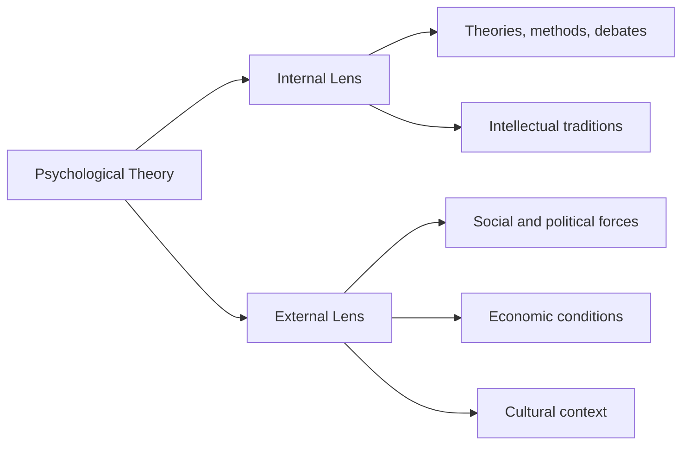
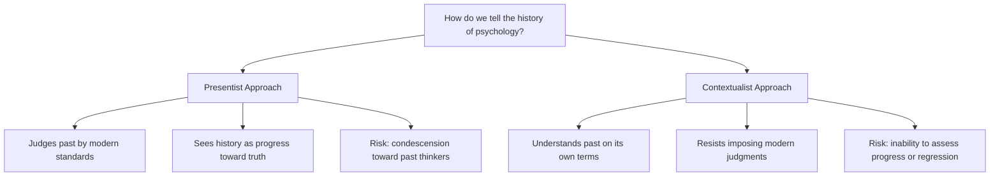

# Chapter 1 · Module 1
# Why Study the History of Psychology?
## Psychology · Unit 1 · History of Psychology

---

It is November 1901, and you are standing in a cramped room in Haverhill, Massachusetts. The air smells of carbolic soap and something else — something you can't name but that makes your stomach tighten. A man named Duncan Macdougall, a physician with sharp cheekbones and an even sharper obsession, has built something strange: a hospital bed mounted on a platform beam scale, sensitive enough to register fractions of an ounce. On the bed lies a patient — a dying man — and Macdougall is waiting. Not for a miracle. For a measurement. He has convinced this man's family, and the man himself, that the precise moment of death should be recorded as a number. When the patient exhales for the last time, Macdougall reads the scale. The man has lost 21 grams. Macdougall publishes his findings in *American Medicine* in 1907 and announces, with the confidence of a man who has stared into the abyss and found a data point, that the human soul weighs approximately three-quarters of an ounce. He tests fifteen dogs next. They lose nothing. He concludes that animals, therefore, have no souls. The scientific community scoffs. The newspapers eat it up. And more than a century later, people still argue about those 21 grams.

But here's what should bother you: Macdougall wasn't a crank. He was a trained physician who used the tools of his era — scales, observation, controlled comparison — to test a hypothesis. He followed the logic of empirical science. And he arrived at a conclusion that most modern scientists would call absurd. So what separates a legitimate scientific question from a misguided one? And who gets to decide?

---

## The Bed, the Scale, and the Question That Won't Die

You already know that science is supposed to be self-correcting. Bad ideas get tested, fail, and disappear. Good ideas survive scrutiny and become knowledge. That's the story you've been told since your first science class — a neat, linear march from ignorance to truth.

Except that's not how it actually works. The history of psychology is littered with ideas that were wrong but persisted for decades, ideas that were right but ignored for centuries, and ideas that nobody could agree on at all. The real story is messier, more human, and far more interesting than the tidy version. And if you want to understand why psychology looks the way it does today — why some questions get funding and others don't, why certain names appear in every textbook while others have been erased — you need to understand how that mess got made.

This is what the **history of psychology** actually studies: not a parade of great discoveries, but the tangled web of ideas, personalities, institutions, and accidents that shaped a discipline. And studying it isn't just an exercise in nostalgia. It's a way of seeing the assumptions you've inherited — the ones so deeply baked into your thinking that you don't even recognize them as assumptions.

### Why Bother With Dead Psychologists?

Here's a question that almost every student asks at some point: why should I care about what some guy in the 1800s thought about the mind? I can just read the latest research. I don't need the archaeology.

That objection feels reasonable. But consider this: a surgeon who has never studied the history of medicine might dismiss the practice of bloodletting as obviously barbaric. But they'd miss something crucial — bloodletting persisted for over two thousand years not because ancient physicians were stupid, but because the underlying theory (humoral imbalance) was internally coherent and seemed to explain what practitioners observed. Understanding *why* it lasted so long teaches you something about how medical thinking can go wrong, in ways that simply knowing "it was wrong" never will.

The same logic applies to psychology. When you learn that early American psychologists used intelligence testing to justify forced sterilization and restrictive immigration policies in the early 20th century, you don't just learn a historical fact. You learn how scientific authority can be weaponized — a lesson that remains urgently relevant.

> [!TIP]
> **Stop and Think:** Think about a belief that most people around you accept as obviously true — maybe about learning styles, or about how memory works like a recording. Where did that belief come from? Who promoted it, and why? What would it take for you to question it?

A 2019 study published in *Perspectives on Psychological Science* by Hussey and Bhatt found that many psychology students graduate with significant misconceptions about foundational concepts — misconceptions that trace directly to how those concepts were historically introduced and then simplified in textbooks. The bones of the dead, it turns out, still shape what the living believe.

### The Two Lenses: Inside the Lab and Outside It

When historians look at the past of psychology, they essentially peer through two different lenses — and the picture changes depending on which one they pick.

The first is **internal history**. This is the story told from inside the discipline: the development of theories, methods, experiments, and debates. Internal histories trace how one idea led to another — how John Locke's theory of the mind as a "blank slate" influenced British associationism, which influenced early experimental work on learning, which influenced behaviorism. It's the story psychologists tell about themselves, and it tends to read like a relay race: each great thinker passes the baton to the next. The classic example is Edwin Boring's *A History of Experimental Psychology* (1929), which shaped how generations of students understood the field.

The second lens is **external history**. This version asks: what was happening in society, politics, economics, and culture that made certain psychological ideas popular at certain times? Why did behaviorism take hold in early 20th-century America and not, say, in France? External historians point to the pragmatic, utilitarian spirit of American culture at the time — a country industrializing rapidly, building railroads, standardizing factories — and argue that a psychology focused on observable behavior and practical outcomes was almost inevitable in that environment.

But wait — if external factors explain so much, why did Germany develop a very different kind of psychology at the same time? Wilhelm Wundt's laboratory in Leipzig, founded in 1879, was rooted in a tradition of philosophical idealism and holistic thinking that had deep intellectual roots in German culture. The internal intellectual traditions mattered too.

The honest answer is that neither lens alone is sufficient.

*Figure 1.1: Two ways of looking at the same history. Neither tells the whole story.*

> [!TIP]
> **Stop and Think:** Think of a popular trend in your own field or area of interest — maybe a technology, a method, or a theory that everyone seems to adopt. Is its popularity best explained by its intellectual merits (internal factors), or by social and economic forces (external factors)? Or both?

---

## Was It the Genius, or Was It the Times?

In 1902, an American researcher named Edwin Twitmyer completed his doctoral dissertation at the University of Pennsylvania showing that the knee-jerk reflex could be conditioned — a form of learning that would later become central to behavioral psychology. He presented his findings at the 1904 meeting of the American Psychological Association. Nobody cared. His paper, as the source text puts it, "fell on deaf ears."

Meanwhile, the Edinburgh physician Robert Whytt had described conditioned salivation — a dog salivating at the mere smell of a lemon — as early as the 18th century. The phenomenon was known. It had been documented. Twice.

So why does everyone credit a Russian physiologist named Ivan Pavlov? Because Pavlov had what Twitmyer and Whytt didn't: scientific prestige (a Nobel Prize for his work on digestion), a well-funded research institute, a team of assistants, and — crucially — timing. His work reached American psychologists at exactly the moment they were looking for rigorous, laboratory-based explanations of behavior. Pavlov was the right person, in the right place, at the right time.

This raises one of the most debated questions in the history of science: do great individuals shape the times, or do the times produce the great individuals?

### The Great Man vs. the Zeitgeist

The **great man theory** of history says that extraordinary individuals — geniuses, visionaries, leaders — drive historical change. Without Wundt, there would be no experimental psychology. Without Watson, there would be no behaviorism. The names on the textbook covers matter.

The **zeitgeist theory** — from the German for "spirit of the times" — says the opposite. It argues that when the cultural, intellectual, and social conditions are ripe, *someone* will make the breakthrough. If Wundt hadn't founded his lab in Leipzig in 1879, someone else would have done something similar within a few years. The ideas were already circulating. The tools were already available. The demand for a "science of the mind" was already growing.

The truth, as usual, lives in the tension between the two. Consider John B. Watson, the father of behaviorism. Watson was undeniably bold and charismatic. But he was also lucky: he became chairman of the psychology department at Johns Hopkins only because his predecessor, James Mark Baldwin, was forced to resign after being arrested in a brothel. Without that scandal, Watson might never have had the institutional power to launch his revolution. The zeitgeist provided the audience; accident provided the stage.

> [!NOTE]
> **Zeitgeist:** The intellectual and cultural climate of a particular era. The idea that historical developments are shaped more by prevailing social conditions than by individual genius. Literally "spirit of the times" in German.

Clark Hull's neobehaviorist learning theories may have been intellectually superior to those of his rival Edward Tolman. But Hull's research program received generous funding from the Laura Spelman Rockefeller Memorial Fund during the Great Depression, while Tolman's did not. Ideas don't survive on merit alone. They need institutional support, funding, and timing.

| Factor | Great Man Explanation | Zeitgeist Explanation |
|---|---|---|
| Core claim | Genius drives change | Conditions drive change |
| Role of the individual | Irreplaceable | Replaceable |
| Role of culture | Background | Primary force |
| Example | Without Watson, no behaviorism | Without American pragmatism, behaviorism would have emerged anyway |
| Weakness | Ignores structural forces | Ignores individual agency |

*Table 1.1: Two ways of explaining why psychology developed as it did.*

> [!TIP]
> **Stop and Think:** In your own life, think of a time when something important happened — a career change, a relationship, a discovery. Was it because of who you are, or because the circumstances were right? Could someone else in the same situation have done the same thing?

---

## Looking Back Without Smirking

There's a particular way of telling the history of psychology that goes like this: once upon a time, people believed in souls and spirits and silly things. Then science came along, and we figured out the truth. It's a satisfying story. It flatters us. We are the culmination, the endpoint, the ones who finally got it right.

Historians call this approach **presentist history** — sometimes called "Whig history," after the British political tradition that portrayed history as a steady march toward liberal progress. In presentist accounts, the past is judged by the standards of the present. Early psychologists who believed in immaterial souls are treated as primitives who hadn't yet discovered the truth. The history of psychology becomes a story of progress from superstition to science.

It's a tempting narrative. It's also deeply misleading.

Take Hippocrates, the Greek physician who lived around 400 BCE. A presentist account might dismiss him as someone who practiced medicine before medicine was "real." But Hippocrates rejected the popular belief that epilepsy was caused by spirit possession. He argued, correctly, that it was a brain condition. He was more right than many people who came centuries later. Or consider Descartes, who lived in the 17th century. Yes, he believed the mind was an immaterial substance — but he also proposed the first systematic reflex theory of behavior, an idea that directly influenced modern neuroscience.

The opposite approach is called **contextualist history** (sometimes "historicism"). Contextualists try to understand each historical period on its own terms, without judging it by modern standards. If 1920s American psychologists adopted behaviorism, the contextualist asks: given their intellectual background, their institutional pressures, and their cultural moment, was that a reasonable choice? Contextualists resist the urge to call the past "wrong" and instead try to explain why it made sense to the people living through it.

But contextualism has its own problems. If you refuse to judge the past at all, how do you assess whether a period represented progress or regression? Can you really explain the significance of behaviorism without having some view of whether it advanced or hindered the development of psychological science?

> [!NOTE]
> **Presentist history:** Interpreting the past through the lens of the present, treating historical developments as steps toward current knowledge. Often flattering to the present, often unfair to the past.

> [!NOTE]
> **Contextualist history:** Understanding each historical period in its own terms, without imposing modern judgments. More fair to the past, but risks losing the ability to evaluate progress.

*Figure 1.2: The tension between presentism and contextualism shapes how every history of psychology is written.*

> [!TIP]
> **Stop and Think:** Think of a historical figure from your own country or culture who is often judged by modern standards — a political leader, a philosopher, a scientist. Is it fair to judge them by what we know now? Or should we try to understand them in the context of their own time? Where do you draw the line?

Here's the cruelest irony: the witch hunts of 17th- and 18th-century Europe and America are often cited as evidence of medieval ignorance. But most historians now argue that the persecution of "witches" was actually a product of the scientific revolution itself — a period when new standards of evidence and legal procedure created the very machinery that drove those persecutions. Progress and regression aren't always easy to tell apart.

---

## In Practice: Why This Changes How You Read a Textbook

The next time you open an introductory psychology textbook, pay attention to the names that appear and the names that don't. Notice which experiments get highlighted — and which are forgotten. Notice the story the textbook tells about how psychology "progressed" from one school of thought to the next. Ask yourself: is this presentist? Is it internal history? Whose perspective is missing?

These aren't idle questions. The way the history of psychology gets told shapes what psychology students believe is important, what questions are worth asking, and what methods are legitimate. If your textbook presents behaviorism as a mistake that cognitive psychology corrected, you'll think about the field differently than if you understand behaviorism as a reasonable response to specific intellectual and social pressures — one that taught us things we still use today.

A street vendor in a Lagos market doesn't need to know the history of economics to sell tomatoes. But an economist who doesn't understand the history of economic thought — who doesn't know why certain assumptions became dominant, or how they were shaped by political and cultural forces — will mistake those assumptions for universal truths. The same applies to psychology. The bones of the dead are not just relics. They are the foundation on which you are standing.

> [!IMPORTANT]
> Every psychological concept you encounter in a textbook carries invisible baggage — assumptions, accidents, and arguments that shaped its current form. Understanding that baggage doesn't make the concept less useful. It makes you a sharper thinker.

---

## Speaking of Dead Psychologists and Their Ideas...

- "Did you hear about the guy who weighed dying patients to find the soul? He published it in a real medical journal. And people took it seriously — at least for a while."
- "Pavlov gets all the credit for conditioning, but an American guy figured it out first and presented it at a major conference. Nobody even clapped. Timing really is everything."
- "Some historians say the witch hunts happened because of the scientific revolution, not in spite of it. That's the kind of twist that makes history worth studying."

---

Macdougall's bed still sits in the history of psychology like a splinter — absurd, fascinating, and impossible to ignore. He was wrong about the soul, but he was right about one thing: if you want to understand the mind, you have to be willing to put your strangest ideas on a scale and see what they weigh. The question is what you do when the numbers don't come out the way you expected. In the next chapter, we'll look at what happened when psychologists decided that the mind itself was the wrong thing to weigh — and that behavior, visible and measurable, was all that mattered. It didn't go the way anyone predicted.

---
*[Chapter complete. Take time with the "Stop and Think" prompts before moving to the next chapter.]*

---

## References

Greenwood, J. (2009). *A Conceptual History of Psychology*. McGraw-Hill.

Hussey, I., & Bhatt, S. (2019). Psychology students' misconceptions about foundational concepts. *Perspectives on Psychological Science*, 14(4), 607–620.

Macdougall, D. (1907). Hypothesis concerning soul substance together with experimental evidence of the existence of such substance. *American Medicine*, 13, 240–243.

Whytt, R. (1751). *An Essay on the Vital and Other Involuntary Motions of Animals*. Edinburgh.

Twitmyer, E. B. (1905). A study of the knee jerk. *Journal of Experimental Psychology*, 1, 506–523.
