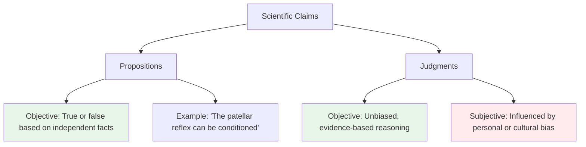
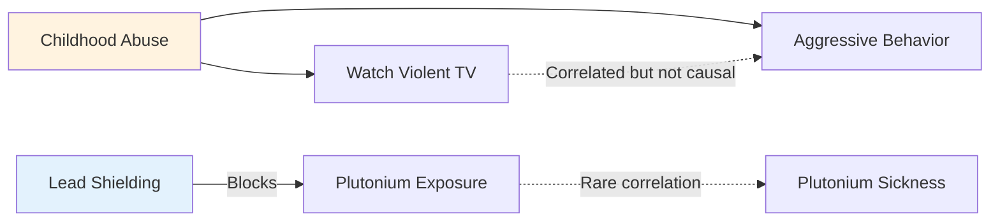
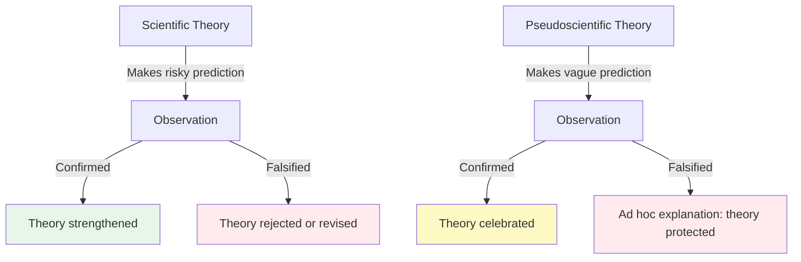

# Chapter 1 · Module 2
# Science and Psychology
## Psychology · Unit 1 · History of Psychology

---

Vienna, 1802. You are sitting in the dimly lit consulting room of Franz Joseph Gall, a physician with an unsettling talent. He runs his fingertips across your skull — slowly, deliberately — pausing at each bump and hollow. He tells you that the protrusion above your left ear indicates a strong "organ of combativeness," while a slight depression near your crown suggests your "organ of veneration" is underdeveloped. You leave the session rattled, clutching a hand-drawn map of your own head, convinced that your character has been read like a book.

Gall's science of phrenology swept through Europe in the early 1800s. His followers mapped the skull into dozens of regions, each tied to a psychological faculty — secretiveness, hope, language, parental love. They examined the skulls of criminals, scholars, and children, building elaborate tables of evidence. When a skull reading matched a person's known temperament, phrenologists celebrated. When it didn't, they found explanations: brain damage, poor measurement, the influence of other organs. The system seemed to explain everything.

But here is the question that should bother you: if a theory can explain everything — every confirming case *and* every disconfirming case — does it actually explain anything at all? What separates a genuine science from something that merely looks like one?

---

## The Line Between Knowing and Guessing

You already know that science involves experiments, lab coats, and careful measurement. But that picture is incomplete. Plenty of disciplines do careful measurement — a wine taster evaluating a Bordeaux vintage, a jeweler grading a diamond, a talent scout assessing a young sprinter in Lagos. None of these activities count as science, even though they involve expertise, observation, and judgment. So what *is* the difference?

The answer starts with a distinction that seems simple but isn't: the difference between a **proposition** and a **judgment**. A proposition is a claim about the world — "water boils at 100°C at sea level," "cats purr when they are content," "the patellar reflex can be classically conditioned." A judgment is what a scientist decides about which theory is best — which explanation to champion, which data to prioritize, which research program to fund.

These are different kinds of objectivity, and confusing them has led psychology into real trouble.

### Propositional Objectivity: Truth That Doesn't Care What You Think

A proposition is **objective** if its truth or falsity is determined by facts that exist independently of anyone's opinion. The claim "electrons carry a negative electric charge" is objective because it is true if and only if electrons actually carry a negative charge. Your feelings about electrons, your political commitments, your cultural background — none of these change whether the proposition is true. It stands or falls on the world alone.

This is equally true for psychological propositions. The claim "humans use prototypes when forming categories" is objective because it is true if and only if humans actually do use prototypes when forming categories. It doesn't matter whether the researcher who proposed it was kind or cruel, well-funded or struggling, working in São Paulo or Seoul. The proposition answers to the world, not to the person who uttered it.

> [!TIP]
> **Stop and Think:** Think about a belief you hold strongly — about nutrition, about how people learn, about what makes a good leader. Ask yourself: is this belief objective? Would it still be true if everyone you know disagreed with you? The test isn't whether you're right. It's whether the world could prove you wrong.

### Judgments: Where Bias Creeps In

Now consider something different. A scientist surveys the evidence and concludes that one theory of aggression is superior to all others. That *conclusion* is a judgment, and judgments can be objective or subjective depending on whether they are influenced by bias. If the scientist reached that conclusion purely on the basis of empirical evidence, the judgment is objective. If the scientist was swayed by personal ambition, political ideology, religious conviction, or the desire to please a funding body, the judgment is subjective — even if the conclusion happens to be correct.

This matters enormously for psychology. When a researcher in the 19th century argued that women were intellectually inferior to men, the *proposition* was objective (it could be tested and falsified by evidence). But the *judgment* that led many scientists to accept this claim without rigorous testing was often deeply subjective — shaped by cultural prejudice, not data.

*Figure 2.1: The distinction between propositional objectivity and judgmental objectivity — two different senses of the word "objective" that are often confused.*

> [!NOTE]
> **Objectivity (Propositional):** A claim is objective if its truth depends on facts about the world, not on who makes the claim. This is different from objectivity as unbiased judgment, which concerns how a scientist evaluates evidence.

But wait — if objectivity is all you need, then everyday statements like "cats like milk" are also objective. They're true if and only if cats actually like milk. So objectivity alone can't be what makes science special. Something more is required.

---

## Why "Because" Is the Most Dangerous Word in Science

A street vendor in a Moroccan souk tells you that the saffron harvest was poor this year because Mercury was in retrograde. A grandmother in Buenos Aires explains that her arthritis flares up because of the full moon. A taxi driver in Bangkok insists that traffic accidents increase during the Songkran festival because of bad karma. These are all causal explanations — they claim that one thing happens *because of* another. They use the same logical structure as any scientific explanation. So what makes a scientific explanation different?

### Conditions: The Grammar of Causation

Every causal explanation identifies **conditions** — factors whose existence is held to be required for an effect to occur. When a chemist explains rusting in terms of oxidation, the claim is that the presence of oxygen is a *condition* for rusting. When a psychologist explains learning in terms of reinforcement, the claim is that reinforcement is a *condition* for learning. The effect is **conditional** upon the cause: without the cause, the effect would not occur (or would occur differently).

But not all conditions work the same way. Some are **sufficient** — if they are present, the effect follows. Others are **necessary** — the effect cannot occur without them. And some are both.

A source of ignition is typically both necessary and sufficient for combustion, given the presence of fuel and oxygen. Remove the ignition, no fire. Provide the ignition, fire follows. Clean and symmetrical.

Now consider something messier. A young man in a crowded market in Lagos shoves someone who bumps into him. Was the bump a *sufficient* cause of the aggression? Perhaps — given the right enabling conditions (heat, fatigue, a bad morning). But was it *necessary*? Clearly not. Aggression has many causes: frustration, revenge, fear, territorial instinct, even the mere presence of weapons in the environment. The same effect can be produced by entirely different conditions.

This asymmetry — between sufficiency and necessity — is one of the most important ideas in science. It means that a single cause can produce many effects, and a single effect can have many causes. The world is not a tidy chain of dominoes.

### Correlation Is Not Causation (But It's a Start)

You've probably heard the phrase "correlation is not causation" so many times that it has lost its edge. Let's restore it.

Two factors can be highly correlated — they rise and fall together — without one causing the other. They might both be effects of some hidden third factor. Childhood abuse, for example, might independently produce both a propensity to watch violent television and a tendency toward aggressive behavior. The TV watching and the aggression correlate, but neither causes the other. The common cause is upstream.

Sometimes the correlation is even more absurd. In southern California, the number of PhD students and the number of mules have historically risen and fallen in lockstep. No one seriously believes that mules cause PhDs or vice versa. The correlation is an artifact of broader demographic and economic trends.

Conversely, some genuine causal relationships show almost no correlation at all. Lead shielding prevents plutonium radiation from reaching human tissue — so plutonium sickness and plutonium exposure rarely correlate in the population, even though the causal link is absolute. The *intervention* masks the relationship.

> [!TIP]
> **Stop and Think:** Think of something in your own life that correlates with something else — sleep quality and exam performance, social media use and mood, rainy days and productivity. Do you know whether the relationship is causal? What would it take to find out?

*Figure 2.2: How causation and correlation can diverge — shared causes create spurious correlations, while interventions can mask real causal links.*

The distinction between experimental and correlational studies exists precisely because of this problem. Experimental studies isolate variables in controlled, "closed" systems — you manipulate one factor and observe what changes. Correlational studies measure relationships in naturally occurring, "open" systems — you watch what happens without intervention. Neither approach is inherently superior; they answer different questions. The psychologist Robert Sessions Woodworth formalized this distinction in his influential 1938 textbook, and Lee Cronbach cemented it in his famous 1957 presidential address to the American Psychological Association, "The Two Disciplines of Scientific Psychology."

---

## Testing the Untestable

A farmer in the Nile Delta watches the river rise each summer and predicts a good harvest. She has observed this pattern for decades. Her predictions are reliable, her data is empirical, and she even has a causal theory: the floodwaters deposit fertile silt. Is she doing science?

Sort of. But there's a crucial step she hasn't taken: she hasn't tried to prove herself *wrong*.

### Direct and Indirect Testing

Scientific claims are subject to **empirical evaluation** — they must be tested against the world. Some claims can be tested directly: you can observe whether a rat presses a lever more often after receiving a food pellet. You can measure whether a patient's symptoms improve after a new drug. The observation is the test.

But many scientific claims are about things you *cannot* observe directly. You cannot see an electron. You cannot watch a repressed memory form. You cannot observe a cognitive heuristic processing a probability estimate. These entities live inside theories, and you test them **indirectly** — by checking whether the predictions derived from the theory match what you actually observe in the world.

This is the bridge between theoretical claims and empirical evidence. If a theory about repressed memories predicts that a certain therapeutic technique will reliably recover them, and the technique fails to do so, the theory is in trouble — even though you never directly observed the repressed memory itself.

> [!NOTE]
> **Empirical Evaluation:** The process of testing scientific claims against observable evidence. Direct testing involves observing the phenomenon itself. Indirect testing involves checking whether predictions derived from a theory match what is observed.

This method of testing — using predictions as proxies for the truth of theories — is what gives science its distinctive power. It also introduces its greatest vulnerability: the temptation to protect theories from disconfirmation.

### Popper's Razor: Risky Predictions or Pseudoscience

In the mid-20th century, the philosopher Karl Popper proposed a sharp distinction between genuine science and what he called **pseudoscience**. The difference, he argued, was not that scientific theories are always correct. It was that they make **risky predictions** — predictions that, if they turned out to be false, would force the theory to be abandoned.

Einstein's general theory of relativity predicted that light from distant stars would be bent by the sun's gravitational field. This was a genuinely risky prediction: if Arthur Eddington's 1919 eclipse expedition had found no deflection, the theory would have been in serious trouble. The prediction was confirmed, and Einstein became a legend. But the key point is that the theory *could* have been destroyed by the evidence. It put itself on the line.

Now contrast this with phrenology. Gall and his followers claimed that psychological faculties were localized in specific brain regions and manifested as bumps on the skull. When they found a skull that matched their predictions — a scholar with a prominent bump in the "language" region — they celebrated. But when they found a mismatch — a brilliant thinker like René Descartes with a *depression* in the region of rationality — they didn't abandon the theory. Instead, they concluded that Descartes must have been overrated as a thinker. When a bump appeared on a skull without the expected personality trait, they invoked brain damage. When their original estimates of a faculty didn't match the bump, they quietly revised the estimates.

This is the hallmark of pseudoscence: the theory is insulated from disconfirmation. Every possible outcome is absorbed. The theory explains everything — and therefore predicts nothing.

> [!TIP]
> **Stop and Think:** Think of a claim you've encountered — in health, politics, relationships — that seemed to explain everything. When something contradicted it, the explanation simply expanded. Did it ever *risk* being wrong? What would it take to disprove it?

*Figure 2.3: The difference between genuine science and pseudoscience, according to Popper — it's not about being right, but about being willing to be wrong.*

A 2015 study published in *Science* by the Open Science Collaboration attempted to replicate 100 experimental findings from leading psychology journals. Only 36% of the replications produced statistically significant results consistent with the original studies. This wasn't fraud — it was the normal operation of a field that had, in many cases, prioritized surprising findings over rigorous testing. The replication crisis forced psychology to reckon with a Popperian question: how many of its cherished findings were genuinely risky predictions, and how many were phrenology in modern dress?

> [!NOTE]
> **Falsifiability:** A theory is falsifiable if it makes predictions that could, in principle, be shown to be false by evidence. A theory that cannot be falsified — because it accommodates every possible outcome — is not genuinely scientific, regardless of how sophisticated it appears.

---

## Are Electrons Real? Are Motives?

Here's a question that sounds like philosophy homework but has real consequences for psychology: when a physicist talks about electrons, is she describing something that actually exists? Or is "electron" just a convenient label — a useful fiction that helps predict the behavior of electric circuits, but not a thing you'd find if you could look closely enough?

This is the debate between **realism** and **instrumentalism**, and it matters more than you might think.

The **realist** says: scientific theories about unobservable entities — electrons, quarks, gravitational fields — are potentially true descriptions of things that actually exist. The theory's predictions being confirmed is *evidence* for the entities, but it is not *sufficient* for the theory's truth. There are objective facts about electrons over and above whether our predictions about circuits work out.

The **instrumentalist** says: scientific theories are tools. "Electron" is a word that helps us build circuits, design computers, and predict the outcomes of experiments. If the predictions work, that's all the "truth" we need. There is no deeper fact about whether electrons "really" exist beyond their usefulness in prediction.

This isn't just abstract philosophizing. In 20th-century psychology, the debate played out in concrete terms. Behaviorist psychologists — particularly those in the neobehaviorist tradition — often took an instrumentalist position toward mental states. Concepts like "drive," "habit strength," or "intervening variables" were treated not as descriptions of real internal states, but as convenient fictions that organized the relationship between stimuli and responses. If the predictions about behavior worked, the theory was "true" — end of story.

| Position | Core Claim | Example in Psychology |
|---|---|---|
| **Realism** | Theoretical entities (electrons, motives) are potentially real. The theory's predictions being correct is evidence, but not proof. | "Cognitive heuristics are real mental processes that actually cause reasoning errors." |
| **Instrumentalism** | Theoretical entities are useful fictions. If the predictions work, the theory is "true enough." | "Talking about 'drives' is useful for predicting behavior, but there's no fact about whether drives actually exist." |

*Table 2.1: Realism vs. instrumentalism — two ways of understanding what scientific theories are actually saying.*

Most natural scientists — physicists, chemists, biologists — are realists by default. They believe electrons exist. But in psychology, the question remains genuinely open. Are cognitive schemas real structures in the mind, or just useful descriptions? Are unconscious motivations actual forces, or convenient explanatory devices? The answer you choose shapes what you think psychology is *for* — describing reality, or predicting behavior.

> [!TIP]
> **Stop and Think:** When you say you "believe" something, or that you're "motivated" to do something, do you think there's a real internal state corresponding to those words? Or are they just useful ways of talking about what you do? Your answer puts you on one side of a debate that has shaped the entire history of psychology.

---

## Science in Practice: What Psychology Actually Needs

So what does a discipline actually need to count as a science? Based on everything we've covered, three conditions emerge as genuinely necessary:

1. **Objectivity**: Its propositions must be true or false based on independent facts, not on who asserts them.
2. **Causal explanation**: It must attempt to explain *why* things happen, not just *that* they happen — by identifying conditions that generate effects.
3. **Empirical evaluation**: It must test its claims against observable evidence, either directly or through the predictions those claims generate.

Beyond these three, things get murkier. Should scientific explanations be quantitative? It helps — Fechner's law, which relates sensation intensity to stimulus intensity through a logarithmic function, is powerful precisely because it is mathematical. But Darwin's theory of evolution by natural selection was qualitative, and no one seriously argues it isn't scientific. Should scientific explanations be systematic — fitting within a coherent general theory? Again, it's valuable, but demanding it in advance dogmatically presupposes that nature itself is neatly systematic.

The deeper point is that many principles psychologists adopted from physics — principles like atomism, universality of causal explanation, and ontological invariance — may not apply to psychological phenomena. Cognitive states like beliefs appear to be *relational*: you cannot have just one belief, because every belief presupposes a network of others. Try ascribing to someone the single belief that the Empire State Building is in New York City. Immediately you need to assume they know what a building is, where New York is, what "in" means, and so on. The belief doesn't exist in isolation.

> [!IMPORTANT]
> The essential features of science — objectivity, causal explanation, and empirical testing — are necessary but not sufficient. Psychology meets all three. The real question isn't whether psychology *is* a science, but whether the particular *kind* of science borrowed from physics is the right one for understanding the human mind.

Similarly, the universality of causal explanation — the assumption that every instance of aggression, depression, or learning has exactly one cause — may not hold. Some aggressive behavior stems from revenge, some from the mere presence of weapons, some from neural overstimulation. Insisting on a single universal cause isn't scientific rigor; it's borrowed prejudice from an era when physics seemed to offer exactly that.

---

## Speaking of Science...

- "My cousin swears that astrology predicted her divorce. I asked her if it also predicted the five years of happy marriage before that. She changed the subject."
- "A nutritionist in São Paulo told me that eating mangoes with milk is deadly. When I showed her the studies, she said the studies hadn't tested *Brazilian* mangoes. The theory can't lose."
- "A friend in Seoul insists that studying at 4 AM is scientifically optimal because 'your brain absorbs more.' I asked for the study. She sent me a blog post."

---

Psychology wanted to be a science so badly that it borrowed its playbook from physics — the most successful science of the 19th century. It adopted principles like atomism, universality, and materialism with the fervor of a convert. But physics has spent the last century abandoning many of those same principles. What happens when a discipline models itself on a moving target? That's where we're headed next.

---

## References

- Open Science Collaboration. (2015). Estimating the reproducibility of psychological science. *Science*, 349(6251), aac4716.
- Popper, K. (1963). *Conjectures and Refutations: The Growth of Scientific Knowledge*. Routledge & Kegan Paul.
- Cronbach, L. J. (1957). The two disciplines of scientific psychology. *American Psychologist*, 12(11), 671–684.
- Woodworth, R. S. (1938). *Experimental Psychology*. Henry Holt.
- Young, R. M. (1990). *Mind, Brain, and Adaptation in the Nineteenth Century*. Oxford University Press.

---
*[Chapter complete. Take time with the "Stop and Think" prompts before moving to the next chapter.]*
