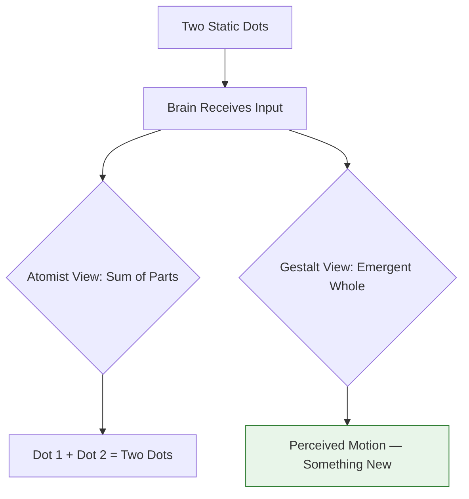
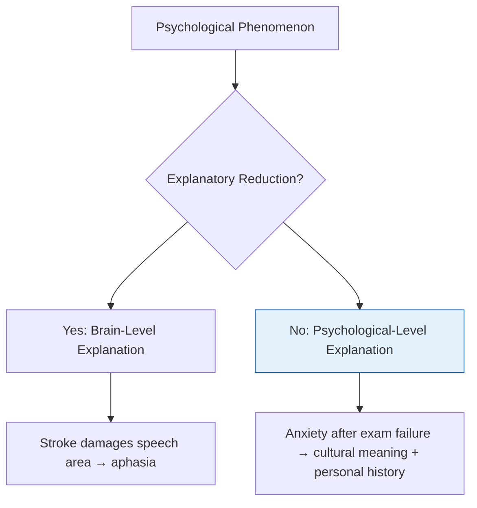

# Chapter 1 · Module 3
# Science and Psychology (Part 2)
## Psychology · Unit 1 · History of Psychology

---

You're sitting in a café in Tokyo, and your friend just used a word you can't translate. She's describing the feeling she gets around her mother — a sweet, indulgent dependency, like wanting to be coddled and knowing it's okay to want that. The word is **amae**, and it doesn't exist in English. Not because English speakers never feel it, but because the feeling never needed its own word in the cultures where English developed. Your friend tries to explain: "It's not love, exactly. It's not need. It's... amae." She shrugs. There's no way to break it down further.

Across the Pacific, a century earlier, a group of German psychologists watched a screen where two dots flashed in sequence. The dots didn't move. But the observers saw movement — a single dot sliding from left to right. The psychologists called this the **phi phenomenon**, and it shattered something fundamental. If two stationary dots could create the experience of motion, then the mind wasn't just adding up its inputs. It was constructing something new. The whole was different from the sum of its parts.

These two moments — one in language, one in a laboratory — point to the same uncomfortable truth. Psychology borrowed its founding principles from physics and chemistry. Atomism. Determinism. Reduction. These principles worked beautifully for gases and billiard balls. But what if the mind doesn't work like a billiard ball? What if the very tools psychology inherited are the wrong ones for the job?

---

## The Myth of the Isolated Mind

You've probably noticed that when you hear a melody, you don't hear individual notes and then assemble them into a song. You hear the song. When you look at a friend's face in a crowd, you don't process a collection of separate features — nose, eyes, mouth — and then combine them into recognition. You see a face. The recognition arrives whole. This seems so obvious that it barely registers as interesting. But for early psychologists, it was a scandal.

The dominant assumption in the late 19th century was **atomism** — the idea that complex experiences are built from simple, independent parts, like bricks forming a wall. This worked well for chemistry: water is hydrogen and oxygen, and you can study each element separately before understanding their combination. Psychologists assumed the mind worked the same way. Break perception into sensations. Break learning into associations. Break emotion into basic components. Study each piece in isolation, and you'd understand the whole.

But wait — if that's true, why did two stationary dots produce an experience of movement that neither dot contained?

Max Wertheimer asked exactly this question in 1912. His experiments on apparent motion — the phi phenomenon — showed that perception doesn't work by assembling discrete parts. The brain doesn't receive two static images and calculate "motion" as a sum. It creates motion as a unified experience. Wertheimer, along with Kurt Koffka and Wolfgang Köhler, built an entire school of psychology around this insight. They called it **Gestalt psychology**, from the German word for "form" or "whole," and argued that the mind organizes experience into meaningful patterns that cannot be reduced to their components.

*Figure 3.1: The phi phenomenon — two static dots produce an experience of motion that exists in neither input.*

The Gestalt psychologists weren't saying atoms don't exist or that chemistry is wrong. They were saying that psychology's subject matter — experience, perception, meaning — behaves differently from chemical compounds. You can study hydrogen in isolation and still understand what it does in water. But you can't study a single note and understand a melody. The melody is an emergent property of the relationship between notes. Remove one note, and you don't get a simpler melody. You get a different one.

This principle extends beyond perception. Think about how you experience a conversation. You don't process someone's words, then their tone, then their facial expression, then their gestures, and finally assemble these into meaning. You read the whole situation simultaneously. A sentence delivered with a smile means something different from the same sentence delivered with clenched teeth. The meaning lives in the pattern, not the parts.

> [!TIP]
> **Stop and Think:** The next time you listen to a piece of music, try to hear only one instrument. Just the bass. Or just the vocals. Notice how difficult it is to isolate that single element without losing the feeling of the song. That struggle is the Gestalt insight in action — your mind resists breaking wholes into parts because that's not how experience actually works.

### Why Psychology Couldn't Let Go

So if Gestalt psychology made such a compelling case, why didn't it replace atomism? Because atomism was convenient. Breaking things into parts makes them measurable. You can count sensations. You can time reactions. You can publish data. The Gestalt approach — "the whole is different from the sum of its parts" — was philosophically powerful but experimentally slippery. How do you quantify a "whole"? How do you measure the pattern that emerges from relationships?

Psychology, desperate to be taken seriously as a science, chose the path that looked more like physics. It kept atomism. It kept the assumption that you could study pieces in isolation and understand the mind. This choice had consequences that rippled through the entire discipline for a century.

> [!TIP]
> **Stop and Think:** Think about a meal you love. Could you understand it by tasting each ingredient separately? The combination of spices, the texture contrast, the temperature — these create something that the individual ingredients don't contain. Your experience of the meal is gestalt, not atomic.

---

## One Cause to Rule Them All?

Here's a thought experiment. A street vendor in a Lagos market gets into a heated argument with a customer. Why did he become aggressive? Was it because he grew up in a household where shouting was normal? Because he hadn't eaten since morning and his blood sugar was crashing? Because the customer insulted his family? Because the temperature hit 38°C and heat makes people irritable? Because he'd been watching political debates on his phone all morning and was already primed for conflict?

The answer, obviously, is: all of them. And probably more. Aggression, like most psychological phenomena, has multiple causes that interact in complex ways. No single variable explains it fully.

Yet psychology has long been seduced by the principle of **universality of causal explanation** — the idea that for every type of event, there should be a single type of cause. One explanation. One mechanism. One law. This principle works beautifully in physics. Gravity explains why apples fall and planets orbit. The same force, the same equation, everywhere in the universe. Psychology wanted that elegance. It wanted a single theory of learning, a single theory of motivation, a single theory of personality.

But wait — if physics can have unified laws, why can't psychology? Because psychological phenomena are multiply caused in a way that physical phenomena often aren't. The gravitational pull on an apple depends on its mass and its distance from Earth. That's it. Two variables. The aggression of a Lagos street vendor depends on his childhood, his breakfast, the weather, the customer's tone, his political mood, and dozens of other factors that shift from moment to moment.

| Feature | Physics (e.g., Gravity) | Psychology (e.g., Aggression) |
|---|---|---|
| Number of causes | Few, identifiable | Many, interacting |
| Cause-effect consistency | High | Variable across contexts |
| Universal law? | Yes | Unlikely |
| Context dependence | Low | High |

*Table 3.1: Why unified causal laws work for physics but may not for psychology.*

In a landmark 1998 study published in *Psychological Bulletin*, Craig Anderson and Brad Bushman analyzed over 50 years of research on the causes of human aggression. They found that aggression was predicted by a wide constellation of factors — biological, psychological, social, and situational — that interacted differently depending on context. No single variable was necessary or sufficient. The study didn't disprove causation; it showed that the causal structure of aggression is fundamentally different from the causal structure of a falling apple.

This doesn't mean psychology can't find causal explanations. It means those explanations may need to be local, contextual, and multi-layered rather than universal and singular. A farmer in rural India and a stockbroker in São Paulo might both experience depression, but the causes, the expressions, and the effective treatments might be quite different. Psychology's borrowed insistence on universal causes may have led researchers to chase a kind of elegance that their subject matter doesn't offer.

> [!TIP]
> **Stop and Think:** Consider something you do every day — your morning routine, the way you study, how you respond to stress. How many factors shape that behavior? Your culture, your family, your body, your recent experiences, the people around you. Try to isolate a single cause. You'll find it's nearly impossible.

### The Torres Strait and the Limits of Universality

In 1898, a team of psychologists traveled to the Torres Strait, between Australia and Papua New Guinea, to test whether visual perception was universal. Led by William Rivers, they presented optical illusions to Indigenous islanders and compared their responses to those of British participants. The results were striking: the islanders were less susceptible to certain visual illusions, suggesting that perception itself might be shaped by cultural experience — by the environments and visual patterns people grew up with.

This was one of the earliest systematic attempts to test whether psychological processes are universal or culturally variable. The findings were provocative but largely ignored for decades, because they threatened the assumption that the mind works the same way everywhere. Psychology wanted universal laws. The Torres Strait data suggested something messier.

> [!NOTE]
> **Ontological Invariance:** The assumption that the entities studied by a science exist everywhere and always — that the same types of things (electrons, emotions, diseases) are found in all places and times. Physics can assume this for fundamental particles. Psychology may not be able to assume it for emotions, disorders, or cognitive processes.

---

## Do We Have to Explain the Mind Through the Brain?

A young Sigmund Freud sat in a Parisian clinic, watching patients whose arms were paralyzed — but whose bodies showed no physical damage. No nerve was severed. No muscle was wasted. The arm simply wouldn't move. As a trained physiologist, Freud initially believed that all mental phenomena could ultimately be explained by the brain — by neurons, pathways, and electrical signals. This principle, **explanatory reduction**, holds that the best explanation of a complex system comes from analyzing its material components. It works for chemistry: the properties of water are explained by hydrogen and oxygen atoms. It works for thermodynamics: the behavior of gases is explained by the motion of molecules.

Freud tried to build a physiological theory of these paralyses. He called it his "Project for a Scientific Psychology." And he failed. Not because he wasn't brilliant, but because the phenomenon resisted the approach. These patients' arms were paralyzed by meaning — by traumatic memories, by anxiety symbolically connected to past events. You couldn't explain a symbol by dissecting a neuron. The paralysis lived in the relationship between a patient's experience and her body, not in the wiring of her nervous system.

Freud abandoned physiology. He built his theory of neurosis around repressed memories, symbolic meaning, and the unconscious — a psychological explanation that operated at the level of psychology, not biology. He never stopped believing that the brain was involved. But he concluded that, for his purposes, the best explanations were relational and psychological, not reductive and physiological.

In a 2014 review published in *Nature Reviews Neuroscience*, researchers Yehuda and LeDoux examined how advances in neuroscience had reshaped our understanding of trauma and stress disorders. While neuroimaging revealed distinct patterns of brain activation in people with PTSD, the researchers emphasized that biological markers alone could not predict who would develop the disorder or explain why specific traumatic memories took the forms they did. The brain was necessary but not sufficient. Psychological meaning, personal history, and social context remained essential explanatory layers.

This is the core challenge of explanatory reduction in psychology. Nobody serious doubts that the brain is involved in mental life. The question is whether brain-level explanations are always the *best* explanations. Sometimes they are. If a patient has a stroke that damages a specific brain region and loses the ability to speak, neuroscience is exactly the right tool. But when a person in Seoul develops crippling anxiety after failing a university entrance exam, the explanation might be better found in the meaning of failure within Korean educational culture, the family dynamics around expectations, and the person's personal history — none of which are visible in a brain scan.

*Figure 3.2: Sometimes brain-level explanations work best; sometimes psychological-level explanations are more illuminating.*

> [!TIP]
> **Stop and Think:** Think about a time you felt homesick. Could a brain scan explain that feeling? It could show which regions activate when you miss home. But could it tell you *what* you miss — the smell of your grandmother's kitchen, the sound of rain on a familiar roof, the particular quality of light in your hometown? The meaning of homesickness lives at a level that brain activity describes but doesn't explain.

---

## Determinism: Must the Future Be Fixed?

You flip a coin. Heads or tails. Before you flip it, you might assume the outcome is random — a matter of chance. But a strict determinist would say the outcome was already fixed by the angle of your thumb, the force of your flip, the air resistance, and a thousand other variables you didn't notice. If you could measure every variable perfectly, you could predict the result with certainty. Nothing is truly random. Everything is determined.

**Determinism** — the principle that every event is fully caused by prior conditions, such that no other outcome is possible — has been a cornerstone of science for centuries. It's the idea that the universe runs like clockwork. Newton's physics seemed to confirm it. The planets moved in predictable orbits. Chemical reactions followed fixed laws. Psychology borrowed this principle enthusiastically. If human behavior was determined by prior conditions — genes, upbringing, environment — then it could be predicted, controlled, and studied scientifically.

But then physics itself abandoned determinism. In the 1920s, quantum mechanics revealed that at the subatomic level, events are genuinely probabilistic. Radioactive decay, for instance, is not determined by prior conditions. The conditions make decay *probable* — in fact, highly probable — but they don't make it inevitable. Werner Heisenberg's uncertainty principle showed that you cannot simultaneously know a particle's exact position and momentum. The universe, at its most fundamental level, is not a clockwork machine.

This should have changed psychology. If the science that gave us determinism had abandoned it, why was psychology still clinging to it? Because determinism felt necessary for science. If behavior isn't determined, how can you predict it? How can you study it? How can you claim to explain it?

But wait — do you actually need determinism to do science? Consider what psychologists actually do in practice. They study whether violent media makes people more aggressive. They measure the effect. They run statistical tests. They report whether the difference is significant. Now ask: does it matter whether violent media *determines* aggression or merely *promotes* it — making it more likely without guaranteeing it? The research method is identical either way. You'd still predict that people exposed to violent media would tend to be more aggressive. You'd still compare groups. You'd still look for statistically significant differences. The science doesn't change. Only the philosophical interpretation does.

| Philosophical Stance | What It Claims | Impact on Research |
|---|---|---|
| Hard Determinism | Prior conditions guarantee one outcome | Predict and explain |
| Probabilistic Causation | Prior conditions make outcomes more likely | Predict tendencies, explain patterns |
| Indeterminism | Some events are genuinely uncaused | Limits on prediction, but science still works |

*Table 3.2: Three philosophical stances on causation — and why psychology works the same either way.*

A farmer in Nigeria plants millet and watches the sky. She knows that dark clouds and rising humidity make rain more likely. She doesn't know for certain it will rain. She plans accordingly — prepares her fields, schedules her planting — based on probability, not certainty. Her practical knowledge works perfectly well without determinism. Psychology could do the same.

> [!TIP]
> **Stop and Think:** Think about a major decision you made — choosing a school, a job, a city. Were you determined to make that choice? Or were you inclined toward it by a web of factors — family expectations, financial reality, personal interests, a conversation with a friend — that made it probable without making it inevitable? If your own life feels probabilistic rather than determined, why should psychology assume otherwise?

---

## In Practice: What Changes When You Drop the Borrowed Rules

So what happens if psychology stops insisting on principles it borrowed from physics? What changes?

Not as much as you'd think. A psychologist studying aggression in a school in Mumbai would still observe students. Still measure variables. Still look for patterns. Still test interventions. The difference is philosophical, not methodological. She would no longer assume that there's one universal cause of aggression. She'd look for the specific constellation of factors at work in her school — the social dynamics, the cultural norms, the individual histories. She would no longer assume that brain-level explanations are always superior to psychological ones. She'd use whichever level of explanation best fit the phenomenon. And she would no longer assume that her findings must apply to students in every school everywhere.

This is liberating, not limiting. When psychology stops pretending to be physics, it can finally be itself — a science of meaning, context, and human experience that operates by its own rules.

> [!IMPORTANT]
> The most important insight from this chapter may be the simplest: the principles that make physics powerful are not the principles that make psychology powerful. A science of the mind needs its own foundations — and building them starts with questioning the ones that were borrowed, not earned.

---

## Speaking of Borrowed Principles...

- "A therapist in Buenos Aires is treating a patient for what the patient calls *saudade* — a melancholic longing for something lost. The therapist's diagnostic manual doesn't have a category for it. Is the patient wrong, or is the manual too narrow?"
- "A cognitive scientist in Berlin insists that all emotions can be reduced to combinations of a few basic feelings. Her colleague in Okinawa points to *amae* — an emotion with no basic components that Western psychology recognizes. Who's right?"
- "A psychology professor in Lagos teaches his students that behavior is determined by prior conditions. A student raises her hand: 'Then how do you explain creativity? How do you explain someone who breaks every pattern?' The professor pauses. The room is very quiet."

---

Aristotle wrote about memory, perception, and dreams. David Hume wrote about causation, habit, and the self. Were they philosophers or psychologists? The question seems clean until you look closely. Aristotle observed how people actually behaved. Hume designed thought experiments to probe how the mind actually worked. The line between philosophy and psychology didn't blur — it was never there to begin with. In the next chapter, we'll see how the thinkers we call "philosophers" were doing psychology centuries before the word existed, and how their ideas still shape the experiments running in labs today.

---
*[Chapter complete. Take time with the "Stop and Think" prompts before moving to the next chapter.]*
