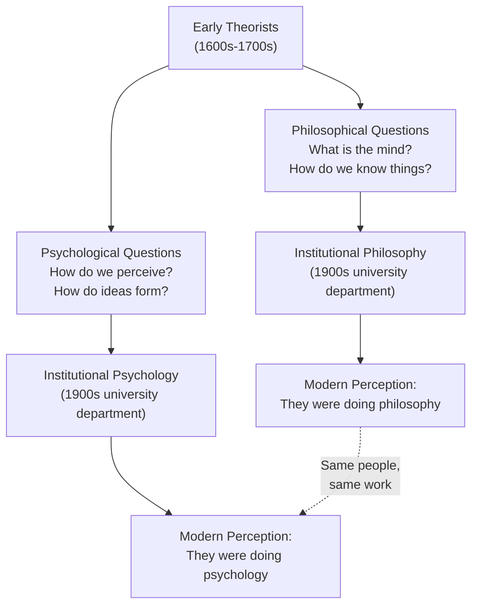
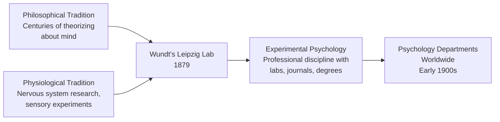

# Chapter 1 · Module 4
# Philosophy and Physiology
## Psychology · Unit 1 · History of Psychology

---

You're sitting in a cold stone building in Edinburgh, Scotland. It's 1739. A young man — barely twenty-eight, with a round face and a reputation for sharp wit — is bent over a manuscript. He's been writing for three years straight, filling page after page with observations about how the human mind works. How we form habits. How one impression leads to another. Why we believe in cause and effect even though we can never actually *see* it. His name is David Hume, and on the title page of his book, he describes his project as nothing less than "an attempt to introduce the experimental method of reasoning into moral subjects."

The experimental method. Applied to human nature. In 1739 — a hundred and forty years before anyone supposedly "invented" psychology in a laboratory.

Hume wasn't conducting experiments with reaction-time devices or measuring how quickly a person could name the color of a printed word. He had no laboratory, no graduate students, no university position at all. He was a man in a room, thinking carefully about how minds actually work, drawing on his own observations and the reports of others, testing his ideas against the evidence of lived experience. He examined memory, imagination, the formation of beliefs, the nature of emotions, the way we connect ideas in chains of association. He was, by any modern standard, doing psychology. So why do we call him a philosopher? And what changed between his time and ours that made "philosopher" and "psychologist" seem like two different things?

---

## The Labels We Inherit

You've probably heard the story told this way: philosophy was the old way of studying the mind — all armchair speculation and no data — and then, around 1879, psychology broke free and became a *real* science. Philosophy stayed behind. Psychology moved forward. Clean story. Simple timeline. Almost completely wrong.

Here's the subtle misconception hiding in that narrative: it assumes that "philosophy" and "psychology" have always been distinct activities, and that the only question was when one grew out of the other. But that's not how it happened. The line between philosophy and psychology wasn't crossed in 1879. It was *drawn* in the early twentieth century, when universities decided to put philosophers in one building and psychologists in another. Before that, the same people did both — and they didn't think they were doing two different things.

### The Anachronism Problem

When we call Descartes a philosopher or Wundt a psychologist, we're projecting our modern categories backward onto people who never used them. This is what historians call **anachronism** — applying a concept or distinction to a time when it didn't exist. It's like calling a medieval knight a "freelance security consultant." The words fit, technically, but they mislead.

The distinction between philosophy as a *conceptual* discipline (thinking about what mind *is*) and psychology as an *empirical* discipline (measuring how mind *works*) is a product of how universities organized themselves in the early 1900s. Before that separation, anyone who studied the mind — whether by reasoning about its nature or by observing its behavior — was doing one thing. The ancient Greek word *psyche* meant soul or mind, and *logos* meant study or account. Psychology, in its oldest sense, was simply the study of the mind. And that's what Hume thought he was doing.

> [!TIP]
> **Stop and Think:** Have you ever been told that a subject "isn't really science" because it doesn't involve lab coats and test tubes? What assumptions about what counts as "science" are embedded in that judgment? Consider whether those assumptions would make sense to someone living in 1739.

### Shared Ground Across the Divide

Here's what makes the philosopher-versus-psychologist split especially misleading: the people we now sort into opposing camps actually agreed on much more than we give them credit for. Take Descartes and John Locke. We learn that Descartes was a *rationalist* — he believed we could gain knowledge through pure reason, independently of experience. Locke was an *empiricist* — he believed all knowledge comes from experience. Opposing teams, right?

Not quite. Despite their famous disagreement about the *source* of knowledge, Descartes and Locke shared a detailed psychological theory about the *nature* of ideas. Both assumed that ideas are mental images — pictures in the mind, essentially — and that all mental states are consciously accessible. If you're thinking it, you can observe yourself thinking it. That's a substantive psychological claim, and both of them held it. They were doing the same kind of work, even when they reached different conclusions.

*Figure 4.1: The institutional split between philosophy and psychology happened in the early twentieth century. Before that, the same thinkers pursued both philosophical and psychological questions without seeing a contradiction.*

> [!TIP]
> **Stop and Think:** Think of a class you've taken where the subject matter overlapped with another class — maybe biology and chemistry, or economics and political science. Did the overlap mean one field was "stealing" from the other? Or did it mean the boundary between them was more about departmental budgets than about the nature of the knowledge?

---

## Before Psychology Had a Name

If "philosopher" and "psychologist" are modern labels that don't quite fit the historical figures who studied the mind, what do we call those earlier thinkers? The historian of psychology Kurt Danziger has argued that the categories we use to sort mental life — "emotion," "motivation," "cognition" — are themselves historical products, not timeless truths about the mind (Danziger, 1997). The same logic applies to the people who studied them. They weren't psychologists, because the profession didn't exist. But they were studying exactly what psychologists study. The term some historians use is **proto-psychologists** — thinkers who investigated mental states and processes before psychology became an institutionalized science.

### What Proto-Psychologists Actually Studied

The list of topics that interested proto-psychologists reads like the table of contents of a modern introductory psychology textbook. Sensation. Perception. Emotion. Memory. Dreaming. Learning. Language. Thought. These weren't side interests or afterthoughts. They were central projects. Aristotle wrote extensively about memory and association, arguing that we recall things by following chains of linked impressions. Augustine of Hippo explored the experience of time and inner awareness in ways that anticipate modern research on temporal perception. Aquinas theorized about the relationship between sensation and intellect. Each of these thinkers was building a systematic account of how the mind works.

But wait — if these thinkers were doing psychology, why does the history of psychology usually start with Wilhelm Wundt in 1879? Because the question isn't *who studied the mind first*. It's *when studying the mind became a profession*.

> [!TIP]
> **Stop and Think:** You've probably learned something in school that was taught as a "discovery" — gravity, evolution, electricity. But in every case, people had noticed the phenomenon long before someone formalized it. What's the difference between noticing something and discovering it? Does the same distinction apply to psychology?

### Science Before "Science"

The same anachronism problem applies to the word *science* itself. Today, science means something specific: a professional practice of formulating theories, designing experiments, collecting data, and publishing results for peer review. But the Latin word **scientia** — from which "science" is derived — simply meant *knowledge*, whether theoretical or practical. A medieval theologian could have *scientia* of God. A farmer could have *scientia* of crop rotation.

The modern idea of science as a social institution, with its own rules and methods and professional societies, didn't emerge until the seventeenth century. The Royal Society of London was founded in 1660. The French Academy of Sciences in 1666. These weren't just clubs for curious people. They were organizations that established *standards* — what counted as evidence, how to report findings, who got to call themselves a scientist. Even then, the word "scientist" itself wasn't coined until 1833, by William Whewell, at a meeting of the British Association for the Advancement of Science.

So when we say that Descartes or Hume were "doing science" before the term existed, we're making a similar move to calling them proto-psychologists. We're recognizing that their work *anticipated* a discipline that hadn't yet institutionalized itself.

| Aspect | Proto-Psychology (pre-1879) | Institutional Psychology (post-1879) |
|---|---|---|
| Setting | Private study, philosophical treatises | University laboratories, research journals |
| Method | Introspection, logical argument, observation | Controlled experiments, statistical analysis |
| Identity | "Philosopher" or "natural philosopher" | "Psychologist" (professional title) |
| Topics | Sensation, perception, memory, emotion, thought | Sensation, perception, memory, emotion, thought |
| Evidence | Personal observation, thought experiments | Systematic data collection, replication |
| Institutional support | Patrons, book sales, personal wealth | University salaries, research grants, professional societies |
*Table 4.1: Proto-psychology and institutional psychology studied remarkably similar topics but operated in very different social and institutional contexts.*

But here's a question worth sitting with: if the topics stayed the same while only the infrastructure changed, what does that tell you about what psychology actually *is*? Is it defined by its subject matter — the mind — or by its method? Hume would have found the question absurd. For him, there was no difference.

---

## Building the House

By the mid-nineteenth century, the intellectual ingredients for a science of psychology were already in place. Philosophers had been theorizing about the mind for centuries. Physiologists had been mapping the nervous system, discovering how nerves carry signals, how different brain regions relate to different functions. The question wasn't whether the mind could be studied — it was whether anyone would build an *institution* dedicated to studying it.

That's what Wilhelm Wundt did. Not because he was the smartest person alive, or because he had a revolutionary idea no one else had thought of. He did it because he was in the right position — a professor with access to university resources — at the right time, when the institutional conditions were finally ready.

### Wundt and the Laboratory That Changed Everything

In 1879, Wundt established what is conventionally recognized as the first experimental psychology laboratory at the University of Leipzig. He didn't discover the mind. He didn't invent a new theory of consciousness. What he did was create a *space* — a room with equipment, a schedule of experiments, a group of students trained in specific methods — where the study of mental processes could be conducted as a systematic, professional activity.

This matters more than it sounds. Before Wundt, if you wanted to study how long it takes a person to react to a sound, you might think about it, write an essay, and publish it in a philosophical journal. After Wundt, you could design an experiment, recruit participants, measure their reaction times with precision instruments, calculate averages, and publish your findings in a journal read by other people who did the same kind of work. The *content* was similar. The *practice* was transformed.

*Figure 4.2: Institutional psychology emerged at the intersection of two older intellectual traditions — philosophical theorizing about the mind and physiological research on the nervous system.*

### Why Institutions Matter

You might be thinking: so what? If proto-psychologists were already studying the same topics, does it really matter that Wundt put up a sign that said "Psychology Lab"? It matters enormously. Institutions change what's possible. When psychology became a university department with its own laboratory, three things happened that couldn't have happened before.

First, there were *standards*. You couldn't just introspect and declare your findings. You had to design experiments that others could replicate. Second, there were *training programs*. Students could learn the methods systematically, not just by reading a philosopher's books. Third, there were *careers*. You could become a psychologist — not a philosopher who happened to be interested in the mind, but a professional whose job it was to study it. This created a self-sustaining community that could grow, debate, correct itself, and build on previous work in ways that isolated thinkers never could.

Wundt himself held chairs in philosophy throughout his career at Heidelberg, Zürich, and Leipzig. Even the founder of experimental psychology was officially a *philosopher* by institutional title. The label lagged behind the reality — just as it always does.

> [!TIP]
> **Stop and Think:** Think about a hobby or interest you have. Could you turn it into a profession? What would need to change — training programs, credentials, job titles, standards of practice — before it became a "real" field? How is that process similar to what happened with psychology in the nineteenth century?

But wait — if institutions matter that much, does it mean that the *ideas* don't? Wundt's laboratory didn't produce a radically new theory of the mind. It produced a radically new *way of working*. The ideas had been circulating for centuries. What changed was the social machinery around them. That raises an uncomfortable question: how much of what we call "progress" in science is really just better organization?

---

## Beyond the Lab: Why This Still Matters

The story of how psychology separated from philosophy isn't just a history lesson. It shapes how psychology thinks about itself *right now*. When psychologists design experiments, they inherit a set of assumptions about what counts as evidence, what counts as a good explanation, and what kinds of questions are worth asking. Many of those assumptions trace directly back to the philosophical traditions that proto-psychologists like Hume and Descartes developed centuries ago.

Take the question of whether mental states are *consciously accessible* — whether you can observe your own thoughts, feelings, and perceptions just by paying attention. Descartes and Locke both assumed the answer was yes. Modern psychology is much more cautious. The rise of cognitive psychology in the 1950s and 1960s showed that much of mental life — automatic processing, implicit memory, unconscious bias — happens below the threshold of conscious awareness. The question that philosophers settled by assumption became one of the most productive debates in the history of the discipline.

> [!IMPORTANT]
> Psychology didn't emerge because someone finally got serious about studying the mind. It emerged because universities created the institutional infrastructure — laboratories, journals, degree programs, professional societies — that allowed a centuries-old intellectual tradition to become a self-sustaining scientific practice.

Near the University of Cape Town, a researcher in 2019 used neuroimaging to study how South African students from different linguistic backgrounds process emotionally charged words — work that connects directly to Hume's questions about how impressions link together in the mind. In São Paulo, a team studying bilingual children's word-learning strategies draws on associationist principles that Aristotle first articulated two thousand years ago. The questions are ancient. The methods are modern. The institutional framework that makes both possible is barely 150 years old.

---

## Speaking of Labels and Legacies...

- "My friend says she's studying 'psychology' and her brother is studying 'philosophy,' and they keep arguing about who studies the mind more rigorously. I told them Hume would find the argument hilarious — he was doing both and didn't see the difference."

- "It's like how 'data scientist' wasn't a job title fifteen years ago, even though people were analyzing data for decades. The work existed. The label came later. Same thing happened with psychology."

- "A professor in Nairobi once told me: 'We don't have separate departments for every kind of knowledge. That's a Western university invention.' She was making the same point Greenwood makes — the boundaries are institutional, not natural."

---

The story so far has been about how psychology emerged from a broader intellectual tradition. But that tradition itself didn't appear from nowhere. It had roots — deep ones — in the ancient world. The next chapter begins with Hippocrates, who argued that the brain, not the heart, is the seat of thought, and Aristotle, who built the first systematic account of how the mind works. Between them, they laid foundations that would shape two thousand years of debate about what it means to be human. But they also disagreed — profoundly — about almost everything. And that disagreement turned out to be more productive than agreement ever could have been.

---
*[Chapter complete. Take time with the "Stop and Think" prompts before moving to the next chapter.]*

---

## References

Benjamin, L. T. (2007). *A Brief History of Psychology* (4th ed.). Thomson Wadsworth.

Danziger, K. (1997). *Naming the Mind: How Psychology Found Its Language*. Sage Publications.

Hume, D. (1973). *A Treatise of Human Nature* (L. A. Selby-Bigge, Ed.; 2nd ed.). Oxford University Press. (Original work published 1739)

Reed, E. S. (1987). *From Soul to Mind: The Emergence of Psychology from Erasmus Darwin to William James*. Yale University Press.

Hatfield, G. (1992). Descartes' physiology and its relation to his psychology. In J. Cottingham (Ed.), *The Cambridge Companion to Cambridge*. Cambridge University Press.
