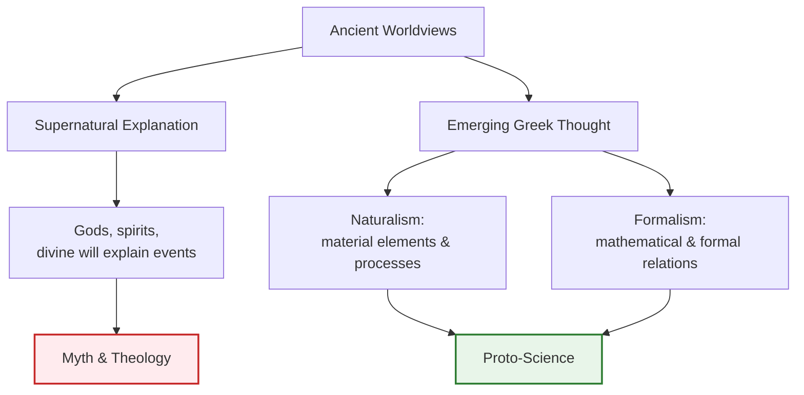

# Chapter 2 · Module 1
# Greek Science
## Psychology · Unit 1 · History of Psychology

---

Imagine you are a merchant in ancient Assyria, 3,000 years before the common era. You have had a terrible night. In your dream, a woman made of smoke beckoned you toward a river of milk. You woke in a sweat, heart slamming against your ribs. Now you face a decision: do you interpret this as a message from the gods, or dismiss it as the meaningless fizzle of a sleeping mind?

If you lived in that era, you would seek out a dream interpreter whose **dream books** catalogued thousands of symbols and their divine meanings. The Assyrians believed dreams were transmissions from the spirit world, and that the **psyche** — though they did not use that word — was something like breath, a vital force tied to the heart and lungs. When breath stopped, life stopped. The connection seemed obvious, self-evident, not even worth questioning.

Humans have been theorizing about the mind for as long as they have kept records — Assyrian dream books date to roughly the fifth millennium BCE, and the Hindu **Vedas**, sacred texts rich with reflections on sensation and consciousness, precede the first millennium BCE. These were not primitive fumblings. They were sustained, systematic attempts to understand what happens inside us when we perceive, remember, dream, and desire. The question is not *when* people started thinking about psychology — it is *what changed* to make some of those thoughts start looking like science.

Something did change. Around the seventh century BCE, in a federation of city-states along the Aegean coast, a handful of thinkers stopped asking what the gods wanted and started asking what the world was made of. They argued with each other — not about theology, but about the fundamental substance of reality. What was it about ancient Greece that produced this break? Was it the borrowed Phoenician alphabet? The unusual political freedom? Or something else — something we still cannot fully explain?

---

## The Crack in the Mirror: How Greeks Stopped Seeing Gods in Everything

You have probably absorbed a tidy narrative: ancient people were superstitious, then the Greeks invented reason. It is a comfortable story, and it is mostly wrong. The shift was not a clean break — it was a crack that ran through everything, and it took centuries to widen.

Before Greece, the dominant way of explaining the world was **supernatural**: events happened because gods, spirits, or divine forces willed them. Floods, illness, dreams, madness — all were messages from elsewhere. The Egyptian and Babylonian cultures developed sophisticated observations of the heavens, but they framed those observations within a theological worldview. Stars were gods. Disease was punishment. The mind was a spirit lodged in flesh.

Then, around the seventh century BCE, a group of thinkers in Ionia (modern-day western Turkey) began advocating **naturalism** — the view that the universe is best explained in terms of material elements and processes, not divine intervention. This was not atheism. Most of these thinkers probably still believed in gods. But they drew a line: the *mechanism* of how things work does not require a deity pulling levers.

**Formalism** emerged alongside naturalism — the view that the universe is best explained through formal or mathematical relations. Together, these two perspectives laid the groundwork for what we now call science.

*Figure 2.1 — The split between supernatural and naturalistic explanation in ancient Greece. Naturalism and formalism converged to produce early scientific thinking.*

Bertrand Russell once wrote that "nothing is so surprising or difficult to account for as the sudden rise of civilization in Greece" (1945, p. 3). He was not exaggerating. Within roughly three centuries, Greek thinkers transformed the intellectual landscape of the ancient world. They did not have laboratories. They did not run experiments. But they did something that no culture before them had done quite so systematically: they offered competing *theories* about reality and expected each other to defend those theories with arguments.

### > [!TIP] Stop and Think #1
Why does it matter whether an explanation is naturalistic or supernatural? If both "a god made it happen" and "fire is the fundamental substance" can account for the same observation, what makes one more *scientific* than the other? Think about what each explanation lets you *do* next.

The critical ingredient was not just intelligence — Babylonian astronomers were brilliant. It was a shift in **epistemic attitude**: a willingness to treat your own explanation as a *hypothesis* rather than a revealed truth. The early Greek theorists offered their ideas as **speculative hypotheses** and expected others to propose alternatives. They used **analogies** — comparing the mind to a wax tablet, comparing the cosmos to a living organism — as exploratory tools, not as proofs.

### > [!TIP] Stop and Think #2
Consider the difference between "I believe this because my teacher told me" and "I believe this because it best explains what I observe." What has to change in a culture before the second kind of thinking becomes possible? Can you think of any modern domains where the first kind still dominates?

But there is a paradox here, and it is one you need to sit with. These thinkers were **speculative**, not experimental. They reasoned about the world from their armchairs (or, more accurately, from their market squares). They rarely tested their ideas by manipulating variables and observing outcomes. Why?

The answer is partly sociological. The forms of physical intervention required for empirical experimentation — mixing chemicals, dissecting animals, building apparatus — were dismissed as **"mechanical" or "servile" arts**, suitable only for slaves. The approved pursuits of free Greek men were the **"liberal arts"**: logic, rhetoric, philosophy. The Greek historian Xenophon captured this attitude bluntly: "The mechanical arts carry a social stigma, and are rightly dishonored in our cities."

### > [!TIP] Stop and Think #3
Imagine you are a curious person in ancient Greece who wants to understand why water boils. You have the idea of running a controlled test — heat the same water in the same vessel at different intensities and measure what happens. But your society tells you that hands-on work is for slaves. How does this social norm shape what counts as *knowledge*? Can you think of modern equivalents where status determines what kinds of inquiry are taken seriously?

This created a strange situation. Greek thinkers were willing to challenge the gods, question the nature of reality, and propose radical theories about the cosmos — but they were largely unwilling to get their hands dirty testing those theories. The result was a tradition of brilliant speculation with limited empirical grounding. It would take nearly two millennia for the experimental method to catch up with the theoretical ambition.

And yet — and this is the part that should genuinely surprise you — some of those speculative theories about the mind were remarkably sophisticated. Aristotle's conception of mental states as the **functional capacities** of complex material bodies approximates contemporary cognitive psychology in ways that are still debated by scholars today. As the psychologist John Greenwood has argued, this was not a primitive fumbling toward our modern understanding. It was a parallel insight that was later *lost* during the scientific revolution of the 16th and 17th centuries (Greenwood, 2009).

### > [!TIP] Stop and Think #4
If Aristotle's theory of mind was sophisticated and in some ways similar to modern cognitive psychology, and if that theory was then *abandoned* during the scientific revolution, what does that tell you about scientific progress? Is the history of science a straight line from ignorance to knowledge, or something messier?

---

## The WEIRD Filter: Whose History Are We Reading?

Here is a question that rarely appears in history-of-psychology textbooks: whose experience gets to count as the default human story?

When researchers Joseph Henrich, Steven Heine, and Ara Norenzayan published their landmark paper "The Weirdest People in the World?" in 2010, they documented something that should have been obvious for decades. The vast majority of psychological research — roughly 96% of participants in top journals — came from **WEIRD** societies: Western, Educated, Industrialized, Rich, and Democratic. And not just any WEIRD societies: a disproportionate share came from a handful of American universities. The researchers showed that on measures ranging from visual perception to moral reasoning, WEIRD populations were statistical outliers, not representatives of the human norm (Henrich et al., 2010).

This finding has a direct implication for how you read the history you are studying now. The standard narrative of psychology's origins — "ancient superstition gave way to Greek reason, which gave way to modern science" — is itself a story told from within the WEIRD tradition. It privileges the intellectual lineage that runs from Athens to Paris to London to the American research university.

| Feature | WEIRD Narrative | What the Evidence Actually Shows |
|---------|----------------|----------------------------------|
| **Ancient psychology** | Primitive animism, superstition | Sophisticated materialistic theories (e.g., Aristotle's functionalism) |
| **Greek contribution** | Birth of "rational" thought | One tradition among many; Indian and Chinese thinkers also theorized systematically |
| **The psyche/soul** | Universal belief in immaterial spirit | Many cultures debated whether the psyche was material or immaterial |
| **Progress** | Linear from ignorance to science | Non-linear; ideas gained, lost, and rediscovered across centuries |
| **Who counts** | Greek → European → American thinkers | Global contributions systematically marginalized |

*Table 2.1 — How the WEIRD filter distorts the standard history of psychology. The left column reflects common assumptions; the right column reflects what scholars have documented.*

> [!NOTE] Key Terms
> **WEIRD**: Western, Educated, Industrialized, Rich, and Democratic — a label for the narrow cultural sample that dominates psychological research.
> **Naturalism**: The view that the universe is best explained through material elements and processes, not divine intervention.
> **Formalism**: The view that the universe is best explained through formal or mathematical relations.

### > [!TIP] Stop and Think #5
If 96% of psychological research participants come from WEIRD societies, and if the history of psychology is told primarily through a WEIRD lens, what important stories might be missing? Think about a psychological concept you take for granted — like "self-esteem" or "intelligence" — and ask: would this concept look the same if it had been developed in a non-WEIRD context?

The Assyrians kept dream books. The Vedas explored consciousness. The Egyptians and Babylonians developed sophisticated astronomical systems embedded in theological frameworks. These were not failed attempts at science. They were different intellectual traditions with different goals. When we treat the Greek turn toward naturalism as the *beginning* of psychology, we implicitly frame everything before it as pre-history — a prologue to the real story.

That framing is itself a hypothesis, not a fact. And like all hypotheses, it deserves to be tested.

---

## In Practice: Why Armchair Theories Still Shape Your Life

> [!IMPORTANT]
> The single most important insight from this module is this: **the Greek distinction between naturalistic and supernatural explanation did not settle the question of how to study the mind — it opened a debate that psychology has never resolved.** Every time a modern psychologist argues about whether to use brain scans or self-report questionnaires, whether to run experiments or conduct interviews, whether the mind is reducible to neurons or irreducible to experience — they are re-enacting, in updated form, the same tensions that Greek thinkers first articulated 2,700 years ago.

Consider a modern example. In 2019, researchers at a WEIRD university published a study claiming that a specific brain region "caused" a particular emotional response. A colleague at a research institute in India countered that the emotional response could not be understood outside its cultural and relational context — that the brain scan captured the *mechanism* but missed the *meaning*. This is the naturalism-versus-formalism debate wearing a lab coat. The Greek thinkers did not resolve it. Neither have we.

The Greeks' refusal to experiment was not mere laziness or snobbery — though the snobbery was real. It reflected a genuine intellectual conviction that the deepest truths about reality could be grasped through reasoning alone. That conviction has never fully disappeared. It lives on in every philosopher who argues that thought experiments are as valid as empirical ones, in every theorist who builds elaborate models before running a single study.

---

## Speaking of Greek Science...

- **At a dinner party**, someone says, "The Greeks basically invented science." You could respond: "They invented *one version* of science — the armchair kind. They thought getting your hands dirty was for slaves. It took another two thousand years before anyone combined Greek theory with actual experiments. So they invented the *thinking* part, but the *doing* part came from somewhere else entirely."

- **In a study group**, a friend asks, "Why should I care about what some guy in ancient Greece thought about the mind?" You might say: "Because that guy — Aristotle — described mental processes as functions of the body, not properties of an immaterial soul. Modern cognitive psychology says almost the same thing. The fact that his idea was *lost* for centuries and then *rediscovered* tells you something important: scientific progress is not a straight line."

- **Scrolling social media**, you see a post claiming "Ancient people were too primitive to understand psychology." You could reply with: "The Vedas explored consciousness before the first millennium BCE. The Assyrians catalogued thousands of dream symbols. Aristotle's theory of mind rivals some modern frameworks. The word 'primitive' says more about the person using it than about the people they are describing."

---

The thinkers you have just met — the naturalists, the formalists, the armchair theorists who dared to explain the world without gods — were only the beginning. In the next module, you will meet the specific philosophers who took the first crack at explaining what the world is *made of*. One of them thought everything was water. Another thought everything was fire. They were wrong about the substance, but they were spectacularly right about the method: propose a theory, defend it with arguments, and welcome the challenge of rivals. The naturalists are coming — and they are going to argue about everything.

---
*[Chapter complete. Take time with the "Stop and Think" prompts before moving to the next chapter.]*

---

## References

Greenwood, J. D. (2009). *A conceptual history of psychology*. McGraw-Hill.

Henrich, J., Heine, S. J., & Norenzayan, A. (2010). The weirdest people in the world? *Behavioral and Brain Sciences*, 33(2–3), 61–83. https://doi.org/10.1017/S0140525X0999152X

Onians, R. B. (1958). *The origins of European thought about the body, the mind, the soul, the world, time, and fate*. Cambridge University Press.

Russell, B. (1945). *A history of Western philosophy*. Simon & Schuster.

Lloyd, G. E. R. (1964). Early Greek science: Thales to Aristotle. *Bulletin of the Institute of Classical Studies*, 11(1), 70–78.
