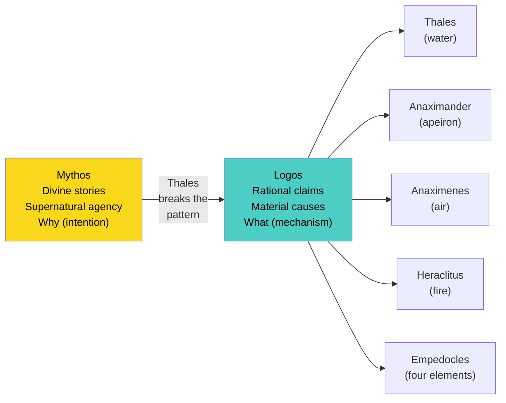

# Chapter 2 · Module 2
# The Naturalists
## Psychology · Unit 1 · History of Psychology

---

Imagine you live in a coastal city on what is now the Turkish coast, around 600 BCE. Every morning, fishermen haul their catch from the Aegean Sea. Farmers irrigate their fields with river water. Women carry clay jugs to public fountains. Water is everywhere — sustaining, shaping, destroying. Now imagine someone stands in the marketplace and declares, with absolute seriousness, that *everything* in the universe — the mountains, the stars, your own body — is made of water.

You would probably laugh. And people did. Aristotle later wrote that this man, **Thales of Miletus**, once walked straight into an open well because he was so busy staring at the stars. He seemed like a fool. But this same fool used astronomical calculations to predict a bumper olive harvest, cornered the market on olive presses, and made a fortune. He predicted a solar eclipse during a battle between two rival kingdoms. He introduced geometry to Greece.

Here is the puzzle that should bother you: How did a man who stumbled into wells also stumble onto the most revolutionary idea in the history of human thought? Not the idea that water matters — everyone knew that — but the idea that you could *theorize* about the fundamental nature of reality at all, without invoking gods, spirits, or ancestral myths. Thales did not say Poseidon controls the sea. He said the sea *is* the fundamental stuff of everything. That shift — from supernatural explanation to natural explanation — sounds simple. It was not. It required a kind of thinking that no human culture had systematically attempted before.

And once that door opened, others rushed through it. Within a few generations, thinkers across the Greek world were competing to outdo each other: What is the *real* fundamental element? How does change happen? Why does anything exist at all? They argued in public, challenged each other's claims, and offered hypotheses instead of dogmas. They were doing something that looked, for the first time in history, recognizably like science.

But here is the question that will haunt the rest of this chapter: If these thinkers were so brilliant, why were they so *wrong*? Water is not the fundamental element. Neither is air, fire, or the "boundless." Every single theory you are about to read was, in the most literal sense, false. And yet every single one of them changed the world. How can a wrong idea be the most important idea anyone ever had?

---

## From Gods to Guesses: The Birth of Abstract Thinking

### The Fool Who Changed Everything

You have probably heard the phrase "standing on the shoulders of giants." It usually refers to modern scientists building on earlier work. But the first giant was not a scientist at all — he was a businessman who stared at the sky and fell into a hole.

Before **Thales** (c. 624–c. 546 BCE), if you wanted to understand why the Nile flooded or why crops failed, you asked a priest. The answer always involved the will of a god. This was not stupidity — it was a perfectly coherent system. Myths explained the world through stories of divine intention. The Greeks called this mode of explanation **mythos**: narrative accounts rooted in supernatural agency. Thunder happens because Zeus is angry. The seasons change because Demeter grieves. The system worked because it *felt* complete. It answered the "why" in terms that made emotional sense.

### From Mythos to Logos

Thales did something different. He asked: What if the answer is not a *who* but a *what*? What if the fundamental stuff of the universe is not a god's intention but a material substance — something you can touch, observe, and reason about? He proposed **water** as the **arche**, the fundamental principle underlying all things. His reasoning was not arbitrary: water exists as liquid, solid, and gas. It is essential to every living thing. It shapes landscapes. If you had to pick one substance to explain everything, water was a reasonable guess.

The revolutionary part was not the answer. It was the *method*. Thales offered his claim as a **hypothesis** — a proposition that could be examined, debated, and rejected. He did not say, "The gods revealed this to me." He said, "I think this is true; here is why; prove me wrong." The Greeks called this new mode of explanation **logos**: rational, evidence-based, impersonal reasoning. The shift from mythos to logos was not a single moment — it was a slow, contested revolution that played out over generations.

> [!TIP]
> **Stop and Think #1:** Consider a belief you hold about human behavior — say, why people procrastinate. Is your explanation more like *mythos* (a story that feels true, involving intentions and narratives) or *logos* (a testable claim about mechanisms)? Most of our everyday psychology is still mythos in disguise.

*Figure: The transition from mythos to logos — a single break that spawned a century of competing naturalist theories.*

---

## The Element Chasers: Five Thinkers, Five Theories

Once Thales opened the door, others did not politely step through — they shoved. Within a few decades, thinkers across the Greek world were locked in a fierce intellectual competition. Each one declared that the *previous* theory was wrong and offered a new candidate for the fundamental element. What emerged was not a single school of thought but a *culture of disagreement* — and that culture, not any particular theory, was the real revolution.

**Anaximander** (c. 610–c. 546 BCE), Thales' own student, was the first to break ranks. He argued that the fundamental substance could not be any specific element like water, because water has definite qualities — it is wet, it is cold — and those qualities would need their own explanation. Instead, he proposed the **apeiron**, a Greek word meaning "the boundless" or "the indefinite." The apeiron was not a substance you could point to; it was an abstract, infinite source from which all specific things emerged and to which they returned. This was a staggering leap. Thales had replaced gods with matter. Anaximander replaced matter with an *abstraction*.

But Anaximander did something even stranger. He proposed a theory of the origin of living creatures that anticipated, in crude outline, the logic of **evolution**. He suggested that living things originally arose from moisture, and that the first animals were encased in prickly barks. As they dried out and the barks cracked open, the creatures inside emerged. He even speculated that humans must have originated inside fish-like creatures, because human infants cannot survive on their own — so early humans must have been nurtured by another species. Two thousand four hundred years before Darwin, a man on the Turkish coast was reasoning about adaptation and survival.

**Anaximenes** (c. 588–c. 524 BCE), another Milesian, rejected the apeiron as too vague. He argued that the fundamental element must be something observable: **air**. His reasoning was ingenious. He noticed that when you blow on your hands with your mouth wide open, the air feels warm; when you blow on hot soup through pursed lips, the air feels cool. The difference, he argued, is **density**. Rarefied air is warm; condensed air is cool. From this everyday observation, he built an entire cosmology: rarefied air becomes fire; progressively condensed air becomes wind, then cloud, then water, then earth, then stone. The soul itself, he claimed, is made of especially rarefied air.

Anaximenes' contribution matters for a reason beyond his specific theory. He was the first thinker to explain qualitative differences (warm vs. cool, soft vs. hard) in terms of quantitative differences (density, compression). This idea — that measurable quantities underlie observable qualities — became the foundation of modern physical science. When a psychologist today explains subjective experience in terms of neural firing rates, they are doing something Anaximenes would recognize.

**Heraclitus** of Ephesus (c. 540–c. 480 BCE) looked at all of this and declared that everyone was missing the point. The fundamental element is **fire**, yes — but the real insight is not about *substance*. It is about *change*. Everything, Heraclitus insisted, is in constant flux. "On those who step into the same rivers, different and different waters flow." The river looks the same. It never is. Your body, your thoughts, your identity — all of it is a process, not a thing. What holds it together is the **logos**: an underlying rational principle governing the constant interplay of opposites — hot and cold, wet and dry, life and death.

Heraclitus also offered a theory of the **psyche** (the soul or mind) that would echo through centuries of psychology. The psyche, he argued, is made of fire. A dry psyche is wise and healthy; a wet psyche — the psyche of a drunkard — is clouded and irrational. "The drunken man," he wrote, "behaves like a foolish boy, stumbling without knowing where he goes." This was not just poetry. It was a proto-psychological claim: your mental state is a function of your physical composition, and it can be degraded by specific causes.

> [!TIP]
> **Stop and Think #2:** Heraclitus claimed that identity is a process, not a fixed thing. Consider your own sense of self over the past five years. How much of "you" has actually stayed the same? If your beliefs, habits, and even your body's cells have changed, what exactly *is* the thing you call "me"?

**Empedocles** (c. 495–c. 435 BCE) of Acragas (modern Agrigento, Sicily) looked at this entire debate and said: you are all half right. No single element is fundamental. There are **four elements** — fire, air, earth, and water — and they are all equally real, equally eternal. They are the irreducible **roots** (*rhizomata*) of everything. What creates the world is not a single substance but the way these four elements combine and separate, governed by two cosmic forces: **love** (attraction, combination) and **strife** (repulsion, separation).

This was not just a clever compromise. Empedocles' theory introduced something genuinely new: a *dynamic* model of reality. Things are not just made *of* stuff; they are shaped by *forces* acting on that stuff. Combined in one proportion, the four elements create bone; in another, blood; in another, hair. Health is the proper *balance* of the elements. Disease is imbalance. This principle — that wellbeing depends on equilibrium — would later become the foundation of Hippocratic medicine and, eventually, of modern ideas about **homeostasis**.

Empedocles also proposed something astonishing: a theory of biological origins that anticipates natural selection. He described how the parts of living things — limbs, organs, heads — originally combined at random, producing monstrous hybrids: "man-faced ox-progeny" and "ox-headed offspring of man." These chimeras could not survive. Only those combinations that happened to be *functional* persisted. Over time, the non-viable forms died out, leaving behind organisms that *appeared* to have been designed — but were actually the product of chance and filtering.

> [!TIP]
> **Stop and Think #3:** Empedocles described random combinations being filtered by survival — a logic strikingly similar to Darwinian natural selection, proposed 2,300 years later. Does it matter that Empedocles had no mechanism (like genetic inheritance) to explain *how* this filtering works? Can an idea be scientifically valuable even if it lacks a complete mechanism?

| Thinker | Element(s) | Key Innovation | Modern Echo |
|---|---|---|---|
| Thales | Water | Abstract hypothesis | The scientific method itself |
| Anaximander | The Apeiron (boundless) | Abstract non-material principle | Mathematical/ theoretical models |
| Anaximenes | Air | Quantitative explanation of quality | Physics, psychophysics |
| Heraclitus | Fire | Change as fundamental; the logos | Process philosophy, dynamic systems |
| Empedocles | Four elements + love/strife | Dynamic forces; proto-evolution | Homeostasis, natural selection |
*Table: The five Naturalists and their contributions — each wrong about the element, each right about something bigger.*

> [!NOTE]
> **Key Terms:**
> - **Arche** (ἀρχή): The fundamental principle or origin of all things — the question "what is everything ultimately made of?"
> - **Apeiron** (ἄπειρον): "The boundless" — Anaximander's abstract, indefinite source of all specific substances.
> - **Logos** (λόγος): Rational principle or order underlying the universe; also the mode of explanation based on reasoning rather than myth.
> - **Psyche** (ψυχή): The soul or animating principle of living beings — the ancestor of our word "psychology."
> - **Rhizomata** (ῥιζώματα): "Roots" — Empedocles' term for the four irreducible elements.

> [!TIP]
> **Stop and Think #4:** Notice that every thinker in this table was *wrong* about the fundamental substance. Yet each one contributed something genuinely important to the history of science. What does this tell you about the relationship between being *right* and being *useful* in science?

---

## Beyond the Lab: Why Wrong Theories Changed the World

> [!IMPORTANT]
> The most important insight from the Naturalists is not any particular theory about elements. It is the *method* they invented: the practice of offering claims as testable hypotheses, competing in public, and accepting that previous theories can be overturned by better reasoning. This culture of critical debate — not any single discovery — is the foundation of all science, including psychology.

You might think the Naturalists are just a historical curiosity, a quaint prelude to "real" science. That would be a mistake. Their struggles are still your struggles.

Consider **Anaximenes' core move**: explaining a qualitative experience (warm vs. cool) in terms of a quantitative variable (density of air). Modern psychology does this every day. When a researcher measures the relationship between cortisol levels and subjective anxiety, they are performing Anaximenes' operation — translating felt experience into measurable quantity. The entire field of **psychophysics**, which studies the relationship between physical stimuli and psychological perception, is built on the assumption that qualities can be mapped to quantities. Anaximenes did not have the tools. He had the *idea*.

Consider **Empedocles' model of health as balance**. The four-element theory is gone, but the principle survives. Modern medicine describes health in terms of homeostasis — the body's tendency to maintain equilibrium among competing systems. Psychologists describe wellbeing in terms of balance among competing needs, drives, or neurological systems. The language has changed. The logic has not.

Consider **Heraclitus' river**. The claim that identity is a process, not a fixed thing, is no longer philosophical speculation. It is empirical fact. Your body replaces virtually all of its cells over a span of years. Your memories are reconstructed each time you recall them. The "you" of today shares few physical particles with the "you" of a decade ago. What persists is a *pattern* — a logos — not a substance. Contemporary psychologists studying the self grapple with exactly this paradox: how do we maintain a stable sense of identity when everything about us is in flux?

And consider **Empedocles' chimeras**. His account of random combinations filtered by survival is not just a proto-Darwinian curiosity. It is a *way of thinking* that pervades modern science. In computational psychology, researchers use **genetic algorithms** that generate random variations and filter them by fitness — exactly Empedocles' logic, executed by machines. The ancient insight was not a lucky guess. It was a genuine understanding of how complexity can emerge from simple processes without a designer.

> [!TIP]
> **Stop and Think #5:** The Naturalists were based in a narrow strip of the eastern Mediterranean — modern Turkey, Sicily, and mainland Greece. Yet similar patterns of inquiry (asking "what is the fundamental stuff?" and "how does change happen?") independently emerged in ancient China (*wuxing* — the five elements), India (*pancha mahabhuta* — the five great elements), and Africa (*various cosmological systems*). What does this suggest about whether the mythos-to-logos shift is a specifically Greek achievement, or a *human* one?

---

## Speaking of Elements and Essences...

- **When a friend says, "I'm just not the same person I was in college,"** they are channeling Heraclitus without knowing it. The river metaphor is so embedded in everyday language that we forget someone had to *invent* the idea that identity is a process. Next time you hear this, you can say: "That's literally Heraclitus. Fifth century BCE. You're doing pre-Socratic philosophy at brunch."

- **When someone describes "finding balance" in their life** — between work and rest, activity and calm, social time and solitude — they are echoing Empedocles' model of health as the equilibrium of competing forces. The four-element theory is dead. The intuition that wellbeing depends on *proportion* and *balance* is very much alive. Every wellness app that tracks your sleep-to-activity ratio is a distant descendant of a Sicilian philosopher who thought your bones were made of earth and fire in a specific ratio.

- **When a therapist asks you to "unpack" a belief** — to examine whether it is based on evidence or just a story that feels true — they are performing the mythos-to-logos operation that Thales initiated 2,600 years ago. The core move of cognitive behavioral therapy is to take a belief that operates like *mythos* (a narrative, an intuition, a felt truth) and subject it to *logos* (evidence, logic, testability). You are not just talking about your feelings. You are doing ancient Greek science on your own mind.

---

The Naturalists gave humanity its first toolkit for thinking about the material world without gods. But they left a crucial question unanswered: If everything is made of atoms and elements, how do those atoms produce *thought*? How does matter become mind? The thinkers who took up that challenge did not chase elements. They chased **form** — the invisible structure that makes a thing what it is. They would become known as the Formalists, and they would reshape not just science, but the very idea of what it means to *know* something.

---
*[Chapter complete. Take time with the "Stop and Think" prompts before moving to the next chapter.]*

---

## References

- Barnes, J. (1979a). *The Presocratic Philosophers*. Routledge.
- Barnes, J. (1987). *Early Greek Philosophy*. Penguin.
- Kirk, G. S., Raven, J. E., & Schofield, M. (1983). *The Presocratic Philosophers* (2nd ed.). Cambridge University Press.
- Palmer, J. A. (2022). "Thales — the 'first philosopher'?" *British Journal for the History of Philosophy*. Taylor & Francis.
- University of California Museum of Paleontology (n.d.). "Evolution and Paleontology in the Ancient World." Retrieved from https://ucmp.berkeley.edu/history/ancient.html — credits Empedocles with an early theory of natural selection.
