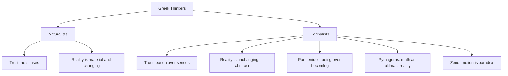
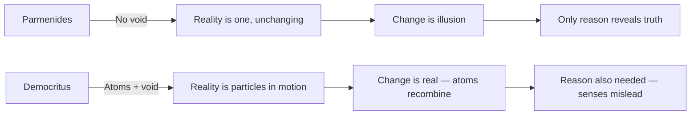

# Chapter 2 · Module 3
# The Formalists and the Physicians
## Psychology · Unit 1 · History of Psychology

---

Imagine you are standing on a dusty road outside the Greek colony of Elea, somewhere in southern Italy, around 460 BCE. The sun is punishing. Dry grass crackles underfoot. A crowd has gathered to watch a race — not between two athletes, but between a man named Achilles and a tortoise. The tortoise gets a head start. The crowd laughs. Of course Achilles will win. He is the fastest runner in Greece. But a young philosopher named Zeno, standing off to the side with a half-smile, asks you a question that will ruin your afternoon: *when*, exactly, does Achilles catch the tortoise?

You think the answer is obvious. You point. You say, "There — when he gets to where the tortoise started." But Zeno shakes his head. By the time Achilles reaches that point, the tortoise has moved a little further — maybe only a few inches, but it has moved. And by the time Achilles reaches *that* point, the tortoise has moved again. You can divide the distance between them into an infinite number of smaller and smaller segments. Achilles must cross each one. Every single one. Can anyone cross an infinite number of distances in a finite amount of time?

The crowd grows restless. Someone shouts that the question is stupid — just watch the race, stop talking. But you can't watch the race anymore, not without feeling the ground shift beneath your logic. You stare at the road. The tortoise keeps walking. The sun beats down. And the answer — the real answer — won't arrive for another two thousand years, when a mathematician named Leibniz invents a tool called calculus that can sum an infinite series in finite time. But that is centuries away. Right now, in this heat, with this crowd, the tortoise is winning.

---

## When Reason Dethrones the Senses

You've already met the Greek naturalists — thinkers like Thales and Heraclitus who trusted what their eyes and hands told them about the world. Water is real. Fire is real. Change is everywhere. But a group of philosophers from Elea and southern Italy looked at the same world and reached a radically different conclusion: your senses are lying to you.

**Parmenides of Elea** (born around 515 BCE) argued that everything you see, hear, and touch — the shifting colors of sunset, the crack of thunder, the heat of a flame — is an illusion. Reality, he insisted, is **unchanging**, indivisible, eternal, and motionless. He called the sensory world the "way of opinion" and contrasted it with the "way of truth," which only **reason** — not the body, not the eyes — can access. In his poem *On Nature*, he wrote: "Nor was it ever, nor will it be; since now it is, all together, one, continuous" (Barnes, 1979a, p. 178).

This was a direct assault on common sense. And Parmenides knew it. He developed what historians credit as an early form of the **dialectic method** — the systematic exploration of arguments for and against opposing positions. He didn't just claim reality was unchanging; he tried to *prove* it, logically, step by step.

**Zeno of Elea** (born around 490 BCE), Parmenides' student, took this further. If his teacher said motion was an illusion, Zeno would demonstrate *why* commonsense belief in motion leads to absurdity. He designed a series of **reductio ad absurdum** arguments — proofs that start by assuming the opposite of what you want to show, then demonstrate that the assumption collapses into contradiction. His most famous argument, the race between Achilles and the tortoise, doesn't just challenge your intuition about speed. It challenges the very coherence of dividing space and time into infinitely many parts.

But here's the puzzle that should nag at you: Zeno's paradoxes are logically rigorous. They *work* as arguments. And yet Achilles obviously catches the tortoise. You can watch it happen. So who is wrong — Zeno, or your eyes?

*Figure 2.1: The split between naturalist and formalist approaches to understanding reality. The formalists placed abstract reasoning above sensory experience.*

> [!TIP]
> **Stop and Think:** Think about the last time you were absolutely certain about something you saw — an optical illusion, a mirage on hot pavement, a face in the clouds that turned out to be a pattern of light. If your senses can fool you in small ways, could they fool you about the fundamental nature of reality? How would you know?

### Pythagoras and the Music of Mathematics

If Parmenides said reality was unchanging, **Pythagoras** (c. 572–497 BCE) went further: he said reality was *mathematical*. Born on the island of Samos and later settling in Croton, southern Italy, Pythagoras founded a school that was part mathematics department, part religious brotherhood. His followers didn't just study numbers — they worshipped them.

The Pythagorean insight was this: the world you experience through your senses — the rough bark of a tree, the taste of salt, the weight of a stone — is imperfect, temporary, and deceptive. But mathematical truths are **perfect**, **eternal**, and **independently real**. The angles of a triangle sum to 180° whether or not any physical triangle has ever existed. You can know this through pure reason, without ever seeing a triangle. Pythagoras called the abstract mathematical world the **intelligible world** and the sensory world the **sensible world** — a distinction that would echo through Plato, Augustine, and into modern cognitive science.

Pythagoras's fascination with numbers wasn't purely abstract. He discovered that musical harmony follows mathematical ratios — a vibrating string cut in half produces a note one octave higher, a string cut in two-thirds produces a perfect fifth. From this, he concluded that the entire universe is structured by mathematical harmony. The cosmos, he believed, literally makes music — the "music of the spheres" — which humans cannot hear only because we've been immersed in it since birth.

This isn't just ancient mysticism. In 1619, Johannes Kepler published *Harmonices Mundi*, an attempt to explain planetary orbits using the same Pythagorean musical ratios. He was wrong about the details, but his conviction that the universe is mathematically ordered drove him to discover the laws of planetary motion — laws that still underpin modern astrophysics. The Pythagorean intuition about mathematical harmony turned out to be more right than Pythagoras himself could have known.

> [!TIP]
> **Stop and Think:** When you hear a song that moves you, is the beauty in the sound waves hitting your ear, or in the mathematical relationships between the frequencies? Can beauty exist in pure mathematics, or does it need a human body to experience it?

### The Mind in a Prison: Pythagoras on the Soul

Pythagoras was a **dualist** — he believed that mind and body are fundamentally different kinds of things. The **psyche** (the Greek word for soul or mind) is immortal, rational, and capable of grasping the intelligible world. The body is corruptible, temporary, and a source of distraction. For Pythagoras, the body was literally a prison: the psyche is trapped in it, cycling through reincarnations in plant, animal, and human forms, and can only escape through rational contemplation and moral purification.

This idea — that the mind is noble and the body is a cage — sounds exotic until you realize how deeply it has shaped Western thought. Early Christian theology adopted it wholesale. Augustine's distinction between the City of God and the City of Man echoes Pythagorean dualism. And even today, when someone says "mind over body" or treats physical desire as something to be disciplined by reason, they are channeling a 2,500-year-old philosophy from a Greek colony in Italy.

Pythagoras also identified the **brain** as the organ of thought — a claim that seems obvious now but was contested for centuries. And he developed a theory of health based on **harmony**: physical and psychological disorders arise when the elements of the body fall out of balance, and treatment consists of restoring that balance through diet, exercise, and music. Sound familiar? This framework would be refined by Hippocrates, whom you'll meet shortly.

> [!TIP]
> **Stop and Think:** Have you ever felt that your body was working against your mind — that fatigue, hunger, or illness made it harder to think clearly? Where does that intuition come from? Is it a discovery about human nature, or an inheritance from ancient Greek philosophy?

### Atomism: The Void and the Seeds of Everything

While the Eleatics denied the reality of change and the Pythagoreans sought truth in numbers, a quieter revolution was brewing. **Democritus** (c. 460–370 BCE), born in Abdera in northern Greece, proposed a theory so radical that it wouldn't be confirmed until the 19th century: everything in the universe is made of tiny, indivisible particles moving through empty space.

Democritus called these particles **atom** (Greek for "uncuttable") and the empty space between them the **void**. Atoms, he argued, are eternal, indestructible, and come in different shapes and sizes. They combine, separate, and recombine to form every object you've ever touched, every color you've ever seen, every thought you've ever had — including the thoughts that Parmenides said were illusions and the mathematical harmonies that Pythagoras said were ultimate reality.

This was a direct challenge to Parmenides, who had argued that the void — nothingness — cannot exist, because "nothing" is not a thing that can be. Democritus essentially said: *watch me*. He accepted that reality is material and atomic, but he agreed with the formalists that the senses are unreliable. True knowledge, he argued, comes only when reason penetrates beyond what the senses report.

Here is the irony that should stop you cold: Democritus was right. Atoms are real. The void is real. But he had no way to prove it. He arrived at the correct answer through philosophical reasoning alone — the same kind of abstract logic that Parmenides used to arrive at the *wrong* answer. What does that tell you about the relationship between logic and truth?

*Figure 2.2: Parmenides and Democritus agreed that senses mislead — but reached opposite conclusions about the nature of reality.*

> [!TIP]
> **Stop and Think:** Democritus got the right answer for the wrong reasons — or maybe for no provable reasons at all. Is a true belief still valuable if you can't justify it? What's the difference between a lucky guess and genuine insight?

---

## The Physicians Who Listened to Bodies

The formalists looked inward, toward logic and mathematics. But in the Greek colonies of southern Italy and on the island of Cos, off the coast of what is now Turkey, a different kind of thinker was doing something far messier: touching sick people, watching them die, and trying to figure out why.

Early Greek medicine was temple medicine — practiced by priests of **Asclepius**, the god of healing. Treatments consisted of sleep, prayer, suggestion, and ritual. If you were ill, you went to the temple, lay down, and waited for the god to visit you in a dream. The priests interpreted the dream and prescribed accordingly. It was, by modern standards, not medicine at all.

But a physician named **Alcmaeon** (active around 500 BCE), working in Croton — the same city where Pythagoras had established his school — began to change this. Alcmaeon dissected human eyes and brains. He traced the **optic nerve** from the retina to the brain and concluded that the brain, not the heart, is the center of perception and cognition. He developed a theory of **animal spirits** — material substances that carry signals through the nerves — that would persist in some form for over two thousand years, influencing Descartes in the 17th century.

Alcmaeon also proposed a theory of health that drew on the naturalist tradition: the body is governed by opposing properties — hot and cold, dry and moist — and health is the **balance** between them. Disease is imbalance. Fever is an excess of heat; treat it with cold. Dehydration is an excess of dryness; treat it with liquids. Death is the extreme imbalance from which no recovery is possible.

### Hippocrates and the Humoral Revolution

**Hippocrates** (c. 460–377 BCE) studied at the temple of Asclepius on Cos but eventually rejected temple medicine entirely. He founded his own school and became, by most accounts, the most influential physician of the ancient world — the figure still called the "father of medicine."

Hippocrates inherited Alcmaeon's insight about the brain. "It ought to be generally known," he wrote, "that the source of our pleasure, merriment, laughter and amusement, as of our grief, pain, anxiety and tears is none other than the brain" (Lloyd, 1983, p. 248). This was not a throwaway line. It was a direct, public rejection of the prevailing belief that emotions originate in the heart — a belief that would persist in popular culture for millennia and still echoes in Valentine's Day cards today.

His most famous target was epilepsy, known in his time as the "sacred disease" because it was attributed to divine possession. Hippocrates demolished this explanation with a surgeon's precision: "I do not believe that the 'Sacred Disease' is any more divine or sacred than any other disease, but, on the contrary, has specific characteristics and a definite cause" (Lloyd, 1983, pp. 237–238). He added, with unmistakable contempt, that those who first called epilepsy sacred were "the sort of people we now call witch-doctors, faith-healers, quacks and charlatans" who used divine explanations "to conceal their ignorance."

Hippocrates developed Alcmaeon's balance theory into the **four humors** — yellow bile, blood, black bile, and phlegm — each linked to one of Empedocles' four elements and to a pair of properties:

| Humor | Element | Properties | Associated Temperament |
|---|---|---|---|
| Yellow bile | Fire | Hot, dry | Choleric (ambitious, aggressive) |
| Blood | Air | Hot, wet | Sanguine (optimistic, social) |
| Black bile | Earth | Cold, dry | Melancholic (thoughtful, anxious) |
| Phlegm | Water | Cold, wet | Phlegmatic (calm, steady) |

*Table 2.1: Hippocrates' four humors and the temperaments they were believed to produce. This framework shaped medical thinking for over two millennia.*

Health, Hippocrates argued, is the correct proportion and proper mixing of these humors. Disease is their imbalance. His recommended treatments — diet, rest, exercise, bathing, massage, laughter — were designed to restore humoral balance. He was, in the language of modern medicine, an early **holistic** practitioner: he treated the whole person, not just the symptom.

But Hippocrates was no mystic. He recommended **trepanning** (drilling holes in the skull) to relieve pressure from brain tumors. He prescribed bloodletting for disorders thought to involve an excess of blood — a practice that persisted into the 18th century and, in retrospect, probably killed more patients than it saved. He also recognized what modern psychology calls the **placebo effect**: "For some patients though conscious that their condition is perilous, recover their health simply through their contentment with the goodness of the physician" (Jones, 1923, p. 319).

He documented diseases with clinical precision — arthritis, epilepsy, mumps, tuberculosis, paranoia, phobia, depression, mania, and hysteria — and established, through studies of brain damage and paralysis, that each hemisphere of the brain controls the opposite side of the body. He and his followers developed a code of medical ethics — the **Hippocratic oath** — that physicians still swear to today, including the injunction never to refuse treatment to those who cannot pay.

> [!NOTE]
> **Four humors:** Hippocrates' theory that health depends on the balance of four bodily substances — yellow bile, blood, black bile, and phlegm — each associated with an element and a temperament. Though scientifically wrong, it introduced the idea that mental states have physiological causes.

> [!NOTE]
> **Holistic medicine:** An approach that treats the whole person — body, mind, and social context — rather than isolated symptoms. Hippocrates is often cited as an early practitioner, emphasizing natural healing and the physician-patient relationship.

> [!TIP]
> **Stop and Think:** Hippocrates' humoral theory is wrong — there are no four humors governing your temperament. But the idea that personality types exist and that they have biological roots is still very much alive. Think about introversion and extraversion, or the Myers-Briggs types. How much of what we call "personality science" today is the four humors wearing a lab coat?

---

## Beyond the Lab: When the Wrong Theory Gets the Right Job

The four humors are wrong. Full stop. No modern physician prescribes bloodletting to balance your phlegm. And yet the humoral theory did something that no amount of correct physiology could do on its own: it gave physicians a *framework* for thinking about the relationship between body and mind.

Before Hippocrates, mental illness was attributed to gods, demons, or moral failure. After Hippocrates, it was a medical problem — a disruption of natural processes that could be treated with natural interventions. This shift didn't happen because the humors were real. It happened because the *logic* of the theory — that mental states have physical causes and physical treatments — was productive, even when the specific content was wrong.

A modern parallel exists. In 2010, Joseph Henrich, Steven Heine, and Ara Norenzayan published a landmark paper in *Behavioral and Brain Sciences* showing that most psychological research has been conducted on what they called **WEIRD** populations — Western, Educated, Industrialized, Rich, and Democratic — and that findings from these populations often don't generalize to the rest of the world. The theory of psychological universals, like the theory of the humors, was built on a narrow base and mistaken for a universal truth. The lesson is the same: the framework you use to organize your observations shapes what you can see — and what you miss.

> [!IMPORTANT]
> A theory doesn't have to be *correct* to be *transformative*. Hippocrates' four humors were scientifically wrong, but they reframed mental illness as a natural, treatable condition — a shift that laid the groundwork for all of modern psychiatry. The most dangerous theories aren't the ones that are wrong. They're the ones that are wrong *and* prevent you from asking better questions.

---

## Speaking of Humors, Atoms, and the Limits of Your Senses...

- "Imagine telling someone in 400 BCE that everything is made of invisible particles moving through empty space. They'd think you were insane. Democritus said exactly that, and he was right — but nobody could prove it for two thousand years."
- "Hippocrates looked at a person having a seizure and said, 'This isn't a god punishing you. This is your brain misfiring.' In his time, that was practically heresy. Today, it's the first thing any neurologist would say."
- "Pythagoras discovered that music is math — that harmony follows exact ratios. He was so convinced numbers were sacred that, according to legend, his followers drowned a man for discovering that some numbers can't be expressed as ratios. Irrational numbers, literally, drove them to murder."

---

The formalists told you that your senses lie and that truth lives in logic. The physicians told you that your body is a natural system and that illness is not a punishment from the gods. Both groups were partly right and partly wrong, in ways that would take centuries to untangle. But they left behind a question that still haunts psychology: if your senses can't be trusted and your body is a machine governed by hidden principles, what exactly *is* the relationship between the mind that thinks and the body that feels? The next chapter follows the philosophers — the Sophists, Socrates, and Plato — who decided that the answer required not just observation or logic, but an entirely new way of asking the question.

---
*[Chapter complete. Take time with the "Stop and Think" prompts before moving to the next chapter.]*

---

## References

Barnes, J. (1979a). *The Presocratic Philosophers*. Routledge.

Henrich, J., Heine, S. J., & Norenzayan, A. (2010). The weirdest people in the world? *Behavioral and Brain Sciences*, 33(2–3), 61–83.

Jones, W. H. S. (1923). *Hippocrates* (Vol. 2). Harvard University Press.

Kagan, J. (1994). *Galen's Prophecy: Temperament in Human Nature*. Basic Books.

Lloyd, G. E. R. (1983). *Hippocratic Writings*. Penguin.

Lloyd, G. E. R. (1991). *Methods and Problems in Greek Science*. Cambridge University Press.
