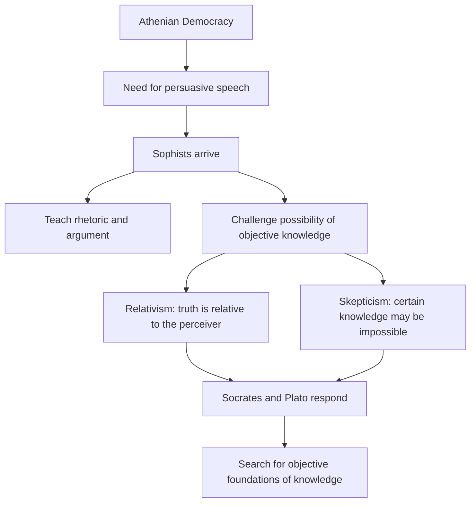
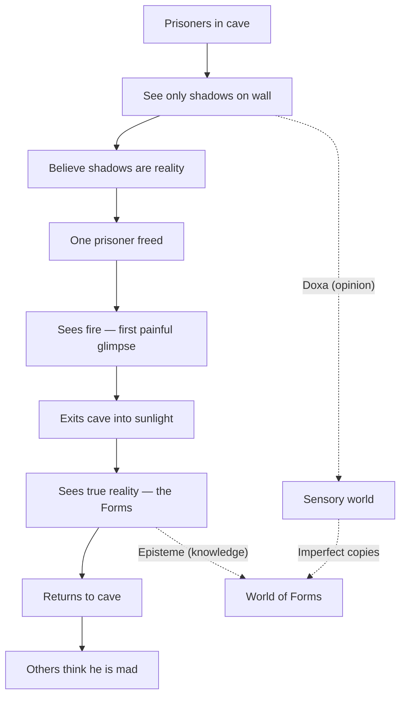

# Chapter 2 · Module 4
# The Philosophers
## Psychology · Unit 1 · History of Psychology

---

You are a young stonemason's apprentice in Athens, circa 420 BCE, and you have made the mistake of asking a question in the agora. You didn't mean to cause a scene. You merely wanted to know — sincerely, without guile — whether the gods truly care about justice, or whether justice is simply whatever the powerful decide it is. A man with a thick beard and an expensive cloak heard you. He introduced himself as Protagoras, and for the next hour he dismantled everything you thought you knew. Truth, he told you, is not a mountain you climb. It is a river, and it looks different depending on where you stand on the bank. He charged your employer two drachmas for the conversation. You left the agora buzzing with questions — and more confused than you had ever been in your life. Later that evening, a barefoot old man with a snub nose and bulging eyes stopped you near the marketplace. He said his name was Socrates, and he had overheard the exchange. He did not offer answers. He asked you more questions. By the time the oil lamps were lit, you were no longer sure what justice was, what knowledge was, or whether you knew anything at all. You went home and could not sleep. Two teachers, two methods, two radically different visions of what it means to know something — and you, caught between them, wondering: if truth is not fixed, how do you build a life on it?

---

## The Art of Persuasion and the Price of Doubt

Athens in the fifth century BCE was not a quiet place to think. It was a democracy — loud, litigious, and obsessed with public speaking. If you wanted to win a lawsuit, pass a law, or avoid exile, you needed to argue well. And into that marketplace of words stepped a new kind of professional: the **Sophists**, itinerant teachers who traveled from city to city, offering instruction in rhetoric, logic, and the art of persuasion — for a fee. The word *sophistēs* originally meant simply "wise man," a respectable title. But it curdled into something more suspicious, in large part because of one student who despised them: Plato.

The Sophists were not a school. They shared no doctrine. What they shared was a posture — a deep, corrosive **skepticism** about the possibility of certain knowledge. If you grew up in a culture where different city-states worshipped different gods, enforced different laws, and held different moral codes, the obvious question was: who's right? The Spartans thought obedience was the highest virtue. The Athenians prized individual freedom. The Egyptians had been building monuments for two thousand years before either city existed. From this diversity, the Sophists drew a radical conclusion: maybe nobody has access to objective truth. Maybe what we call "knowledge" is just a story told by the winners.

This was **relativism** in its earliest Western form — the doctrine that truth, morality, and knowledge are not absolute but relative to the individual or the culture. It was intoxicating. It was terrifying. And it was very, very good for business.

*Figure 2.4: The intellectual chain reaction set off by the Sophists in fifth-century Athens.*

One Sophist, **Antiphon**, reportedly offered what amounts to an early form of talk therapy — using dialogue to help people suffering from grief and melancholy. Think about that for a moment: a man paid to argue was also, in some sense, paid to listen. The line between rhetoric and healing was blurrier than you might expect.

> [!TIP]
> **Stop and Think:** You encounter relativism every day, even if you've never used the word. When someone says "that's just your perspective" or "everyone has their own truth," they're channeling a 2,500-year-old argument. Have you ever used relativism to avoid a difficult conversation? When does "everyone's truth is valid" become a way of avoiding the question of who's actually right?

---

## Man Is the Measure — And the Problem That Wouldn't Go Away

Of all the Sophists, one man crystallized the problem in a single sentence that has never been topped for sheer provocation. **Protagoras of Abdera** (c. 490–c. 420 BCE) declared: *"Of all things, man is the measure."* What he meant, roughly, was this: what seems cold to you is cold *for you*. What seems warm to me is warm *for me*. Neither of us is wrong. Perception is the final court of appeal.

Protagoras arrived at this claim through a simple observation that modern psychology has thoroughly confirmed: sensory experience varies. The same room feels warm to someone who has been jogging and cold to someone who has been sitting still. The same food tastes bland to one person and spicy to another. If even basic perceptions shift from person to person and moment to moment, Protagoras asked, on what grounds can anyone claim to know how things *really* are?

His contemporary **Gorgias of Leontini** (c. 485–380 BCE) pushed even further. Gorgias argued that even if something exists beyond our senses, we could never know it — and even if we could know it, we could never communicate it to anyone else. This was not idle philosophizing. In a culture where a single courtroom speech could mean exile or death, the question of whether words can convey truth was a matter of life and death.

| Thinker | Core Claim | Implication for Psychology |
|---|---|---|
| **Protagoras** | "Man is the measure of all things" | Perception is subjective; individual experience is the foundation of knowledge |
| **Gorgias** | Nothing can be known, or communicated | Skepticism about the limits of language and perception |
| **Antiphon** | Dialogue can heal psychological distress | Early precedent for therapeutic conversation |
| **Socrates** | Objective knowledge is attainable through reason | The mind can transcend subjective perception |
| **Plato** | Reality lies beyond sensory experience | The intellect, not the senses, reveals truth |

*Table 2.1: The philosophical spectrum from radical skepticism to rationalist confidence — and the psychological stakes of each position.*

The research literature has caught up with Protagoras in interesting ways. A 2014 study by Henrich, Heine, and Norenzayan, published in *Behavioral and Brain Sciences*, documented what they called the **WEIRD problem**: the vast majority of psychological research has been conducted on people from Western, Educated, Industrialized, Rich, and Democratic societies — populations that represent roughly 12% of the world's people but account for 96% of published psychological data. When researchers expanded their samples, they found that many "universal" psychological findings — from visual perception to moral reasoning — varied dramatically across cultures. Protagoras, it turns out, was onto something: the observer matters.

But here is where the story turns. The Sophists' skepticism, for all its brilliance, created a crisis. If truth is relative, then justice is relative. If justice is relative, then power is the only law. Athens was already teetering — the Peloponnesian War was grinding the city down, and democratic institutions were fraying. Into this crisis walked two figures who refused to accept that the search for truth was hopeless.

**Socrates** (c. 469–399 BCE) never wrote a word. This is one of history's great ironies: the most influential teacher in Western civilization left behind no texts, no lectures, no curriculum. What he left behind was a method — and a student who turned that method into a philosophy that would shape psychology for the next two millennia.

Socrates did not charge fees. He did not claim to have answers. What he claimed, famously, was that he knew nothing — and that this awareness of his own ignorance was the beginning of wisdom. His method was deceptively simple: he asked questions. Relentless, precise, uncomfortable questions. When someone claimed to know what courage was, Socrates would ask for a definition. When the definition was offered, he would find a case it didn't cover. When the definition was revised, he would find another case. Round after round, the confident claim would dissolve into confusion — a process the Greeks called **aporia**, a state of productive puzzlement.

This is the **Socratic method** (also called **dialectic**): a form of cooperative argumentative dialogue in which questions are used to draw out ideas, expose contradictions, and move closer to truth. It is not debate. Debate has winners. The Socratic method has only learners.

Socrates believed that beneath the shifting surface of opinion and perception, there existed **objective knowledge** — stable truths about courage, justice, virtue, and the good that could be discovered through rigorous examination. Against the Sophists' relativism, he insisted that some things are not matters of perspective. The unexamined life, he said, is not worth living. And he proved it: in 399 BCE, he was tried, convicted, and executed for "corrupting the youth" of Athens — punished, in essence, for asking too many questions.

> [!TIP]
> **Stop and Think:** Have you ever changed your mind because someone asked you a question — not because they told you that you were wrong, but because the question made you realize you couldn't fully explain what you believed? That's the Socratic method in action. It works because it targets your own standards, not someone else's. How comfortable are you with not knowing?

The Socratic method didn't die with Socrates. A 2015 study by Braun, Sokol, Folker, and colleagues in *Cognitive Therapy and Research* found that therapists trained in **Socratic questioning** — asking clients to examine the evidence for their own beliefs rather than directly challenging them — produced significantly greater cognitive change in patients with depression than direct persuasion techniques. Socrates was executed for his method. Modern psychologists are publishing papers about it.

---

## Shadows on the Cave Wall: Plato's Dangerous Idea

**Plato** (429–347 BCE) was twenty-eight when Socrates died, and the execution broke something open in him. He had been born into Athenian aristocracy — wealthy, connected, politically ambitious. After watching the democracy condemn the wisest man he had ever known, he abandoned politics entirely. He traveled to Egypt, to southern Italy, to Sicily. He returned to Athens and founded a school called the **Academy** — the word from which we get "academy" and "academic" — and spent the next forty years trying to answer the question the Sophists had posed and Socrates had died for: is there anything that is truly, permanently, objectively real?

Plato's answer was the **Theory of Forms**, and it is one of the most consequential ideas in the history of human thought. Here is the argument, stripped to its bones: every beautiful thing you have ever seen — a sunset, a face, a melody — is beautiful in a different way, and all of them will eventually fade. Yet you recognize beauty in each of them. How? Plato's answer: because you have encountered **Beauty itself** — an eternal, unchanging, perfect Form that exists not in the physical world but in a realm beyond it. Every beautiful thing in the world is merely a shadow, a copy, a flawed reflection of that perfect Form.

The same logic applies to everything: there is a Form of Justice, a Form of Courage, a Form of Knowledge. The physical world is a hall of mirrors — flickering, unreliable, deceptive. Genuine knowledge — **episteme** — comes from apprehending the Forms through pure reason. Mere opinion based on the senses — **doxa** — is the currency of the cave.

The cave. You knew it was coming.

In Book VII of the *Republic*, Plato tells a story so vivid that it has never been forgotten. Imagine prisoners chained in a cave since birth, facing a wall. Behind them burns a fire. Between the fire and the prisoners, objects are carried back and forth, casting shadows on the wall. The prisoners, having never seen anything else, believe the shadows are reality. One prisoner is freed. He turns around, sees the fire, and is blinded. He stumbles out of the cave into sunlight and, after agonizing adjustment, sees the real world for the first time. He returns to tell the others. They think he is insane.

This is Plato's **Allegory of the Cave**, and it operates on at least three levels: as a theory of knowledge (the senses deceive; reason reveals truth), as a theory of education (learning is painful liberation, not comfortable absorption), and as a political warning (society punishes those who see beyond the consensus).

*Figure 2.5: Plato's Allegory of the Cave maps the journey from ignorance to knowledge — and the social cost of seeing clearly.*

Plato didn't stop at metaphysics. He also developed a theory of the human soul — the **psyche** — that would echo through psychology for centuries. In the *Republic*, he argued that the psyche is **tripartite**: it has three parts, each with its own desires and functions. **Reason** (*logistikon*) seeks truth and should rule. **Passion** (*thumos*) seeks honor and glory and serves as reason's ally. **Appetite** (*epithumia*) seeks food, sex, and pleasure and must be controlled. A just and well-ordered psyche is one in which reason governs the other two. A disordered psyche — one in which appetite or passion has seized control — is the source of immorality and misery.

Sound familiar? Twenty-three centuries later, Sigmund Freud proposed his own tripartite model: the **id** (primitive drives), the **ego** (rational mediator), and the **superego** (moral conscience). The structural parallels are striking. Freud's ego mediates between the id's appetites and the superego's demands, just as Plato's reason mediates between appetite and passion. Both theorists believed that psychological health depends on the rational part maintaining control. Both believed that internal conflict — not external circumstance — is the primary source of human suffering.

The comparison is imperfect. Freud grounded his model in clinical observation and biological instinct; Plato grounded his in philosophical reasoning and moral idealism. Freud saw the ego as a beleaguered compromise; Plato saw reason as a noble sovereign. But the echo is unmistakable. As the *Psychology Today* article by philosopher Massimo Pigliucci noted, "Plato's tripartite soul is arguably the first structural model of the human mind — and Freud, whether he knew it or not, was building on that foundation."

> [!NOTE]
> **Theory of Forms:** Plato's doctrine that abstract, perfect, eternal entities (Forms) are more real than the imperfect physical objects that copy them. Knowledge of Forms is attained through reason, not the senses.

> [!NOTE]
> **Tripartite soul (psyche):** Plato's model of the human psyche as consisting of reason, passion, and appetite. Psychological harmony requires reason to govern the other two parts.

> [!NOTE]
> **Episteme vs. Doxa:** Plato's distinction between genuine knowledge (derived from rational apprehension of the Forms) and mere opinion or belief (based on unreliable sensory experience).

> [!TIP]
> **Stop and Think:** Think about a time when you knew — rationally, clearly — that something was a bad idea, but your emotions or desires pulled you in the opposite direction. Maybe you stayed in a relationship too long, or ate something you regretted, or procrastinated on a deadline. Plato would say your reason lost control of your passions and appetites. Freud would say your ego was overpowered by your id. The language differs; the diagnosis is the same. Which framework — Plato's or Freud's — feels more useful to you? Why?

Plato's influence on psychology cuts in two directions. On one hand, his insistence that the mind can transcend sensory experience and access deeper truths inspired centuries of rationalist philosophy — and, eventually, the nativist tradition in psychology that argues some knowledge is innate. In the *Meno*, Plato has Socrates demonstrate this by guiding an uneducated slave boy through a geometric proof, drawing out knowledge the boy never learned. The implication: the soul already knows. Education is **recollection**, not instruction.

On the other hand, Plato's contempt for sensory experience — his belief that the body is a prison, that the senses are chains — cast what the source text calls "a dead hand" on the development of scientific reasoning. If the physical world is an illusion, why study it? If true knowledge comes only from pure thought, why bother with experiments? When early Christian theologians adopted this framework, the consequences for empirical science were severe. For over a thousand years, the Platonic tradition reinforced the idea that observation and measurement were inferior to prayer, revelation, and logical deduction.

> [!TIP]
> **Stop and Think:** Consider the tension between Plato's rationalism and the empirical methods that define modern science. A modern psychologist who runs experiments is closer to Aristotle than to Plato. Yet many psychological theories — from Chomsky's innate grammar to the concept of universal emotions — carry Platonic DNA. Can you hold both traditions in your mind at once? What is gained and what is lost when you privilege reason over observation — or observation over reason?

> [!TIP]
> **Stop and Think:** Here is the deepest question Plato poses to modern psychology: if our senses systematically deceive us — if what we perceive is not reality but a shadow of it — then what does that mean for a science based on observation? Cognitive psychology has shown that perception is constructive, that memory is reconstructive, and that attention is selective. We don't passively receive the world; we build it. Plato didn't have fMRI scanners, but his cave allegory anticipated the fundamental problem of perceptual science. How comfortable are you building a science on instruments that are themselves extensions of the senses Plato distrusted?

---

## In Practice: The Philosopher in the Therapist's Chair

The ancient philosophers didn't think of themselves as psychologists. The word wouldn't exist for another two thousand years. But the questions they asked — What can we know? How should we live? What is the relationship between reason and emotion? — are the same questions that occupy clinical psychologists, cognitive scientists, and therapists today.

Consider the modern practice of **cognitive behavioral therapy** (CBT), one of the most empirically supported treatments for depression and anxiety. At its core, CBT rests on a Socratic premise: that psychological suffering is often caused not by events themselves, but by the beliefs we hold about those events. A depressed person who believes "I am worthless" is not responding to reality; they are responding to a shadow on the cave wall. The therapist's job — like Socrates' — is to ask questions that help the patient examine the evidence for that belief, discover its contradictions, and arrive at a more accurate understanding. The therapist does not tell the patient what to think. The therapist asks the patient to think.

This is not a coincidence. Aaron Beck, who developed CBT in the 1960s, was explicit about the philosophical roots of his approach. The Socratic method is not just a technique borrowed from ancient Greece; it is the foundation of how cognitive therapy works. A 2015 study published in *Cognitive Therapy and Research* found that Socratic questioning produced greater belief change in depressed patients than direct confrontation — precisely because the patient, not the therapist, generated the new understanding.

> [!IMPORTANT]
> The most radical idea the Greek philosophers gave psychology is not any specific theory of the soul or the mind. It is the conviction that human beings can examine their own thinking — and that this examination, painful as it can be, is the path to psychological health. Every modern therapy that asks you to question your assumptions is, in some sense, still doing what Socrates did in the agora: refusing to let you stop at the first answer.

---

## Speaking of Shadows and Measures...

- "Protagoras said 'man is the measure of all things' 2,500 years ago. Today, psychologists call it the WEIRD problem — most research is done on a tiny, unrepresentative slice of humanity. Turns out the 'measure' has been pretty narrow."
- "Plato thought the body was a prison for the soul. Freud thought the ego was a battered mediator between primitive drives and moral rules. Different century, same argument about who's really in charge of your mind."
- "Socrates was executed for asking too many questions. Modern therapists get paid for it. The method hasn't changed — just the hourly rate."

---

The Sophists opened a crack in the wall of certainty, and through that crack poured two thousand years of philosophical argument about the nature of knowledge, the reliability of the senses, and the structure of the human soul. Socrates and Plato tried to seal the crack with reason, but they disagreed about how — and their disagreement split Western thought into two streams that still flow today: one that trusts the mind, and one that trusts the world. But one student of Plato's Academy looked at both streams and decided that neither was enough on its own. He wanted to get his hands dirty. He wanted to count, dissect, observe, and classify. His name was Aristotle, and what he did next would change psychology forever.

---
*[Chapter complete. Take time with the "Stop and Think" prompts before moving to the next chapter.]*

---

## References

Barnes, J. (Ed.). (1995). *The Complete Works of Aristotle*. Princeton University Press.

Beck, A. T. (1976). *Cognitive Therapy and the Emotional Disorders*. International Universities Press.

Braun, J. D., Sokol, A. D., Folker, H. A., & Bhatt, S. (2015). Therapist use of Socratic questioning predicts session-to-session symptom change in cognitive therapy for depression. *Cognitive Therapy and Research*, 39(5), 577–585.

Greenwood, J. (2009). *A Conceptual History of Psychology*. McGraw-Hill.

Henrich, J., Heine, S. J., & Norenzayan, A. (2010). The weirdest people in the world? *Behavioral and Brain Sciences*, 33(2–3), 61–83.

Pigliucci, M. (2019, December 12). Did Plato lay the groundwork for Freud's psychoanalysis? *Psychology Today*.

Pivnicki, D. (1969). The beginnings of psychotherapy. *Journal of the History of the Behavioral Sciences*, 5(3), 238–247.

Simon, B. (1972). Plato and Freud: The mind in conflict. *Psychoanalytic Review*, 59(3), 371–396.

Walker, N. P. (1991). Greek medicine and the Greek genius. *British Journal of Psychiatry*, 159, 1–6.
