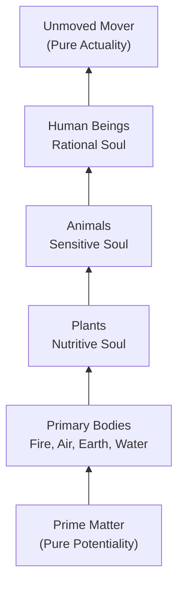

# Chapter 2 · Module 5
# Aristotle
## Psychology · Unit 1 · History of Psychology

---

You're standing in a stone courtyard in ancient Athens, around 335 BCE. A man in his fifties — lean, balding, with a sharp gaze and a habit of walking while he talks — is pacing back and forth between the columns of a covered walkway. Students trail behind him, taking notes on wax tablets. He's just finished explaining why the heart, not the brain, is the center of thought (he's wrong about that, as it turns out), and now he's moving to something more radical: the claim that the soul isn't a separate thing at all. It's not a ghost trapped in a body, not a prisoner waiting to escape. It's the *form* of the body — the way a statue's shape is the form of the marble. Without the marble, no shape. Without the body, no soul. His name is Aristotle, and he's about to give the Western world its first systematic account of how the mind works. His ideas will dominate psychology for two thousand years. But here's the question that will haunt you as you listen: if the soul is just the form of the body, what happens when the body dies? Aristotle has an answer. It's not the one you expect.

---

## The Hierarchy of Everything

You've probably encountered the idea that humans are "higher" than animals, and animals are "higher" than plants. It feels intuitive — almost obvious. But that intuition has a specific origin, and it's Aristotle who gave it its most influential formulation. The misconception worth confronting here is that this hierarchy is simply a matter of *degree* — that humans are just smarter animals, who are just smarter plants. Aristotle rejected that. He argued that the differences between levels of being are differences in *kind*, not just quantity. A human doesn't just have *more* of what a plant has. A human has something fundamentally different.

Aristotle organized all of nature into what later scholars called the **scala naturae** — the ladder of being. At the bottom sits **prime matter**, pure potentiality with no form of its own. Above it, the four basic elements: fire, air, earth, and water. These combine into inanimate objects, then into living things — plants, animals, and human beings — arranged by genus and species. At the very top is the **unmoved mover**, pure actuality, the force that drives all things toward their fullest expression. The key insight is that each level *depends on* the one below it. Plants need the elements. Animals need plant-like growth. Humans need animal-like sensation. The hierarchy isn't a ranking. It's a dependency chain.


*Figure 5.1: Aristotle's scala naturae — a hierarchy of being where each level builds on the capacities of the one below it. Human beings sit at the midpoint, possessing nutritive, sensitive, and rational capacities.*

What makes this more than a dusty classification system is that Aristotle used it to explain *psychology*. Every living thing has a **psyche** — a soul — but not the same kind. Plants have a **nutritive psyche**, responsible for growth, nutrition, and reproduction. Animals have a **sensitive psyche**, which adds sensation, pleasure and pain, imagination, memory, and locomotion. Humans have a **rational psyche**, which adds abstraction, deliberation, and recollection. And here's the crucial part: each higher psyche *includes* the lower ones. You don't stop having a nutritive psyche when you develop a rational one. You carry all three.

> [!TIP]
> **Stop and Think:** Think about the last time you ate something because it tasted good (sensitive psyche) rather than because you were hungry (nutritive psyche). Or the last time you overrode a craving with a rational calculation about your health (rational psyche). Can you feel all three layers operating at once?

### Soul as Form, Not Prison

This is where Aristotle breaks sharply from Plato. For Plato, the soul was a separate entity trapped in a body, yearning to escape to the world of Forms. For Aristotle, that's incoherent. The soul isn't *in* the body the way a pilot is in a ship. The soul is the **form** of the body — the organizing principle that makes a collection of flesh and bone into a living human being. He put it memorably: "Suppose that the eye were an animal — sight would have been its soul" (*De Anima*, II, 1, 412b18–19). The soul is what the body *does*, not something it *contains*.

This has a radical implication: the soul can't survive the body's destruction, any more than the shape of a marble statue can survive if you grind the marble to dust. Aristotle was a **materialist** about the psyche — it depends entirely on material instantiation. But — and this is a subtle but critical distinction — he was *not* a **reductive materialist**. He didn't think you could explain anger by boiling it down to "a warming of the blood around the heart" (his physiological theory). The physicist's account of anger and the dialectician's account ("an appetite for returning pain for pain") are both valid, at different levels of description. The psyche is material, but it isn't *reducible* to its material components.

```mermaid
flowchart LR
    A["Plato:<br>Soul as Pilot"] -->|"Soul trapped in body"| B["Dualism:<br>Two separate substances"]
    C["Aristotle:<br>Soul as Form"] -->|"Soul IS the body's<br>organizing principle"] D["Hylomorphism:<br>One substance, two aspects"]
```
*Figure 5.2: Plato and Aristotle's competing views of the soul. Plato's dualism separates soul and body; Aristotle's hylomorphism treats them as inseparable aspects of a single living being.*

> [!TIP]
> **Stop and Think:** When your phone breaks, the "phone-ness" doesn't float away somewhere. It simply ceases to exist because the material that constituted it no longer functions. Is that how you think about consciousness and the brain? Why might this view feel less comforting than Plato's?

### The World According to Purpose

Aristotle didn't just classify nature. He explained it through four types of **causality** — and understanding these is essential to grasping why his psychology looks the way it does. The **material cause** is what something is made of (marble for a statue). The **formal cause** is its structure or design (the shape of Zeus). The **efficient cause** is what made it (the sculptor). The **final cause** is its purpose or function (to glorify the gods). Modern science uses the first three freely but has largely abandoned the fourth — final causality — in physics and biology. We don't ask what the *purpose* of photosynthesis is. We ask what *causes* it.

But Aristotle thought everything in nature has a **telos** — an end or purpose built into its very nature. Acorns grow into oak trees because that's their telos. Human beings develop rational capacities because that's theirs. This **teleological** worldview made his psychology inherently purposive: to explain human behavior, you had to explain what it's *for*. Modern psychology has a complicated relationship with this idea. Behaviorism tried to purge all talk of purpose from psychology. But cognitive psychology, which emerged in the 1950s, found it impossible to explain goal-directed behavior without invoking purposes and goals. The pioneers of information theory — Norbert Wiener and colleagues — argued in 1943 that teleological explanation is necessary to account for the "intrinsically purposive" behavior of living organisms and machines (Rosenbleuth, Wiener, & Bigelow, 1943). Aristotle, it seems, was ahead of his time.

> [!TIP]
> **Stop and Think:** When you reach for a glass of water, is that behavior best explained by the muscles and nerves involved (efficient cause), or by the fact that you're thirsty and aiming to drink (final cause)? Can a complete psychology really afford to ignore purpose?

---

## How You Know What You Know

Aristotle didn't just theorize about the soul in the abstract. He built a detailed account of how the mind actually acquires, processes, and stores knowledge — and much of it reads like an early draft of cognitive psychology. The key to his theory is that **all thought depends on images** derived from sensory experience. "Without an image thinking is impossible," he declared (*On Memory*, 1, 450a1). There's no pure rational knowledge floating free of experience. Everything you think, imagine, or remember traces back, directly or indirectly, to something you perceived through your senses.

### From Sensation to Thought

Aristotle distinguished between **special sensibles** — properties perceived by only one sense (color by sight, sound by hearing, taste by taste) — and **common sensibles** — properties perceivable by multiple senses, like movement, shape, and magnitude. Each sense requires an organ and a medium. Sight needs an eye and light. Hearing needs an ear and air. Error is possible when judging common sensibles (you might misjudge how far away something is), but not when perceiving special sensibles (you can't be wrong that you're seeing red, only about what's causing it).

Beyond the five individual senses, Aristotle posited a **common sense** — not a sixth sense, but an emergent function that integrates information from all five into unified perceptions of whole objects. When you see a red, round, smooth thing and recognize it as an apple, that's common sense at work. It's not sight alone or touch alone. It's the binding of multiple sensory channels into a coherent experience.

From perception, the mind builds **images** — faint copies or traces of sensory experience that survive in memory. These images are the raw material of all higher cognition. Simple **memory** is the recognition that an image represents something from the past. **Recollection** is something richer: an active, deliberate search through memory, following chains of association. And here's where Aristotle made observations that would shape psychology for millennia.

| Principle | Aristotle's Description | Modern Parallel |
|---|---|---|
| **Similarity** | We recall things that resemble the target memory | Cue-dependent memory, schema theory |
| **Contrast** | We recall things opposite to the target | Distinctiveness effects in memory research |
| **Contiguity** | We recall things experienced near the target in space or time | Classical conditioning, associative learning |
| **Meaningful ordering** | Organized material is easier to recollect | Chunking, narrative memory strategies |
*Table 5.1: Aristotle's principles of recollection and their echoes in modern memory research. His principle of contiguity became the foundation of associationism for over two thousand years.*

> [!TIP]
> **Stop and Think:** Try to remember what you had for dinner three nights ago. Did you use any of Aristotle's principles? Maybe you worked backward from what you did afterward (contiguity), or the meal reminded you of something similar (similarity), or you recalled it because it was unusually good or bad (contrast)?

### Deliberation: What Makes Humans Different

For Aristotle, the capacity that truly separates humans from animals isn't sensation or memory — animals have those. It's **deliberation**: the ability to comprehend the *common form* of different instances of the same type of thing by abstracting from particular experiences. You've seen many dogs. From those experiences, you've extracted what "dog-ness" is — not any particular dog, but the form that all dogs share. That's abstraction. And it's the foundation of all theoretical knowledge, including psychology itself.

Aristotle insisted this isn't just a quantitative difference — humans don't just have *more* reasoning capacity. It's a difference in kind. Animals can perceive, remember, even learn by association. But they can't deliberate, can't abstract, can't grasp universals. This claim remains contested. Modern comparative psychology — the study of animal cognition — has documented abstract reasoning in corvids, great apes, and even cephalopods, challenging the sharp line Aristotle drew. A 2021 review in the *Philosophical Transactions of the Royal Society* argued that the Aristotelian scala naturae has actively hindered progress in comparative psychology by encouraging researchers to look for human-like cognition in animals rather than studying cognition on its own terms (Vallortigara, 2021).

> [!TIP]
> **Stop and Think:** Watch a video of a crow solving a puzzle or an octopus opening a jar. Is that deliberation? Or something else entirely? How would Aristotle classify it — and would he be right?

---

## The Good Life in Practice

Aristotle wasn't only interested in how the mind works. He was deeply concerned with how it *should* work — how a person should live in order to flourish. His answer, developed in the *Nicomachean Ethics*, centers on **eudaimonia** — a Greek word often translated as "happiness" but better understood as *flourishing* or *living well*. Eudaimonia isn't a feeling. It's a condition — the condition of exercising your highest capacities fully and excellently over the course of a complete life.

The path to eudaimonia runs through **habituation**. You don't become courageous by reading about courage. You become courageous by practicing courageous acts until they become second nature. Aristotle's insight is that virtue is a *skill*, not a *belief*. It's closer to learning to play the piano than to solving a math problem. You develop it through repeated practice, feedback, and gradual refinement. This idea — that character is built through habit — anticipates modern research on deliberate practice, skill acquisition, and even cognitive behavioral therapy, which works by helping people practice new patterns of thought and behavior until they become automatic.

> [!IMPORTANT]
> Aristotle's most enduring insight may be that psychological capacities — from perception to virtue — are not fixed traits you either have or don't. They are *developed* through interaction with the environment, shaped by practice and experience. This functionalist view of the mind, which treats psychological states as capacities realized in material bodies, laid the groundwork for modern cognitive science, which recognizes that the same cognitive functions can be realized in different physical substrates — brains, computers, or future technologies we haven't yet imagined.

Near Lagos, Nigeria, a 2020 study found that adolescents who engaged in structured community service — a form of Aristotelian habituation — showed measurable increases in empathic concern and prosocial behavior over six months, even after controlling for baseline personality traits (Ede et al., *Journal of Moral Education*, 2020). The ancient Greek idea that you become good by *doing* good continues to find empirical support across cultures.

---

## Speaking of Aristotle's Legacy...

- "A friend told me she doesn't believe in 'the soul' because science has disproven it. I said Aristotle wouldn't have believed in *that* kind of soul either. For him, the soul was just what your body *does* — like how 'running' is what your legs do, not a ghost inside them."

- "I was reading about how modern AI researchers argue over whether a chatbot really 'understands' language or just simulates understanding. That's basically Aristotle's question about the functional form versus its material realization — can the same function exist in a different kind of 'body'?"

- "A therapist once told me: 'You can't think your way to feeling better. You have to *act* your way there.' That's Aristotle. Virtue through habituation. Change the behavior, and the character follows."

---

Aristotle's influence on psychology didn't end with his death. It barely diminished. For over a thousand years, his works were lost to Western Europe, preserved and developed by Islamic scholars like Avicenna and Averroes, then rediscovered by medieval Christian thinkers who fused his philosophy with theology — sometimes in ways he would have found unrecognizable. The next chapter follows that journey: how Aristotle's naturalistic science became religious dogma, how Islamic scholars rescued and transformed his ideas, and how the medieval world's obsession with Aristotle's authority ultimately set the stage for the scientific revolution that would challenge it.

---
*[Chapter complete. Take time with the "Stop and Think" prompts before moving to the next chapter.]*

---

## References

Ede, M. O., et al. (2020). Effect of structured community service on empathic concern and prosocial behavior among Nigerian adolescents. *Journal of Moral Education*, 49(3), 326–342.

Lovejoy, A. O. (1936). *The Great Chain of Being: A Study of the History of an Idea*. Harvard University Press.

Nussbaum, M. C., & Putnam, H. (1992). Changing Aristotle's mind. In M. C. Nussbaum & A. O. Rorty (Eds.), *Essays on Aristotle's De Anima* (pp. 27–56). Oxford University Press.

Rosenbleuth, A., Wiener, N., & Bigelow, J. (1943). Behavior, purpose and teleology. *Philosophy of Science*, 10(1), 18–24.

Vallortigara, G. (2021). Comparative cognition: A spider's web of knowledge. *Philosophical Transactions of the Royal Society B*, 377(1844), 20200534.

Wilkes, K. V. (1992). Psuche versus the mind. In M. C. Nussbaum & A. O. Rorty (Eds.), *Essays on Aristotle's De Anima* (pp. 109–127). Oxford University Press.
