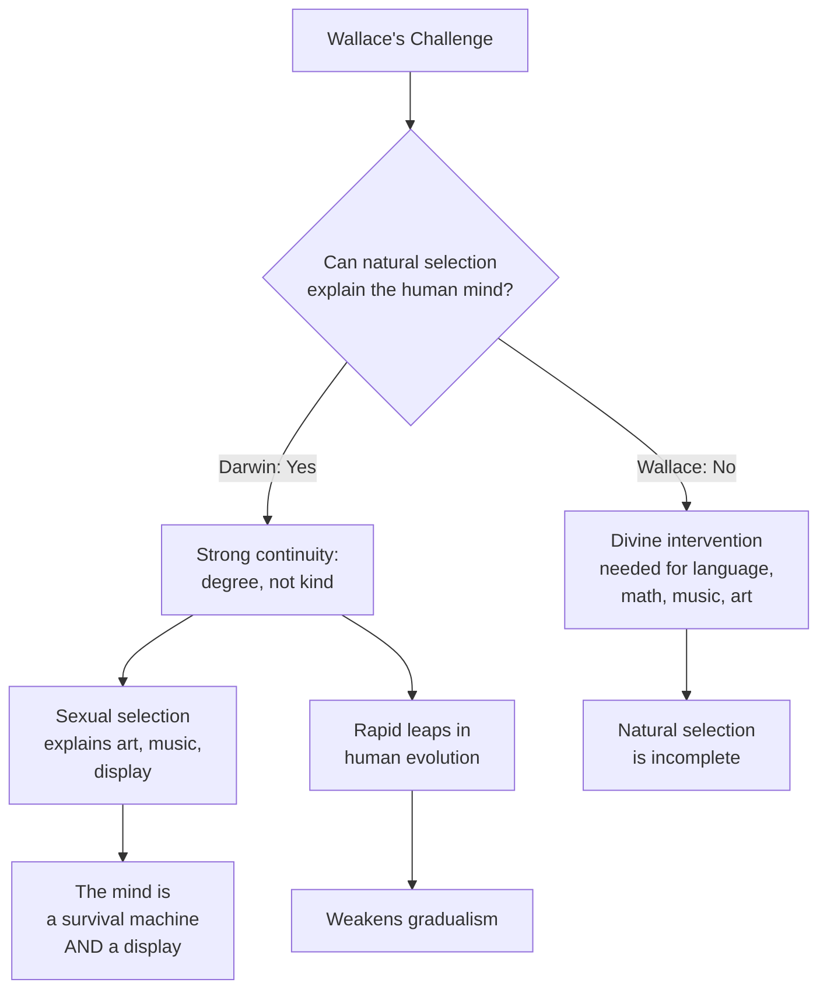

# Chapter 07 · Module 4
# The Descent of Man — Human Evolution and Its Discontents
## Psychology · Unit 1 · History of Psychology

---

In February 1871, a 62-year-old man sat in his study at Down House, surrounded by stacks of correspondence and a half-eaten lunch he had forgotten to finish. Charles Darwin had spent twelve years avoiding this moment. He had published *The Origin of Species* in 1859 with a single tantalizing sentence about human evolution — "light will be thrown on the origin of man and his history" — and then said nothing more. He had watched bishops rage and scientists argue. He had endured the Oxford debate, the anonymous reviews, the whispered accusations. And through it all, he had kept his most dangerous idea locked away.

Now, finally, he was releasing it. *The Descent of Man, and Selection in Relation to Sex* would argue that humans are not a separate creation. They are animals — continuous with the animal kingdom in body, mind, and emotion. The difference between a human and a chimpanzee is one of degree, not kind.

Darwin knew what would happen. *The Times* of London would publish an editorial claiming that his views would lead to the collapse of morality. Clergymen would denounce him from pulpits. Even some of his scientific allies would flinch. But he could not stay silent any longer. Two men had forced his hand.

The first was Thomas Henry Huxley, who in 1863 had published *Evidence as to Man's Place in Nature*, demonstrating striking anatomical similarities between the brains of apes and humans. The second was Alfred Russel Wallace — the same Wallace who had co-discovered natural selection — who had published two papers arguing that natural selection *could not* account for the human mind. Darwin had to respond. Not with a paragraph. With a book.

---

## Wallace's Challenge: When Natural Selection Isn't Enough

Wallace's argument was subtle and, in some ways, more dangerous to Darwin than any bishop's sermon. Wallace accepted natural selection for the body. He agreed that human anatomy had evolved through the same mechanisms as every other species. But he drew the line at the mind.

In "The Origin of Human Races and the Antiquity of Man" (1864), Wallace argued that the human brain had developed far beyond what survival requires. Humans could create fire, clothing, tools, and shelter. They formed cooperative social arrangements. Their intelligence had effectively allowed them to *surmount* natural selection — to survive through cultural knowledge rather than biological adaptation. Human evolution, Wallace claimed, had shifted from the biological to the cultural.

In "Geographical Climates and the Origin of Species" (1869), Wallace went further. He argued that many distinctive human characteristics — language, logic, mathematics, music, art — confer *no advantage* in the struggle for existence. A bushman in the Kalahari does not need differential calculus to survive. A fisherman in Kerala does not need to compose symphonies. These capacities are so far beyond the demands of survival that Wallace concluded they could only have been produced by "the intervention of a higher intelligence."

This was a bombshell. Wallace — the co-founder of natural selection theory — was arguing that natural selection alone could not produce the human mind. He was, in effect, smuggling divine design back into evolution through the door of human exceptionalism.

> [!TIP]
> **Stop and Think:** Wallace argued that human capacities like mathematics, music, and art have no survival value. But is that true? Mathematical reasoning helps with trade, navigation, and planning. Music strengthens social bonds. Art communicates identity and status. Could these capacities have survival value that Wallace simply didn't recognize? Or was Wallace right that some human abilities go beyond what natural selection can explain?

---

*Figure: The Wallace-Darwin disagreement about human evolution. Wallace accepted natural selection for the body but rejected it for the mind. Darwin insisted on strong continuity — but had to make concessions that weakened his own framework.*

---

## "Degree and Not of Kind": Darwin's Response

Darwin was horrified by Wallace's position. He wrote to Wallace: "I hope you have not murdered too completely your own and my child." If Wallace was right — if the human mind required divine intervention — then natural selection was not a universal theory. It was a theory that worked for everything *except* the thing that mattered most.

Darwin's response was *The Descent of Man* (1871). His central claim was **strong continuity** between human and animal psychology:

> "The difference in mind between man and the higher animals, great as it is, is certainly one of degree and not of kind. We have seen that the senses and intuitions, the various emotions and faculties, such as love, memory, attention, curiosity, imitation, reason, &c., of which man boasts, may be found in an incipient, or even sometimes in a well-developed condition, in the lower animals."
> — Charles Darwin, *The Descent of Man* (1871, p. 105)

Darwin did not claim that humans are descended from apes — a common misconception. He claimed that humans and primates share a common ancestor. The differences between them are products of *degree* — more intelligence, more language, more social complexity — not *kind*. Human language is continuous with birdsong and chimpanzee calls. Human reasoning is continuous with animal problem-solving. Human emotions are continuous with animal emotions.

But Darwin faced a problem. If natural selection operates on small, random variations over long periods of time, how could it produce the vast gap between human and even the highest primate intelligence? Darwin's answer was uncomfortable: he suggested that in human evolution, there could have been "rapid leaps" — a concession that weakened his own gradualist framework. He also introduced **sexual selection** to explain human traits that seem to have no survival value.

> [!TIP]
> **Stop and Think:** Darwin used sexual selection to explain traits like art, music, and elaborate displays — comparing human artistic productions to the male peacock's tail. The peacock's tail doesn't help it survive; it helps it attract a mate. Could human creativity serve the same function? Think about how people display talent on social media. Is that sexual selection in action?

---

## Sexual Selection: The Peacock's Tail and the Human Mind

Darwin had introduced sexual selection in *The Origin of Species*, but in *The Descent of Man* he developed it extensively. Sexual selection operates when organisms compete for mates, not for survival. The male peacock's magnificent tail is a classic example: it does not help the peacock survive — in fact, it makes it *more* visible to predators. But peahens prefer males with larger, more colorful tails. Over generations, the trait is amplified.

Darwin argued that many distinctive human characteristics — artistic ability, musical talent, elaborate displays of wealth and status — could be explained by sexual selection rather than natural selection. Humans do not create art to survive. They create art to attract partners, signal intelligence, and establish social地位. The capacity for beauty, like the peacock's tail, is a product of mate choice.

This was a radical move. It meant that human psychology is not entirely shaped by the cold logic of survival. It is also shaped by desire, preference, and aesthetic judgment — forces that operate on a different timescale and according to a different logic than natural selection. The human mind is not just a survival machine. It is also a display.

> [!TIP]
> **Stop and Think:** Darwin argued that artistic and intellectual capacities evolved through sexual selection — mate choice, not survival. If this is true, then the human mind was shaped partly by what potential partners find attractive. Does this change how you think about intelligence? Is intelligence partly a social signal, not just a cognitive capacity?

---

## Darwinism, Racism, and Sexism: The Corruption of a Theory

Darwin's theory of evolution was one of the most powerful ideas in human history. It was also one of the most abused.

In the decades after *The Descent of Man*, many theorists seized on evolution as a justification for racism. Ernst Haeckel, the foremost German advocate of Darwinian theory, represented Caucasians as the pinnacle of human development — just as he represented humans as the pinnacle of evolution:

> "The immense superiority that the white race has won over the other races in the struggle for existence is due to Natural Selection... That superiority will, without doubt become more and more marked in the future."
> — Ernst Haeckel (1883, p. 85)

Haeckel's **recapitulation theory** — that the development of each individual organism replays the evolutionary history of its species — was turned into a racist tool. If "ontogeny recapitulates phylogeny," then adult members of "lower races" would display the juvenile traits of the "superior" white race. D. G. Brighton claimed in 1890 that "the adult who retains the more numerous fetal, infantile traits... is unquestionably inferior." Imperialists appealed to Darwin's theory to justify colonial conquest.

Yet these views were *not* consequences of Darwin's theory. Darwin himself repudiated the idea that other races were intellectually inferior by fixed biological determination. He was impressed by the ability of Fuegian natives to learn Spanish and English and adopt European habits. Spencer — despite his laissez-fare social Darwinism — also rejected imperialism.

When genetics undermined recapitulation theory, racists simply shifted their argument. They adopted **neoteny** — the idea that humans evolved by retaining the juvenile traits of their ancestors — and argued that white races retained *more* juvenile traits, and were therefore superior. As Stephen Jay Gould noted, they "quickly discovered multiple evidences of juvenile traits in the 'child-like vivacity' of Europeans." The conclusion was always the same. Only the justification changed.

The sexism was equally grotesque. E. H. Clark, a Harvard physiology professor, claimed that menstruation made academic study dangerous for women. Granville Stanley Hall — who founded America's first psychology laboratory and PhD program at Johns Hopkins — opposed women's higher education because it would interfere with their "biologically determined childbearing function." Hugo Münsterberg, who succeeded William James at Harvard, argued that women should be denied the vote because of their "constitutional irrationality."

> [!TIP]
> **Stop and Think:** Haeckel's recapitulation theory was used to justify racism. Neoteny was used to justify racism. The *same data* supported opposite conclusions — because the conclusion came first, and the theory was bent to fit. Can you think of a modern example where scientific findings are selectively used to support a pre-existing belief? What safeguards prevent this?

---

## The Women Who Fought Back

Not everyone accepted these claims. Two early women psychologists challenged the hereditarian orthodoxy with empirical evidence.

Helen Bradford Thompson (1874–1947), later Helen Woolley, conducted the first systematic empirical study of sensory-motor and perceptual-cognitive differences between men and women at the University of Chicago. Her conclusion: most differences between men and women are products of social development, not biology. She complained that previous research on sex differences was based on "personal bias, prejudice and sentimental rot and drivel" (Woolley, 1910).

Leta Stetter Hollingworth (1886–1939), who received her doctorate from Columbia University in 1916, went further. Her dissertation research demonstrated that menstruation does *not* diminish women's mental capacities — directly refuting Clark's claims. She argued that common beliefs about women's intellectual inferiority were "social myths unsupported by evidence" (Hollingworth, 1940).

Thompson-Woolley and Hollingworth were doing what Darwin's male critics should have done: testing claims against evidence. Their work laid the foundation for the psychology of gender differences — a field that continues to challenge biological determinism today.

> [!TIP]
> **Stop and Think:** Thompson-Woolley and Hollingworth challenged sexism in psychology using empirical methods — the same methods their male colleagues used to reinforce it. Does science self-correct? Or does it only correct when marginalized people force it to? Think about who gets to ask the questions in science, and how that shapes the answers.

> [!IMPORTANT]
> The story of Darwinism's corruption is a warning about the power of scientific ideas. A theory that explained the diversity of life was turned into a justification for racism, sexism, and imperialism — not because the theory demanded it, but because people wanted it to. Darwin's theory does not imply racial hierarchy. It does not imply female inferiority. It does not justify colonialism. But it was *used* to justify all of these things, by people who had already decided what they wanted to believe. The lesson is clear: scientific theories are tools. In the right hands, they illuminate. In the wrong hands, they obscure. The theory is only as honest as the person wielding it.

---

## Speaking of Descent, Power, and Misuse...

- A geneticist in Lagos reads a news article claiming that a new study proves one racial group is smarter than another. She checks the original paper. The sample size is 40. The effect size is tiny. The confounds are enormous. She tweets: "This is not science. This is confirmation bias with a p-value." Haeckel would have loved the headline. The geneticist is doing what Thompson-Woolley did: demanding better evidence.

- A university student in São Paulo studies the history of eugenics in Brazil. She discovers that sterilization programs targeted poor Black women in the 1930s — programs justified by the same "science" that Haeckel and Galton promoted. She asks her professor: "Why don't we learn about this?" The professor says: "Because it's uncomfortable." The student replies: "That's exactly why we should learn about it."

- A psychologist in Seoul is designing a study on gender differences in spatial reasoning. She reads Hollingworth's 1914 dissertation and is struck by how relevant it still is. A hundred years later, the same questions are being asked. The same biases persist. But the methods are better. And the voices challenging those biases are louder.

---

Darwin had extended natural selection to human beings. He had argued for strong continuity between human and animal psychology. He had introduced sexual selection to explain the human mind's more extravagant capacities. And he had watched as his theory was twisted into a weapon. But the scientific story of evolution was far from over. In a monastery garden in Moravia, a quiet monk was growing peas — and discovering the mechanism of heredity that Darwin never found. Darwin had proposed *how* evolution works. Mendel would reveal *why* it works. The synthesis of their ideas would transform biology — and psychology — forever.

---

## References

1. Boakes, R. (1984). *From Darwin to behaviorism: Psychology and the minds of animals*. Cambridge: Cambridge University Press.
2. Darwin, C. (1859). *On the origin of species by means of natural selection*. London: John Murray.
3. Darwin, C. (1871). *The descent of man, and selection in relation to sex*. London: John Murray.
4. Gould, S. J. (1980). *The panda's thumb: More reflections in natural history*. New York: W. W. Norton.
5. Haeckel, E. (1883). *The pedigree of man and other essays*. London: Freethought.
6. Hawkins, M. (1997). *Social Darwinism in European and American thought, 1860–1945*. Cambridge: Cambridge University Press.
7. Hollingworth, L. S. (1914). Functional periodicity: An experimental study of the mental and motor abilities of women during menstruation. *Contributions to Education*, No. 69.
8. Shields, S. A. (1975). Functionalism, Darwinism, and the psychology of women. *American Psychologist, 30*, 739–754.
9. Thompson, H. B. (1903). *The mental traits of sex*. Chicago: University of Chicago Press.
10. Woolley, H. T. (1910). A review of the recent literature on the psychology of sex. *Psychological Bulletin, 7*, 335–342.
