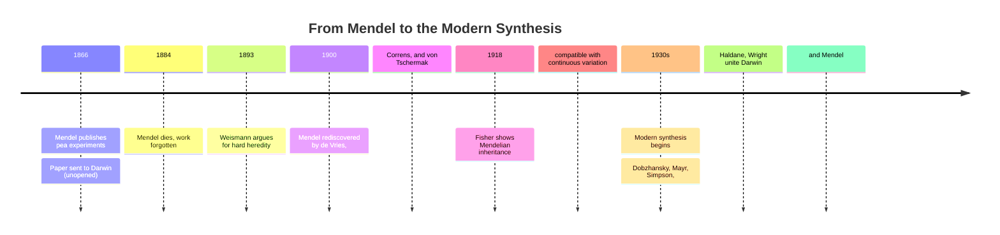

# Chapter 07 · Module 5
# Neo-Darwinism — From Mendel's Peas to the Modern Synthesis
## Psychology · Unit 1 · History of Psychology

---

On January 6, 1884, a 61-year-old Augustinian friar died of chronic nephritis in Brno, in what is now the Czech Republic. His name was Gregor Mendel, and he had spent eight years crossbreeding 29,000 pea plants in the monastery garden. He had discovered the fundamental laws of heredity — that traits are passed from parent to offspring in discrete units, not blended like paints. He had presented his findings to the Brno Natural History Society in 1865. He had published them in the society's proceedings in 1866.

Almost nobody read them.

Mendel had sent a copy of his paper to Charles Darwin. The envelope was found in Darwin's study after his death in 1882 — still sealed. Darwin, the man who most needed to understand heredity, never opened the one paper that could have solved his biggest problem. Mendel's work was rediscovered independently by three botanists — Hugo de Vries, Carl Correns, and Erich von Tschermak — in 1900, sixteen years after Mendel's death. By then, the monk who had cracked the code of inheritance was buried in an unmarked grave in the monastery garden where he had grown his peas.

History is full of near-misses. The answer was sitting in an envelope on Darwin's desk. He never opened it.

---

## What Mendel Found: The Particles of Heredity

Mendel's discovery was revolutionary in its simplicity. He crossed tall pea plants with short pea plants and observed the results. If heredity worked by "blending" — as Darwin and most 19th-century scientists assumed — the offspring should be medium height. They weren't. The first generation was all tall. The second generation was three-quarters tall and one-quarter short.

Mendel realized that heredity does not blend. It transmits discrete **factors** (what we now call genes) from parent to offspring. Each parent contributes one factor for each trait. Some factors are **dominant** (tallness), others are **recessive** (shortness). A plant with one tall factor and one short factor is tall — because tallness is dominant. But it still carries the short factor, which can reappear in the next generation.

This was the mechanism Darwin had been looking for. It solved Fleeming Jenkin's "blending" objection — the argument that favorable variations would be diluted within a few generations. Under Mendelian heredity, they aren't diluted. They are preserved as discrete units that can be passed on unchanged. Natural selection can act on them without them disappearing into a genetic average.

> [!TIP]
> **Stop and Think:** Mendel's paper was sitting on Darwin's desk, unopened. Darwin spent years worrying about how heredity works, and the answer was in an envelope he never read. How often do scientists miss discoveries that are right in front of them? Is science a logical process of accumulating knowledge, or is it shaped by accidents, timing, and what people are ready to accept?

---

## The Term "Neo-Darwinism": Romanes Draws a Line

The term **neo-Darwinism** was coined by George John Romanes (1848–1894) — the same Romanes who collected anecdotes of animal intelligence. Romanes used the term to describe any theory of evolution that treats natural selection as *sufficient* to account for the evolution of species, without needing the inheritance of acquired characteristics.

This was not Darwin's own position. Darwin maintained that natural selection is the primary mechanism of evolution, but he also believed that the inheritance of acquired characteristics plays a role — especially in human evolution. He suggested that habits developed during an organism's lifetime could be passed to offspring. This was "soft heredity."

Wallace and August Weismann disagreed. They were committed to "hard heredity" — the idea that the mechanism of inheritance is independent of an organism's life experience. What you learn during your lifetime dies with you. Only your genes are passed on. Weismann demonstrated this dramatically by cutting off the tails of mice for multiple generations. The offspring were always born with full-length tails. Acquired characteristics are not inherited.

The neo-Darwinian position — natural selection plus hard heredity — would eventually become the foundation of modern biology. But it took another forty years to get there.

> [!TIP]
> **Stop and Think:** Darwin himself believed in soft heredity — that acquired characteristics could be inherited. He was wrong about the mechanism, but right about the big picture. Is it possible for a scientist to be right about the conclusion but wrong about the process? Does it matter, as long as the conclusion is correct?

---

*Figure: The long road from Mendel's monastery garden to the modern synthesis. It took sixty years and contributions from multiple fields to unite Darwin's theory of natural selection with Mendel's theory of genetics.*

---

## The Modern Synthesis: Darwin Meets Mendel

The **modern synthesis** — the fusion of Darwin's theory of natural selection with Mendel's theory of genetics — did not occur until the 1930s. It was the work of several biologists working independently across different fields.

Ronald Fisher, a British statistician, showed in 1918 that Mendelian inheritance is fully compatible with continuous variation — the kind of small, gradual differences that natural selection acts on. Sewall Wright, an American geneticist, demonstrated how random genetic drift can produce evolutionary change in small populations. J. B. S. Haldane, a British biologist, worked out the mathematics of natural selection acting on Mendelian genes. Theodosius Dobzhansky, a Ukrainian-American geneticist, synthesized laboratory genetics with field observations of natural populations in *Genetics and the Origin of Species* (1937). Ernst Mayr, a German-American biologist, integrated population genetics with the biological species concept. George Gaylord Simpson connected paleontology with genetics.

The result was a unified theory: evolution occurs through natural selection acting on genetic variation. Genes are the units of inheritance. Mutations produce new variations. Natural selection preserves favorable variations and eliminates unfavorable ones. The inheritance of acquired characteristics does not happen. This is neo-Darwinism — and it remains the foundation of evolutionary biology today.

> [!TIP]
> **Stop and Think:** The modern synthesis took forty years to develop, required contributions from statistics, genetics, paleontology, and field biology, and was built by scientists in Britain, America, Germany, and Ukraine. No single person could have done it alone. What does this tell you about how scientific revolutions happen? Are they the work of geniuses, or of communities?

---

## Darwin's Influence on Psychology: Less Than You Think

Given how transformative Darwin's theory was for biology, you might expect it to have had an equally dramatic impact on psychology. It didn't — at least not directly.

Most early American psychologists accepted the *fact* of evolution. But many did not accept the *theory* of natural selection. They were inspired by Darwin's naturalistic treatment of human and animal behavior — his observations of emotions in animals, his developmental studies of his own children — but they did not build their psychology on natural selection.

The **functionalists** — led by James Rowland Angell, John Dewey, and Harvey Carr — claimed their psychology was grounded in Darwinian theory. Angell declared that functional psychologists viewed human behavior as "susceptible of explanation in an evolutionary manner" (1909). But in practice, functionalists focused on how organisms *adapt* to their environments — a concept borrowed from everyday observation, not from the theory of natural selection. They studied intelligence, learning, and problem-solving as tools for adaptation, without asking which traits were selected for their survival value.

The **selectionist theories of learning** — Thorndike's law of effect, Skinner's operant conditioning — were often described as applications of Darwin's theory to individual behavior. But as historians have shown, these theories predated Darwin. Gay, Whytt, and Hartley proposed selectionist theories of learning in the 18th century. Hartley's theory of individual learning actually *inspired* Erasmus Darwin's theory of the evolution of species — the influence ran from psychology to evolution, not the other way around.

> [!TIP]
> **Stop and Think:** We often hear that Skinner's operant conditioning is "Darwinism applied to behavior" — behavior is selected by its consequences, just as organisms are selected by their fitness. But historians have shown that selectionist learning theories predated Darwin. Does the origin of an idea affect its validity? Can an idea be right even if its historical genealogy is wrong?

---

## What Darwin Actually Gave Psychology

If functionalists didn't use natural selection properly, and selectionist learning theories predated Darwin, then what *did* Darwin contribute to psychology? Two things.

First, Darwin's commitment to **strong continuity** between human and animal psychology gave American psychologists permission to generalize from animal experiments to human behavior. If the difference between a rat and a human is one of degree, not kind, then principles discovered in the rat maze might apply to the classroom. This assumption — questionable as it is — powered a century of comparative psychology and animal learning research.

Second, Darwin rejected the Spencerian idea that evolution ensures progress. "Progress is no invariable rule," Darwin wrote in *The Descent of Man*. Evolution does not guarantee human perfection. It does not guarantee survival. It is a blind, mechanistic process that produces adaptation to *current* environments — not improvement toward any goal.

This had a profound practical consequence. Unlike Spencer, who argued that social intervention is futile because evolution will naturally produce the best outcome, Darwin's view implied that humans must *actively* manage their own welfare. If evolution does not ensure progress, then progress requires deliberate effort — through education, public health, social reform, and applied science.

American psychologists embraced this implication. They rejected laissez-faire and immediately began applying psychological knowledge to education, industry, clinical practice, and military selection. The applied psychology movement — intelligence testing, vocational guidance, psychotherapy — owes more to Darwin's rejection of evolutionary optimism than to any specific Darwinian theory.

> [!TIP]
> **Stop and Think:** Spencer believed that evolution naturally produces the best outcome, so social intervention is futile. Darwin believed that evolution is blind and does not ensure progress, so humans must actively improve their conditions. These two views of evolution lead to opposite political conclusions — both drawn from the same biological theory. How much of political ideology is shaped by how you interpret evolution?

> [!IMPORTANT]
> Darwin's influence on psychology was real but indirect. He did not provide a theory of mind or a method of research. What he provided was a *worldview*: that humans are continuous with animals, that the mind is a product of natural processes, and that progress is not guaranteed. This worldview licensed the comparative study of animal behavior, justified the application of psychology to social problems, and undermined the theological foundations of the old psychology. Darwin did not build the house of scientific psychology. But he cleared the ground.

---

## Speaking of Synthesis, Legacy, and Unopened Envelopes...

- A PhD student in Mumbai reads Mendel's original 1866 paper for a history of science seminar. She is struck by its clarity and precision — and by the fact that it was ignored for 34 years. She asks her advisor: "Could there be a paper like this sitting unread today?" The advisor smiles. "Almost certainly. The question is whether anyone will find it in time."

- A psychologist in Nairobi designs a study on child development using evolutionary theory. Her colleague asks: "Isn't that just Social Darwinism?" She sighs. "No. Social Darwinism says evolution justifies inequality. Evolutionary psychology says evolution shaped our cognitive abilities. Those are completely different claims." The distinction matters — but it's one that most people never learn.

- A biology teacher in Mexico City explains the modern synthesis to her class. A student raises his hand: "So Darwin was right about selection, but wrong about heredity?" She nods. "And Mendel was right about heredity, but didn't know about selection. It took sixty years for someone to put them together." The student asks: "What else are we missing right now?" The teacher pauses. "That's the most important question in science."

---

The story of evolution's impact on psychology is not a story of a single theory transforming a discipline. It is a story of ideas borrowed, misused, extended, and sometimes ignored. Spencer turned evolution into cosmic law. Darwin stripped it of purpose. Galton — Darwin's cousin — would use it to justify measuring human beings and breeding the "best" ones. And a new generation of psychologists would ask whether animal minds could be studied at all — and what counts as evidence for consciousness. The next module follows Galton into the anthropometric laboratory, where the measurement of individual differences became both a science and a scandal.

---

## References

1. Angell, J. R. (1909). The influence of Darwin on psychology. *Psychological Review, 16*, 152–169.
2. Bowler, P. J. (1989). *The Mendelian revolution: The emergence of hereditarian concepts in modern science and society*. London: Athlone Press.
3. Dawkins, R. (1978). *The selfish gene*. Oxford: Oxford University Press.
4. Hearnshaw, L. S. (1987). *The shaping of modern psychology*. London: Routledge.
5. Mayr, E. (1982). *The growth of biological thought*. Cambridge, MA: Harvard University Press.
6. Richards, R. J. (1987). *Darwin and the emergence of evolutionary theories of mind and behavior*. Chicago: University of Chicago Press.
7. Sohn, D. (1976). Two concepts of adaptation: Darwin's and psychology's. *Journal of the History of the Behavioral Sciences, 12*, 367–375.
8. Wilson, E. O. (1975). *Sociobiology: The new synthesis*. Cambridge, MA: Harvard University Press.
