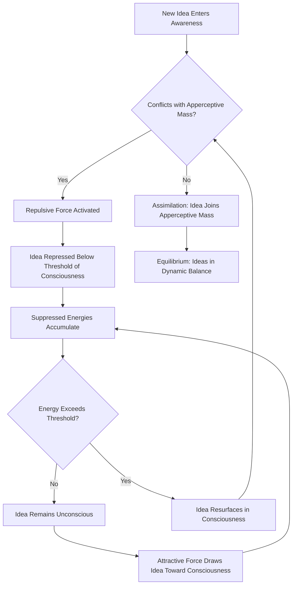

# Chapter 08 · Module 1
# Before the Laboratory — Herbart and the Dream of a Mathematical Psychology
## Psychology · Unit 1 · History of Psychology

---

The lecture hall at the University of Königsberg was cold that November evening in 1809. Johann Friedrich Herbart, forty-one years old, his dark coat still dusted with the first snow of the Baltic winter, stood before an audience of skeptical students and took his seat in the chair that Immanuel Kant had occupied for decades. The fireplace at the back of the room crackled and popped. Outside, the Pregel River was beginning to freeze. Herbart opened his notes and began to speak — not about what the mind feels like from the inside, but about how ideas move through it like forces in a gravitational field, pulling and pushing each other, rising and sinking, competing for a place in awareness.

This was a formidable inheritance. Kant had argued that psychology could never be a genuine science — that the mind's processes are too fleeting, too subjective, too entangled with the observer to admit of quantified laws. Herbart thought Kant was wrong. He sat down and wrote a book that attempted to prove it: a mathematical psychology, complete with equations, thresholds, and forces.

The book was called *A Textbook of Psychology* (1816), and it was unlike anything that had come before. Herbart did not just describe how the mind works. He calculated it. He treated ideas as physical forces — attractive and repulsive — that strive toward equilibrium. He wrote equations governing the rise and fall of ideas in consciousness. He predicted when ideas would be repressed, when they would resurface, and how they would combine. It looked like science. It had the trappings of science. And it was, in a sense, the first serious attempt to create a psychology that could stand alongside physics as a quantitative discipline.

There was just one problem. Herbart never specified how to measure the central quantities in his theory. You could not actually weigh an idea or measure its attractive force. The equations were elegant but empty — mathematical forms without empirical content. Kant's challenge remained unanswered.

But Herbart's ambition did not die. It passed to his followers, to the German university system, and eventually to a young physiologist named Wilhelm Wundt, who would succeed where Herbart had failed — not by making psychology mathematical, but by making it experimental.

---

## Herbart's Dynamic Psychology

Herbart (1776–1841) advanced an associationist psychology based on a postulated system of ideas possessed of attractive and repulsive forces. Ideas, he argued, strive to attain dynamic equilibrium. They are attracted to consciousness via effort and repelled from consciousness when they conflict with ideas that constitute the current **apperceptive mass** — the constellation of connected mental representations that constitute the current object of focused attention.

Herbart claimed that this theory explained the apparent spontaneity of thought, just as Newton's gravitational theory explained the apparent wandering of planets. In both cases, apparently irregular behavior is a determinate consequence of fixed mathematical laws. Ideas are never lost completely. They are merely repressed below a **threshold of consciousness**. Repressed ideas can sum their weaker energies to force their way into consciousness, displacing the original apperceptive mass. This is how certain ideas "pop" into your mind apparently unheralded, and how certain thoughts keep recurring against your will.

Herbart's theory had all the trappings of a scientific theory — presented as mathematical equations:

> "While the arrested portion of the concept sinks, the sinking part is at every moment proportional to the part unsuppressed. Mathematically, the above law may be expressed: ξ = S(1 − e^−2t) in which S = the aggregate amount suppressed, t = the time elapsed during the encounter, ξ = the suppressed portion of all the concepts in the time indicated by t."
> — Johann Friedrich Herbart, *A Textbook of Psychology* (1816/1891, p. 395)

Unfortunately, Herbart did not specify empirical measures for his central concepts. His theory was virtually impossible to evaluate empirically. Yet it served as a rich source of theoretical psychological concepts — such as the **repression** of ideas and cognitive equilibrium — that were later exploited by Freud and the social psychologist Leon Festinger.

Herbart denied the possibility of an experimental psychology (since ideas cannot be individually isolated from the dynamical systems in which they occur) and an introspective psychology (since many ideas are unconscious). He believed psychology could become a dynamical and mathematical science, but not an experimental one.

*Figure: Herbart's model of idea dynamics — new ideas either join the apperceptive mass through assimilation or are repelled below the threshold of consciousness, where their suppressed energies accumulate until they can resurface.*

> [!TIP]
> **Stop and Think:** Herbart wrote equations for the rise and fall of ideas in consciousness, but he had no way to measure the quantities in those equations. Is a theory without measurements still a scientific theory? Think about string theory in physics — it has elegant mathematics but no direct empirical tests. Is it in the same situation as Herbart's psychology?

---

## Drobisch and Homeostatic Motivation

Herbart's follower Moritz Wilhelm Drobisch (1802–1896) added an important new element to the theory. Drobisch noted that the continued operation of perception and memory ensures that any system of ideas will remain in a state of disequilibrium. Organisms experience disequilibrium as unpleasant and are motivated to regain equilibrium.

This notion of **homeostatic motivation** — the idea that organisms are motivated to eliminate states of disequilibrium experienced as unpleasant or painful — played a central role in later theories. Freud's pleasure principle (the drive to reduce tension) and Clark Hull's drive-reduction theory (behavior is motivated by the need to reduce physiological drives) are both descendants of Drobisch's insight.

The idea seems obvious now: we are motivated to fix what feels wrong. But in the early 19th century, it was a significant theoretical contribution — the first systematic attempt to ground motivation in a psychological (rather than theological or philosophical) framework.

> [!TIP]
> **Stop and Think:** Drobisch argued that we are motivated to eliminate unpleasant states of disequilibrium. Think about the last time you felt bored, anxious, or hungry. Did you act to reduce the discomfort? Is all motivation reducible to the elimination of unpleasant states? Or are there motivations that are not about reducing tension — like curiosity, play, or the pursuit of meaning?

---

## Educational Psychology: Herbart's Practical Legacy

Herbart applied his abstract mathematical theory to education. He claimed that novel ideas introduced to students should be consistent with and related to the apperceptive mass of previously mastered ideas. Learning occurs when new representational elements are associated with the apperceptive mass through **assimilation** (the new element is integrated with the existing mass) or **accommodation** (the mass is adjusted to incorporate the new element).

This is strikingly similar to Jean Piaget's theory of cognitive development, developed more than a century later. Piaget's concepts of assimilation and accommodation — the two processes by which children incorporate new experience into their existing cognitive structures — are direct descendants of Herbart's educational theory.

Herbart is often treated as the founder of educational psychology. His ideas about the sequencing of instruction, the importance of prior knowledge, and the active role of the learner in constructing understanding anticipated constructivist theories of learning that would not become mainstream until the late 20th century.

Herbart's theory was the dominant force in psychology in Germany when Wundt developed his program of physiological psychology in the late 19th century. The University of Leipzig was the center of Herbartian psychology (with Drobisch as its head) when Wundt took up his position there as professor of philosophy in 1875. Wundt's new psychology was, in many ways, a response to Herbart's — an attempt to ground psychology in experiment rather than mathematics.

> [!TIP]
> **Stop and Think:** Herbart argued that new learning must connect to what students already know — the apperceptive mass. Modern educational psychology calls this "prior knowledge" and considers it one of the strongest predictors of learning. Have you ever tried to learn something completely new, with no connection to anything you already knew? How did it feel? Was it harder than learning something that connected to existing knowledge?

> [!TIP]
> **Stop and Think:** Herbart's theory predicted that ideas can be repressed below consciousness but never truly lost. Freud later built an entire theory of the mind on this premise. Modern cognitive science has confirmed that unconscious processing is real — priming effects, implicit memory, blindsight all demonstrate that the mind processes information below the threshold of awareness. Was Herbart right all along? Or is modern unconscious processing something different from what Herbart imagined?

> [!TIP]
> **Stop and Think:** Drobisch argued that disequilibrium is experienced as unpleasant and motivates action. Think about the feeling of not knowing the answer to a question on an exam. Is that discomfort a form of disequilibrium? Does it motivate you to keep searching for the answer? What happens when you give up — does the discomfort disappear, or does it linger?

> [!IMPORTANT]
> Herbart's dream of a mathematical psychology failed because he could not measure what he theorized about. But his ambition — to create a psychology that is as rigorous as physics — would drive the discipline for the next two centuries. The question he raised but could not answer is still the central question of psychology: how do you measure the mind? Herbart tried mathematics. The next generation would try experiment. And the generation after that would try computation. The dream keeps changing. The question remains.

---

## Speaking of Equations and Education...

- A physics student in Seoul struggles with quantum mechanics. The mathematics is elegant, but she cannot connect it to anything she has experienced. The equations describe a world she cannot perceive. This is Herbart's problem in reverse: he had intuitions about the mind but could not measure them. She has measurements but cannot intuit the reality they describe.

- A primary school teacher in Lagos discovers that her students learn fractions faster when she starts with pizza slices and chocolate bars — things they already know — before introducing abstract notation. This is Herbart's apperceptive mass in action: new ideas must connect to existing ones. The teacher has never heard of Herbart. She does not need to. The principle works whether you know its name or not.

- A therapist in São Paulo notices that her patient keeps bringing up the same painful memory, unprompted, in different conversations. "It keeps popping into my head," the patient says. The therapist thinks of Freud's concept of repression — the idea that painful ideas are pushed below consciousness but keep resurfacing. She is, without knowing it, applying Herbart's theory of the dynamics of ideas.

---

Herbart had tried to make psychology mathematical. He had failed — but he had established psychology as a legitimate subject of inquiry in the German university system. The next step was to make it experimental. And the man who would do it was a failed physician who had accidentally given a patient iodine instead of a narcotic, who had studied with Helmholtz, and who would, in 1879, open the first experimental psychology laboratory in the world. His name was Wilhelm Wundt.

---

## References

1. Benjafield, J. G. (1996). *A history of psychology*. Boston: Allyn & Bacon.
2. Fancher, R. E. (1996). *Pioneers of psychology* (3rd ed.). New York: Norton.
3. Herbart, J. F. (1816/1891). *A textbook of psychology* (M. K. Smith, Trans.). New York: Appleton.
4. Piaget, J. (1952). *The origins of intelligence in children*. New York: International Universities Press.
