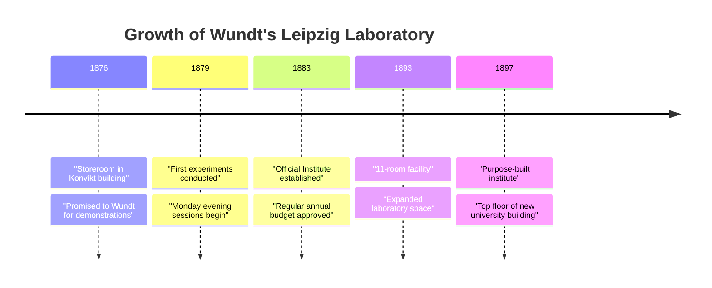

# Chapter 08 · Module 2
# Wundt's Laboratory — The Birth of Experimental Psychology
## Psychology · Unit 1 · History of Psychology

---

The storeroom smelled of old flour and damp wood. It was a Monday evening in the winter of 1879, and the Konvikt building at the University of Leipzig — a shabby structure that convicts had originally erected as a cafeteria for poor students — was mostly empty. But on the top floor, in a room that had been used to store kitchen supplies, a handful of students hunched over crude timing instruments: pendulums, Hipp chronoscopes, and telegraph keys wired to electromagnetic counters. The gas lamps hissed. Outside, snow was falling on the Augustusplatz. Under the direction of a 47-year-old professor named Wilhelm Wundt, these students were measuring the time it takes to perceive a stimulus, to make a decision, to shift attention from one thought to another. They were, without knowing it, founding a new science.

One of these students was Max Friedrich, who began his study "On the Duration of Apperception During Simple and Complex Ideas" in the winter of 1879–1880. He became the first student to be awarded a PhD in psychology at Leipzig. Another was G. Stanley Hall, the first American student to visit Wundt's laboratory. Both Hall and Wundt served as subjects in Friedrich's experiments, along with Friedrich himself. The apparatus was primitive by modern standards — reaction keys connected to clockwork mechanisms that measured time in thousandths of a second — but the ambition was anything but.

The year 1879 is conventionally designated as the one in which psychology was founded as an institutional scientific discipline. Not because Wundt invented psychology — he did not. Not because he discovered something revolutionary — his experimental findings were modest. But because he created something that had never existed before: a funded laboratory, a PhD program, a textbook, and a journal, all dedicated to the scientific study of the mind. He made psychology a profession.

---

## The Making of a Psychologist

Wilhelm Maximilian Wundt (1832–1920) was born in the village of Neckarau in the German principality of Baden, the fourth child of a Lutheran minister. He came from a distinguished family of university professors, scientists, and theologians. After a poor academic start — he hated school, failed his classes, and was thought by his teachers to be ill-suited for any demanding career — Wundt excelled as a medical student at the University of Heidelberg and received his medical degree with honors in 1855.

Despite his academic success, Wundt had no interest in medicine. He attributed this to personal doubts about his competence and recounted an anecdote about his early days as a medical intern, when he was so tired that he accidentally gave a patient iodine instead of a narcotic. His interests turned to physiology. He studied with Müller and du Bois-Reymond at the University of Berlin in 1856, received his second doctoral degree in physiology in 1857, and returned to Heidelberg as a lecturer.

In 1858, Wundt was appointed as an assistant to Helmholtz, the new head of the Institute of Physiology at Heidelberg. The assistantship was a disappointment — it required him to teach introductory courses to medical students, and he had little opportunity to work with Helmholtz on research. But Wundt used the time productively. He developed his first course on "psychology as a natural science" in 1862 and published *Contributions Toward a Theory of Sense Perception* (1862) and *Lectures on Human and Animal Psychology* (1863).

> [!TIP]
> **Stop and Think:** Wundt worked as Helmholtz's assistant but barely interacted with him on research. Instead, he used the time to develop his own ideas. Sometimes the most productive periods of a career are not the ones where you are doing what you are supposed to do, but the ones where you are quietly doing something else entirely. Have you ever had a "side project" that turned out to be more important than your main work?

Wundt continued Helmholtz's measurement of neural transmission and calculated the time taken for the transmission of nerve impulses from sense organs through the nervous system to musculature. He identified a temporal remainder not accounted for by simple transmission — which he attributed to mental processes such as choice and volition. This type of theoretical inference about mental processes on the basis of reaction-time measurements became characteristic of Wundt's later experimental research.

In 1873–1874, Wundt published the first edition of his two-volume *Principles of Physiological Psychology* — perhaps the first real textbook of experimental psychology. It was revised and expanded through multiple editions and constituted Wundt's self-conscious attempt to mark out physiological psychology as "a new domain of science," independent of but related to physiology and philosophy.

> [!TIP]
> **Stop and Think:** Wundt failed at medicine, accidentally poisoned a patient, and was considered unsuited for a demanding career. He then became the founder of a new scientific discipline. How many of history's great scientists succeeded not despite their failures but because of them? What did Wundt's failure in medicine teach him about what he actually wanted to do?

---

## The Leipzig Laboratory

Wundt accepted a chair in philosophy at the University of Leipzig in 1875. The university was the largest in Germany, and the center of Herbartian psychology. Wundt's new scientific discipline began modestly. The first course he taught was on physiological psychology. Some demonstrations and practicals were conducted in a storeroom in the Konvikt building — promised to Wundt in 1876.

As Wundt's courses became more popular, his "psychological laboratory" came to occupy more and more rooms in the building. In 1883, when the University of Breslau made him a lucrative job offer, the Leipzig administration was anxious to retain him. Wundt set conditions: a higher salary and funds for the expansion of the laboratory. The university agreed. His "Institute for Experimental Psychology" was officially listed in the university catalogue with a regular annual budget.

The laboratory continued to expand. In 1893, it moved to an 11-room facility. In 1897, it moved to specially designed rooms on the top floor of a brand-new building. By this time, Wundt's new science and PhD program were well established, attracting students and visitors from all over the world.

Wundt supervised 186 dissertations at Leipzig between 1876 and 1917, of which 116 were psychological. He was by all accounts a popular teacher of a popular subject and an indefatigable worker. In 1881, he established *Philosophical Studies* (*Philosophische Studien*) — the first journal dedicated exclusively to psychological research and the first to regularly publish experimental studies in psychology.

> [!TIP]
> **Stop and Think:** Wundt's laboratory started in a storeroom in a convict-built cafeteria. It ended as a purpose-built institute that attracted students from around the world. How much of the history of science depends on institutional support — funding, space, administrative backing? Could Wundt have founded psychology without the University of Leipzig's willingness to invest in his program?

---

## Experimental Methods: Measuring the Mind

Wundt promoted an experimental psychology of **immediate experience** — the raw content of consciousness as it is experienced, without theoretical interpretation. This was in contrast to **mediate experience** — experience as interpreted by scientific theories — which he treated as the subject matter of natural science.

Wundt rejected the traditional philosophical conception of introspection as a form of "inner perception." He claimed that "there is no such thing as an 'inner sense' which can be regarded as an organ of introspection." Instead, he advocated **experimental self-observation** (*experimentelle Selbstbeobachtung*) — trained subjects providing concurrent commentaries on their conscious experience under rigorously controlled experimental conditions. He hoped this would avoid the distorting effects of intellectual reflection and reconstructive memory.

> [!TIP]
> **Stop and Think:** Wundt rejected "armchair introspection" in favor of "experimental self-observation." The difference is that experimental self-observation happens under controlled conditions, with trained subjects. But is there really a difference between sitting in a room describing your experience and sitting in a laboratory describing your experience? Can the act of observation ever be truly objective when the observer and the observed are the same person?

However, only a very small proportion of the work done in Wundt's laboratory involved direct reporting of experience. Of the 180 experimental studies conducted in Wundt's laboratory between 1883 and 1903, only four contained introspective reports. Most were studies of sensation and perception, developments of Fechner's psychophysical studies, and — most characteristically — studies of **mental chronometry**.

Mental chronometry used reaction-time experiments to measure the duration of postulated mental processes. The Dutch physiologist Franciscus Donders had pioneered this approach. By subtracting simple reaction time from the time taken to discriminate a target stimulus from distractors, Donders estimated the time taken for the mental process of discrimination. By subtracting discrimination time from the time taken to choose a response, he estimated choice reaction time.

Wundt and his students created more complex stimuli and responses — requiring subjects to respond to visual stimuli of a specific color, intensity, or duration, and to make concurrent responses to visual and auditory stimuli. Wundt hoped to measure the time taken by mental mediating processes and to determine the nature of processes such as attention, judgment, memory, and inference.

James McKeen Cattell, one of Wundt's American students, conducted experiments on letter identification. He determined that reaction time for naming letters decreases as more letters are presented, and that reading times for connected words are shorter than for unconnected letters. His work was published in *Philosophical Studies* in 1885.

Apart from the occasional use of experimental self-observation, the studies conducted in the Leipzig laboratory did not differ radically from those in physiological laboratories. Wundt simply appropriated that area of experimental physiology concerned with psychological dependent variables.

> [!TIP]
> **Stop and Think:** Wundt claimed to study consciousness through experimental self-observation, but almost none of his laboratory work actually involved introspective reports. Most of it was reaction-time measurement — the same kind of work done in physiology labs. Does this mean Wundt's "new science" was just physiology with a different name? Or is there something genuinely different about measuring reaction times when you are interested in mental processes rather than neural ones?

*Figure: The institutional growth of Wundt's Leipzig laboratory from a storeroom to a purpose-built institute over two decades.*

> [!IMPORTANT]
> Wundt's greatest achievement was not any single experiment or theory — it was the creation of an institutional infrastructure for psychology as a science. By securing a dedicated laboratory, a regular budget, a PhD program, a journal, and a professional identity distinct from physiology and philosophy, he transformed psychology from a topic that philosophers speculated about into a profession that students could train for. The lesson is not that one genius changed the world, but that ideas need institutions to survive.

---

## Speaking of Laboratories and Legacies...

- A neuroscience graduate student in Mumbai stares at her EEG cap and the 64-channel amplifier on her lab bench. She is measuring event-related potentials — tiny electrical signals from the brain that unfold in milliseconds. The technology is incomparably more sophisticated than Wundt's Hipp chronoscope, but the logic is the same: infer mental processes from the timing of responses. She has never thought of herself as Wundt's intellectual descendant. She is.

- A high school teacher in Seoul explains to his students why psychology is considered a science. "They do experiments," he says, "just like chemists and physicists." A student raises her hand: "But how can you experiment on something you can't see?" The teacher pauses. This is the same question that was asked in Leipzig in 1879. Wundt's answer was mental chronometry — measuring the invisible by measuring the time it takes. The teacher does not know this history. But he is defending the same ground.

- An organizational psychologist in Lagos is hired by a tech company to redesign its hiring process. She designs a battery of timed cognitive tests — measuring how quickly candidates can switch between tasks, how accurately they can hold multiple items in working memory, how fast they can identify patterns. Her methods are direct descendants of the reaction-time studies conducted in Wundt's laboratory. The company has no idea it is applying 19th-century German experimental psychology to 21st-century African tech recruitment. It is.

---

Wundt had built the institution. He had trained the students. He had founded the journal. But what was his actual psychology? What did he believe about the mind — about apperception, creative synthesis, the nature of elements? And what was this strange project called *Völkerpsychologie* that consumed the last twenty years of his career? The answers are more interesting — and more modern — than the textbooks suggest.

---

## References

1. Blumenthal, A. L. (1975). A reappraisal of Wilhelm Wundt. *American Psychologist, 30*(11), 1081–1088.
2. Danziger, K. (1990). *Constructing the subject: Historical origins of psychological research*. Cambridge: Cambridge University Press.
3. Kusch, M. (1995). *Psychologism: A case study in the sociology of philosophical knowledge*. London: Routledge.
4. Wundt, W. (1897/1902). *Outlines of psychology* (C. H. Judd, Trans.). Leipzig: Engelmann.
