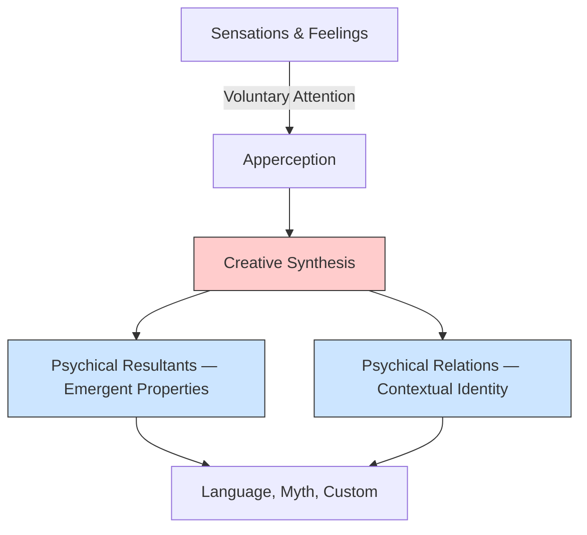

# Chapter 08 · Module 3
# Wundt's Mind — Apperception, Language, and Cultural Psychology
## Psychology · Unit 1 · History of Psychology

---

In 1874, two books appeared in German bookshops that would define the future of psychology. Wilhelm Wundt published the first volume of his *Principles of Physiological Psychology*; Franz Brentano published *Psychology From an Empirical Standpoint*. The two books could not have been more different. Wundt wanted to measure consciousness with instruments and timers. Brentano wanted to understand its essential structure through philosophical analysis. But Wundt had something Brentano did not: a laboratory, a journal, and a PhD program. Ideas alone do not build disciplines. Institutions do.

Picture Leipzig in the late 1870s. The air in Wundt's cramped laboratory on the second floor of the Konvikt building smells of metal and ink. A young doctoral student sits in a darkened room, a kymograph scratching its wavy lines on smoked paper. His task is deceptively simple: press a telegraph key the instant he hears a sound, and measure the time between the sound and his response. But Wundt is not really interested in reaction time. He is interested in what happens *between* the stimulus and the response — the moment of **apperception**, when the mind selects, organizes, and creates something new from raw sensation.

Wundt's institutional success often overshadows his theoretical contributions. But his psychology was far more sophisticated than the caricature found in most textbooks. He was not an introspectionist who asked people to report their sensations. He was a theorist of **creative synthesis** — the idea that consciousness is not a collection of atomic elements but a dynamic, relational process shaped by attention and will. His theory of apperception, his invention of sentence tree diagrams, and his 10-volume *Völkerpsychologie* represent a vision of psychology that was never fully realized — and that modern cognitive science is only now beginning to recover.

The question that haunted Wundt's students — and that still haunts psychologists today — was this: if the mind creates something genuinely new from its elements, something that cannot be predicted from the parts alone, then how do you study it scientifically?

---

## Wundt's Psychology: Apperception and Creative Synthesis

Wundt accepted the evolution of species, but his position was closer to Lamarck's and Spencer's than to Darwin's. He endorsed the inheritance of acquired characteristics and conceived of development as intrinsically teleological — a goal-directed process of differentiation. He agreed with Morgan that all animal psychology "can be accounted for by the simple laws of association," but denied that all human psychology could be explained this way.

Although humans do passively associate ideas according to principles of similarity, contiguity, and repetition, Wundt maintained that the "elements" of human consciousness are not compounded in the aggregative fashion of associationist psychology. They are formed into integrated and unified configurations through the voluntary action of the will.

Wundt employed the term **apperception** to designate the creative and selective attentional processes responsible for the configuration of conscious mental states. Apperception was the evolutionary advance that distinguished humans from animals and made possible the development of complex cultural forms of mentality such as language, myth, and custom.

Wundt held that the distinctive property of apperception is **creative synthesis** (*schöpferische Synthese*) — the idea that all other human psychological processes (perception, thought, memory) are controlled by this central process, which he located in the frontal lobes. Because of this emphasis on the voluntary, selective, and creative nature of apperception, Wundt characterized his theoretical psychology as **voluntaristic psychology**.

The two basic elements of Wundt's system were sensations and feelings. He analyzed feelings as varying along three dimensions: pleasant versus unpleasant, high versus low arousal, and concentrated versus relaxed attention. His Leipzig students devoted much time to exploring this tri-dimensional theory, but eventually abandoned it as unworkable.

According to Wundt's **principle of psychical resultants** (also known as the principle of creative synthesis), the attributes of psychological configurations are distinct from the mere aggregation of the attributes of their elements:

> "Every psychological compound shows attributes which may indeed be understood from the attributes of its elements after these elements have once been presented, but which are by no means to be looked upon as the mere sum of the attributes of these elements."
> — Wilhelm Wundt, *Outlines of Psychology* (1897/1902, p. 321)

Wundt did not merely claim with Mill that complex ideas have emergent properties. He rejected Mill's mental chemistry because Mill had neglected the "special creative character of psychic synthesis." Wundt maintained that the "elements" of psychological configurations cannot be identified independently of their configuration — unlike atomic elements such as hydrogen and oxygen.

*Figure: Wundt's model of mental life. Sensations and feelings are configured through apperception (voluntary attention) into creative syntheses. These configurations exhibit psychical resultants (emergent properties not predictable from elements alone) and psychical relations (elements defined by their context). Together, these processes generate the higher cultural products of language, myth, and custom.*

> [!TIP]
> **Stop and Think:** Wundt argued that the "elements" of consciousness are not independent building blocks but are defined by their relationships within a configuration. This is a radical claim. It means you cannot study a sensation in isolation — you can only study it in context. How does this compare to modern neuroscience, where researchers study individual neurons but acknowledge that meaning emerges from networks?

According to Wundt's **principle of psychical relations**, the nature and identity of the elements of psychological configurations are determined by their relational location within those configurations:

> "Every single psychical content receives its significance from the relations in which it stands to other psychical contents."
> — Wilhelm Wundt, *Outlines of Psychology* (1897/1902, p. 323)

For example, words do not have meaning in isolation, but only via their role in configured sentences. This relational conception later became the foundational principle of Gestalt psychology.

> [!TIP]
> **Stop and Think:** Wundt argued that the "elements" of consciousness — sensations, feelings — are not independent building blocks but are defined by their relationships within a configuration. Think about the word "bank." Its meaning changes completely depending on whether it appears in "I sat on the river bank" or "I deposited money in the bank." Is the meaning of "bank" an element of your consciousness, or is it a product of the configuration in which the word appears?

---

## Language and Völkerpsychologie

Wundt explained linguistic performance in terms of the transformation of thought configurations into symbolic representations in language. A speaker apperceives a configured idea and selects a sequence of linguistic symbols to express it; a listener analyzes the speaker's production in an attempt to reconstruct the original configured idea.

Wundt noted that the original configured idea can be expressed by the speaker (or reconstructed by the listener) in a variety of different linguistic forms — which explained how we can remember the meaning of a verbal communication after we have forgotten the specific sentences used. He invented the tree diagrams representing sentence structure that were later employed by many linguists, including Noam Chomsky.

By the early 1900s, Wundt had lost interest in laboratory work and devoted most of his remaining years to his 10-volume *Völkerpsychologie* (1900–1920) — a comparative-historical study of the "mental products" of social communities: language, myth, and custom.

Wundt saw *Völkerpsychologie* as a complement to experimental psychology, not a replacement for it:

> "Psychological analysis of the most general mental products, such as language, mythical ideas, and laws of custom, is to be regarded as an aid to the understanding of all the more complicated psychical processes."
> — Wilhelm Wundt, *Outlines of Psychology* (1897/1902, p. 10)

Wundt rejected the Herbartian conception of language as elements compounded by association and maintained that language is creatively generated in accord with abstract rules governing the production of sentences. This anticipated the transformational grammar of Chomsky — though Chomsky himself was unaware of Wundt's priority.

> [!TIP]
> **Stop and Think:** Wundt invented tree diagrams for sentence structure fifty years before Chomsky. He argued that language is generated by rules, not by association. Why was Wundt's contribution forgotten while Chomsky's became one of the most influential ideas in 20th-century science? Is scientific discovery about being first, or about being heard at the right time by the right audience?

> [!TIP]
> **Stop and Think:** Wundt spent the last twenty years of his career on *Völkerpsychologie* — the comparative study of language, myth, and custom across cultures. Most historians of psychology have treated this as a footnote. But Wundt saw it as essential. Can you understand the human mind by studying only laboratory experiments? Or do you also need to understand how minds are shaped by culture, language, and history?

---

## Wundt's Legacy: The Sorcerer's Apprentice

Wundt's lasting achievement was the establishment of psychology as an autonomous scientific discipline. He trained generations of German and foreign students who went on to found their own laboratories in Germany, the Americas, India, Russia, and Asia. His Indian students produced a commemorative volume in 1932; his Russian and Japanese students built replicas of his Leipzig laboratory in Moscow (1912) and Tokyo (1920).

Wundt had many students but few intellectual disciples. There are no enduring psychological laws or principles named after him. His main achievement was the establishment of a research community of psychologists working on a common set of experimental problems, who disseminated their results through PhD dissertations and journal publications.

Thirty-three Americans completed their doctoral degrees under Wundt's supervision. Ten years after the founding of his laboratory, there were over 40 American laboratories, about a dozen founded by his students — including programs at Cornell, Stanford, Columbia, Northwestern, Pennsylvania, and Yale.

But the Americans who studied with Wundt returned home with only the experimental skeleton and institutional structure of the new psychology. For those who did not study with Wundt directly, their exposure was filtered through the translations of Edward B. Titchener, who interpreted Wundt's psychology in terms of the atomistic and associationist psychology of British empiricism — to which it bore little resemblance.

Wundt's chair at Leipzig was in philosophy, and he considered psychology to be "both a part of the science of philosophy and an empirical Geisteswissenschaft." He hoped psychology would transform and reinvigorate German philosophy. This did not save him from the criticisms of philosophers like Wilhelm Windelband, who complained:

> "For a time it was thought in Germany that one was close to being qualified for a philosophical chair as soon as one had learned to press electric buttons in a methodological way."
> — Wilhelm Windelband (quoted in Kusch, 1995, p. 171)

In a sense, Wundt's fate was that of the sorcerer's apprentice. In creating a form of scientific psychology based on laboratory science, he unleashed powerful forces that he was unable to control — forces that, over a few generations, radically transformed the discipline.

> [!TIP]
> **Stop and Think:** Wundt's psychology was misrepresented by Titchener, who translated it into British empiricist terms. Most American psychologists learned a version of Wundt that Wundt himself would not have recognized. How often does this happen in science — where a thinker's ideas are distorted by their interpreters? Can you think of another case where the "received version" of a theory differs dramatically from the original?

> [!IMPORTANT]
> Wundt did not invent the study of the mind. But he invented the *profession* of studying the mind. Before Wundt, psychology was a branch of philosophy. After Wundt, it was an academic discipline with laboratories, journals, PhD programs, and professional organizations. The institutional achievement was more important than any single experimental finding. Wundt proved that a systematic scientific psychology, sustained by a social collective of teachers and students engaged in a common research agenda, was a "practical possibility." Everything that followed — behaviorism, cognitive psychology, clinical psychology, neuroscience — was built on that foundation.

---

## Speaking of Institutions and Misinterpretations...

- A graduate student in São Paulo reads about Wundt in a textbook and learns that he was the father of introspectionism — a method that was later abandoned. She is surprised to discover that almost none of Wundt's laboratory work involved introspection. The textbook has been telling Titchener's version, not Wundt's.

- A university administrator in Lagos argues that psychology should be housed in the philosophy department, not as a separate discipline. Wundt would have agreed — he believed psychology was part of philosophy. But the American model of separate psychology departments won out. The institutional separation of psychology from philosophy shaped the discipline in ways Wundt never intended.

- A psychologist in Seoul publishes a paper on sentence processing using tree diagrams. She does not know that the tree diagram was invented by Wilhelm Wundt in the 1900s — fifty years before Chomsky reinvented it. The history of ideas is full of such parallel inventions and forgotten priorities.

---

Wundt had founded psychology in Leipzig. But Leipzig was not the only game in Germany. A philosopher named Franz Brentano was proposing a radically different conception of the mind based on intentionality. A dedicated experimentalist named Georg Elias Müller was building a rival laboratory in Göttingen that was, in many ways, more rigorous than Wundt's. And Hermann Ebbinghaus was about to demonstrate that memory — one of the most elusive mental processes — could be studied with mathematical precision.

---

## References

1. Blumenthal, A. L. (1975). A reappraisal of Wilhelm Wundt. *American Psychologist, 30*(11), 1081–1088.
2. Danziger, K. (1990). *Constructing the subject: Historical origins of psychological research*. Cambridge: Cambridge University Press.
3. Kusch, M. (1995). *Psychologism: A case study in the sociology of philosophical knowledge*. London: Routledge.
4. Wundt, W. (1897/1902). *Outlines of psychology* (C. H. Judd, Trans.). Leipzig: Engelmann.
5. Wundt, W. (1900–1920). *Völkerpsychologie* [Cultural psychology] (Vols. 1–10). Leipzig: Engelmann.
