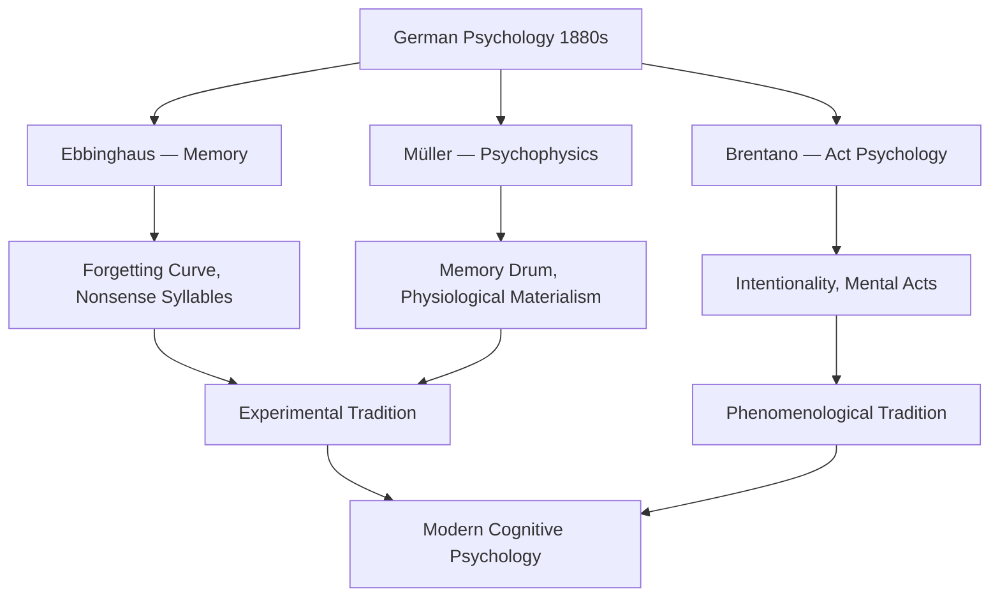

# Chapter 08 · Module 4
# Ebbinghaus, Müller, and Brentano — Memory, Psychophysics, and Act Psychology
## Psychology · Unit 1 · History of Psychology

---

In the spring of 1880, a 30-year-old German philosopher walked into a secondhand bookstore on the Left Bank of Paris. The shelves were dusty, the light thin, the smell of old paper thick in the air. He picked up a copy of Gustav Fechner's *Elements of Psychophysics* — a book that had been published twenty years earlier and had attracted little attention outside a small circle of German physicists. But something in it struck the young man with the force of revelation: the idea that a mental process could be measured with mathematical precision. His name was Hermann Ebbinghaus, and the book changed his life. He decided, on the spot, to do for memory what Fechner had done for sensation — measure it.

Ebbinghaus returned to Germany, where he served as an untenured instructor at the University of Berlin. He began a series of experimental studies on memory — defined as "learning, retention, association and reproduction" — with himself as the single experimental subject. He had no laboratory, no funding, no assistants. He had a metronome ticking steadily on his desk, a pen, and a set of lists he had invented himself. The lists were made of **meaningless syllables** — consonant-vowel-consonant combinations like "DAX," "BUP," and "TOL" — designed to eliminate the influence of prior associations and meaningful relations. Day after day, night after night, he sat alone, reading the lists aloud, timing himself with the metronome, recording how many repetitions it took to learn them perfectly — and how quickly he forgot.

The results were published in 1885 in a book called *On Memory*, dedicated to Fechner. It became an instant classic. William James, who had little good to say about most pioneers of German psychology, called Ebbinghaus one of Germany's "best men." The **forgetting curve** — the relationship between time and memory loss — was established. Experimental psychology had found its second major research program. But what made Ebbinghaus's achievement remarkable was not just the finding. It was the demonstration that the most private, elusive, and seemingly immeasurable of human experiences — remembering and forgetting — could be subjected to the same rigorous methods as the weight of a stone or the pitch of a tone.

---

*Figure: Three rival research programs in German psychology. Ebbinghaus and Müller both contributed to the experimental tradition — Ebbinghaus through mathematical studies of memory, Müller through rigorous psychophysics. Brentano's act psychology, grounded in the concept of intentionality, fed into the phenomenological tradition. Both streams eventually converged in modern cognitive psychology.*

## Ebbinghaus: The Forgetting Curve

Hermann Ebbinghaus (1850–1909) created lists of **meaningless syllables** — consonant-vowel-consonant combinations with no inherent meaning — and used randomly selected combinations as stimulus material. On each learning trial, he looked at each syllable for a fraction of a second, as measured by a metronome. He repeated this process every 15 seconds until he attained mastery of the list — when he could recall each syllable without error.

Ebbinghaus established several fundamental findings:

The number of repetitions required to learn a list increases with list length: 7 syllables require 1 repetition; 16 require 30; 36 require 55. Memory deteriorates rapidly in the first few hours and days after learning, and much more slowly thereafter: over 50% is forgotten in the first hour, over 60% in the first day, with about 20% retained between the second and thirtieth day. The time taken to relearn lists decreases as the number of original repetitions increases — demonstrating the importance of **overlearning**.

*On Memory* described an elegant set of studies directed to specific hypotheses, in the scientific tradition of Gilbert's *On Magnetism* and Newton's *Opticks*. It initiated a long tradition of research on memory that continues to this day. Ebbinghaus was appointed professor extraordinarius at the University of Berlin as a result.

But Ebbinghaus did not continue his memory research. His interests turned to sensory and perceptual psychology, possibly under the influence of Helmholtz, who held a chair in physics at Berlin. He founded an Institute of Experimental Psychology but played only a minor role in the institutional development of German psychology. He published two extremely popular textbooks and pioneered the use of completion tests for assessing children's intelligence — tests that Alfred Binet later incorporated into his intelligence scales.

> [!TIP]
> **Stop and Think:** Ebbinghaus used himself as his only experimental subject. Modern psychology requires multiple subjects, control groups, and statistical analysis. Was Ebbinghaus's single-subject approach scientifically valid? His forgetting curve has been replicated hundreds of times with thousands of subjects. Does the validity of a finding depend on how many people were tested, or on whether the finding holds up when others try to replicate it?

---

## Müller: The Dedicated Experimentalist

Georg Elias Müller (1850–1934) was a native of Saxony who originally studied philosophy and history at Leipzig. After military service in the Franco-Prussian War, he returned to Leipzig to study with Drobisch — Herbart's follower. On Drobisch's recommendation, he went to study at Göttingen with Rudolf Hermann Lotze, who held the chair formerly held by Herbart.

After producing a thesis on attention in 1873, Müller returned to Leipzig, where he met Fechner and developed an interest in psychophysics. In 1878, he published *Fundamentals of Psychophysics* — a critical evaluation of Fechner's work. Fechner's detailed response established Müller's reputation, and shortly afterward Müller was appointed to the chair of philosophy at Göttingen, where he remained until his retirement in 1921.

Müller immediately set about founding a laboratory and PhD program in psychology. He was a dedicated experimentalist whose lifelong commitment to methodological rigor, quantification, and instrumentation was possibly more representative of the spirit of modern scientific psychology than Wundt's own version. William James described Müller's contribution as "brutal."

Müller's form of physiological psychology was far more physiological than Wundt's. He was a reductive explanatory materialist who insisted that scientific psychological theories must be grounded in physiological theories. His own theories were based on physiological theories of cortical blood supply and neural excitation.

Although not an innovative theorist, Müller was enormously productive. He extended Fechner's psychophysics, making Göttingen a major center for psychophysical research. He introduced methodological and statistical innovations and produced masterful studies of the psychophysics of lifted weights. He developed the program of memory research that Ebbinghaus had initiated and established the research tradition of verbal learning.

Müller and his student Friedrich Schumann invented the **memory drum** — for many years the standard instrument for the study of verbal learning and memory. Müller also developed an early interference theory of memory with another student, Alfons Pilzecker. His extensive studies of recall and recognition were summarized in his three-volume *Analysis of the Processes of Memory and Mental Representation* (1911–1913).

Müller recognized the critical role of configurational properties (*Gestaltsqualitäten*) in perception and memory, but rejected Wundt's theory of creative synthesis. He based his own structural theory (*Komplextheorie*) on traditional Herbartian principles of association and treated configurational properties as complex by-products of association.

> [!TIP]
> **Stop and Think:** Müller recognized that perception has configurational properties — the whole is different from the sum of its parts — but tried to explain this using associationism. The Gestalt psychologists would later argue that this is impossible. Can you explain emergent properties using reductionist tools? Or do emergent properties require a fundamentally different kind of explanation?

Müller played almost as influential a role as Wundt in the early development of experimental psychology. But he is rarely remembered in introductory texts. Few of his works were translated into English, and he was uninterested in developments outside Germany.

Müller also had some remarkable students, including several American women who overcame extraordinary barriers. Christine Ladd-Franklin studied color perception with Müller in 1891 and developed her own theory of color vision. Johns Hopkins denied her a degree because it refused to grant degrees to women — she finally received one in 1926, 44 years after completing her studies. Lillien Martin published a classic study with Müller on the psychophysics of lifted weights but never received a degree from Göttingen because it prohibited women from graduating. She became chair of psychology at Stanford. Gilbert Haven Jones, an African American, earned a doctoral degree at Jena and studied with Müller before becoming the first African American with a doctoral degree to teach psychology.

> [!TIP]
> **Stop and Think:** Christine Ladd-Franklin completed her PhD requirements in 1882 but received her degree in 1926 — 44 years later. Lillien Martin was never granted a degree at all, yet became chair of psychology at Stanford. These women succeeded despite institutional barriers designed to exclude them. How much talent has psychology lost because of discrimination? And how much is it still losing?

> [!TIP]
> **Stop and Think:** Müller's laboratory at Göttingen was arguably more rigorous than Wundt's at Leipzig, and Müller trained remarkable students who overcame barriers of race and gender. Yet Müller is barely mentioned in psychology textbooks. What determines which scientists are remembered and which are forgotten? Is it the quality of their work, or the accident of whether their ideas were translated into English?

---

## Brentano: Intentionality as the Mark of the Mental

Franz Brentano (1838–1917) proposed a radically different conception of the mind. The son of an Italian merchant immigrant to Germany, Brentano began training for the priesthood at 17. He studied philosophy at Berlin and Munich, developing a lifelong interest in Aristotle. He received his PhD from Tübingen in 1862, was ordained as a priest, and obtained a position at the University of Würzburg.

In 1873, Brentano resigned from the priesthood and his academic position over the debate about papal infallibility. During the next few years, he worked on his magnum opus: *Psychology From an Empirical Standpoint* (1874) — published the same year as the second volume of Wundt's *Principles of Physiological Psychology*.

Following Aristotle and Aquinas, Brentano treated **intentionality** as the distinctive "mark of the mental." Mental states such as thoughts, memories, and emotions are intentionally directed upon objects:

> "Every mental phenomenon is characterized by what the Scholastics of the Middle Ages called the intentional. . . . Every mental phenomenon includes something as object within itself, although they do not all do so in the same way. In presentation something is presented, in judgment something is affirmed or denied, in love loved, in hate hated, in desire desired, and so on."
> — Franz Brentano, *Psychology From an Empirical Standpoint* (1874/1995, p. 88)

Because of his focus on mental acts (perceiving, judging, desiring), Brentano is often characterized as a proponent of **act psychology** — in contrast to Wundt's supposed psychology of contents. But Wundt placed at least as much emphasis on mental acts as on mental contents.

Like Wundt, Brentano was committed to the utility of experimental methods. He petitioned the University of Vienna for funding for a psychological laboratory. But he was less enthusiastic than Wundt about the potential of physiological psychology. Like Müller, he was an explanatory reductive materialist who believed that causal understanding of psychological processes depends on understanding the physiological processes that ground them. Since physiology had few established causal principles relevant to psychology in the late 19th century, he thought the immediate prospects for an explanatory scientific psychology were poor.

Although he did not develop a substantive experimental research program, Brentano had important and influential students — including Carl Stumpf, Edmund Husserl (the founder of phenomenological philosophy), Christian von Ehrenfels (a founder of Gestalt psychology), and Sigmund Freud.

> [!TIP]
> **Stop and Think:** Brentano argued that every mental state is "about" something — it is directed toward an object. Your thought is about the weather. Your fear is about the spider. Your memory is about last summer. Is there any mental state that is not about anything? What about a diffuse mood of anxiety with no clear object? Or the experience of meditation, where the mind is supposedly empty? Does Brentano's theory capture all of consciousness, or only part of it?

> [!IMPORTANT]
> Ebbinghaus, Müller, and Brentano were not just filling in gaps in Wundt's program. They were proposing fundamentally different answers to the question of what psychology should be. Ebbinghaus said: measure it. Müller said: ground it in physiology. Brentano said: understand its essential structure. These three visions — mathematical, physiological, and phenomenological — did not merge into a single unified science. They split into rival traditions that would define psychology for the next century. The tension between measurement and understanding, between explanation and interpretation, was not resolved in the 1880s. It has never been resolved.

---

Brentano had identified intentionality as the mark of the mental. Müller had pushed experimental rigor to new heights. Ebbinghaus had shown that memory could be measured. But the most consequential developments in German psychology were still to come — not in Leipzig, but in Berlin and Würzburg, where two very different challenges to the associationist tradition were about to converge.

---

## Speaking of Memory, Measurement, and Mental Acts...

- A student in Lagos studies for her exams using flashcards. She reviews the same material at increasing intervals — one day, three days, seven days. She does not know she is using a technique called spaced repetition, which is directly descended from Ebbinghaus's discovery that memory deteriorates predictably over time. The forgetting curve is 140 years old, and it still governs how she learns.

- A psychologist in Seoul designs a study on how people perceive faces. She uses psychophysical methods — measuring just-noticeable differences in facial features. She is doing exactly what Müller did at Göttingen over a century ago. The methods have not changed. The questions have not changed. Only the technology.

- A philosopher in São Paulo argues that artificial intelligence cannot truly "understand" anything because it lacks intentionality — its processes are not "about" the world. His argument is pure Brentano. The question of whether machines can think is, at its core, the question of whether intentionality can be reduced to computation.

---

## References

1. Brentano, F. (1874/1995). *Psychology from an empirical standpoint* (A. C. Rancurello, D. B. Terrell, & L. L. McAlister, Trans.). London: Routledge.
2. Ebbinghaus, H. (1885/1913). *Memory: A contribution to experimental psychology* (H. A. Ruger & C. Bussenius, Trans.). New York: Teachers College, Columbia University.
3. Müller, G. E. (1911–1913). *Analyse der Gedächtnistätigkeit und des Vorstellungsverlaufes* [Analysis of memory and mental representation] (Vols. 1–3). Leipzig: Barth.

