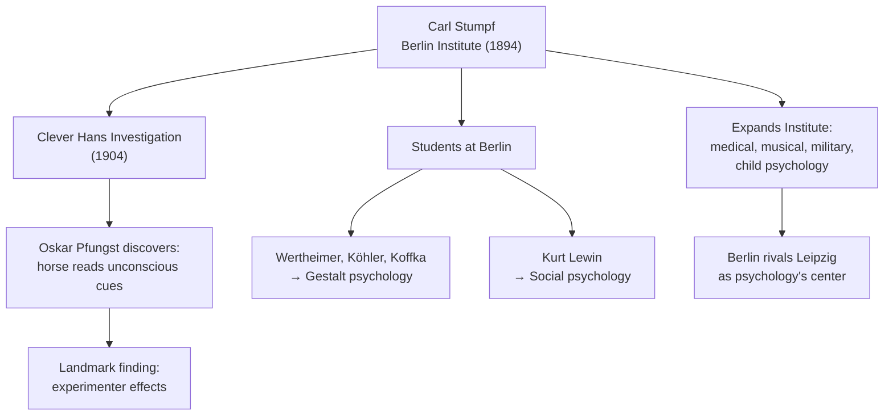

# Chapter 08 · Module 5
# Berlin, Würzburg, and the Road to Gestalt
## Psychology · Unit 1 · History of Psychology

---

In 1894, Carl Stumpf was appointed to the chair of philosophy at the University of Berlin. His new office smelled of pipe smoke and old books. On his desk sat a battered cigar box — and nothing else. He was not an experimentalist. He allegedly boasted that he could carry all the laboratory apparatus he needed in that cigar box under his arm. But he was an organizer, an administrator, and a man of extraordinary influence. Within a few years, his Berlin Institute would fill with laboratories — rooms humming with galvanometers, ticking metronomes, and the quiet scratching of pens recording reaction times. Students from across Europe arrived to study under him. His Berlin Institute would rival Wundt's Leipzig. And his students — Wertheimer, Köhler, Koffka, Lewin — would transform psychology in ways that neither Wundt nor Stumpf could have predicted.

Meanwhile, 300 kilometers to the south, in the medieval university town of Würzburg, a group of psychologists was discovering something that should not exist: thoughts without images. In quiet experimental rooms, subjects sat in chairs, eyes closed, and reported on the contents of their consciousness after performing simple cognitive tasks. They described states of awareness that had no visual component, no auditory trace, no sensory quality at all — just a bare "knowing" that something was so. If associationism was right — if all thinking is just chains of sensory images — then these reports were impossible. But the Würzburg psychologists found imageless thought again and again, in subject after subject, protocol after protocol. The implications would take decades to fully absorb.

---

## Stumpf: The Berlin Institute and Clever Hans

Carl Stumpf (1848–1936) discovered philosophy as a student of Brentano's at Würzburg. He completed his PhD under Lotze's supervision at Göttingen in 1868 and worked with Weber and Fechner. After holding positions at several universities, he was appointed to the chair of philosophy at the University of Berlin in 1894.

Stumpf did little empirical research and was skeptical of experimentation in psychology. He allegedly boasted that he could carry all the laboratory apparatus he needed in a cigar box under his arm. But he was an excellent organizer and administrator who quickly expanded the Institute of Experimental Psychology at Berlin. He hired Friedrich Schumann, Müller's former research assistant, and instituted schools of medical, musical, military, and child psychology. The Berlin Institute eventually rivaled Wundt's Leipzig Institute as the primary center for psychology in Germany.

Stumpf's most famous contribution was his investigation of the case of **Clever Hans** — a horse owned by Herr von Osten that could apparently solve mathematical puzzles by tapping out answers. The horse attracted daily crowds to von Osten's home in Berlin. Stumpf collaborated with his student Oskar Pfungst to investigate. Pfungst demonstrated that Clever Hans was incapable of performing when von Osten was not present and that the horse's "achievements" were responses to unconscious behavioral cues supplied by the owner.

The Clever Hans case was a landmark in the history of psychology — one of the first demonstrations of the importance of controlling for experimenter effects in research with both animals and humans.

Stumpf was deeply critical of Wundt's psychology, which was condemned at the Berlin Institute as too passive and elemental. This hostility was partly personal — an acrimonious public dispute over the discrimination of tonal distances reflected their radically different approaches to empirical validation. Stumpf's position was based on his own introspective experience as a trained musician, which he considered superior to that of untrained experimental subjects.

Many of Stumpf's students had a major impact on subsequent developments. The Gestalt psychologists Wertheimer, Köhler, and Koffka were all students of Stumpf's, as was Kurt Lewin, who applied Gestalt principles to social psychology.

> [!TIP]
> **Stop and Think:** The Clever Hans case showed that a horse could appear to do mathematics by reading its owner's unconscious body language. The same principle applies to psychology experiments: if the experimenter knows the correct answer, the subject might pick up subtle cues. How do modern psychologists control for this? What would happen if we did not?

*Figure: Stumpf's Berlin Institute and its legacy — from Clever Hans to Gestalt psychology.*

---

## The Würzburg School: Thoughts Without Images

Oswald Külpe (1862–1915) enrolled at Leipzig in 1881, intending to study history and philosophy, but became interested in experimental psychology after attending Wundt's lectures. He studied with Müller at Göttingen, returned to Leipzig, and completed his degree under Wundt. From 1887 to 1894, he served as Wundt's assistant.

In 1894, Külpe was appointed professor at the University of Würzburg, where he developed the psychology laboratory and — with Karl Marbe — founded the Institute of Psychology. The research conducted there was directed primarily toward the experimental study of cognitive and volitional processes. The work of Külpe's associates laid the foundations of 20th-century cognitive psychology.

The Würzburg psychologists made two discoveries that undermined fundamental assumptions of associationist psychology.

First, they demonstrated the existence of **imageless thoughts** — "states of consciousness" and "forms of judgment" not associated with any sensations or images. Some subjects reported in experimental protocols that they had thoughts "without any trace of imagery." This result, reported around the same time by Binet in Paris and Woodworth in New York, proved fatal to the tradition of associationist psychology from Hume to Bain, in which thoughts were conceived as images derived from sense impressions.

> [!TIP]
> **Stop and Think:** The Würzburg psychologists discovered that people can have thoughts without images. Try it right now: think about the concept of "justice." Do you see an image? Hear a word? Feel something? Or is there just a knowing — a thought that is not reducible to any sensation or image? If thoughts can exist without images, what are they made of?

Second, they demonstrated that **determining tendencies** — directed thoughts — play a critical role in cognitive processing, different from and often overriding associations based on similarity and contiguity. Directive instructions override idiosyncratic associations: when asked for a response to "farmer," subjects might say "tradesman" in free association, but would say "occupation" when directed to respond with a superordinate category.

As Külpe put it:

> "The importance of the task and its effects on the structure and course of mental events could not be explained with the tools of association psychology."
> — Oswald Külpe (1912/1964, p. 216)

The Würzburg psychologists recognized the possibility of a cognitive psychology based on the processing of thought contents in accord with rules independent of image association. Karl Bühler stressed the critical role of rules in processing and was a pioneer of the "rules and representations" approach of cognitive psychology. Otto Selz developed perhaps the closest approximation to contemporary cognitive theory — his theory of anticipatory schema in problem solving anticipated later developments in computer simulation of problem solving.

> [!TIP]
> **Stop and Think:** The Würzburg psychologists discovered that cognition operates by rules, not just associations. When you solve a math problem, you are not chaining images together — you are applying rules to symbols. This insight anticipated cognitive psychology by fifty years. Why did it take so long for psychology to catch up? What had to happen before "rules and representations" became the dominant framework?

The Würzburg program brought its members into conflict with Wundt, who wrote a famous critique of their experiments (1907). But the controversy was not about whether "higher" thought processes could be studied experimentally. Wundt's own theory of apperception precluded the equation of thoughts with sensational images, and he was fully supportive of the study of determining tendencies. Wundt's objections were specific methodological complaints about the Würzburg experimentalists' practices — especially their failure to identify experimental subjects and their use of subject interrogation (*Ausfrage*).

Müller, not Wundt, defended associationist psychology against the Würzburg critiques. The imageless-thought debate caused a stir in America mainly because it created problems for Titchener's structural psychology, which interpreted Wundt in terms of British empiricism.

> [!TIP]
> **Stop and Think:** The Würzburg controversy is usually described as a fight between Wundt and Külpe. But the real fight was between associationism and cognitive psychology — between the idea that thinking is chaining images and the idea that thinking is processing rules. This same fight replayed in the 1950s and 1960s, when cognitive psychology replaced behaviorism. Why do paradigm shifts in psychology always take so long? What has to die before something new can live?

> [!TIP]
> **Stop and Think:** The Würzburg psychologists discovered that people can have thoughts without images — "imageless thought." This seems like a contradiction in terms for any theory that equates thinking with imagining. Try this: think about the concept of "justice." Do you see an image? Hear a word? Feel something? Or is there just a knowing — a thought that is not reducible to any sensation or image?

> [!IMPORTANT]
> The psychologists beyond Leipzig — Ebbinghaus, Müller, Brentano, Stumpf, and the Würzburg school — each challenged Wundt's program in a different way. Ebbinghaus showed that memory could be studied with mathematical precision. Müller insisted on physiological grounding. Brentano argued that intentionality, not sensation, is the mark of the mental. Stumpf built a rival institution. And the Würzburg school discovered that thoughts are not images — that cognition operates by rules, not by association. Together, they demonstrated that Wundt's Leipzig was not the only path for scientific psychology. There were many paths. And the most consequential one — the path that would lead to Gestalt psychology and eventually to cognitive science — was just beginning to emerge.

---

## Speaking of Forgotten Scientists and Found Ideas...

- A memory researcher in London uses Ebbinghaus's nonsense syllable method to study how people forget phone numbers. The method is 140 years old, and it still works. Ebbinghaus's forgetting curve — steep decline in the first hour, gradual decline thereafter — has been replicated in every culture and every era.

- A psychology student in Seoul reads about Brentano's intentionality and thinks: "This is exactly what my professor means when she says mental states are 'about' something." The concept is so fundamental that it seems obvious. But someone had to articulate it first.

- A neuroscientist in São Paulo studies patients with visual agnosia — they can see objects but cannot recognize them. They have visual sensations without meaning. This is exactly the kind of dissociation that Brentano's act psychology would predict: the act of perceiving (sensation) can occur without the act of recognizing (intentional judgment).

---

Ebbinghaus measured memory. Müller refined psychophysics. Brentano identified intentionality. The Würzburg school discovered imageless thought. But the most famous school to emerge from German psychology was still to come. On a train ride through the Rhine in 1910, a psychologist named Max Wertheimer noticed something about the telephone poles whizzing by his window — and it changed everything.

---

## References

1. Blumenthal, A. L. (1985). Wilhelm Wundt and early American psychology: A clash of cultures. *Annals of the New York Academy of Sciences, 470*, 87–97.
2. Brentano, F. (1874/1995). *Psychology from an empirical standpoint* (A. C. Rancurello, D. B. Terrell, & L. L. McAlister, Trans.). London: Routledge.
3. Ebbinghaus, H. (1885/1913). *Memory: A contribution to experimental psychology* (H. A. Ruger & C. E. Bussenius, Trans.). New York: Teachers College, Columbia University.
4. Külpe, O. (1912/1964). The modern investigation of thinking. In B. B. Wolman (Ed.), *Historical roots of contemporary psychology* (pp. 210–225). New York: Harper & Row.
