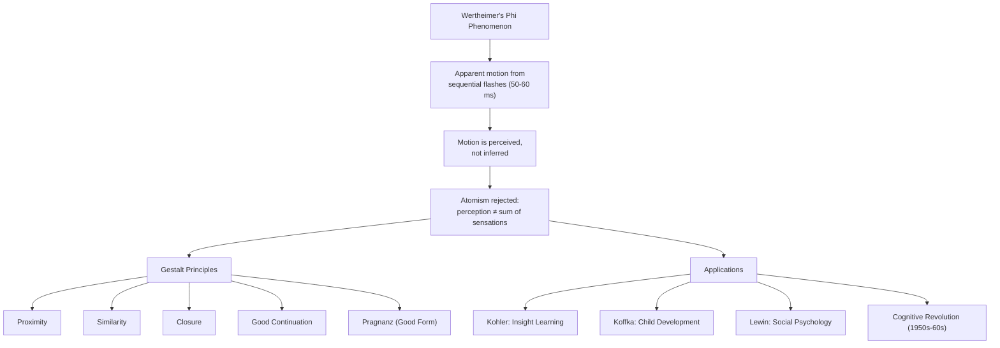

# Chapter 08 · Module 6
# The Whole Is Different From the Sum — Gestalt Psychology
## Psychology · Unit 1 · History of Psychology

---

In the summer of 1910, a psychologist named Max Wertheimer was on a train traveling through the German Rhine. Through the window, the Rhine valley unfolded — vineyards on steep hillsides, medieval castles perched on rocky outcrops, the river itself glinting in the afternoon sun. Wertheimer watched the telephone poles flick past the window, one after another, a rhythmic staccato against the slow drift of the mountains. And then he noticed something strange. The poles appeared to leap forward. The mountains appeared to slide backward. Neither was moving. The poles were fixed in the ground. The mountains were fixed to the earth. Only the train was moving. Yet his eyes saw motion — vivid, undeniable motion — in objects that were perfectly still.

Wertheimer set down his newspaper. He could not stop thinking about it. Why do we perceive motion when there is no motion? The poles are stationary. The train is moving. But the poles appear to move. The answer seemed obvious — and yet it was not. If perception were simply a matter of registering sensory atoms, as the empiricists had taught, then the poles should appear stationary. They were stationary. But they did not. Something in his brain was creating motion out of nothing.

Wertheimer abandoned his vacation. He got off the train at Frankfurt, rented a hotel room, and began experimenting with a stroboscope he bought at a local toy store. The next day, he visited the University of Frankfurt, where he consulted Friedrich Schumann, a former assistant to Müller. Schumann offered Wertheimer the use of his laboratory, including an improved tachistoscope. He also introduced Wertheimer to two of his colleagues: Wolfgang Köhler and Kurt Koffka.

Together, these three men would found the most influential school of psychology to emerge from Germany: Gestalt psychology. Their central claim was deceptively simple: the whole is different from the sum of its parts. Perception is not built from atoms. It is organized into wholes. And those wholes have properties that cannot be found in any of their components.

---

## The Phi Phenomenon

In Wertheimer's original experiments, he projected flashes of light successively through two horizontal slits onto a screen. At a projection rate of about 50–60 milliseconds, a single line of light appeared to move from one position to another. At higher rates, two lines appeared simultaneously; at lower rates, they appeared individually in succession.

Wertheimer called the impression of motion generated by alternative illumination at the middle projection range the **phi phenomenon**. He reported the results in his 1912 paper "Experimental Studies in the Visual Perception of Motion."

Wertheimer concluded that apparent motion is genuinely perceived, not inferred from discrete elements — challenging the empiricist accounts of Berkeley, Mill, and Helmholtz. He showed subjects still perceive apparent motion when fixating on a single point, and when illumination cycles are faster than eye movements could follow — ruling out the inference-from-eye-movements explanation.

According to Wertheimer, retinal input is processed directly by the brain to generate the perception of motion, via what he called "a kind of physiological short circuit" (*Kurzschluss*). Excitations in the brain become integrated into a "physiological whole-process" (*Gesamtprozess*).

This grounded the Gestalt thesis: perception is not "senseless additive combining." Elements of perception are not autonomous atoms but gain their identity from their relational location within perceptual configurations.

> [!TIP]
> **Stop and Think:** Watch a cartoon — any cartoon. The characters are not actually moving. They are a sequence of still images projected in rapid succession. Your brain creates the motion. The motion is not in the images. It is in the relationship between the images. This is the phi phenomenon — and it is happening every time you watch a screen.

*Figure: The phi phenomenon as the foundation of Gestalt psychology — from a single perceptual discovery to a revolution in how we understand the mind.*

---

## Ehrenfels and Form-Qualities

The basic principles of Gestalt psychology can be traced to Kant, who claimed that sensational elements are actively organized by the mind. The more immediate precursors were the physicist Ernst Mach and the psychologist Christian von Ehrenfels.

Mach claimed to have identified sensations of "space-form" and "time-form" that are independent of visual sensation. Ehrenfels, a student of Meinong's at the University of Graz, introduced the notion of **form-qualities** (*Gestaltqualität*) in 1890.

Ehrenfels illustrated his concept with a melody. The form-quality of a melody is not equivalent to the aggregate sum of its tonal elements. You can produce a different melody by rearranging the same tonal elements in a different order. You can produce the same melody by arranging different tonal elements (in a different key) in the original order. The form-quality is something "over and above" the sum of its sensational elements. It is an emergent configuration actively created by the organizational propensities of the mind.

But the Gestalt psychologists went further: sensational "elements" are artificial abstractions whose nature is relationally determined by their location within perceptual configurations. The Gestalt psychologists rejected all forms of psychological atomism and associationist psychology.

> [!TIP]
> **Stop and Think:** Listen to a familiar melody — "Happy Birthday," for example. Now hum the same melody in a different key. The notes are completely different. But the melody is the same. What makes it the same? Not the elements (the notes). The structure (the relationships between the notes). This is Ehrenfels's form-quality — and it challenges the entire empiricist tradition from Locke to Hume.

---

## Köhler: Insight Learning in Apes

Wolfgang Köhler (1887–1967) was perhaps the most effective advocate of Gestalt psychology. Born in Estonia and originally trained as a physicist with Max Planck, he took his PhD with Stumpf in 1909. In 1913, the Prussian Academy of Sciences invited him to serve as director of its anthropoid station in Tenerife.

During his years there, Köhler did pioneering research with chimpanzees, documented in *The Mentality of Apes* (1917). In one series of studies, chimpanzees demonstrated their ability to stack boxes to reach hanging bananas and to manipulate sticks of different lengths to access bananas placed outside their enclosure.

Köhler claimed that the chimpanzees' success was a product of **insight learning** — a creative form of learning that involves perceptual restructuring of the problem situation, in contrast to the mechanical "trial-and-error" learning attributed to animals by Morgan and Thorndike. Köhler maintained that chimpanzees engage in means-ends reasoning and that many animals are capable of perceiving relations.

In what Köhler called **transposition learning**, animals respond to similarities in relationships between stimuli rather than similarities between stimuli themselves. Chimpanzees trained to choose a 15-cm over a 10-cm disk, and subsequently presented with 15-cm and 20-cm disks, choose the larger 20-cm disk — they make relational rather than stimulus-specific responses.

Köhler also developed a neurophysiological theory modeled on physical field theory: brain force fields seek equilibrium; when disturbed, they become dynamic and strive to regain balance.

Köhler explained perception through **psychoneural isomorphism**: perceptual fields are structurally identical to the neural fields that produce them. Balanced neural input yields accurate perception; unbalanced input triggers reconfiguration.

This neural theory was entirely speculative. Köhler freely admitted that Gestalt psychologists were "not in the position to derive the respective physiological and phenomenal characteristics in individual cases." The rare experimental studies of neural field theory proved negative.

> [!TIP]
> **Stop and Think:** Köhler showed that chimpanzees could solve problems by insight — by suddenly seeing the solution rather than stumbling upon it through trial and error. Think about a time you solved a puzzle or problem not by trying different approaches but by suddenly seeing the answer. Was that insight? Or was it the result of unconscious trial and error happening below the threshold of awareness?

---

## Gestalt Principles: How the Mind Organizes Perception

The Gestalt psychologists identified several principles of perceptual organization: **Proximity** (adjacent elements group together), **Similarity** (like elements group together), **Good continuation** (elements in lines appear continuous), **Closure** (incomplete configurations are mentally completed), and the **law of Prägnanz** (input organizes into the most concise, ordered form possible).

These principles explained perceptual illusions that stumped empiricist accounts — ambiguous figures like the vase/faces or old woman/young woman could be understood as different figure-ground configurations.

Kurt Koffka extended Gestalt principles to child development in *The Growth of the Mind* (1924). Karl Duncker and Wertheimer developed them into a general theory of problem solving. Köhler extended them to memory. The underlying justification: all psychological processes are functions of dynamic brain forces involving tension displacement.

A good illustration was Bluma Zeigarnik's study of the memory of waiters. Zeigarnik studied with Kurt Lewin, a colleague of Köhler and Koffka at the Berlin Institute. Lewin noted that Berlin waiters remembered the details of a client's bill while it remained unpaid but immediately forgot them once the bill was paid. Zeigarnik explored this and found that interrupted and unfinished tasks tend to be remembered better than completed tasks — the **Zeigarnik effect**. Once payment is received, closure is achieved, dissipating tension and erasing memory.

> [!TIP]
> **Stop and Think:** The Zeigarnik effect says that unfinished tasks are remembered better than finished ones. Think about a TV show that ends on a cliffhanger. You cannot stop thinking about it. But once you see the resolution, the details fade quickly. Is this happening in your life right now — unfinished business that keeps intruding on your thoughts?

---

## The Legacy: Emigration and Influence

Many of the theoretical explanations offered by the Gestalt psychologists were highly speculative and undersupported by experimental data. Müller, Bühler, and members of the Leipzig school of Gestalt psychology were critical of the Berlin school's work. The members of the Graz school advanced an alternative account: that perceptual configurations are psychological products of preexisting sensational elements — not transformations of them.

The limited empirical support for Gestalt theories of perception cast doubt on their extension to other domains. Köhler's neurophysiological research at MIT did not provide empirical support for psychoneural isomorphism.

The Gestalt psychologists promoted their ideas with evangelical zeal, behaving like "intellectual missionaries, spreading a new gospel." They located Gestalt principles within a general holistic philosophical worldview. While accorded respect, they attracted few American disciples — partly because Wertheimer, Koffka, and Köhler all held positions at institutions without graduate programs in psychology (the New School, Smith College, and Swarthmore, respectively).

The Gestalt psychologists were also thoroughly mechanistic — Wertheimer, Köhler, and Koffka all insisted that psychological processes are wholly determined by automatic neural processes.

When the Nazis came to power, the Gestalt psychologists fled. Wertheimer emigrated in 1933, Köhler in 1935. Köhler had bravely criticized the Nazis and defended the Jews from his position of academic authority. He expected to be arrested at any time. He was not, but the authorities would not accept his resignation. He finally left when things became intolerable.

In America, the Gestalt psychologists never fully established their program. But their ideas — that perception is organized, that wholes have properties not found in parts, that cognition involves active structuring — became foundational for the cognitive revolution of the 1950s. When Ulric Neisser published *Cognitive Psychology* in 1967, he was building on insights that Wertheimer, Köhler, and Koffka had articulated half a century earlier.

> [!TIP]
> **Stop and Think:** Gestalt psychology was a German movement that was forced to emigrate to America by the Nazis. It never fully took hold in its new home. But its core ideas — that perception is organized, that the mind actively structures experience, that wholes are different from parts — became the foundation of cognitive psychology. How often do ideas survive the death of the movements that created them? Is the history of science a history of ideas, or a history of institutions?

> [!IMPORTANT]
> The Gestalt psychologists made a claim that seems simple but has profound implications: the whole is different from the sum of its parts. This is not just a principle of perception. It is a principle of explanation. If you want to understand a melody, you cannot analyze it note by note. If you want to understand a problem, you cannot solve it step by step. If you want to understand a mind, you cannot reduce it to its components. The whole has properties that the parts do not. And those properties are not mystical. They are products of organization — of the way the parts relate to each other. This insight, which originated in the study of perception, has been applied to everything from neuroscience to social psychology to artificial intelligence. It is, arguably, the most important idea to come out of German psychology.

---

## Speaking of Wholes, Parts, and Insight...

- A jazz musician in Seoul improvises over a chord progression. Each note is simple. But the solo — the pattern of notes, their relationships, their timing — has a quality that no single note possesses. This is Ehrenfels's form-quality, experienced in real time. The musician is not thinking about Gestalt psychology. She does not need to. The principle is operating whether she knows it or not.

- A software engineer in Lagos stares at a bug in his code for hours. He tries different fixes, line by line. Nothing works. Then he steps away, comes back, and sees the problem immediately — a structural error, not a line-by-line one. This is insight learning, happening in a cubicle instead of a cage.

- A child in São Paulo looks at a partially drawn circle and says "that's a circle." There is a gap. But her mind fills it in automatically. This is the principle of closure, operating without effort or instruction.

---

The Gestalt psychologists showed that the mind actively organizes perception into wholes. But psychology in Germany was not just about perception and cognition. It was also about application — about testing aptitude, training workers, educating children, and serving the state. The story of applied psychology in Germany is a story of innovation, ambition, and catastrophe. And it ends in the most unlikely of places: a concentration camp.

---

## References

1. Ash, M. G. (1995). *Gestalt psychology in German culture, 1890–1967: Holism and the quest for objectivity*. Cambridge: Cambridge University Press.
2. Köhler, W. (1917/1925). *The mentality of apes* (E. Winter, Trans.). New York: Harcourt, Brace.
3. Köhler, W. (1929). *Gestalt psychology*. New York: Liveright.
4. Wertheimer, M. (1912/1938). Experimental studies in the visual perception of motion. In W. D. Ellis (Ed.), *A source book of Gestalt psychology* (pp. 103–112). London: Routledge.
5. Zeigarnik, B. (1927). Über das Behalten von erledigten und unerledigten Handlungen [On the retention of completed and uncompleted tasks]. *Psychologische Forschung, 9*, 1–85.
