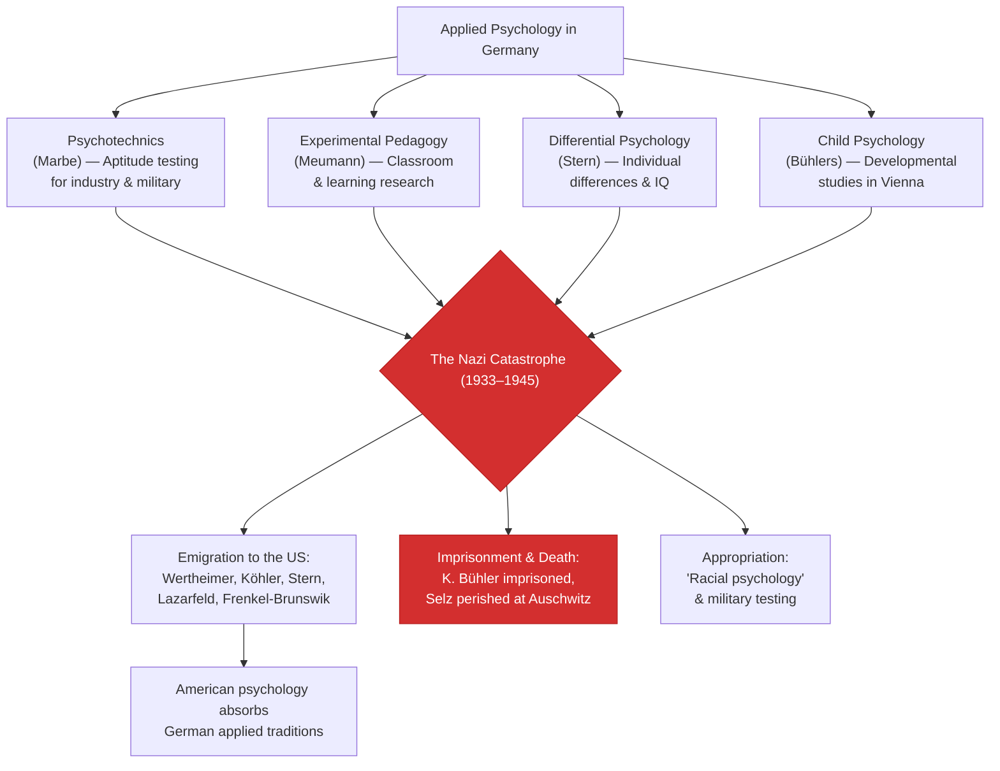

# Chapter 08 · Module 7
# Psychology Meets the World — Applied Psychology and the Nazi Catastrophe
## Psychology · Unit 1 · History of Psychology

---

The smell of fresh ink and warm printing press rollers filled the offices of the *Zeitschrift für angewandte Psychologie* in Berlin, where stacks of freshly bound journals were being packed into wooden crates for shipment to factories, schools, and military barracks across Germany. It was 1925, and something remarkable had happened: more publications in German psychology were devoted to applied topics than to "pure" or general psychology — by a ratio of two to one. The journals carried articles on worker fatigue in coal mines, aptitude tests for streetcar conductors, memory training for schoolchildren, and the psychology of advertising. Psychology had left the laboratory.

This was precisely what Wilhelm Wundt had feared. Before his death in 1920, the founder of experimental psychology had rejected the "American model" of separate psychology departments, warning that it would lead to an overemphasis on applied over theoretical psychology. He wanted psychology to remain a philosophical science — rigorous, contemplative, concerned with the nature of mind itself. But in Germany, in the restless decade after the First World War, no one was listening to Wundt's warnings anymore. The country needed practical solutions. Factories needed efficient workers. Courts needed reliable witnesses. Schools needed methods to sort children by ability. And the military — always the military — needed psychologists.

So psychology became a practical discipline. Karl Marbe tested train conductors for their aptitude to avoid accidents. Ernst Meumann brought experimental methods into the classroom. William Stern developed tests of individual differences and invented the mental quotient. Karl and Charlotte Bühler built a world-renowned institute for child psychology in Vienna, training a generation of researchers who would scatter across the globe when the storms came.

In lecture halls in Leipzig and Göttingen, the theoretical ambitions of Wundt, the experimental rigor of Müller, the philosophical depth of Brentano, the perceptual insights of the Gestalt psychologists — all of these gave way, slowly and then suddenly, to the demands of industry, education, and the state. And when the state became a totalitarian nightmare, psychology was drawn in. The journals that had been packed into wooden crates in 1925 would, within fifteen years, carry articles on "racial psychology" and military selection. The story of how psychology met the world is also the story of what happened when the world was not what anyone expected.

*Figure: The branches of German applied psychology — psychotechnics, experimental pedagogy, differential psychology, and child psychology — and how the Nazi catastrophe fractured each one, driving psychologists into exile, imprisonment, or death.*

---

## Psychotechnics: Testing for the Real World

Karl Marbe, who had studied with Wundt and Külpe, turned to the psychology of advertising and studied the psychology of accidents and industrial damage. He pioneered the development of **psychotechnics** — the application of psychological knowledge to practical problems, especially aptitude testing.

Marbe created aptitude tests for train conductors, insurance agents, prison guards, dentists, and surgeons. He played a major role in instituting the subdisciplines of school and forensic psychology. His work was driven by a simple question: can psychological science help select the right person for the right job?

The answer, it turned out, was sometimes yes. Aptitude testing became a major industry in Germany, and the methods Marbe developed were adopted by employers, military organizations, and educational institutions. Psychotechnics was, in many ways, the German version of American applied psychology — the same impulse to make psychology useful, to translate laboratory findings into practical tools.

> [!TIP]
> **Stop and Think:** Modern job interviews, aptitude tests, and personality assessments are descendants of psychotechnics. When you take an online personality test for a job application, you are participating in a tradition that began in Germany in the early 1900s. Are these tests fair? Do they measure what they claim to measure? Or do they measure something else — like your ability to take tests?

---

## Meumann: Experimental Pedagogy

Ernst Meumann (1862–1915), while serving as an assistant at Wundt's Leipzig Institute, directed work on educational psychology, which he called "experimental pedagogy." A progressive social and school reformer — like John Dewey and G. Stanley Hall in the United States — Meumann held posts in psychology and education at various universities.

Wundt thought Meumann an outstanding student, and they remained close friends, although Wundt withdrew his original support because of the limited number of publications that came out of Meumann's research. Meumann's *Introductory Lectures on Experimental Pedagogy* (1907) became a required text for generations of education students in Germany and was well received in North and South America and Russia.

Meumann founded *The Archives of Psychology* in 1903 and the *Journal of Experimental Education* in 1911. His studies of "social facilitation" in the classroom — the effect of other people's presence on individual performance — were later developed by Floyd Allport, one of the founders of American social psychology.

> [!TIP]
> **Stop and Think:** Meumann studied how the presence of other students affects learning. Modern research on "social facilitation" shows that the presence of others improves performance on easy tasks but impairs performance on hard ones. Have you ever studied better in a library (where others are working) than alone at home? Or worse? The answer may depend on how difficult the material is.

---

## William Stern: Differential Psychology and the Mental Quotient

William Stern (1871–1938), a former student of Ebbinghaus's, was committed to the application of psychological knowledge to industry, commerce, and education. He introduced the term **differential psychology** to characterize the study of individual differences — originally in the context of his pioneering studies of eyewitness testimony.

Stern's research on eyewitness testimony was motivated by a practical concern: how reliable are the memories of witnesses in court? He conducted systematic studies showing that memory is far less reliable than people assume — that witnesses routinely confabulate details, misremember sequences, and are influenced by the way questions are framed. This research had immediate implications for the legal system and anticipated decades of subsequent research on memory distortion.

Stern also introduced the notion of a **mental quotient** — defined as a child's mental age (determined by performance on the Binet-Simon test of intelligence) divided by its chronological age. This concept was later refined by Lewis Terman at Stanford into the Intelligence Quotient, or IQ.

Stern pioneered the development of personality psychology and had a special influence on Gordon Allport, the Harvard social psychologist and founder of personality theory in America. With his wife Clara, Stern published classic studies of child language and memory. His work was well received by American educators, and he accepted a position at Duke University in 1934, where he died suddenly in 1938.

> [!TIP]
> **Stop and Think:** Stern studied eyewitness testimony and found that memory is unreliable. Modern research has confirmed this — and led to reforms in how police lineups are conducted and how witness testimony is evaluated in court. Is this psychology? Or is it law? When psychology is applied to real-world problems, does it stop being psychology and become something else?

---

## The Vienna School: Karl and Charlotte Bühler

Karl Bühler (1879–1963), another of Külpe's students, founded the Psychological Institute at the University of Vienna in 1922. It became known for its rigorous experimental research and its productive association with the Institute of Education.

Karl was joined by his wife Charlotte Bühler (1893–1974) in 1923 — the first female instructor in Germany at Dresden Technical University. Charlotte established the Institute of Child Psychology and pioneered the use of naturalistic developmental studies at the Vienna Reception Center for Children, a children's shelter.

Famous students of the Vienna Institute included Paul Lazarfeld, the social psychologist and statistician; Else Frenkel-Brunswik, one of the coauthors of *The Authoritarian Personality*; and Karl Popper, the philosopher of science, whose PhD thesis on "The Genetic Theory of Intelligence" was examined by Bühler and Moritz Schlick, one of the founders of logical positivism.

Charlotte Bühler visited the United States on a Rockefeller Foundation Fellowship in 1924–1925 and managed to secure ten years of funding for the Vienna Institute from the Foundation. The Institute thrived until the Nazis annexed Austria in 1938.

> [!TIP]
> **Stop and Think:** Charlotte Bühler was the first female instructor in psychology in Germany. She founded a child psychology institute, secured Rockefeller funding, and trained a generation of researchers. Her husband Karl is the one who appears in textbooks. How many women in the history of psychology have been overshadowed by their husbands or male colleagues? Is this still happening?

---

## The Nazi Catastrophe

The story of German psychology does not have a happy ending.

After the First World War, experimental psychologists were no longer appointed to chairs in philosophy. Traditional philosophers recaptured the chairs at the universities of Bonn and Wroclaw. New positions were introduced for psychologists during the 1920s and 1930s, but these were almost exclusively at technical universities and institutes — not at the leading research universities.

In 1931, German psychologists organized their own petition for the establishment of separate chairs of psychology at leading German universities. The petition failed. Psychology in Germany was marginalized — too applied for the philosophers, too theoretical for the technocrats.

When the Nazis came to power, the situation became catastrophic. The philosophers who had opposed experimental psychology were often sympathetic to the regime. The psychologists who had built Germany's scientific tradition were disproportionately Jewish or politically liberal. They were removed from their positions, forced into exile, or murdered.

Many of the leading German psychologists fled to the United States — including Wertheimer, Köhler and Koffka, Lazarfeld, Frenkel-Brunswik, and William and Clara Stern. Others suffered at the hands of the Nazis. Karl Bühler was demoted, discharged, and imprisoned. The new director of the Vienna Institute introduced "racial psychology."

And Otto Selz — Külpe's student, the anticipator of 20th-century cognitive psychology, the man who had developed the most sophisticated theory of problem solving before the computer age — perished in the concentration camp at Auschwitz.

By this time, psychology in Germany had been appropriated by the military. The tradition of Wundt, Müller, Brentano, Stumpf, the Würzburg school, and the Gestalt psychologists — a tradition of scientific inquiry into the human mind that had flourished for half a century — was broken. It would not fully recover.

> [!TIP]
> **Stop and Think:** The Nazi catastrophe destroyed German psychology as a scientific tradition. The psychologists who survived did so by emigrating — mostly to the United States, where they shaped the development of American psychology. The psychologists who stayed were silenced, imprisoned, or killed. Is the history of science also a history of politics? Can science flourish under a totalitarian regime? Or is scientific freedom inseparable from political freedom?

> [!IMPORTANT]
> The story of psychology in Germany is a story of extraordinary achievement and extraordinary destruction. In less than a century, Germany produced Herbart's mathematical psychology, Wundt's experimental psychology, Ebbinghaus's memory research, Müller's psychophysics, Brentano's act psychology, the Würzburg school's cognitive psychology, and the Gestalt psychologists' perceptual psychology. It also produced the Nazi regime, which destroyed most of what had been built. The lesson is not that science is fragile. The lesson is that science exists within a political and social context — and when that context becomes hostile, no amount of scientific genius can protect the people who do the science. The ideas survive. The people often do not.

---

## Speaking of Applied Psychology and Catastrophe...

- A human resources manager in São Paulo uses personality tests to screen job candidates. The tests are descendants of Stern's differential psychology and Marbe's psychotechnics. She does not know their history. She does not need to. But she might want to ask: what assumptions about human nature are embedded in the tests she uses?

- A teacher in Lagos uses Stern's concept of mental age to assess her students' readiness for different levels of instruction. The concept has been refined into IQ testing, which has been both praised as a tool for educational equity and condemned as a tool for racial discrimination. The debate that began with Galton continues with Stern.

- A historian in Seoul reads about Otto Selz and thinks: "Here was a man who anticipated cognitive psychology by fifty years. He developed theories of problem solving that would not be rediscovered until the 1960s. And he died in Auschwitz." The historian closes the book and sits in silence for a while.

---

German psychology was broken by the Nazi catastrophe. But the ideas survived — carried to America by the emigrés, absorbed into the growing discipline of scientific psychology, and eventually reimported to Germany after the war. The next chapter tells the story of psychology in America — a story of rapid expansion, institutional growth, and the rise of behaviorism. But the foundations were laid in Germany, in the storerooms and laboratories of Leipzig, Göttingen, Berlin, Würzburg, and Frankfurt.

---

*[Module 7 of 7. This concludes Chapter 08: Psychology in Germany.]*

---

## References

1. Ash, M. G. (1980). Wilhelm Wundt and Oswald Külpe on the institutional status of psychology. In W. Bringmann & R. Tweney (Eds.), *Wundt studies* (pp. 396–415). Toronto: Hogrefe.
2. Geuter, U. (1992). *The professionalization of psychology in Nazi Germany*. Cambridge: Cambridge University Press.
3. Kusch, M. (1995). *Psychologism: A case study in the sociology of philosophical knowledge*. London: Routledge.
4. Stern, W. (1914). The psychological methods of testing intelligence. *Educational Psychology Monographs, 13*.
