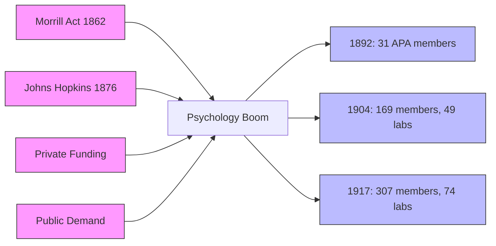

# Chapter 09 · Module 1
# The American Boom — How Psychology Conquered a Continent
## Psychology · Unit 1 · History of Psychology

---

In July 1892, a small group of men gathered at Clark University in Worcester, Massachusetts. There were 31 of them — professors, researchers, a few graduate students. They came from Johns Hopkins, Harvard, Yale, Cornell, Columbia, and a handful of other universities. They were there to found the American Psychological Association. G. Stanley Hall, the president of Clark University and the man who had created America's first psychology laboratory, presided.

The meeting had a distinctly German flavor. Many of the papers presented were on topics in physiological psychology — reaction times, sensory thresholds, psychophysical measurements. The methods were Wundt's methods. The language was Wundt's language. These were men who had studied in Leipzig, who had sat in Wundt's laboratory, who had learned to measure the mind with chronoscopes and tachistoscopes.

But something was already different. At the first annual meeting of the APA, held at the University of Pennsylvania in December 1892, the tone shifted. James McKeen Cattell and Lightner Witmer gave papers critical of psychophysics and mental chronometry. William Brian discussed the use of psychological tests in Indiana schools. Joseph Jastrow described the laboratory demonstrations he planned for the Chicago World's Fair. The Americans were not content to replicate what they had learned in Germany. They wanted to do something with it.

Within a decade, America had more and better laboratories than Germany. By 1904, there were 49 laboratories, 169 APA members, and 62 institutions offering three or more courses in psychology. Psychology ranked fourth in the sciences for PhDs awarded. By 1913, the year Watson published his behaviorist manifesto, America had surpassed Germany in research publications.

How did this happen so fast?

*Figure: Four institutional forces — the Morrill Act, Johns Hopkins, private funding, and public demand — converged to fuel the rapid expansion of American psychology from 31 APA members in 1892 to 307 members and 74 laboratories by 1917.*

---

## The American University System

The answer lies in the transformation of the American university system in the second half of the 19th century.

Prior to the Civil War, American colleges were small affairs devoted to training ministers and the intellectual elite. Harvard had fewer than 20 faculty in the 1850s. The curriculum centered on classics, mathematics, and logic as a means of fostering mental discipline. **Moral philosophy** — based on the Scottish common sense psychology of Reid and Stewart — was taught to seniors as the capstone of their liberal education. It affirmed the reliability of perception and intuition and maintained the traditional dualist distinction between immaterial mind and material body.

The **Morrill Act of 1862** changed everything. It promoted the development of state universities by awarding land and grants to state-founded institutions, especially in new technological areas such as mining, agriculture, and industry. Competition for resources and prestige between these state institutions — governed by boards of local businessmen and politicians — led to their inevitable expansion, including the offering of a wider range of academic subjects.

The founding of **Johns Hopkins University** in 1876 — the first exclusively graduate school in America — raised the stakes further. Modeled on the German research university, Johns Hopkins introduced lighter teaching loads, financial support for research, and graduate fellowships. Between 1876 and 1880, graduate enrollments at Harvard, Yale, and Cornell dropped precipitously. The older universities were forced to compete by refurbishing their graduate programs.

Charles Eliot, appointed president of Harvard in 1869, expanded the curriculum and introduced an elective system. When philosophy suffered, he allowed William James to introduce a course on the new physiological psychology. By 1878, Eliot had doubled the instructional staff, recruiting faculty on the basis of specialized qualifications rather than character and alumni status.

The University of Chicago, founded by John D. Rockefeller in 1890, used its financial muscle to raid other universities for talent and quickly became a center of excellence in psychology. Its distinguished psychologists included John Dewey, James Rowland Angell, John B. Watson, and George Herbert Mead.

> [!TIP]
> **Stop and Think:** The American university system was transformed by competition — between state universities, between private institutions, between old colleges and new ones. Psychology thrived because it was new, popular, and practical. Is the success of a scientific discipline always shaped by institutional forces? Or can a discipline succeed on its intellectual merits alone?

> [!TIP]
> **Stop and Think:** Scottish common sense psychology affirmed the reliability of perception — that we can trust our senses to give us accurate information about the world. Modern cognitive science has shown that perception is far more constructive and error-prone than Reid imagined. Optical illusions, change blindness, and false memories all demonstrate that what we perceive is not always what is there. Was Reid wrong? Or is perception reliable enough for everyday purposes, even if it is not perfect?

> [!TIP]
> **Stop and Think:** The Morrill Act created state universities funded by the government. Johns Hopkins was funded by a private financier. Chicago was funded by Rockefeller. Harvard was funded by tuition and endowments. Does the source of funding affect the kind of science that gets done? Would psychology have developed differently if it had been funded entirely by the government rather than by private donors?

---

## Scottish Common Sense and the Road to Pragmatism

American psychology did not emerge from a vacuum. It grew out of the tradition of **Scottish common sense psychology** — the philosophy of Thomas Reid and Dugald Stewart, which was imported to America by Presbyterian émigrés like James McCosh (president of Princeton) and Noah Porter (president of Yale).

Scottish common sense psychology was not antagonistic to science. On the contrary, its proponents were philosophical realists who argued that the immaterial mind can have genuine knowledge of the material world through veridical perception and scientific methods. By the late 19th century, scientific training — including the laboratory methods of the new psychology — came to be accepted as a legitimate alternative to the classics as a means of instilling mental discipline.

This philosophical openness created space for a new kind of psychology. And the philosophy that filled that space was **pragmatism** — the view that the adequacy of any theoretical system should be judged by its practical utility.

In the early 1870s at Harvard, William James organized informal meetings of the Metaphysical Society, devoted to philosophical problems of the day. The group included James, the philosophers Chauncey Wright and Charles Sanders Peirce, and the legal theorist Oliver Wendell Holmes. One significant outcome was the development of pragmatism.

Peirce was the first to develop the theory, which he called "pragmaticism." James successfully promoted it in *The Will to Believe* (1897), *Pragmatism* (1907), and *The Meaning of Truth* (1909). James developed a pragmatist theory of truth: a belief is true if it "works satisfactorily in the widest sense of the word." He really did mean the widest sense — a belief should be accepted as true if it satisfies our feelings or produces a beneficial effect.

Most American psychologists embraced pragmatism in the broad sense that theories should be judged by their practical utility. This philosophical commitment — that psychology should be useful, not just accurate — would shape the discipline for the next century.

> [!TIP]
> **Stop and Think:** Pragmatism says a theory is true if it works. Is this a good criterion for scientific truth? Newton's theory of gravity "worked" for two centuries — but it was superseded by Einstein's relativity. Can a theory work and still be wrong? Can a theory be true and not work?

---

## Why Psychology Succeeded in America

Several factors converged to make America uniquely hospitable to psychology.

The democratic culture and progressive social values of late-19th-century America made it fertile ground for new social sciences. Psychological questions were matters of common interest in the increasingly secular, industrial, and urban American culture. Phrenology and mesmerism had already demonstrated the public appetite for psychological knowledge.

American psychologists were not hesitant in the promotion of their new discipline. James, Hall, Dewey, and Cattell presented psychology as offering an applied science of human behavior with much to offer education, industry, and social reform. This practical orientation was distinctly American. European psychologists sought to establish psychology as a pure science. American psychologists wanted to use it.

The new private universities — Cornell, Chicago, Stanford, Clark — were effectively the creation of American capitalism. The emerging social scientific disciplines were, as one historian put it, "to an almost unhealthy degree the creatures of American capitalism" (Manicas, 1987). But this commercial connection gave psychology something it lacked in Germany: institutional support, funding, and a public that believed in its utility.

By 1917, there were 307 APA members (84 percent with a PhD), 74 laboratories, and psychology ranked among the leading sciences in America. The discipline had arrived.

> [!TIP]
> **Stop and Think:** Psychology succeeded in America partly because it was useful — to educators, to industry, to the military. But does usefulness drive good science? Or does it drive shortcuts, oversimplifications, and the abandonment of fundamental questions? Is there a tension between making psychology useful and making it true?

> [!IMPORTANT]
> The American university system created the conditions for psychology's explosive growth. Competition between institutions, the Morrill Act's expansion of higher education, the German research model imported by Johns Hopkins, and the philosophical openness of Scottish common sense and pragmatism — all of these converged to make America the new center of the psychological world. But the American version of psychology was different from the German original. It was more eclectic, more applied, more driven by practical utility. The Americans who studied with Wundt returned home with the experimental skeleton of the new psychology — but they dressed it in distinctly American clothes.

---

## Speaking of Institutions and Competition...

- A university administrator in Seoul decides to create a new department of data science because competing universities are doing it. She does not ask whether data science is a genuine discipline. She asks whether it will attract students and funding. This is exactly how psychology departments were created in 1890s America — driven by institutional competition, not intellectual necessity.

- A medical school in Lagos adds a psychology course to its curriculum because students are demanding it. The course is practical — focused on patient communication, mental health screening, and stress management. This is the American model of applied psychology, transplanted to a new context.

- A tech company in São Paulo hires an organizational psychologist to improve team performance. The psychologist uses personality assessments, feedback systems, and team-building exercises. She is, without knowing it, continuing the tradition of Walter Dill Scott — the man who first applied psychology to industry in the early 1900s.

---

The American university system created the stage. But the actors — the psychologists who built the discipline — were a remarkable collection of individuals. The most famous was William James: a failed artist, a suicidal philosopher, and the man who wrote the most influential psychology textbook of the 19th century. His story is the story of how American psychology found its voice.

---

## References

1. Fancher, R. E. (1996). *Pioneers of psychology* (3rd ed.). New York: Norton.
2. Manicas, P. T. (1987). *A history and philosophy of the social sciences*. Oxford: Blackwell.
3. O'Donnell, J. M. (1985). *The origins of behaviorism: American psychology, 1870–1920*. New York: New York University Press.
4. Richardson, R. D. (2006). *William James: In the maelstrom of American modernism*. Boston: Houghton Mifflin.
