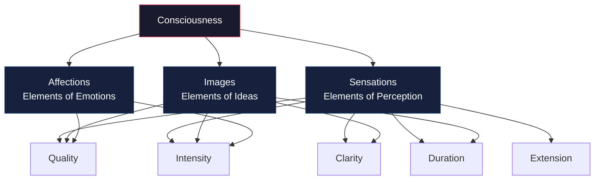

# Chapter 09 · Module 3
# Titchener's Laboratory — Structural Psychology and Its Limits
## Psychology · Unit 1 · History of Psychology

---

In 1890, a 23-year-old Englishman traveled to Leipzig to study with Wilhelm Wundt. His name was Edward Bradford Titchener, and he had just completed a degree in philosophy and classics at Oxford. He had read Wundt's *Principles of Physiological Psychology* and been captivated. He translated the third edition into English. Then Wundt produced the fourth edition. Titchener translated that too. Then Wundt produced the fifth.

Titchener spent two years at Leipzig and received his doctorate in 1892. He saw little of Wundt during his time there — they were not close — but Wundt's influence on him was enormous. When Frank Angell, an American student who had established the psychology laboratory at Cornell, accepted a position at Stanford, he recommended Titchener as his replacement. Titchener was also offered a job at Oxford. He recognized that psychology had no immediate future in Britain and accepted Cornell's offer.

He would spend the rest of his life there — building the largest doctoral program in psychology in America, creating a system of psychology called structuralism, and defending it with an authoritarian zeal that made him both legendary and isolated. He always lectured in his Oxford gown, which he claimed gave him the right to be dogmatic.

---

## Structural Psychology: The Atoms of Consciousness

Titchener's aim was to identify the atomistic constituents of conscious experience and determine the correlational laws of their combination. He called his psychology **structural psychology** — concerned with the basic *structure* of the mind: the conscious elements and their modes of combination.

He distinguished this from **functional psychology**, which he said was concerned with the *functions* of consciousness — what the mind does, rather than what the mind is. Titchener did not disparage functional psychology. He simply believed that structural psychology had priority. You need to know what the mind is made of before you can understand what it does.

Titchener identified the elements of consciousness as **sensations** (the elements of perception — sights, smells, tastes), **images** (the elements of ideas), and **affections** (the elements of emotions). In addition to Wundt's properties of quality and intensity, Titchener added clarity, duration, and extension. He claimed to have documented more than 44,435 distinct sensational elements — 32,820 visual and 11,600 auditory.

Most of the experimental studies conducted in the Cornell laboratory focused on the identification of these sensational elements. Some were directed toward more exotic targets. Experimental subjects reported on sensational and affective elements of urination and defecation (and sex, in the case of married students), while others reported on responses to hot and iced water ingested through a rubber tube they were required to swallow.

Titchener accounted for the organization of sensory elements into complex perceptual wholes by appeal to traditional principles of association — the "laws of connection of the elementary sensory processes." Where Wundt appealed to apperception and creative synthesis, Titchener maintained that association accounts for all psychological processes.

*Figure: Titchener's element system — consciousness decomposed into three fundamental element types (sensations, images, affections), each characterized by specific properties.*

> [!TIP]
> **Stop and Think:** Titchener claimed to have identified over 44,000 distinct sensational elements. Think about your experience of looking at a sunset. Can you identify individual elements — this shade of orange, that sensation of warmth, this particular feeling of beauty? Or is the experience unified — a single, indivisible whole that dissolves when you try to analyze it into parts?

---

## Systematic Experimental Introspection

Titchener's method was **systematic experimental introspection** — trained subjects providing detailed reports of their conscious experience under rigorously controlled experimental conditions. He followed Wundt's mantra of repetition, isolation, and variation: "an experiment is an observation that can be repeated, isolated and varied."

But Titchener's introspection was more invasive than Wundt's. His subjects were specially trained to avoid what he called the **stimulus error** — reporting the meaning of the sensory array or the real-world object of experience, rather than the pure contents of experience. For example, when reporting their experience of an apple, subjects were required to describe colors, tastes, and smells, but not the apple itself.

Titchener acknowledged an important difference between introspection and inspection:

> "If you try to report the changes in consciousness, while these changes are in progress, you interfere with consciousness; your translation of the mental experience into words introduces new factors into that experience itself."
> — Edward Titchener, *A Textbook of Psychology* (1910, pp. 21–22)

He suggested that one way of alleviating this problem was to delay reporting until after the process was complete — so that introspection became a form of retrospection. He also maintained that experienced subjects could overcome problems of interference:

> "The practised observer gets into an introspective habit, has the introspective attitude ingrained in his system."
> — Edward Titchener (1910, p. 23)

He conceived of the training of experimental subjects as analogous to the calibration of scientific instruments. Once properly trained, subjects found that accurate introspection became a largely mechanical process.

> [!TIP]
> **Stop and Think:** Titchener compared trained introspection to calibrating a scientific instrument. But instruments do not have biases, expectations, or motivations. Human observers do. Can introspection ever be as objective as a thermometer? Or is the comparison fundamentally misleading?

> [!TIP]
> **Stop and Think:** Titchener always lectured in his Oxford gown, which he claimed gave him the right to be dogmatic. His students smoked cigars because they believed he thought it was essential to being a good psychologist. These details seem trivial, but they reveal something about how scientific authority is constructed. How much of scientific credibility depends on personal charisma, ritual, and performance — rather than on evidence alone?

---

## The Imageless Thought Debate

Titchener's program came to methodological grief over the debate about **imageless thought**. At the University of Würzburg, Külpe and his associates had discovered that some subjects reported thoughts "without any trace of imagery" — states of consciousness that were not associated with any sensations or images. Binet in Paris and Woodworth in New York reported similar results.

Titchener took issue with these results. Between 1907 and 1915, he repeated the Würzburg experiments with his own students at Cornell. He claimed that in all cases, subtle sensations and images could be identified by "properly trained observers" in controlled experiments.

The debate revealed a fundamental problem. The Würzburg and Cornell laboratories produced consistently different results. Titchener treated the ability to report images for thoughts as the criterion of a "properly trained observer" and dismissed the recalcitrant results of other laboratories as due to subject naiveté or insufficient training.

This naturally led to the suggestion that Titchener's "reagents" were subject to a form of experimenter bias. Ogden (1911) attributed the different results to "unconscious bias" due to the different forms of training that subjects received. He also suggested that if Wundt's critique of the Würzburg method was sound, it could be generalized to all methods of introspection — including Titchener's own.

Many psychologists concluded that the imageless-thought debate was incapable of empirical resolution by appeal to introspective reports. If two laboratories, using trained observers and controlled conditions, produce consistently different results, then introspection cannot serve as the objective method that Titchener claimed it was.

> [!TIP]
> **Stop and Think:** The imageless-thought debate pitted two laboratories against each other, each producing different results from the same experiments. Titchener said the Würzburg subjects were poorly trained. The Würzburg psychologists said Titchener's subjects were biased by their training. Who was right? Can you design an experiment that would settle the question? Or is the problem that introspection — by its very nature — cannot produce the kind of intersubjective agreement that science requires?

---

## The Experimentalists and the Eclipse of Structural Psychology

Titchener was a charter member of the APA but never attended its meetings. He resigned in 1904 and founded his own group — the **Experimentalists** — as a more scientifically rigorous alternative. He ran this group in the same authoritarian fashion as he ran his PhD program, determining legitimate topics and attendance.

Women were excluded during Titchener's lifetime. Female faculty from Bryn Mawr College were "promptly turned out" when they tried to attend the 1907 meeting. Christine Ladd-Franklin waged a long campaign to have women admitted. When Titchener defended his exclusion by appeal to the need for critical discussion and cigar smoking, she responded that she was as critical as any man and enjoyed cigars as much as any man.

Titchener dominated American experimental psychology during his lifetime. But he became increasingly isolated in the first two decades of the 20th century. Critics raised doubts about the utility of introspective methods. By the time Watson launched his famous attack on introspection in 1913, he was preaching to a largely converted audience.

When Titchener died of a brain tumor in 1927, at the age of 60, structural psychology died with him. The Experimentalists continued to meet, but they no longer restricted their research topics or their membership to men. Madison Bentley, who took over the Cornell department, transformed it by introducing new specialties such as educational and clinical psychology.

By 1898, only about 2 percent of published experimental studies in psychology employed introspection, and only about half employed adult human subjects. The theoretical and methodological debate about introspection had lagged behind experimental practice. American psychology had already moved on.

> [!TIP]
> **Stop and Think:** Titchener's structural psychology died with him. But his contribution was not nothing. His laboratory manuals were the standard for experimental psychology courses for 20 years. He trained many of the psychologists who would shape the next generation. He instilled a respect for scientific rigor that survived even the rejection of his theoretical system. Can a psychologist's methods outlive their theories? Can rigor be valuable even when the specific science it serves is wrong?

> [!IMPORTANT]
> Titchener's structural psychology was the most rigorous attempt to analyze consciousness into its elements. It failed — not because the ambition was wrong, but because the method was insufficient. Introspection, no matter how carefully trained, could not produce the intersubjective agreement that science requires. The imageless-thought debate demonstrated this beyond reasonable doubt. But the lesson was not that consciousness should be abandoned as a subject of study. The lesson was that consciousness needed to be studied by other means. The next generation would try — with behaviorism, with cognitive science, with neuroscience. The question Titchener raised — what is the structure of the mind? — has never been fully answered.

---

## Speaking of Introspection and Its Limits...

- A meditation practitioner in Seoul reports that her thoughts have no images — they are pure "knowings" without visual content. This is exactly what the Würzburg psychologists reported. Titchener would have said she was not introspecting carefully enough. The meditation practitioner would say Titchener was not listening carefully enough.

- A psychologist in Lagos asks her patients to describe their anxiety. Some say "I feel tightness in my chest." Others say "I just know something is wrong." The first group is reporting physical sensations. The second is reporting something that sounds like imageless thought. The distinction matters for treatment — but can it be measured objectively?

- A neuroscience student in São Paulo reads about Titchener and thinks: "He was trying to do with introspection what we now do with fMRI — identify the components of mental experience." The tools have changed. The ambition has not. Are fMRI scans more objective than introspection? Or do they just replace one form of interpretation with another?

---

Titchener had tried to make psychology a pure science — a rigorous analysis of consciousness into its elements. But American psychology was pulling in the opposite direction: toward application, toward utility, toward the practical problems of education, industry, and clinical care. The psychologists who built these applied traditions — Hall, Cattell, Witmer, Scott — were not interested in the atoms of consciousness. They were interested in what psychology could do.

---

## References

1. Blumenthal, A. L. (1975). A reappraisal of Wilhelm Wundt. *American Psychologist, 30*(11), 1081–1088.
2. Titchener, E. B. (1898b). The postulates of a structural psychology. *Philosophical Review, 7*, 449–465.
3. Titchener, E. B. (1910). *A textbook of psychology*. New York: Macmillan.
4. Tweney, R. D. (1987). Programmatic research in experimental psychology: E. B. Titchener's laboratory, 1893–1905. In M. G. Ash & W. R. Woodward (Eds.), *Psychology in twentieth-century thought and society* (pp. 33–57). Cambridge: Cambridge University Press.
