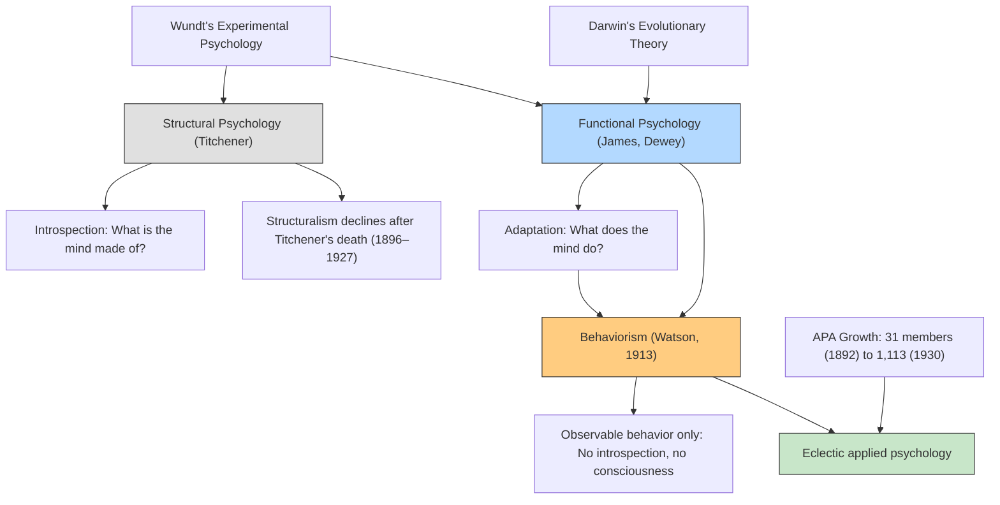

# Chapter 09 · Module 5
# The Fight for Psychology's Soul — Structure vs. Function
## Psychology · Unit 1 · History of Psychology

---

In 1896, a 37-year-old professor at the University of Chicago published a paper that would change the direction of American psychology. His name was John Dewey, and the paper was called "The Reflex Arc Concept in Psychology." It was short — barely fifteen pages — and its argument was deceptively simple. But it struck at the foundations of everything Titchener was building at Cornell.

Dewey argued that the reflex arc — the basic unit of psychological explanation since Descartes — was a mistake. Not because reflexes do not exist, but because the idea of a reflex as a chain of discrete, separable events (stimulus → central process → response) misrepresents how the mind actually works. In real life, there are no pure stimuli. What counts as a stimulus depends on what the organism is already doing. What counts as a response depends on what the organism is trying to achieve. The mind is not a machine that processes inputs and generates outputs. It is an active, purposeful, continuously adapting system.

This was the beginning of **functionalism** — the view that psychology should study what the mind *does*, not what the mind *is*. And it set the stage for the most radical transformation in the history of psychology: the rise of behaviorism.

---

## Structural vs. Functional Psychology

Titchener had drawn the distinction clearly. **Structural psychology** asks: what are the elements of consciousness? What is the mind made of? **Functional psychology** asks: what does consciousness do? What is it for?

Titchener believed that structural psychology had priority. You need to know what the mind is before you can understand what it does. But the Americans disagreed. They were pragmatists. They wanted to know what the mind was *for*.

The functionalists did not form a single, unified school. They were a loose collection of thinkers — James, Dewey, Angell, Carr, Woodworth — who shared a common orientation. They were influenced by Darwin's theory of evolution, which suggested that mental capacities exist because they serve a function — because they help organisms adapt to their environments. Consciousness is not a passive mirror reflecting the world. It is an active tool for navigating it.

*Figure: The evolution from Wundt's experimental psychology through the structural–functional debate to the rise of behaviorism and the eclecticism of the APA.*

> [!TIP]
> **Stop and Think:** Is the mind more like a camera (passively recording what is there) or more like a flashlight (actively selecting what to attend to)? The structuralists tended toward the camera metaphor. The functionalists tended toward the flashlight. Which metaphor better captures your own experience of consciousness?

---

## Dewey and the Reflex Arc

John Dewey (1859–1952) was one of Hall's first doctoral students at Johns Hopkins. He went on to build the psychology department at the University of Chicago into one of the most dynamic in the country. His 1896 paper, "The Reflex Arc Concept in Psychology," was the founding document of functionalism.

Dewey's argument was elegant. Consider a child who sees a candle and reaches for it. The traditional reflex arc analysis says: the candle is the stimulus, the reaching is the response, and the burning sensation is a new stimulus that triggers a new response (pulling away). But Dewey pointed out that this analysis is artificial. The child does not passively receive the visual stimulus of the candle. The child is already active — already exploring, already reaching. What counts as a "stimulus" is determined by the child's ongoing activity. The visual experience of the candle is not a separate event that causes the reaching. It is part of a continuous, integrated process of exploration, contact, pain, and withdrawal.

Dewey argued that the reflex arc concept breaks down a continuous process into artificial, discrete elements. The mind does not work in chains of stimulus-response links. It works as a continuous, integrated, purposeful system.

This was a direct challenge to both Titchener's structural psychology (which analyzed consciousness into elements) and the reflex-based physiology that underpinned much of experimental psychology. It was also a direct precursor of the ecological psychology of J. J. Gibson and the embodied cognition movement of the late 20th century.

> [!TIP]
> **Stop and Think:** Dewey argued that the stimulus-response chain is an artificial abstraction. Think about a conversation. Is your interlocutor's words a "stimulus" that causes your "response"? Or is the conversation a continuous, collaborative process in which each utterance is shaped by what came before and what you expect to come after? Does the stimulus-response model capture the reality of human interaction?

---

## Angell and the Chicago School

James Rowland Angell (1869–1949) was another of Hall's students who became a leading functionalist. He built the psychology department at Chicago into the center of the functionalist movement. His *Psychology: An Introductory Study* (1904) was one of the most widely used textbooks of the era.

Angell defined functional psychology as the study of the mind's operations — how it perceives, remembers, thinks, and acts — rather than its contents. He argued that psychology should be an applied science, useful for education, industry, and social reform. He emphasized the role of habit in adaptive behavior and the importance of studying psychology in natural settings, not just laboratories.

The Chicago school — Dewey, Angell, Carr, Watson, Mead — was the intellectual home of functionalism. It was also the birthplace of behaviorism. John B. Watson, who would launch the behaviorist revolution in 1913, was a product of the Chicago school. His rejection of introspection and his insistence that psychology should study observable behavior were, in many ways, a logical extension of the functionalist emphasis on what the mind *does*.

> [!TIP]
> **Stop and Think:** Angell argued that psychology should be an applied science. Titchener argued that it should be a pure science. This debate — between pure and applied, between understanding and utility — has never been settled. Is psychology more valuable when it advances fundamental knowledge, or when it solves practical problems? Can it do both?

---

## Watson and the Behaviorist Manifesto

In 1913, John B. Watson published "Psychology as the Behaviorist Views It" in *Psychological Review*. It was, in effect, a declaration of war on introspection, consciousness, and the entire tradition of structural psychology.

Watson argued that psychology should abandon the study of consciousness entirely. It should study only observable behavior. Introspection is not a scientific method. Consciousness is not a scientific concept. The mind — whatever it is — is not accessible to objective observation. Behavior is.

Watson's argument was not entirely new. Morgan's canon had cautioned against attributing complex mental states to animals when simpler explanations would suffice. The sensory-motor theory had argued that all nervous system functions are reflexive. Sechenov had claimed that thought is the first two-thirds of a reflex. Watson simply extended these principles to all of psychology — animal and human alike.

Watson was preaching to a largely converted audience. By 1913, only about 2 percent of published experimental studies employed introspection. Titchener's structural psychology was already in decline. The functionalists had opened the door to studying what the mind does. Watson walked through it and said: forget the mind. Study the behavior.

> [!TIP]
> **Stop and Think:** Watson argued that psychology should study only observable behavior. Is this a reasonable restriction? Think about your own mental life — your thoughts, feelings, daydreams, anxieties. Are these real? Can they be studied scientifically? Or are they — as Watson claimed — irrelevant to a science of behavior?

---

## The APA and the Triumph of Eclecticism

The APA grew from 31 charter members in 1892 to 228 in 1910 and 1,113 by 1930. It went through a lean period when the philosophers broke away to found their own professional association, and when Titchener's formation of the Experimentalists drew away some of the more experimentally oriented members. But by the 1920s, the APA was a large, diverse, and increasingly applied organization.

The 12th annual meeting of the APA in 1902, held in a school hall in Princeton, was poorly attended — only 12 papers delivered. But by 1910, the membership had expanded dramatically, and the meetings reflected the growing eclecticism and applied orientation of American psychology. Papers on psychophysics and reaction time were joined by papers on educational testing, clinical diagnosis, industrial efficiency, and child development.

This eclecticism was both a strength and a weakness. It allowed American psychology to grow rapidly, absorbing new topics, methods, and applications. But it also meant that psychology lacked a coherent identity. Was it a natural science? A social science? A helping profession? An applied technology? These questions would define the discipline for the rest of the 20th century.

Titchener feared that applied psychology would dilute and displace the scientific core of the discipline. He was, in a sense, right. By 1930, most American psychologists were not working in laboratories studying the elements of consciousness. They were testing intelligence, counseling patients, advising industry, and educating children. The scientific core survived — but it was no longer the center of the discipline.

> [!TIP]
> **Stop and Think:** The APA grew from 31 members in 1892 to over 1,100 by 1930. Today, it has over 100,000. What does this growth mean for the discipline? Is a larger organization a stronger one? Or does size dilute quality, coherence, and intellectual rigor?

> [!IMPORTANT]
> The fight for psychology's soul — structure versus function, pure science versus applied science, consciousness versus behavior — was not resolved by a single victory. It was resolved by a shift in the center of gravity. American psychology moved from the laboratory to the clinic, from the analysis of consciousness to the prediction of behavior, from the pursuit of knowledge to the pursuit of utility. Titchener's structural psychology died with him. James's functionalism evolved into behaviorism. And the APA grew into a vast, diverse, eclectic organization that included experimentalists, clinicians, educators, industrial psychologists, and social reformers. The Americans who studied with Wundt returned home with the experimental skeleton of the new psychology. What they built with it was something Wundt never imagined — and would probably not have approved of.

---

## Speaking of Functions, Behaviors, and Growth...

- A UX researcher in Seoul studies how users interact with a mobile app. She does not ask what users think or feel. She observes what they do — where they tap, how long they hesitate, when they abandon a task. This is Watson's behaviorism, applied to technology design. The user's consciousness is irrelevant. The behavior is the data.

- A teacher in Lagos uses behavioral techniques to manage her classroom — rewarding good behavior, ignoring minor disruptions, using clear and consistent consequences. She has never read Watson or Skinner. But she is applying their principles. The children's inner lives are not her concern. Their behavior is.

- A psychologist in São Paulo argues that both approaches are needed. "You can't help someone without understanding their inner experience," she says. "But you also can't help them without observing their behavior." She is trying to bridge the gap that Titchener and Watson opened — between the mind and the behavior, between the structure and the function.

---

The story of psychology in America is a story of explosive growth, institutional ambition, and theoretical conflict. The Americans who studied with Wundt returned home and built something new — not a replica of German experimental psychology, but a distinctly American discipline: eclectic, applied, practical, and constantly changing. The next chapter will show how this American psychology developed further — through functionalism, behaviorism, and the rise of mental testing. But the foundations were laid in the period covered here: the university system, the APA, the laboratories, the clinics, and the great debate between structure and function.

---

*[Module 5 of 5. This concludes Chapter 09: Psychology in America — The Early Years.]*

---

## References

1. Angell, J. R. (1904). *Psychology: An introductory study*. New York: Holt.
2. Dewey, J. (1896). The reflex arc concept in psychology. *Psychological Review, 3*, 357–370.
3. Watson, J. B. (1913). Psychology as the behaviorist views it. *Psychological Review, 20*, 158–177.
4. O'Donnell, J. M. (1985). *The origins of behaviorism: American psychology, 1870–1920*. New York: New York University Press.
