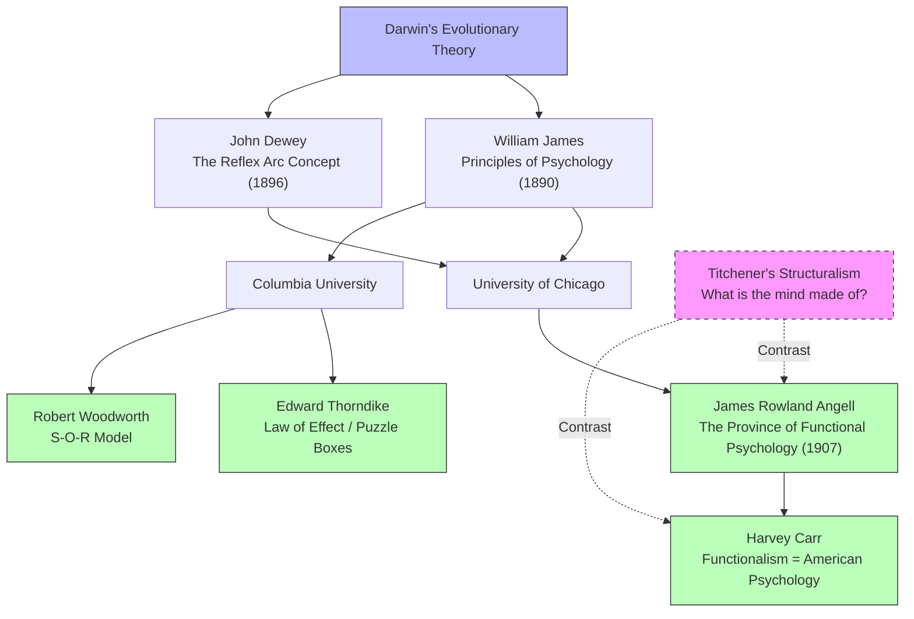

# Chapter 10 · Module 1
# The Functional Revolution — Psychology Learns to Be Useful
## Psychology · Unit 1 · History of Psychology

---

In 1909, John B. Watson wrote a letter to his friend Robert Yerkes that would have horrified Wilhelm Wundt. Watson was in debt. He needed money. He had decided to write a textbook — not because he had a grand theory to present, but because, as he put it, "I am in debt and I've got to get out." The textbook needed a theme, something popular, something that would sell. Watson chose behaviorism.

This is not how the history of science is supposed to work. Great ideas are supposed to emerge from brilliant insights, from years of careful research, from the pursuit of truth for its own sake. They are not supposed to emerge from a young professor's need to pay his rent. But the history of psychology in early-20th-century America is full of such mundane origins. The psychologists who built the discipline were not just pursuing knowledge. They were pursuing careers. And the career opportunities were in applied work — in education, industry, clinical practice, and mental testing.

The turn to applied psychology was driven by practical necessity as much as intellectual conviction. By the end of the 19th century, the supply of PhD-certified psychologists exceeded the demand of academic departments. New graduates were obliged to seek positions in education, industry, and clinical work if they wished to continue in psychology. Hall's Clark graduates — including most of those in animal psychology — secured positions in education, as professors of pedagogy, educational testers, or heads of normal schools.

The turn to application was also driven by the public demand for psychological services. In the 1850s, railroad companies had considered using phrenologists to select trainmen. By the early 20th century, Münsterberg was consulting for urban electric railway companies. The demand for mental tests in education and industry was growing rapidly.

And there was another, less noble reason: the flight from teaching overload. Assistant professors in psychology were required to teach a wide variety of courses — psychology, logic, history of philosophy, ethics, aesthetics, and pedagogy. Harry Levi Hollingworth, who taught every available course at Columbia, Teachers College, and Barnard, claimed that he "became an applied psychologist in order to earn a living."

---

## Functional Psychology: What the Mind Does

The "school" of functional psychology was associated with the University of Chicago and Columbia University. It was, in a very real sense, the intellectual creation of Titchener, who distinguished between his own structural psychology (concerned with the elements of consciousness) and functional psychology (concerned with the functions of consciousness).

James Rowland Angell and Harvey Carr, the acknowledged leaders of the movement, insisted that functional psychology was not committed to any distinctive theoretical or methodological position. Angell claimed it merely aimed to broaden the scope of psychology beyond Titchener's structuralism. Carr maintained that it was equivalent to American psychology — defined by its dual emphasis on scientific rigor and practical application.

Although functional psychology was officially defined in contrast to Titchener's structuralism, it was remarkably Wundtian in orientation, given its emphasis on the active, creative, and purposive role of consciousness in the generation and control of adaptive behavior. Functional psychologists recognized the need for a socially useful psychology but remained tied to the earlier philosophical tradition of James, Ladd, and Hall.

*Figure: The functional psychology movement emerged from Darwinian evolutionary thought, splitting into two major branches at Chicago (Dewey, Angell, Carr) and Columbia (Thorndike, Woodworth). Dashed lines show the contrast with Titchener's structuralism, which functionalism defined itself against.*

> [!TIP]
> **Stop and Think:** Functional psychology was defined in opposition to structural psychology — function versus structure, what the mind does versus what the mind is. But can you really separate these? If you do not know what the mind is made of, can you know what it does? If you do not know what it does, can you know what it is made of? Is the distinction between structure and function as clean as Titchener and Angell made it seem?

---

## Angell: The Province of Functional Psychology

James Rowland Angell (1869–1949) took over from Dewey as head of the psychology department at the University of Chicago. He provided the most influential statement of functionalist principles in his 1907 presidential address to the APA, "The Province of Functional Psychology."

Angell claimed that functional psychology was concerned with the **utilities of consciousness** — the role of consciousness in the generation and control of adaptive behavior. Where Titchener asked "what are the elements of consciousness?" Angell asked "what does consciousness do?"

Angell claimed that the primary focus of functional psychology was on the role of consciousness in helping organisms adapt to their environments. This was a Darwinian insight: mental capacities exist because they serve a function. Consciousness is not a passive mirror. It is an active tool.

When Angell left Chicago in 1921 to become president of Yale, he handed leadership of the functionalist movement to Harvey Carr. Carr maintained essentially the same position and claimed that functional psychology was so eclectic that it was equivalent to American psychology. He treated other schools — structuralism, psychoanalysis, Gestalt psychology, behaviorism — as merely exaggerated developments of one aspect of functional psychology.

> [!TIP]
> **Stop and Think:** Angell argued that consciousness has utilities — that it serves a function. Modern neuroscience has shown that much of our behavior is controlled by unconscious processes. If consciousness is not necessary for many behaviors, what is it for? Is consciousness a tool, a byproduct, or something else entirely?

> [!TIP]
> **Stop and Think:** Carr claimed that functional psychology was so eclectic that it was equivalent to American psychology. Is eclecticism a strength or a weakness? A discipline that embraces everything risks having no identity. A discipline that rejects everything risks being irrelevant. Where is the balance?

---

## Thorndike: The Law of Effect

Edward L. Thorndike (1874–1949) was a former student of Cattell's at Columbia who conducted some of the most influential experiments in the history of psychology. He put cats in puzzle boxes — slatted cages with latches that could be opened to escape and receive a food reward.

The cats initially responded in a random fashion — clawing, biting, sniffing, pushing. Eventually, they hit upon the movement required to release the latch. On subsequent trials, they exhibited less random behavior until they learned the required response. Thorndike measured the decreased time and decreased number of errors over trials.

Thorndike claimed that learning was incremental — not a spontaneous act of insight or reasoning. Successful responses were "stamped in" and unsuccessful responses "stamped out." He characterized this process as the **law of effect**:

> "Of several responses made to the same situation, those which are accompanied or closely followed by satisfaction to the animal will, other things being equal, be more firmly connected with the situation."
> — Edward Thorndike, *Animal Intelligence* (1911, p. 244)

Thorndike supplemented this with the **law of exercise**: responses connected with a situation more frequently and more vigorously become more strongly connected. His theory of learning, which he called **connectionism**, appealed to traditional principles of association based on contiguity and repetition — but focused on associations between behavior and its consequences rather than associations between ideas.

> [!TIP]
> **Stop and Think:** Thorndike's law of effect says that behaviors followed by satisfaction are strengthened. Think about a habit you have developed — checking your phone, biting your nails, going for a run. Was the habit shaped by its consequences? Did the satisfying outcomes strengthen some behaviors and the unpleasant outcomes weaken others? Is all learning reducible to the law of effect?

---

## Woodworth: The S-O-R Model

Robert Sessions Woodworth (1869–1962) was another of Cattell's students who promoted functionalist forms of psychology at Columbia. He strenuously objected to being identified with any school of psychology and published *Contemporary Schools of Psychology* in 1931, which included chapters on structural psychology, functional psychology, behaviorism, Gestalt psychology, and psychoanalysis — but refused to treat any as the definitive school.

Woodworth proposed the **S-O-R model** — stimulus-organism-response — as an alternative to the simple S-R (stimulus-response) model. Between the stimulus and the response, there is an organism — a living, active, purposeful system that processes information, makes decisions, and generates behavior. This was a direct challenge to Watson's behaviorism, which tried to explain behavior without reference to internal processes.

Woodworth's S-O-R model was a bridge between functionalism and the cognitive psychology that would emerge decades later. It acknowledged that behavior is shaped by environmental stimuli but insisted that what happens inside the organism matters.

> "Every school is good, though no one is good enough. No one of them has the full vision of the psychology of the future."
> — Robert Woodworth, *Contemporary Schools of Psychology* (1931, p. 255)

> [!TIP]
> **Stop and Think:** Woodworth argued that between stimulus and response, there is an organism. This seems obvious. But Watson's behaviorism tried to eliminate the organism — to explain behavior purely in terms of stimulus-response connections. Can you explain human behavior without reference to what is happening inside the person? What would be lost?

> [!IMPORTANT]
> Functional psychology was not a single theory. It was an orientation — a commitment to studying what the mind does rather than what it is. Angell defined it. Carr generalized it. Thorndike operationalized it with puzzle boxes and the law of effect. Woodworth formalized it with the S-O-R model. Together, they laid the groundwork for the most radical transformation in the history of psychology: the replacement of consciousness with behavior as the central concept of the discipline. The functionalists opened the door. Watson walked through it.

---

## Speaking of Functions, Effects, and Organisms...

- A teacher in Lagos uses a reward system — stickers for good behavior, extra recess for completed work. She is applying Thorndike's law of effect without knowing it. Behaviors followed by satisfaction are repeated. Behaviors followed by displeasure are not.

- A UX designer in Seoul tests two versions of a website button — one red, one blue. She measures which version gets more clicks. She is doing functional psychology: studying what works, not what the user thinks or feels. The function of the button is to get clicked. The structure of the user's consciousness is irrelevant.

- A parent in São Paulo notices that their toddler throws food on the floor when they want attention. The parent ignores the behavior, and it decreases. The parent gives attention when the child uses words, and the behavior increases. This is the law of effect, operating in real time. Thorndike would have recognized it instantly.

---

The functionalists had opened the door to studying what the mind does. But a young psychologist at Johns Hopkins was about to walk through that door and slam it shut behind him. John B. Watson would argue that the mind itself is irrelevant — that psychology should study only observable behavior. His argument was not entirely new. But his timing, his rhetoric, and his ambition were.

---

## References

1. Angell, J. R. (1907). The province of functional psychology. *Psychological Review, 14*, 61–91.
2. Carr, H. A. (1925). *Psychology: A study of mental activity*. New York: Longmans.
3. Joncich, G. (1968). *The sane positivist: A biography of Edward L. Thorndike*. Middletown, CT: Wesleyan University Press.
4. Thorndike, E. L. (1911). *Animal intelligence*. New York: Macmillan.
5. Woodworth, R. S. (1931). *Contemporary schools of psychology*. New York: Ronald Press.
