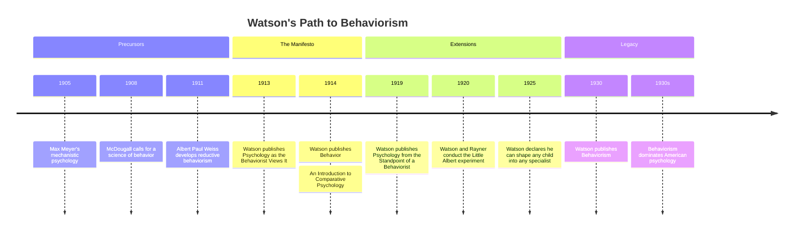

# Chapter 10 · Module 2
# Watson's Manifesto — The Birth of Behaviorism
## Psychology · Unit 1 · History of Psychology

---

In 1913, a 35-year-old professor at Johns Hopkins University published a paper in *Psychological Review* that declared war on the entire tradition of introspective psychology. The paper was called "Psychology as the Behaviorist Views It," and its author was John Broadus Watson. The paper was not subtle. It was not cautious. It was a manifesto.

Watson argued that psychology should abandon the study of consciousness entirely. It should study only observable behavior. Introspection is not a scientific method. Consciousness is not a scientific concept. The mind — whatever it is — is not accessible to objective observation. Behavior is.

The paper was not entirely original. Max Meyer had advanced a similar position in 1911. Albert Paul Weiss had developed a radically reductive behaviorism. William McDougall had called for a "positive science of conduct and behavior" in 1908. The conceptual foundations had been laid by the new realist philosophers at Harvard and Pennsylvania.

But Watson's timing was perfect. By 1913, most psychologists had already abandoned introspection in practice. The imageless-thought debate had discredited Titchener's methods. Applied psychologists had no use for introspection. Watson was preaching to a largely converted audience. And he preached with style.

Watson's own motivation was, by his own admission, partly financial. He told his friend Robert Yerkes that he was writing a textbook "largely for money" because "I am in debt and I've got to get out." Behaviorism was, at least in part, a marketing strategy.

---

## Watson's Three Reasons

Watson gave three reasons for rejecting introspective psychology.

His first reason was the irrelevance of consciousness to animal psychology. He argued that speculation about the minds of animals has no theoretical or practical value:

> "One can assume either the presence or the absence of consciousness anywhere in the phylogenetic scale without affecting the problems of behavior by one jot or one tittle."
> — John B. Watson, "Psychology as the Behaviorist Views It" (1913a, p. 161)

He generalized this conclusion to human behavior: "The behavior of man and the behavior of animals must be considered on the same plane."

His second reason was the failure of structural psychology. He cited the lack of inter- and intrasubject agreement with respect to introspection, including the imageless-thought debate. These were fair criticisms, but insufficient grounds for the rejection of all theoretical references to consciousness and cognition.

His third reason was the practical irrelevance of a psychology of consciousness. He noted that "experimental pedagogy, the psychology of drugs, the psychology of advertising, legal psychology, the psychology of tests, and psychopathology" had all managed to thrive while distancing themselves from the psychology of consciousness.

Watson represented his advocacy of behaviorism as a generalization from his position in animal psychology. But it was also a plea for the legitimacy of animal psychology as a discipline in its own right — independent of any bearing it might have on human psychology.

*Figure: Timeline of Watson's behaviorist movement, from its intellectual precursors through the 1913 manifesto to its eventual dominance of American psychology.*

> [!TIP]
> **Stop and Think:** Watson argued that consciousness is irrelevant to the science of psychology. But he did not deny that consciousness exists. He identified thought with "inner speech" — movements of the larynx. He predicted that if someone lost their larynx, they would lose the ability to think. When this was falsified by people who continued to think after larynx removal, he modified his position to include other speech muscles. Was Watson's theory of thought as laryngeal movement a genuine scientific hypothesis, or was it a desperate attempt to save his theory?

> [!TIP]
> **Stop and Think:** Watson's three reasons for rejecting introspection were: (1) animal psychology does not need it, (2) it has failed to produce reliable results, (3) applied psychology does not need it. Are these reasons sufficient to reject all study of consciousness? Can you think of a fourth reason — one Watson did not mention — that might be stronger?

> [!TIP]
> **Stop and Think:** Watson's behaviorism was partly motivated by financial need — he needed to write a popular textbook to pay his debts. Does the motivation behind a scientific theory affect its validity? Can a theory be true even if its author chose it for the wrong reasons?

---

## Pavlov: Conditioned Reflexes

Watson's behaviorism was heavily influenced by the work of Ivan Petrovich Pavlov (1849–1936), the Russian physiologist who won the Nobel Prize in 1904 for his research on digestion. Pavlov's most famous discovery — conditioned reflexes — was made almost by accident.

While studying salivation in dogs, Pavlov noticed that the dogs began to salivate before the food was delivered — at the sight of the lab assistant who usually brought it, or at the sound of footsteps. Pavlov recognized that this was a phenomenon worth studying in its own right.

Pavlov distinguished between an **unconditioned reflex** (an innate response to a stimulus, like salivation in response to food) and a **conditioned reflex** (a learned response to a previously neutral stimulus). He demonstrated that an originally neutral stimulus, such as the sound of a metronome, would elicit salivation after repeated pairing with food.

Pavlov and his students also identified **extinction** (the attenuation of a conditioned response when the conditioned stimulus is no longer paired with the unconditioned stimulus), **spontaneous recovery** (the tendency of a conditioned response to reappear after time has passed since extinction), and **disinhibition** (the tendency of any strong stimulus to elicit a conditioned response after extinction).

One of Pavlov's students, Natalia Shenger-Krestovnikova, induced an "experimental neurosis" in dogs by pairing food stimuli with a circle but not an ellipse. As the ellipses were made progressively more circular, the dogs manifested violent and erratic behavior. For Pavlov, this supported his conviction that most neuroses are a product of the "derangement" of inhibitory reflexes in the brain.

Pavlov never used a bell as a conditioned stimulus. The cultural myth that he did derives from the fact that the artist who illustrated the American translation of Pavlov's work substituted a bell for the original metronome.

> [!TIP]
> **Stop and Think:** Pavlov's dogs salivated at the sound of a metronome that had been paired with food. Modern advertising works the same way: a brand name (neutral stimulus) is paired with attractive images, music, or emotions (unconditioned stimulus) until the brand name alone triggers positive feelings (conditioned response). Are you a Pavlovian consumer? How many of your brand preferences are conditioned responses?

---

## Watson and Rayner: Little Albert

Watson did not just theorize about behaviorism. He tested it. In 1920, he and his graduate student Rosalie Rayner conducted an experiment that would become one of the most famous — and most controversial — in the history of psychology.

The subject was an 11-month-old infant known as "Little Albert." Albert was a healthy, emotionally stable child who showed no fear of white rats, rabbits, dogs, or other animals. Watson and Rayner presented Albert with a white rat. Each time Albert reached for the rat, they struck a steel bar with a hammer behind his head, producing a loud, frightening noise. After several pairings, Albert began to cry at the sight of the rat alone — even without the noise.

Watson and Rayner demonstrated that the fear response generalized to other white, furry objects — a rabbit, a dog, a fur coat, even a Santa Claus mask. They had conditioned a fear response in a human infant through classical conditioning.

The experiment was ethically problematic even by the standards of the time. Albert's fear was never deconditioned. Watson and Rayner made no attempt to remove the fear they had created. Watson later speculated about the practical applications of conditioning — suggesting that fears, habits, and emotional responses could be deliberately manipulated through environmental control.

Watson's environmentalism was extreme. He claimed that he could take any healthy infant and, by controlling the environment, train the child to become any kind of specialist — "doctor, lawyer, artist, merchant-chief and, yes, even beggar-man and thief." This was a direct challenge to the hereditarian assumptions of the mental testing movement.

> [!TIP]
> **Stop and Think:** The Little Albert experiment would not be approved by any modern ethics committee. Albert's fear was conditioned but never removed. He was used as an experimental subject without informed consent. And the experiment was designed to cause deliberate psychological harm. But the principle it demonstrated — that emotional responses can be conditioned through association — has been replicated hundreds of times. Can a morally problematic experiment produce valid scientific knowledge? Should the knowledge be used?

> [!IMPORTANT]
> Watson's behaviorism was not just a theory. It was a movement. It promised to make psychology a real science — objective, predictive, practical. It rejected introspection, consciousness, and the mind as scientific concepts. It embraced observable behavior as the only legitimate subject matter. And it was, at least partly, a product of the institutional and financial pressures of early-20th-century American academia. Watson needed a popular theme for a textbook. He chose behaviorism. The choice changed psychology forever.

---

## Speaking of Conditioned Fears and Environmental Control...

- A child in Seoul is afraid of dogs after being bitten by one. Her therapist uses a technique called systematic desensitization — gradually exposing her to dogs in a safe environment until the fear diminishes. This is the reverse of the Little Albert experiment: instead of conditioning a fear, the therapist is extinguishing one. Watson's principles, applied in reverse.

- A marketing director in Lagos pairs his brand's jingle with images of happy families and beautiful landscapes. After repeated exposure, consumers feel positive emotions when they hear the jingle alone. This is Pavlovian conditioning, applied to commerce. The consumers do not know they are being conditioned. That is the point.

- A parent in São Paulo discovers that their teenager has developed an anxiety response to the sound of a phone notification — because every notification might be a message from a bully. The phone (neutral stimulus) has been paired with fear (unconditioned response). The parent changes the teenager's phone number. This is extinction through stimulus removal.

---

Watson had declared that psychology should study behavior, not consciousness. But he was not the only behaviorist. Edward Thorndike had been studying animal learning for years. Ivan Pavlov had been studying conditioned reflexes. And two other thinkers — Tolman and Hull — would soon propose their own versions of behaviorism, each with a different answer to the question: what happens between the stimulus and the response?

---

## References

1. Harris, B. (1979). Whatever happened to Little Albert? *American Psychologist, 34*(2), 151–160.
2. Pavlov, I. P. (1927). *Conditioned reflexes* (G. V. Anrep, Trans.). Oxford: Oxford University Press.
3. Watson, J. B. (1913). Psychology as the behaviorist views it. *Psychological Review, 20*, 158–177.
4. Watson, J. B., & Rayner, R. (1920). Conditioned emotional reactions. *Journal of Experimental Psychology, 3*(1), 1–14.
