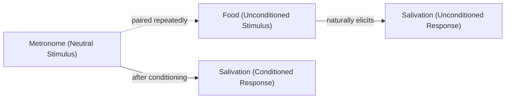
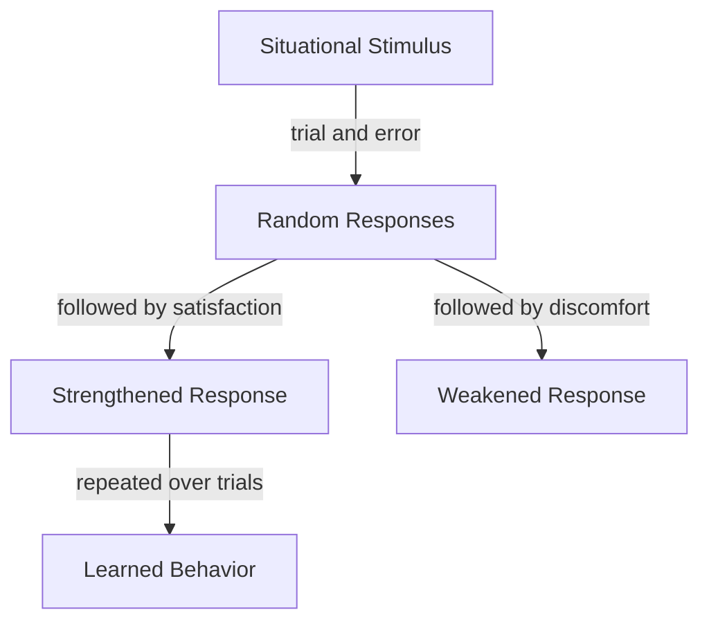

# Chapter 10 · Module 3
# Thorndike's Cats, Pavlov's Dogs — The Science of Learning
## Psychology · Unit 1 · History of Psychology

---

In the summer of 1898, a 24-year-old graduate student at Columbia University was conducting an experiment that his landlady found deeply suspicious. Edward Thorndike had set up a series of slatted wooden cages in a basement room. Inside each cage was a cat. The cats were food-deprived. They were placed in the cages and required to open a latch — or a series of latches — to escape and receive a food reward. Thorndike sat outside, stopwatch in hand, recording every movement.

Thorndike had originally planned to work with children. He had been studying animal intelligence at Harvard, but the Harvard authorities refused to allow him to continue after Franz Boas conducted an anthropometric study involving the loosening of children's clothes — creating a public outcry in Boston. James suggested chickens. Thorndike's landlady refused to allow chickens in her house. James offered his basement. When Thorndike moved to Columbia, Cattell secured him laboratory space.

The cats did not figure things out through insight. They did not suddenly see the solution. They thrashed and clawed and bit and sniffed, and eventually — by accident — they hit the latch. On the next trial, they thrashed a little less and hit the latch a little sooner. Over many trials, the random behavior decreased until the cat produced the required response immediately upon being placed in the box.

Thorndike's conclusion was stark: animal learning is incremental, not insightful. There is no "aha" moment. There is only the gradual stamping in of successful responses and the gradual stamping out of unsuccessful ones. This was a direct challenge to Köhler's Gestalt psychologists, who claimed that chimpanzees solve problems through sudden insight.

---

## The Law of Effect

Thorndike characterized his account of learning as the **law of effect**:

> "Of several responses made to the same situation, those which are accompanied or closely followed by satisfaction to the animal will, other things being equal, be more firmly connected with the situation, so that, when it recurs, they will be more likely to recur."
> — Edward Thorndike, *Animal Intelligence* (1911, p. 244)

He supplemented this with the **law of exercise**: responses connected with a situation more frequently and more vigorously become more strongly connected.

Thorndike's theory of learning, which he called **connectionism**, appealed to traditional principles of association based on contiguity and repetition. But it focused on associations between behavior and its consequences, rather than associations between ideas. The main principle — that behaviors followed by satisfaction are repeated — had been recognized earlier by Hartley, Spencer, and Bain. But Thorndike was the first to demonstrate it experimentally with controlled animal studies.

Thorndike demonstrated that learning was not a product of imitation. The observation of successful responses by other cats did not decrease the time it took a cat to learn the correct response. The learning was individual, not social.

Thorndike also demonstrated that the required response was learned incrementally, rather than through any spontaneous act of insight. The learning curves were smooth and gradual, not step-like. There was no evidence of sudden comprehension.

> [!TIP]
> **Stop and Think:** Thorndike's cats learned through trial and error — not through insight. Köhler's chimpanzees learned through insight — not through trial and error. Both experiments were carefully conducted. Both produced clear results. How do you explain the discrepancy? Are cats and chimpanzees fundamentally different? Or are there different kinds of learning, and different tasks elicit different kinds?

---

## Pavlov: The Metronome and the Saliva

Ivan Pavlov's discovery of conditioned reflexes was made almost by accident. While studying digestion in dogs, he noticed that the dogs began to salivate before the food was delivered — at the sight of the lab assistant, at the sound of footsteps, at the click of a metronome.

Pavlov recognized that this was a phenomenon worth studying. He designed experiments in which he paired an originally neutral stimulus (the sound of a metronome) with food (the unconditioned stimulus). After repeated pairings, the metronome alone elicited salivation. The neutral stimulus had become a conditioned stimulus.

Pavlov and his students identified several important phenomena:

**Extinction**: the conditioned response diminishes when the conditioned stimulus is no longer paired with the unconditioned stimulus. If you stop pairing the metronome with food, the dog eventually stops salivating at the sound of the metronome.

**Spontaneous recovery**: after extinction, the conditioned response tends to reappear after some time has passed, even without re-pairing.

**Disinhibition**: after extinction, any strong stimulus tends to temporarily restore the conditioned response.

**Experimental neurosis**: when the discrimination between stimuli becomes too difficult (e.g., distinguishing between a circle and an almost-circle), the animal manifests violent and erratic behavior — a phenomenon Pavlov interpreted as an animal model of neurosis.

Pavlov never used a bell. The myth derives from an American translator's artistic license. Pavlov's own preferred stimulus was a metronome.

> [!TIP]
> **Stop and Think:** Pavlov's conditioned reflexes are often presented as a simple, mechanical process. But consider: your phone buzzes. You feel a surge of anticipation. Is that a conditioned response? The buzz (conditioned stimulus) has been paired with interesting messages (unconditioned stimulus) hundreds of times. Now the buzz alone triggers the anticipation. How many of your daily emotional responses are Pavlovian?

---

## Classical vs. Instrumental Conditioning

Pavlov's conditioned reflexes and Thorndike's trial-and-error learning represent two fundamentally different forms of learning.

In **classical conditioning** (Pavlov), a neutral stimulus is paired with an unconditioned stimulus until it elicits the same response. The organism is passive — it does not need to do anything. The learning happens to the organism.

In **instrumental conditioning** (Thorndike), the organism's behavior is shaped by its consequences. Behaviors followed by satisfaction are strengthened; behaviors followed by discomfort are weakened. The organism is active — it must produce a behavior that is then reinforced or punished.

The Polish physicians Jerzy Konorski and Stefan Miller argued that these are two distinct forms of learning — not just variations of the same principle. Classical conditioning explains reflexive, involuntary responses (like salivation). Instrumental conditioning explains voluntary, goal-directed behavior (like pressing a lever for food).

Pavlov disagreed. He tried to accommodate instrumental conditioning as a form of classical conditioning, but without success. The distinction between the two forms of learning became one of the foundational principles of learning theory.

*Figure: Pavlov's classical conditioning — a neutral stimulus (metronome) is repeatedly paired with an unconditioned stimulus (food) until it alone elicits the conditioned response (salivation).*

*Figure: Thorndike's trial-and-error learning — random responses are shaped by their consequences, with satisfying outcomes stamping in successful behaviors over repeated trials.*

> [!TIP]
> **Stop and Think:** Classical conditioning explains involuntary responses — salivation, fear, nausea. Instrumental conditioning explains voluntary behavior — pressing levers, solving puzzles, choosing careers. Can you think of a behavior that is both? Is the athlete who feels a surge of adrenaline at the starting gun (classical) and then runs faster because of the crowd's applause (instrumental) demonstrating both forms of learning simultaneously?

---

## Bechterev: Motor Reflexes

Vladimir Bechterev (1857–1927), a Russian neurologist who studied with Wundt and du Bois-Reymond, developed an objective psychology based on motor reflexes. He created the first Russian laboratory devoted to experimental psychology at the University of Kazan in 1885.

Bechterev's approach was similar to Pavlov's but focused on motor rather than glandular responses. He studied the association of movements — how originally random movements become associated with stimuli through repeated pairing. His *Objective Psychology* (1907–1910) developed a comprehensive system of reflexive psychology that encompassed all forms of behavior.

Bechterev's work was less well known in the West than Pavlov's, partly because of political barriers and partly because Pavlov's Nobel Prize gave him greater visibility. But Bechterev's emphasis on motor reflexes and the association of movements was an important contribution to the development of behaviorist theory.

> [!TIP]
> **Stop and Think:** Pavlov studied glandular responses (salivation). Bechterev studied motor responses (movements). Both used the same basic principle: association through contiguity and repetition. Does it matter whether the response is a gland secreting saliva or a hand pressing a lever? Are all behaviors — from salivation to speech to creativity — reducible to conditioned reflexes?

> [!TIP]
> **Stop and Think:** Thorndike showed that learning is incremental — the learning curves are smooth and gradual. Köhler showed that learning can be sudden — chimpanzees stacking boxes to reach bananas. Is there a single law of learning that explains both? Or are there fundamentally different types of learning that require different explanations?

> [!IMPORTANT]
> Thorndike, Pavlov, and Bechterev each demonstrated that learning can be studied objectively, without reference to consciousness or introspection. Thorndike showed that animals learn through trial and error, shaped by consequences. Pavlov showed that reflexive responses can be conditioned through association. Bechterev showed that motor behavior can be similarly conditioned. Together, they provided the experimental foundation for behaviorism. Watson did not invent the science of learning. He provided the philosophical framework for it — and the rhetoric to make it a movement.

---

## Speaking of Cats, Dogs, and Conditioned Responses...

- A student in Seoul develops a stress response to the sound of her alarm clock. The alarm (conditioned stimulus) has been paired with the stress of waking up for exams (unconditioned stimulus) so many times that the alarm alone triggers anxiety — even on weekends. This is classical conditioning, operating in her bedroom.

- A dog in Lagos learns that sitting on command is followed by a treat. The sitting behavior is strengthened by the consequence (the treat). This is instrumental conditioning — Thorndike's law of effect, operating in a backyard.

- A bartender in São Paulo notices that certain customers salivate when they see the cocktail shaker — even before tasting the drink. The shaker (conditioned stimulus) has been paired with the taste of alcohol (unconditioned stimulus) so many times that it triggers the salivary response alone. Pavlov would have recognized the phenomenon immediately. He might have asked for a drink.

---

Thorndike's cats learned through trial and error. Pavlov's dogs learned through conditioned reflexes. Watson declared that all behavior can be explained in these terms. But two other behaviorists — Tolman and Hull — disagreed. They accepted that behavior is the subject matter of psychology but argued that what happens between the stimulus and the response matters. Their neobehaviorism would bridge the gap between Watson's radical rejection of the mind and the cognitive revolution that was still decades away.

---

## References

1. Pavlov, I. P. (1927). *Conditioned reflexes* (G. V. Anrep, Trans.). Oxford: Oxford University Press.
2. Thorndike, E. L. (1911). *Animal intelligence*. New York: Macmillan.
3. Todes, D. P. (2014). *Ivan Pavlov: A Russian life in science*. Oxford: Oxford University Press.
