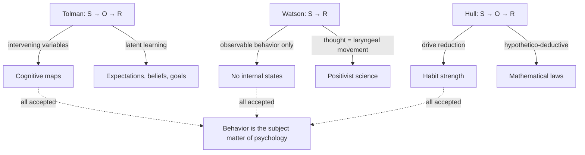
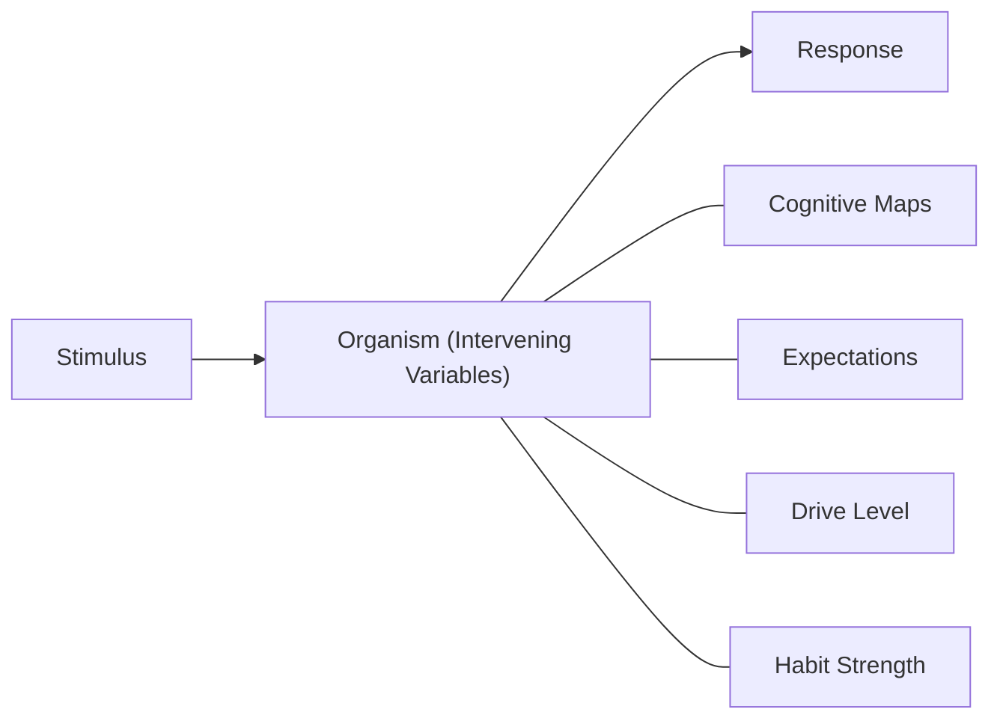

# Chapter 10 · Module 4
# Neobehaviorism — Tolman, Hull, and the Mental Return
## Psychology · Unit 1 · History of Psychology

---

In 1948, a psychologist at the University of California, Berkeley, published a paper with a provocative title: "Cognitive Maps in Rats and Men." The psychologist was Edward Chase Tolman, and the paper argued something that Watson would have found heretical: rats form mental representations of their environment. They build cognitive maps. They do not just learn stimulus-response connections. They learn *where things are*.

Tolman was a behaviorist. He accepted that observable behavior is the subject matter of psychology. But he rejected Watson's insistence that psychology must avoid all mentalistic concepts. Tolman argued that you can study behavior scientifically and still use mentalistic explanations — as long as those explanations are grounded in observable data.

This was **neobehaviorism** — the second phase of the behaviorist movement. It accepted Watson's premise that behavior is the subject matter of psychology but rejected his prohibition against mentalistic concepts. Tolman and Clark Hull, the two leading neobehaviorists, agreed that psychology should be a science of behavior. They disagreed profoundly about what kind of science it should be.

---

## Tolman: Purposive Behaviorism

Edward C. Tolman (1886–1959) was trained at Harvard and spent most of his career at Berkeley. He developed what he called **purposive behaviorism** — a form of behaviorism that acknowledged the role of purpose, cognition, and mental representation in the control of behavior.

Tolman's key innovation was the concept of **intervening variables** — hypothetical internal processes that mediate between the stimulus and the response. These intervening variables are not directly observable, but they can be inferred from behavior. They include things like expectations, beliefs, goals, and cognitive maps.

Tolman demonstrated his concept through a series of elegant experiments on maze learning in rats. He showed that rats do not simply learn a sequence of left-right turns (as strict S-R theory would predict). They learn the spatial layout of the maze — the relationships between landmarks, turns, and the goal. They form **cognitive maps** — mental representations of the environment.

In one famous experiment, Tolman trained rats to swim through a maze. When the maze was drained and the rats were placed in it dry, they ran the maze correctly on the first trial — demonstrating that they had learned the spatial layout, not just the motor responses required to navigate it while swimming.

Tolman also demonstrated **latent learning** — learning that occurs without reinforcement. Rats that were allowed to explore a maze without food rewards nevertheless learned the layout. When food was later introduced, they immediately performed better than rats that had never explored the maze. They had been learning all along — they just had no reason to demonstrate it.

> [!TIP]
> **Stop and Think:** Tolman showed that rats learn even without reinforcement. Think about a time you learned something without being rewarded — exploring a new city, browsing a library, watching a documentary. Was that latent learning? Did the knowledge become useful only later, when you needed it? If learning can occur without reinforcement, what does that mean for Hull's drive-reduction theory?

> [!TIP]
> **Stop and Think:** Tolman showed that rats form cognitive maps — mental representations of their environment. Think about your own experience of navigating a city. Do you navigate by a sequence of turns ("left at the gas station, right at the park")? Or do you have a mental map — a spatial representation that allows you to find shortcuts and alternate routes? If rats can form cognitive maps, what does that tell you about the relationship between behavior and cognition?

---

## Hull: The Hypothetico-Deductive System

Clark L. Hull (1884–1952) took a very different approach. Hull was trained at the University of Wisconsin and spent most of his career at Yale. He was determined to make psychology as rigorous as physics — a science of precise laws and mathematical predictions.

Hull developed a **hypothetico-deductive system** — a set of postulates and theorems from which specific predictions about behavior could be derived. His system was based on the concept of **drive reduction** — the idea that behavior is motivated by the need to reduce physiological drives (hunger, thirst, pain) and that learning occurs when a behavior successfully reduces a drive.

Hull's system included concepts like **habit strength** (the strength of the association between a stimulus and a response, determined by the number of reinforced trials), **drive** (the motivational state that energizes behavior), and **reaction potential** (the probability that a response will occur, determined by habit strength and drive level).

Hull's approach was explicitly mathematical. He wrote equations relating habit strength to the number of reinforced trials, drive to the time since the organism last ate, and reaction potential to the product of habit strength and drive. He believed that psychology could achieve the same kind of precise, quantitative laws that characterized physics.

Hull's system was enormously influential in the 1940s and 1950s. His seminar at Yale attracted a generation of psychologists who went on to shape the discipline. But the system eventually collapsed under the weight of its own complexity — too many postulates, too many qualifications, too many exceptions.

> [!TIP]
> **Stop and Think:** Hull tried to make psychology as precise as physics. He wrote equations for learning, motivation, and behavior. But human behavior is far more complex than the motion of planets. Can psychology achieve the same kind of mathematical precision as physics? Should it try? Or is there something about human behavior that resists mathematical formalization?

---

## Watson vs. Tolman vs. Hull: Three Visions

The three behaviorists — Watson, Tolman, and Hull — represented three different visions of what psychology should be.

**Watson** said: study observable behavior. Reject all mentalistic concepts. Consciousness is irrelevant. Thought is laryngeal movement. Psychology is a positivist science of stimulus-response correlations.

**Tolman** said: study observable behavior, but use mentalistic concepts to explain it. Intervening variables — cognitive maps, expectations, purposes — are legitimate scientific constructs, as long as they are grounded in behavioral data. Psychology is a science of purposive behavior.

**Hull** said: study observable behavior and build a mathematical system of laws that predict it. Drive reduction, habit strength, and reaction potential are the building blocks. Psychology should be as precise as physics.

All three agreed that behavior, not consciousness, is the subject matter of psychology. They disagreed about what kind of explanations are legitimate. Watson allowed no internal states. Tolman allowed cognitive internal states. Hull allowed motivational internal states but not cognitive ones (at least not in his early work).

The debate between these three positions — and the eventual triumph of none of them — shaped the development of psychology for the next half-century.

*Figure: Three behaviorist positions — Watson rejected internal states entirely, Tolman reintroduced cognition through intervening variables and cognitive maps, and Hull built a mathematical system around drive reduction and habit strength.*

*Figure: The S-O-R model — neobehaviorists inserted the organism between stimulus and response, using intervening variables like cognitive maps, expectations, drive level, and habit strength to explain behavior without abandoning scientific rigor.*

> [!TIP]
> **Stop and Think:** Watson, Tolman, and Hull all called themselves behaviorists. But they disagreed about almost everything except the subject matter. Is "behaviorism" a single theory or a family of theories? Can a movement survive internal disagreement? Think about other movements — feminism, socialism, existentialism. Do they have a single definition, or are they defined by a shared orientation?

> [!TIP]
> **Stop and Think:** Hull's system was based on drive reduction — behavior is motivated by the need to reduce physiological drives. But what about curiosity, play, creativity, and exploration? These seem to be motivated by something other than drive reduction. Tolman's latent learning experiments showed that rats learn even without reinforcement. Is Hull's theory too narrow? Or can drive reduction be expanded to explain these behaviors?

> [!IMPORTANT]
> Neobehaviorism — Tolman's purposive behaviorism and Hull's hypothetico-deductive system — represented the high-water mark of the behaviorist movement. They accepted Watson's premise that behavior is the subject matter of psychology but rejected his prohibition against mentalistic concepts. Tolman reintroduced cognition through the back door — cognitive maps, intervening variables, latent learning. Hull built a mathematical system of learning that was as ambitious as anything in the history of psychology. Both systems eventually collapsed. But they demonstrated that behaviorism could accommodate internal states — that you could study behavior scientifically without denying that something is happening inside the organism. This was the bridge between Watson's radical rejection of the mind and the cognitive revolution that would follow.

---

## Speaking of Maps, Drives, and Systems...

- A taxi driver in Lagos navigates the city without a map. He has a cognitive map — a mental representation of the street layout, built through years of experience. When a road is closed, he finds an alternate route without conscious deliberation. This is Tolman's cognitive map, operating in real time.

- A student in Seoul studies for an exam. She is hungry, but she keeps studying. The drive to pass the exam overrides the drive to eat. This is Hull's concept of competing drives — two motivational states in conflict, with the stronger one determining behavior.

- A software engineer in São Paulo designs a recommendation algorithm. The algorithm learns user preferences through reinforcement — behaviors (clicks, purchases) that are followed by satisfaction (continued engagement) are strengthened. This is Hull's drive reduction, translated into code.

---

The behaviorists had made psychology a science of behavior. But the same impulse that drove behaviorism — the desire for practical, useful, applicable knowledge — also drove another movement: mental testing. The psychologists who built the testing movement believed they could measure intelligence, predict success, and improve society through scientific selection. They were wrong about some of these things. And the consequences were devastating.

---

## References

1. Hull, C. L. (1943). *Principles of behavior: An introduction to behavior theory*. New York: Appleton-Century-Crofts.
2. Skinner, B. F. (1963). Behaviorism at fifty. *Science, 140*(3570), 951–958.
3. Tolman, E. C. (1948). Cognitive maps in rats and men. *Psychological Review, 55*(4), 189–208.
