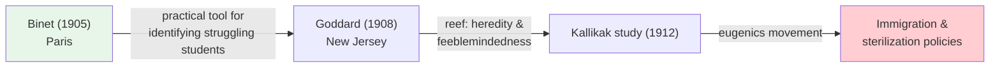
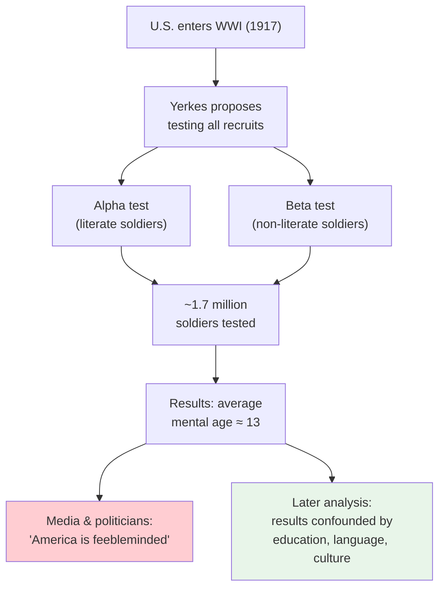

# Chapter 10 · Module 5
# The Measure of Intelligence — Testing, Immigration, and Sterilization
## Psychology · Unit 1 · History of Psychology

---

Paris, 1904. The French government has a problem. Primary education is now compulsory, and classrooms are swelling with children who simply cannot keep up. Teachers complain that certain students are disruptive, slow, unable to follow lessons. But which children are truly incapable of benefiting from schooling, and which ones simply need a different approach? The government turns to a quiet, bespectacled scientist named Alfred Binet, director of the laboratory of physiological psychology at the Sorbonne. Binet does not believe intelligence is a single, fixed thing — it can be nurtured. With his assistant Theodore Simon, he designs practical tasks — arranging objects by size, defining common words, remembering digit sequences — to spot which children need extra help. In 1905, they publish their first scale: 30 items ranked by difficulty. By 1908, it grows to 54 items organized by age level, so that a child who passes tasks typical of a seven-year-old has a "mental level" of seven.

Binet's purpose is modest and humane: identify struggling children so you can help them. He never claims to measure a fixed quantity of intelligence. But his test is about to cross the Atlantic, and when it does, its purpose will be transformed beyond recognition. In American hands, a tool designed to help children becomes a weapon used to sort human beings, restrict immigration, and justify the surgical sterilization of tens of thousands of people.

## From Paris to New Jersey: The American Reinvention

When Binet's 1908 scale reached the United States, it landed in a country obsessed with classification, efficiency, and — increasingly — heredity. The American reception of the Binet-Simon test reveals how the same instrument can serve radically different purposes depending on who wields it and why.

The man who first brought the test to America was Henry H. Goddard, who in 1906 became director of the research laboratory at the Vineland Training School for Feeble-Minded Girls and Boys in New Jersey. Goddard translated the 1908 Binet-Simon scale into English and began administering it to the children in his institution. Where Binet had seen a practical diagnostic tool, Goddard saw something more: a way to identify and classify the **feebleminded** — a catch-all term that, in the early twentieth century, encompassed anyone deemed intellectually below normal.

Goddard did not stop at institutional walls. In 1912, he published *The Kallikak Family: A Study in Feeblemindedness*, a book that would become one of the most influential — and most misleading — works in the history of American psychology. The book traced the family tree of Deborah, a Vineland resident, back to a Revolutionary War soldier named Martin Kallikak. On one side, Martin married a respectable Quaker woman and produced doctors and lawyers. On the other, he fathered an illegitimate child with a "feebleminded serving wench," and this line allegedly produced criminals, prostitutes, and social undesirables.

The implication: feeblemindedness was inherited, running in families like a stain. The Kallikak study became a cornerstone of the American **eugenics** movement, the belief that society should encourage reproduction of those with "good" genes and prevent reproduction of those with "bad" ones. As Stephen Jay Gould later documented in *The Mismeasure of Man* (1981), Goddard's researchers appear to have altered photographs of the "defective" family members — retouching faces to make them appear more menacing. The visual evidence was manufactured to fit the theory.

*Figure: The transformation of Binet's test from a compassionate diagnostic tool to an instrument of social control.*

Goddard also took his classification skills to Ellis Island, where he convinced immigration officers that he could identify the feebleminded among the waves of eastern and southern European immigrants arriving in the United States. With a brief visual inspection — sometimes lasting only seconds — Goddard and his colleagues would tag individuals as mentally deficient. People were turned away from American shores based on snap judgments dressed up in the authority of science.

> [!TIP] **Stop and Think**
> Goddard used Binet's test for a purpose Binet never intended. Can you think of a modern tool — a technology, an algorithm, a measurement — that was designed for one purpose but has been repurposed in ways its creators would find disturbing? What responsibility do creators bear for how their tools are used?

## The IQ Machine: Terman and the Stanford-Binet

While Goddard focused on identifying the feebleminded, another American psychologist was building a more sophisticated version of the test — one that would reshape education, employment, and popular culture for the rest of the century.

Lewis M. Terman brought to psychology a deep conviction that intelligence was measurable, heritable, and the primary determinant of life outcomes. In 1916, he published his revision of the Binet-Simon scale — far more than a translation. The **Stanford-Binet** included 36 additional items calibrated against a large standardization sample from California schools, designed so the average child at any age between 5 and 16 would test at that exact age level.

This standardization introduced a powerful public concept: the **intelligence quotient**, or **IQ**. A child's mental age divided by chronological age, multiplied by 100. The average 10-year-old: mental age 10, IQ exactly 100. Above 100 meant advanced; below meant behind. Intelligence, distilled to a single number.

Terman did not hide his hereditarian assumptions. He believed IQ was largely fixed at birth and openly claimed racial and ethnic groups differed in average intelligence — claims thoroughly debunked by subsequent research but enormously influential in early twentieth-century America. He used the Stanford-Binet to identify "gifted" children, running a long-term study that continued for decades. His enthusiasm was genuine, but his interpretations were shaped by the hereditarian ideology of his time.

| Feature | Binet's Original Intent | American Adaptation |
|---|---|---|
| **Purpose** | Identify struggling students for remedial help | Classify and sort people by "intelligence" |
| **View of intelligence** | Malleable, improvable | Largely fixed, inherited |
| **Key concept** | Mental level | Mental age → IQ score |
| **Social use** | Educational support | Social engineering, exclusion |
| **Who benefits** | Children who need help | Institutions that need to classify |

*Table: How Binet's test changed as it crossed the Atlantic.*

> [!TIP] **Stop and Think**
> An IQ of 100 is defined as average — but average for whom? Terman's standardization sample was drawn from California schools in the 1910s. What populations might have been excluded from that sample, and how might their exclusion distort what "average" means?

## The Army and the Biggest Experiment in Psychology's History

In 1917, the United States entered the First World War, and American psychology seized its moment. Robert M. Yerkes, then president of the American Psychological Association, formed the Committee on Methods of Psychological Examining for Recruits and pitched an audacious plan: test every soldier in the U.S. Army for intelligence. The proposal went through the National Research Council and received approval.

The **Army Testing Project** was staggering in scale. Over 400 personnel administered group intelligence tests to virtually every recruit. The **Alpha** test covered literate soldiers with sections on directions, arithmetic, vocabulary, and pattern completion; the **Beta** test was pictorial for those who could not read or read English. By early 1919, close to 1.7 million soldiers had been tested — the largest psychological testing program ever conducted.

The results seemed to confirm everything the hereditarians had been claiming. The average mental age of the recruits, according to Yerkes and his colleagues, was around 13 — just above the threshold for what Goddard called **moron**, a classification for those with a mental age between 8 and 12. Nearly half the recruits tested at or below that level. The implications, trumpeted in newspapers and academic journals alike, were alarming: the American population was far less intelligent than anyone had supposed.

But the tests were administered under chaotic conditions — noisy barracks, time pressure, exhausted or illiterate soldiers unfamiliar with the format. Even the Beta test for non-English speakers required instructions many recruits could not follow. As Gould and later historians argued, the scores measured education, cultural familiarity, and English proficiency as much as native ability.

*Figure: The Army Testing Project — from military testing to public panic to later scholarly critique.*

> [!TIP] **Stop and Think**
> The Army tests were administered to 1.7 million people in a single year. Speed and standardization were prioritized over nuance. When a measurement tool is deployed at massive scale, what kinds of errors become more likely — and harder to detect?

## When Science Serves Power: Immigration, Eugenics, and Sterilization

This is where the story turns dark. The Army Testing Project did not stay in the barracks. Its results were seized upon by politicians, eugenicists, and nativists as scientific proof that America's racial stock was being degraded.

Carl Brigham, a Princeton psychologist who had worked on the Army program, published *A Study of American Intelligence* in 1923 with a foreword by Yerkes. He argued that recent immigrants — particularly from southern and eastern Europe — were less intelligent than native-born Americans, ranking racial groups with Nordic peoples at the top. The book provided scientific data for a political movement already gathering force.

The consequences were devastating. Fears about "pollution" of the national gene pool led to the **National Origins Act** of 1924, imposing strict immigration quotas based on the 1890 census — chosen precisely because it preceded mass immigration from southern and eastern Europe. Immigration from Italy, Russia, Poland, and Greece was drastically reduced while quotas favored northern and western Europeans. Families fleeing poverty and persecution were turned away because their national origins had been deemed a threat to the nation's intelligence.

The eugenics movement pushed further toward **sterilization** — surgical prevention of reproduction among those deemed unfit. Indiana passed the first sterilization law in 1907; by the late 1920s, nearly 30 states had such laws, and by 1930 approximately 12,000 people had been compulsorily sterilized — often without informed consent, sometimes without their knowledge.

In 1927, the Supreme Court gave its blessing in **Buck v. Bell**. Justice Oliver Wendell Holmes wrote: "Three generations of imbeciles are enough." The decision has never been formally overruled. These were not fringe policies — they were mainstream, supported by prominent scientists and enacted by elected legislatures. Intelligence testing provided the scientific veneer for policies that destroyed lives.

> [!TIP] **Stop and Think**
> The sterilization laws targeted people who were institutionalized, poor, and powerless — people who could not fight back. What does it tell us about the relationship between science and power when the "subjects" of research are also the most vulnerable members of society?

## The Recantation — and What It Teaches Us

There is a remarkable epilogue. In 1930, Carl Brigham publicly recanted his earlier conclusions, calling his *Study of American Intelligence* "without foundation." He acknowledged the Army test scores could not draw conclusions about innate racial intelligence — they were confounded with education, language, and cultural background.

But the damage was done. The National Origins Act was law. The sterilizations had been performed. Scientific authority is claimed quickly and retracted slowly; a journal retraction cannot undo suffering already inflicted.

> [!TIP] **Stop and Think**
> Brigham recanted his racist conclusions, but the policies they inspired lasted for decades. Once scientific claims become embedded in law and institutional practice, how difficult is it to reverse the damage even after the science is discredited?

Testing also reshaped psychology's professional landscape. When the APA declined to certify practicing psychologists in 1915, Leta S. Hollingworth, J. E. Wallace Wallin, and Rudolf Pinter formed the American Association of Clinical Psychologists in 1917. By 1919, it became the APA's Clinical Section — a compromise acknowledging applied psychology's growing importance. Testing had created a professional identity for psychologists outside the laboratory.

> [!IMPORTANT] **Closing Insight**
> Intelligence testing reveals a fundamental truth about psychological science: measurement tools are never neutral. They acquire the purposes, assumptions, and biases of the people who wield them. Binet's compassionate diagnostic became a weapon not because the test changed, but because the ideology behind it changed — from helping the vulnerable to sorting the "fit" from the "unfit." The lesson for every student of psychology: always ask who designed this tool, whose assumptions does it encode, and who bears the cost of its errors.

## Speaking of Intelligence Tests...

If you have ever taken a standardized test — a college entrance exam, a civil service exam, a professional certification — you are living in the world that Binet, Goddard, Terman, and Yerkes helped create. The idea that a single score can capture something important about your abilities, and that this score can sort you into categories, now feels natural. But it is a historical invention, carrying the fingerprints of every purpose it has served — from Binet's compassionate identification of struggling students to Holmes's cold justification of forced sterilization.

In Brazil, the ENEM exam determines university admission for millions. In South Korea, the Suneung shapes entire childhoods. In India, the JEE and NEET exams sort millions of aspiring engineers and doctors. In the UK, the Eleven-Plus once determined grammar school placement — a system that, like the Stanford-Binet, assumed intelligence was fixed and measurable. In Nigeria, standardized entrance exams govern access to universities with far more applicants than places. The same tension persists: tests can identify who needs help, but they can also be instruments of exclusion when designers believe scores reflect something innate.

---

Intelligence testing is psychology's complicated relationship with power. Psychologists eager for relevance offered their tools to governments, militaries, and immigration authorities — sometimes with good intentions, sometimes with prejudice dressed as science. The damage fell hardest on those with the least power to resist.

As you study psychology, you will encounter many more tools, tests, and theories. The ability to ask *who benefits from this measurement, and who is harmed* is not just a historical skill — it is an ethical one.

*[Module 5 of 5 complete. Chapter 10 complete. Take time with the "Stop and Think" prompts before moving to the next chapter.]*

## References

- Gould, S. J. (1981). *The Mismeasure of Man*. New York: W. W. Norton.
- Watson, J. B. (1913). Psychology as the behaviorist views it. *Psychological Review*, *20*(2), 158–177.
- Zenderland, L. (1998). *Measuring Minds: Henry Herbert Goddard and the Origins of American Intelligence Testing*. Cambridge: Cambridge University Press.
