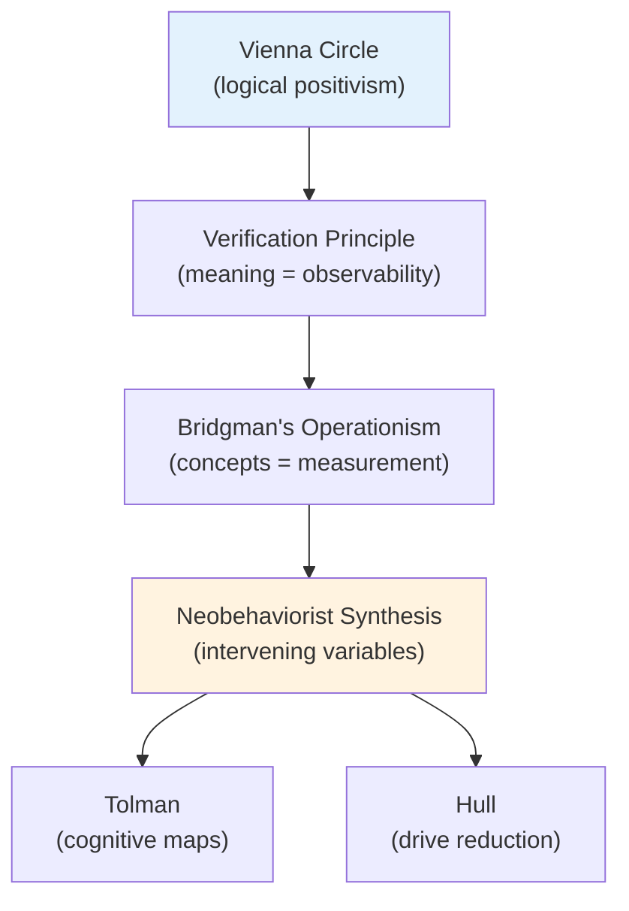

# Chapter 11 · Module 1
# Logical Positivism and the Neobehaviorist Dream
## Psychology · Unit 1 · History of Psychology

---

In the 1920s, a group of philosophers, scientists, and mathematicians began meeting in Vienna to discuss a radical idea: that the only meaningful statements are those that can be verified by observation. They called themselves the Vienna Circle. Their leader was Moritz Schlick, a philosopher who had studied with Max Planck. Their members included Rudolf Carnap, Kurt Gödel, and Herbert Feigl. They were brilliant, ambitious, and — within a few years — scattered across the world by the rise of Nazism.

Their philosophy — **logical positivism** — would become one of the most influential intellectual movements of the 20th century. And its influence on psychology would be enormous, though not in the way anyone expected.

The logical positivists did not set out to change psychology. They were concerned with the foundations of science — with what makes a statement meaningful, what makes a theory scientific, and what distinguishes genuine knowledge from metaphysical speculation. But their ideas were adopted by a generation of American psychologists who wanted to make their discipline as rigorous as physics. The result was neobehaviorism — a form of behaviorism that accepted Watson's premise that behavior is the subject matter of psychology but rejected his prohibition against theories about internal states.

The neobehaviorists — Clark Hull and Edward Tolman chief among them — wanted to build real theories. They wanted to postulate internal states, deduce predictions, and test those predictions against data. They wanted psychology to look like physics. And they turned to logical positivism to show them how.

---

## Logical Positivism: Meaning Is Verification

The central doctrine of logical positivism was the **verification principle**: the only meaningful factual propositions are those verifiable by observation. As Schlick put it: "the meaning of a proposition is its method of verification."

The logical positivists distinguished between formal and factual propositions — between propositions rendered true by logic (like "all triangles have three sides") and propositions rendered true by facts about the world (like "all unsupported bodies fall to the ground"). They employed the verification principle to dismiss metaphysical, ethical, religious, and aesthetic propositions as literal nonsense — because they cannot be empirically verified.

But they faced a problem. Many legitimate scientific propositions — about electrons, gravitational fields, and atomic structures — are also incapable of direct verification. The positivists solved this by claiming that theoretical propositions are legitimate as long as they are defined in terms of observables, via **correspondence rules** or **operational definitions**.

In the early version of logical positivism (called "sensationalism"), observational propositions described private sense experience. In the later version (called "physicalism"), they described publicly observable properties of physical objects — like readings on spectrometers or the motion of bodies. Neobehaviorists like Hull and Tolman embraced this later version, treating theoretical references to consciousness and cognition as analogous to theoretical references to electrons in physics.

> [!TIP]
> **Stop and Think:** The verification principle says that a statement is meaningful only if it can be verified by observation. Is the statement "other people have feelings" verifiable? You can observe their behavior, but you cannot directly verify their feelings. Does this mean the statement is meaningless? Or does it mean the verification principle is too strict?

---

## Operationism: Concepts Must Be Measurable

The neobehaviorists adopted **operationism** — the doctrine, advanced by the Harvard physicist Percy Bridgman, that any legitimate scientific concept must be linked to measurement procedures. Such operational measures provide the empirical significance of a concept — its operational definition.

Bridgman claimed that concepts like "absolute simultaneity" and "absolute space," which cannot be operationally defined, lack empirical significance and are useless in science. Neobehaviorists appropriated this principle to argue that theoretical propositions in psychology must be operationally defined in terms of observable stimuli and behavior.

Bridgman himself was unhappy about this appropriation. He complained that neobehaviorists had distorted his original intent — which was about scientific utility, not theoretical meaning — and lamented that he had "created a Frankenstein."

The neobehaviorist version of operationism led to a peculiar requirement: every theoretical concept in psychology — drive, habit strength, cognitive map — had to be defined in terms of observable stimuli and behavioral responses. This created a tension that would haunt neobehaviorism for decades.

> [!TIP]
> **Stop and Think:** Bridgman argued that concepts must be linked to measurement procedures. Is "intelligence" a legitimate scientific concept? It can be measured (with IQ tests). But does the measurement capture everything the concept is supposed to mean? Is the concept defined by the measurement, or does the concept exceed the measurement?

---

## Intervening Variables: What Happens Between Stimulus and Response

The neobehaviorists' key innovation was the concept of **intervening variables** — hypothetical internal states that mediate between observable stimuli and observable responses. These intervening variables are not directly observable, but they can be inferred from behavior.

Tolman explained:

> "Mental processes are but intervening variables between the five independent variables of (1) environmental stimuli, (2) physiological drive, (3) heredity, (4) previous training, and (5) maturity, on the one hand, and the final dependent variable, behavior, on the other."
> — Edward Tolman (1936/1951, pp. 116–117)

But the concept of an intervening variable was ambiguous. It could be interpreted as either a **logically intervening variable** (merely a logical device for integrating descriptions of observable stimuli and responses) or a **causally intervening variable** (an internal state that causally mediates between stimuli and responses).

Many neobehaviorists embraced an instrumentalist conception — intervening variables are just "shorthand" descriptions of the influence on behavior of several independent variables. Others, notably Hull and Tolman, were committed realists who treated intervening variables as explanatory references to real internal states.

Later, MacCorquodale and Meehl (1948) distinguished between **intervening variables** (wholly reducible to empirical laws) and **hypothetical constructs** (containing surplus meaning not reducible to empirical laws). Tolman acknowledged that his cognitive postulates were hypothetical constructs — they specified the meaning of cognitive maps independently of any operational definition.

> [!TIP]
> **Stop and Think:** When a psychologist says "the rat has a cognitive map," is this a description of the rat's behavior? Or is it a claim about what is happening inside the rat's head? If it is just a description of behavior, does it explain anything? If it is a claim about the rat's head, how can it be verified?

> [!TIP]
> **Stop and Think:** The logical positivists dismissed metaphysical propositions as meaningless. But what about "all humans have dignity" or "suffering is bad"? These cannot be verified by observation. Are they meaningless? Or does the verification principle miss something essential about human knowledge?

> [!TIP]
> **Stop and Think:** The neobehaviorists wanted psychology to look like physics. But physics deals with universal laws that apply everywhere and always. Psychology deals with organisms that are shaped by evolution, culture, and individual experience. Can a science of human behavior ever achieve the same universality as physics? Should it try?

> [!IMPORTANT]
> The neobehaviorists wanted to build real theories — to postulate internal states, deduce predictions, and test those predictions against data. They adopted logical positivism as their philosophical framework. But logical positivism created a tension that would eventually tear neobehaviorism apart: if theoretical concepts must be defined in terms of observables, then explanations using those concepts are circular. If they are not defined in terms of observables, then they are meaningless. The neobehaviorists were caught between Scylla and Charybdis — between circularity and meaninglessness. Skinner would exploit this tension to devastating effect.

---

## Speaking of Verification, Operations, and Variables...

- A doctor in Lagos diagnoses a patient with depression. She uses a standardized questionnaire (the operational definition) and observes the patient's behavior (the observable data). But the patient says: "You are measuring my symptoms, not my suffering." The doctor's operational definition captures something. It does not capture everything.

- A psychologist in Seoul designs an experiment on motivation. She operationally defines motivation as "the number of presses on a lever per minute." But is motivation really the same as lever-pressing? Or is lever-pressing just one behavioral indicator of a richer internal state?

- A student in São Paulo reads about logical positivism and thinks: "If the only meaningful statements are those that can be verified, then what about love? Justice? Beauty? Are these meaningless?" The logical positivists would have said yes. Most people would disagree.

---

The logical positivists gave the neobehaviorists a philosophical framework. But two very different psychologists used that framework in very different ways. Tolman built cognitive maps and purposive behaviorism. Hull built a mathematical system of drive reduction. Their debate — about what happens between the stimulus and the response — would define American psychology for two decades.

*Figure: The intellectual pipeline from the Vienna Circle through operationism to neobehaviorism, branching into Tolman's cognitive and Hull's mechanistic programs.*

*[Module 1 of 5.]*

---

## References

1. Koch, S. (1964). Psychology and the human enterprise. In S. Koch (Ed.), *Psychology: A study of a science* (Vol. 6, pp. 9–36). New York: McGraw-Hill.
2. MacCorquodale, K., & Meehl, P. E. (1948). On a distinction between hypothetical constructs and intervening variables. *Psychological Review, 55*(2), 95–107.
3. Smith, L. D. (1986). *Behaviorism and logical positivism: A reassessment of the alliance*. Stanford: Stanford University Press.
