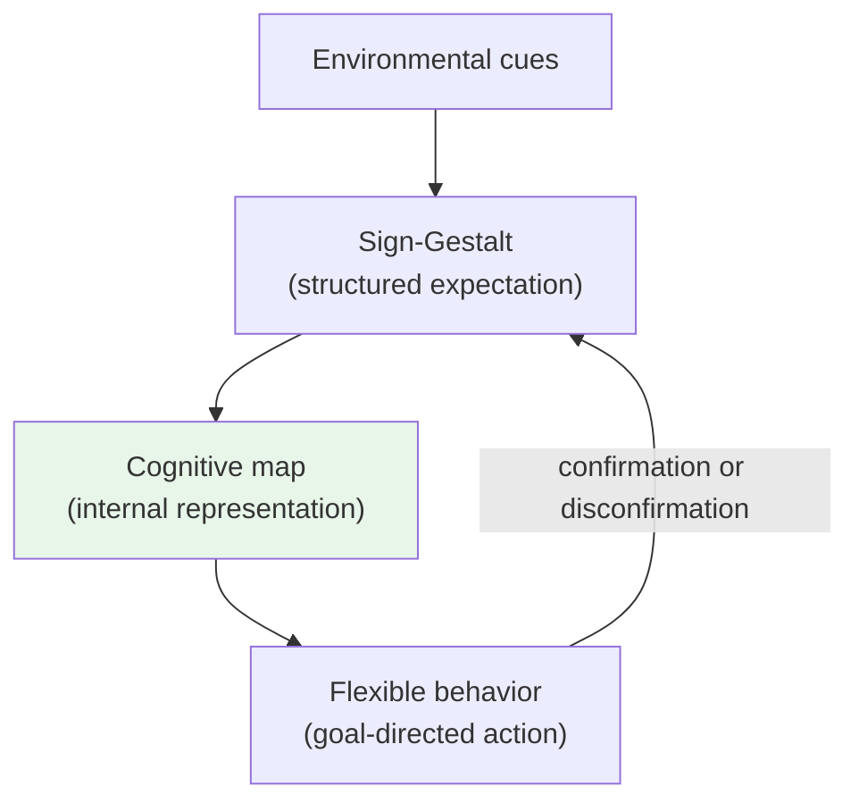
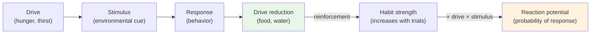

# Chapter 11 · Module 2
# Tolman and Hull — Two Visions of Scientific Psychology
## Psychology · Unit 1 · History of Psychology

---

A young man walks into the MIT library in 1909, looking for something to read during his final year as an electrochemistry student. He pulls a thick volume off the shelf — William James's *Principles of Psychology*. Edward Chance Tolman reads it and never looks back. He abandons electrochemistry, enrolls at Harvard, studies with Kurt Koffka in Germany, and by 1918 settles at the University of California, Berkeley, with a conviction that will put him at odds with nearly every other behaviorist in America: rats think.

Not in words. But Tolman watches rats run mazes, and he sees something Watson's stimulus-response framework cannot explain. Rats learn the layout of a maze even when they receive no food reward. They explore. They build mental representations. When you finally place food in the maze, these rats run the correct path far faster than rats who have never explored. Tolman calls this **latent learning**, and it challenges the orthodoxy that learning requires reinforcement.

Meanwhile, in New Haven, Connecticut, Clark Hull arrives at Yale in 1929 with a background in mining engineering, a leg brace from polio, and an ambition bordering on grandiosity: to build a mathematical system of behavior as rigorous as Newton's *Principia*. Hull looks at the same behavior Tolman studies and sees not cognition but mechanics. Drive reduction. Habit strength. Reaction potential.

These two men — Tolman the cognitivist in behaviorist clothing, Hull the engineer of the mind — will define the neobehaviorist movement. Their rivalry is a clash between two fundamentally different visions of what psychology can become.

## The Rat Who Thought: Tolman's Purposive Behaviorism

Tolman did something strange for a behaviorist: he insisted that behavior is **purposive** — directed toward goals. He rejected Watson's "muscle-twitchism" just as firmly as Titchener's structuralism. But he watched animals behave, and he could not ignore the obvious. Rats do not stumble through mazes at random. They run *toward* food. They turn *away* from shock. As Tolman put it, goal-directedness is "quite an objective and purely behaviorist affair" — "out there in the behavior, of its descriptive warp and woof."

This was **purposive behaviorism**: behaviorism that took goals seriously without retreating into mentalism. Influenced by the new realism of his Harvard teachers Holt and Perry, Tolman went further — he argued that cognitive states — representations, expectations, hypotheses — are real internal causes of behavior.

In a famous series of experiments on **latent learning**, Tolman and his student Honzik (1930) demonstrated that rats could learn a maze without reinforcement. One group explored daily with no food. Another received food from the start. A third explored without food for 10 days, then received food. When the food appeared, the previously unreinforced rats immediately ran the correct path — as if they had been building a mental map all along.

Tolman called these representations **cognitive maps** — internal models of the spatial environment that organisms construct through experience. He described them using the Gestalt-inspired concept of a **sign-Gestalt**: a structured relationship between signs (environmental cues), the organism's goal, and the expected outcome. The rat builds a map of the entire maze — one it can use flexibly, rerouting when a familiar path is blocked.

*Figure: Tolman's model of how organisms build cognitive maps through experience and use them to guide flexible, goal-directed behavior.*

> [!TIP] **Stop and Think**
> Tolman's rats learned without rewards. What does this tell you about the relationship between reinforcement and learning? Is it possible to learn something without being rewarded for it — and if so, what motivates the learning?

### Intervening Variables: Just Logic, or Real Causes?

Tolman's commitment to cognitive states created a philosophical puzzle. Behaviorists study observable behavior — but Tolman was postulating unobservable mental states as causes of that behavior.

In the 1930s, Tolman visited Vienna and met members of the Vienna Circle. He came back speaking their language, describing cognitive states as **intervening variables** — theoretical terms between observable stimuli and observable behavior. This allowed him to talk about cognition while appearing to stay within scientific empiricism. But it raised a question that would haunt neobehaviorism: Is an intervening variable just a logical shorthand for observable data? Or a reference to a real internal state that causes behavior?

Tolman's answer was clear. He was a **realist**. He believed cognitive maps really exist inside the rat's brain. He adopted the distinction by MacCorquodale and Meehl (1948) between pure intervening variables (logical shorthand) and **hypothetical constructs** (real internal states with "surplus meaning" beyond observation). His cognitive maps were hypothetical constructs — you could understand what a cognitive map *is* without knowing how the rat behaves. This meant Tolman's behaviorism contained a hidden commitment to the reality of mental states that most other behaviorists rejected.

## The Newton of Behavior: Hull's Hypothetico-Deductive System

Clark Hull came to psychology through a very different route. Where Tolman read James and Koffka, Hull read Newton and Hume. Where Tolman was drawn to the richness of animal behavior, Hull was drawn to the elegance of mathematical systems. His ambition was nothing less than to create a complete theory of learning expressed as a set of mathematical postulates from which specific behavioral predictions could be deduced — a **hypothetico-deductive system** modeled on the physics of Newton.

Hull's system, fully elaborated in *Principles of Behavior* (1943), began with postulates about how organisms learn. The core idea was **drive reduction**: physiological needs create internal drives, and learning occurs when a response reduces that drive. The strength of a learned habit — **habit strength** — increases with reinforced trials.

From these postulates, Hull derived **reaction potential**: the likelihood that a stimulus will elicit a response, calculated as a function of habit strength, drive level, stimulus intensity, and reinforcement magnitude. He expressed these relationships mathematically, and his students spent years running experiments to determine the precise constants in his equations.

*Figure: Hull's drive-reduction model — learning occurs when a response reduces a physiological drive, strengthening the habit.*

Hull trained a generation of students at Yale — Kenneth Spence, Neal Miller, John Dollard — who became some of psychology's most productive researchers. His laboratory was a factory for experiments designed to test and refine his postulates. For a time, his system seemed to offer what psychology had always lacked: a rigorous mathematical framework comparable to those in the natural sciences.

But the system had a fatal flaw. Hull's postulates explained simple conditioning reasonably well — a rat pressing a lever, a dog salivating to a bell. But they could not explain flexible, goal-directed behavior. A rat building a cognitive map without reinforcement, an animal rerouting when a path is blocked — these did not fit Hull's drive-reduction framework.

| Feature | Tolman | Hull |
|---|---|---|
| **Central idea** | Behavior is purposive and goal-directed | Behavior is driven by need reduction |
| **Key construct** | Cognitive map | Habit strength |
| **Role of cognition** | Real internal causes of behavior | Eliminated or reduced to habits |
| **Method** | Observational experiments, flexible designs | Mathematical postulates, deduction |
| **View of theory** | Realist (theoretical constructs refer to real states) | Realist but operationally defined |
| **Model of science** | Gestalt-influenced biology | Newtonian mechanics |
| **Legacy** | Precursor to cognitive psychology | Peak of neobehaviorist ambition |

*Table: Two visions of what scientific psychology could become.*

> [!TIP] **Stop and Think**
> Hull wanted to make psychology as precise as physics. Tolman wanted to make psychology as rich as biology. Which ambition do you think better serves the study of mind and behavior — and why?

### The Realist and the Engineer

The deepest difference was about what theories are *for*. Tolman treated his constructs — cognitive maps, expectations — as genuine explanations. A cognitive map tells you *why* the rat turns left: because it has a representation of the maze. The explanation has content beyond observable behavior.

Hull's constructs were mathematically precise but ultimately defined in terms of observable operations — reinforced trials, response probability. His explanations often felt circular: habit strength is defined by reinforced trials, and reinforced trials explain the habit strength. Both men were realists, but for Tolman the mind was a map — rich, representational. For Hull it was a machine — mechanical, driven by need.

> [!TIP] **Stop and Think**
> Tolman said, "I in my future work, intend to go ahead imagining how, if I were a rat, I would behave." He meant this as a heuristic — a way of generating hypotheses about animal cognition. Is this a valid scientific method? What are the risks of imagining yourself inside another creature's mind?

## The Behaviorist Civil War: Why It Matters

This was a struggle over the soul of behaviorism — and of psychology itself. Watson's original behaviorism was simple: study behavior, ignore the mind. Neobehaviorism complicated this by introducing internal states, but the neobehaviorists could not agree on what those states were. Tolman said cognition — maps, representations, expectations. Hull said mechanics — drives, habits, reaction potentials. Skinner, as we will see next, rejected both and called any reference to internal states an "explanatory fiction."

The consequences were lasting. Tolman's cognitive behaviorism planted seeds that grew into the cognitive revolution of the 1950s and 1960s — his ideas about mental maps, representations, and learning without reinforcement returned when researchers began studying human memory, attention, and problem-solving. Hull's system peaked in the 1940s and 1950s, then collapsed under evidence that learning is more flexible than drive reduction could explain. But his ambition — a complete, mathematically precise theory of behavior — remains one of psychology's most impressive intellectual projects.

> [!TIP] **Stop and Think**
> Hull's system was mathematically precise but ultimately wrong. Tolman's ideas were less precise but more enduring. What does this tell you about the relationship between precision and truth in science? Does mathematical rigor guarantee correctness?

> [!IMPORTANT]
> Tolman and Hull both accepted the neobehaviorist framework — observable behavior as subject matter, theoretical constructs as explanatory tools, operational definitions as the bridge between them. But they answered the central question of neobehaviorism in opposite ways: What lies between stimulus and response? Tolman answered with cognition — maps, representations, expectations. Hull answered with mechanics — drives, habits, reaction potentials. Neither answer was complete. Tolman's cognitive maps lacked mechanistic precision; Hull's drive-reduction system could not explain flexible, uninstructed behavior. The tension between them — between richness and rigor, between meaning and measurement — was never resolved. It was simply inherited by the next generation of psychologists, who would abandon behaviorism altogether and build cognitive science on the ruins of both programs.

## Speaking of Rats and Maps...

You use cognitive maps every day. When you navigate a familiar city, you are consulting an internal representation of the spatial layout. If a road is closed, you reroute. If someone asks for directions to a place you have never walked to, you can still describe the route. This is exactly what Tolman's rats did.

Place cells in the hippocampus, discovered by John O'Keefe in 1971, fire when an animal is in a specific location — a neural map of space. O'Keefe shared the Nobel Prize in 2014. Tolman, who died in 1959, never saw his cognitive maps confirmed at the neural level. But he was right.

In Seoul, taxi drivers navigate a city of 10 million with mental maps so detailed that neuroscientists have found enlarged hippocampi in their brains. In Lagos, market traders navigate labyrinthine open-air markets with thousands of stalls using cognitive maps. In the Amazon, indigenous communities navigate vast forests using mental representations of river systems, tree formations, and star positions. Tolman's rats were not so different from us.

> [!TIP] **Stop and Think**
> Hull's drive-reduction theory explains why you eat when hungry — a need creates a drive, and eating reduces it. But what about behaviors that don't reduce any obvious drive? Why do people explore new cities, read novels, or learn languages for fun? What would Tolman say? What would Hull say?

---

Tolman and Hull gave psychology two competing visions of what a science of behavior could look like. One was rich, cognitive, and biological. The other was precise, mechanical, and mathematical. Neither vision won outright. Instead, as we will see in the next module, a third behaviorist — Burrhus Frederick Skinner — rejected both and built a radically different kind of psychology, one that dismissed internal states altogether and focused exclusively on what can be observed and controlled.

*[Module 2 of 5 complete.]*

## References

- Hull, C. L. (1943). *Principles of Behavior: An Introduction to Behavior Theory*. New York: Appleton-Century-Crofts.
- MacCorquodale, K., & Meehl, P. E. (1948). On a distinction between hypothetical constructs and intervening variables. *Psychological Review*, *55*(2), 95–107.
- Tolman, E. C. (1932). *Purposive Behavior in Animals and Men*. New York: Century.
- Tolman, E. C. (1948). Cognitive maps in rats and men. *Psychological Review*, *55*(4), 189–208.
- Tolman, E. C., & Honzik, C. H. (1930). Introduction and removal of reward, and maze performance in rats. *University of California Publications in Psychology*, *4*, 257–275.
