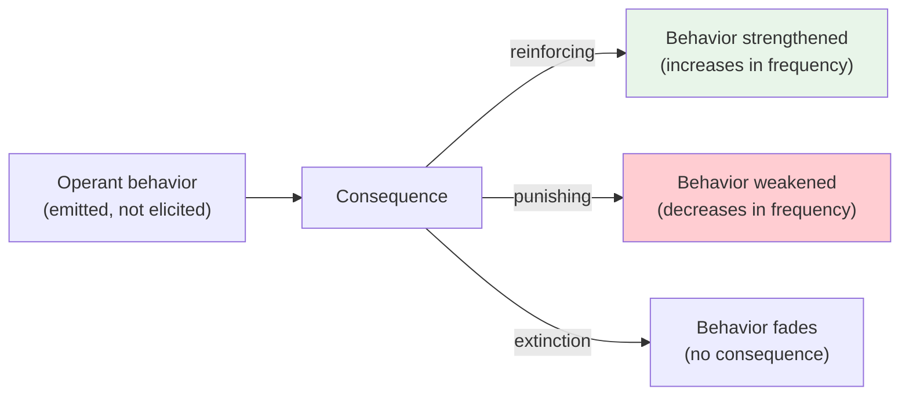

# Chapter 11 · Module 3
# Skinner's Box — Radical Behaviorism
## Psychology · Unit 1 · History of Psychology

---

In 1928, a young man arrives at Harvard with a suitcase and a crisis. Burrhus Frederick Skinner — "Fred" to everyone who knows him — has spent the past two years failing. He wanted to be a writer. He moved to Greenwich Village, smoked a pipe, lived in a garret, and produced almost nothing. Robert Frost told him his short stories showed promise, but praise from a famous poet does not pay rent. Skinner returns home to Pennsylvania, reads Watson and Pavlov, and has what he later describes as a conversion experience. He decides to abandon literature and become a psychologist. His parents are horrified. His girlfriend's father — a judge — tells him psychology is not a real profession. Skinner enrolls at Harvard anyway.

He devours physiology and psychology. He builds a small laboratory in his apartment. He rigs up a box — a simple chamber with a lever and a food dispenser — and puts a rat inside. The rat presses the lever. A food pellet drops. Skinner watches. He records. He adjusts. Over the next sixty years, from this humble beginning, Skinner will build a psychology that rejects Tolman's cognitive maps, dismisses Hull's mathematical postulates, and claims to explain all of human behavior without ever referring to the mind.

This is **radical behaviorism** — the most uncompromising version of behaviorism ever developed. And its creator is one of the most famous, controversial, and misunderstood psychologists who ever lived.

## The Skinner Box: How Operant Conditioning Works

Skinner's key insight was deceptively simple. Pavlov had studied **respondent behavior** — behavior *elicited* by a stimulus, like a dog salivating when it sees food. But most of what organisms do is not elicited by anything. A rat walks around a cage. A pigeon pecks at the floor. A child babbles. These behaviors are not triggered by a specific stimulus; they are **emitted** by the organism. Skinner called them **operant behavior** — behavior that "operates" on the environment.

The question was: what happens after the behavior is emitted? If the rat presses a lever and food appears, the probability that it will press the lever again increases. Skinner called this **operant conditioning**: the strengthening of behavior through its consequences. Unlike Pavlovian conditioning, where the response is automatic, operant conditioning depends on what happens *after* the behavior.

Skinner built his famous **Skinner box** — a small, controlled chamber with a lever (for rats) or a key (for pigeons) and a mechanism for delivering reinforcement. The box eliminated distractions and allowed precise measurement of response rates. Skinner recorded how many times the rat pressed the lever per unit of time, creating cumulative records that showed the rising curve of learning.

But Skinner went further. He discovered that *how* you deliver reinforcement matters as much as *whether* you deliver it. He identified four basic **schedules of reinforcement**:

- **Fixed ratio**: Reinforcement after a set number of responses (e.g., every 10th lever press). Produces high response rates with brief pauses after reinforcement.
- **Variable ratio**: Reinforcement after an unpredictable number of responses. Produces the highest, most consistent response rates — this is why gambling is so addictive.
- **Fixed interval**: Reinforcement for the first response after a set time period. Produces a scalloped pattern — the organism responds more as the time for reinforcement approaches.
- **Variable interval**: Reinforcement for the first response after unpredictable time periods. Produces slow, steady responding.

Skinner also developed **shaping** — the technique of reinforcing progressive approximations to a target behavior. Instead of waiting for the rat to press the lever by accident, you reinforce it first for facing the lever, then for approaching it, then for touching it, then for pressing it. Using shaping, Skinner's lab taught pigeons to play ping-pong, guide missiles, and — in one famous demonstration — spell out words by pecking at letters.

*Figure: The basic operant conditioning cycle — behavior is shaped by its consequences.*

> [!TIP] **Stop and Think**
> Skinner argued that a reinforcing stimulus is simply one that reinforces — a definition that sounds circular. But think about it from the organism's perspective: how does the rat "know" that food is reinforcing? Is the circularity a fatal flaw, or is it just the nature of how reinforcement works?

## The Man Who Rejected Theory

Skinner's most radical claim was not about rats or pigeons. It was about the nature of science itself. He rejected the entire apparatus of neobehaviorist theory — intervening variables, hypothetical constructs, operational definitions, the hypothetico-deductive method. He argued that all of it was unnecessary, and worse, misleading.

His argument was elegant. Neobehaviorists like Hull and Tolman insisted that theoretical constructs must be operationally defined in terms of observable stimuli and responses. But Skinner pointed out the fatal circularity: if "habit strength" is defined entirely in terms of the number of reinforced trials and the probability of response, then saying "the rat pressed the lever because of its habit strength" is just saying "the rat pressed the lever because it had been reinforced to press the lever." The theory adds nothing. It is an **explanatory fiction** — a label that sounds explanatory but is actually redundant.

Skinner made the same point about everyday psychological explanations. "He drinks because he is thirsty" — but if "thirsty" just means "has a tendency to drink," then the explanation is circular. "She stole bread because she was hungry" — but the external conditions that caused the hunger would have sufficed to explain the theft. "He is anxious" — but we still need to identify the external conditions that produced the anxiety. Why not just study the external conditions directly?

"The objection to inner states," Skinner wrote, "is not that they do not exist, but that they are not relevant in a functional analysis." We cannot stay inside the organism to explain behavior. We must look at the environment — at the reinforcement contingencies that shape and maintain behavior. Everything else is a digression.

This was a powerful critique of neobehaviorist theory. But it had a blind spot. Skinner's argument worked against operationally defined intervening variables — constructs that are just shorthand for observable correlations. It did not work against Tolman's cognitive constructs, which had "surplus meaning" beyond their operational definitions. A cognitive map is not just a description of the rat's behavior in the maze; it is a representation of the maze itself. You can understand what a cognitive map *is* without knowing how the rat behaves. Skinner never adequately addressed this distinction.

| Claim | Skinner's Position | The Counter-Argument |
|---|---|---|
| Internal states don't matter | "Not relevant in a functional analysis" | They may have autonomous causal power |
| Theory is unnecessary | Induction of functional laws suffices | Theory generates novel predictions |
| Explanations are circular | "Thirsty" = "tendency to drink" | Cognitive constructs have surplus meaning |
| Environment determines behavior | Total environmentalism | Organisms interpret and represent environments |

*Table: Skinner's radical claims and the responses they provoked.*

> [!TIP] **Stop and Think**
> Skinner said internal states exist but are irrelevant to explaining behavior. Can you think of a case where knowing about an internal state — a belief, a desire, a representation — gives you predictive power that purely environmental analysis would miss?

## The Public Skinner: Walden Two and Beyond Freedom and Dignity

Skinner was not content to stay in the laboratory. He wanted to change the world.

In 1948, he published *Walden Two*, a novel about a utopian community run on principles of behavior modification. The community has no punishment, no coercion, no traditional government. Instead, residents are shaped from childhood through positive reinforcement to behave cooperatively and productively. The book sold modestly at first but became a bestseller in the 1960s, inspiring the creation of several real-life communities based on its principles.

In 1971, Skinner published *Beyond Freedom and Dignity*, a far more provocative book. In it, he argued that the concepts of human freedom and personal dignity are "pre-scientific" notions that obstruct the application of behavioral science to social problems. The book became a bestseller and made Skinner a household name — and a lightning rod for criticism. Television hosts asked him outrageous questions. When asked whether he would burn his books or his children if forced to choose, Skinner said he would burn his children (meaning they were replaceable in ways his ideas were not). The public was appalled.

The irony is that Skinner's applied work was often humane and effective. His principles of behavior modification were used in education (programmed instruction and teaching machines), clinical psychology (token economies in psychiatric hospitals), and animal training. Keller and Marian Breland, two of Skinner's former students, founded Animal Behavior Enterprises, which trained animals for commercials and educational shows using operant conditioning. The legacy of applied behavior analysis — including its use in helping children with autism — continues to this day.

But Skinner's philosophical position — that human freedom is an illusion, that all behavior is environmentally determined — remained deeply controversial. He denied that he was a "mere" environmentalist, but his rejection of the idea that humans are "the true originator or initiator of action" left little room for agency, creativity, or choice.

> [!TIP] **Stop and Think**
> Skinner raised his daughter Deborah in an air-controlled "baby box" for the first two and a half years of her life. Rumors later claimed she was psychologically scarred. In fact, she graduated with honors from Radcliffe and became a successful artist. Does this outcome validate Skinner's approach? What would you need to know before drawing that conclusion?

## Speaking of Reinforcement Schedules...

You encounter operant conditioning every day, whether you realize it or not. In India, food delivery apps like Zomato and Swiggy use variable ratio reinforcement — occasional discounts and surprise offers keep you checking the app. In Brazil, the gamification of fitness apps like Strava uses fixed ratio rewards (badges for every 10 workouts) to keep runners engaged. In South Korea, mobile games are designed around variable ratio schedules — you never know when you will get a rare item, so you keep playing. In the United Kingdom, loyalty card programs at bakery chains use fixed interval reinforcement (a free pastry after every 10 purchases) to maintain customer habits.

The slot machine is the purest example. It operates on a variable ratio schedule — you never know which pull will pay off. This produces the highest, most consistent rate of responding, which is why gambling is so difficult to stop. Skinner himself noted this connection, and behavioral economists have since confirmed that variable ratio schedules are the most resistant to extinction — the behavior persists long after the average payoff drops below the cost of playing.

Skinner's insight about schedules of reinforcement is one of the most practically useful findings in all of psychology. It explains why social media is addictive (variable ratio likes and comments), why people check their phones compulsively (variable interval notifications), and why slot machines generate more revenue than any other casino game. The principles are universal, even if the specific applications vary by culture.

> [!TIP] **Stop and Think**
> Think about the apps on your phone. Which ones use variable ratio reinforcement to keep you coming back? Which use fixed interval or fixed ratio schedules? Now think about your own habits — checking social media, opening email, playing games. Are these habits you chose, or are they behaviors that were shaped by schedules of reinforcement designed by someone else?

> [!TIP] **Stop and Think**
> Skinner dismissed the concept of human freedom as a superstition. But you feel free — you choose what to eat, what to read, what career to pursue. Is that feeling of freedom itself a product of reinforcement contingencies? Can a behaviorist account of choice preserve the meaningfulness of human freedom?

> [!IMPORTANT]
> Skinner's radical behaviorism gave psychology some of its most powerful practical tools — shaping, reinforcement schedules, and behavioral analysis — while simultaneously pushing the rejection of mental life to its logical extreme. His insight that behavior is shaped by its consequences remains one of the most robust findings in all of psychology. But his insistence that internal states are irrelevant to explanation, and that freedom and dignity are pre-scientific illusions, revealed the fundamental tension at the heart of radical behaviorism: a framework powerful enough to shape behavior in the laboratory, yet too narrow to account for the minds of the organisms inside it.

---

Skinner's radical behaviorism was the last great expression of the behaviorist tradition. It was powerful, elegant, and deeply controversial. It gave psychology tools of enormous practical value — shaping, reinforcement schedules, behavioral analysis. But it also pushed the rejection of mental life to its logical extreme, denying the relevance of cognition, consciousness, and agency in a way that many psychologists found intolerable. As we will see in the next module, the cracks in the behaviorist edifice were already appearing — not from philosophical criticism, but from the behaviorists' own experiments.

*[Module 3 of 5 complete.]*

## References

- Skinner, B. F. (1938). *The Behavior of Organisms: An Experimental Analysis*. New York: Appleton-Century.
- Skinner, B. F. (1953). *Science and Human Behavior*. New York: Macmillan.
- Skinner, B. F. (1957). *Verbal Behavior*. New York: Appleton-Century-Crofts.
- Skinner, B. F. (1971). *Beyond Freedom and Dignity*. New York: Knopf.
- Ferster, C. B., & Skinner, B. F. (1957). *Schedules of Reinforcement*. New York: Appleton-Century-Crofts.
