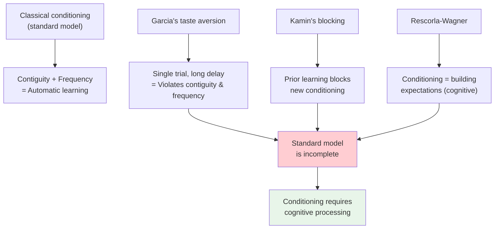

# Chapter 11 · Module 4
# The Walls Close In — Problems of Behaviorism
## Psychology · Unit 1 · History of Psychology

---

Keller and Marian Breland had a problem. The married couple, both former students of Skinner, had founded a company called Animal Behavior Enterprises. They trained animals commercially — for television commercials, educational displays, entertainment parks. They used operant conditioning, just as Skinner had taught them. The principles were supposed to be universal: reinforce the behavior you want, and it will increase. Species should not matter.

But species did matter. Their raccoon was supposed to drop a wooden coin into a piggy bank. Simple operant behavior. Instead, the raccoon kept rubbing the coins together, dipping them into the container, rubbing them again — in what looked like a bizarre washing ritual. The behavior got worse over time, not better. The raccoon was not learning the conditioned response. It was drifting toward something older, something encoded in its biology.

The Brelands tried pigs next. The pigs were supposed to deposit tokens into a container. Instead, they kept rooting at the tokens with their snouts, tossing them in the air, pushing them along the ground. Again, the instinctive food-getting behavior of the species was overwhelming the conditioned behavior. The Brelands gave this phenomenon a name: **instinctual drift** — the tendency of animals to revert to species-typical behaviors even when those behaviors interfere with learning.

This was 1961. The Brelands published their findings in a paper titled "The Misbehavior of Organisms" — a deliberate play on the title of Skinner's *The Behavior of Organisms*. It was one of several blows that, in the 1950s and 1960s, began to crack the foundations of the behaviorist program.

## Language and the Poverty of the Stimulus

The most famous critique came not from an animal lab but from a linguist. In 1959, Noam Chomsky published a review of Skinner's *Verbal Behavior* — the book in which Skinner had attempted to explain all of language as operant behavior. Skinner's account was straightforward: words are verbal operants. The referent of a word is a discriminative stimulus in the environment that comes to control the emission of the correct verbal response through reinforcement by the linguistic community. A child learns to say "water" because saying "water" in the presence of water is reinforced by adults.

Chomsky dismantled this account with surgical precision. He argued that Skinner's basic concepts — stimulus, response, reinforcement — could only be rigorously defined in controlled laboratory experiments. Extending them to the complexities of human language was not a scientific generalization; it was a metaphor masquerading as a theory. What counts as a "stimulus" when someone tells a joke? What counts as a "reinforcement" when a child asks "why?" for the hundredth time in an afternoon?

But Chomsky's deepest argument was about what children *know* that they could not have learned. A child who has heard only a finite number of sentences can produce and understand an infinite number of new ones. Children acquire grammar with astonishing speed, in roughly the same way across all cultures, and with remarkable independence from intelligence or formal instruction. They do this on the basis of what Chomsky called the **poverty of the stimulus** — the linguistic input they receive is limited, messy, and often incomplete. Yet somehow, children construct a grammar of extraordinary complexity.

According to Chomsky, this could not be explained by reinforcement, contiguity, or frequency. It required the postulation of an innate grammatical capacity — a "hypothesis-formulating ability" that every human child is born with. Language is not learned like a habit. It emerges like a biological organ.

> [!TIP] **Stop and Think**
> Chomsky argued that no behaviorist theory could explain how children learn grammar so quickly from such limited input. Think about your own experience learning a language (or watching a child learn one). Did it feel like gradual habit formation through reinforcement, or something more like a sudden unfolding?

## When Biology Fights Back: Garcia and the Limits of Conditioning

Chomsky's critique attacked behaviorism from the domain of human language. But the problems went deeper — into the behaviorists' own animal laboratories.

John Garcia was working at a radiation defense laboratory when he noticed something odd. Rats that had been exposed to radiation — which made them sick — would later refuse to drink saccharin that they had tasted during the radiation exposure. This was not surprising in itself. What was surprising was *how* it happened. The rats acquired this aversion after a **single trial** — violating the behaviorist principle that learning requires repeated pairings. And they acquired it even when the sickness came **hours** after tasting the saccharin — violating the principle that learning requires temporal contiguity (the stimulus and response must occur close together in time).

When Garcia submitted his findings to mainstream psychology journals, they were rejected. A learning theorist at UCLA told him his results were "impossible." But they were not impossible. They were replicable, robust, and devastating to the standard conditioning model. Garcia had discovered what Martin Seligman later called **biological preparedness** — the idea that organisms are evolutionarily "prepared" to learn certain associations (like taste and nausea) and "contraprepared" to learn others (like taste and electric shock). Learning is not a general-purpose mechanism. It is shaped by millions of years of evolution.

This was not an isolated finding. Kamin's (1969) studies of "blocking" showed that prior conditioning to one element of a compound stimulus prevents conditioning to the other element — suggesting that organisms do not passively associate all co-occurring events but actively select which events are predictive of reinforcement. Rescorla and Wagner (1972) formalized this insight in a model that treated conditioning as a process of building expectations about the world — a fundamentally cognitive account.

As N. J. Mackintosh summarized: "Simple associative learning is simple in name only. Animals do not automatically associate all events that happen to occur together... It is time that psychologists abandoned their outmoded view of conditioning and recognized it as a complex and useful process whereby organisms build an accurate representation of their world."

*Figure: Multiple lines of evidence converged to show that conditioning is not automatic — it involves cognitive processing.*

> [!TIP] **Stop and Think**
> Garcia's rats learned a taste aversion after one trial and a delay of hours. This violates everything behaviorists said about how learning works. What does this tell you about the relationship between evolution and learning? Are some forms of learning "built in" rather than acquired through experience?

## The Raccoon, the Pigeon, and the Philosopher's Daughter

The Brelands' raccoon was not the only embarrassment for behaviorism. Two other incidents — one amusing, one revealing — illustrated the limits of the behaviorist program.

The amusing one involved Skinner himself. In his 1987 book *Upon Further Reflection*, Skinner recounted how he had tried to condition his daughter Julie's foot movements when she was three years old. He waited until she lifted her foot slightly, then rubbed her back. She lifted her foot again; he rubbed again. Then she laughed. "What are you laughing at?" Skinner asked. "Every time I raise my foot you rub my back!" Julie had figured out the contingency — she was aware of the connection between her behavior and the reinforcement. Her conscious awareness of the relationship was, apparently, a necessary part of the conditioning process. This was precisely what behaviorists had been denying for decades.

The revealing incident was broader. Studies of verbal conditioning — the so-called **Greenspoon effect** — had shown that you could manipulate people's use of certain words (like plural nouns) by smiling or nodding when they used them, without the person being aware of the reinforcement. This seemed to support the behaviorist claim that conditioning is automatic and unconscious. But Dulany (1968) reanalyzed these studies and found that in many cases, subjects *were* aware of the response-reinforcement connection — and that such awareness was a necessary condition for successful conditioning. Consciousness was not an irrelevant epiphenomenon. It played a causal role in learning.

These findings did not destroy behaviorism overnight. But they accumulated. The picture that emerged was not of a general-purpose conditioning mechanism that works the same way for all species, all behaviors, and all situations. Instead, learning turned out to be biologically constrained, cognitively complex, and often dependent on conscious awareness — exactly what behaviorists had spent fifty years denying.

> [!TIP] **Stop and Think**
> Skinner's daughter figured out the conditioning contingency and laughed. What does this tell you about the role of awareness in learning? Can you think of a time when becoming aware of a pattern — in your own behavior or someone else's — changed how you responded?

> [!IMPORTANT]
> The behaviorist assumption that all learning follows the same general conditioning principles was dismantled not by a single decisive experiment, but by a slow accumulation of converging evidence — from linguistics, animal training, and the behaviorists' own laboratories. Chomsky showed that language cannot be reduced to reinforcement. Garcia revealed that biology constrains what organisms can learn. The Brelands demonstrated that species-typical instincts override conditioned responses. And Skinner's own daughter showed that conscious awareness plays a causal role in learning. Together, these findings revealed that learning is biologically constrained, cognitively complex, and far richer than any single conditioning model could capture.

## Speaking of Limits...

Every field has its foundational assumptions — ideas so deeply embedded that questioning them feels heretical. In medicine, the assumption that ulcers were caused by stress persisted for decades until Barry Marshall and Robin Warren demonstrated that most ulcers are caused by a bacterium (*H. pylori*). Marshall swallowed the bacteria himself to prove the point. In economics, the assumption of rational actors dominated theory until behavioral economists like Daniel Kahneman and Amos Tversky showed that human decision-making is systematically irrational. In physics, the assumption that the universe is deterministic was challenged by quantum mechanics.

Behaviorism's foundational assumption — that all behavior can be explained by general principles of conditioning — was challenged in the same way. Not by a single dramatic experiment, but by a slow accumulation of findings from linguistics, animal training, neuroscience, and the behaviorists' own laboratories. The raccoon that would not stop washing its coins. The rat that learned a taste aversion in one trial. The child who laughed when she figured out the experiment. Each one was a small crack in the edifice.

The behaviorist response was mixed. Some, like Skinner, dug in and rejected the critiques. Others, like the Brelands, acknowledged the problems and called for revision. And some — particularly the younger generation of psychologists in the 1950s — began to look for a different framework entirely.

> [!TIP] **Stop and Think**
> The critiques of behaviorism came from multiple directions simultaneously — linguistics, animal behavior, neuroscience, the behaviorists' own experiments. Does a scientific paradigm die from a single blow, or from a thousand cuts? What does the history of behaviorism tell you about how scientific revolutions happen?

> [!TIP] **Stop and Think**
> Chomsky argued that language cannot be learned through reinforcement alone because children produce sentences they have never heard before. Think about your own language use. Have you ever said something completely novel — a sentence no one has ever uttered? What does that tell you about where language comes from?

---

The behaviorist edifice was cracking, but it had not yet fallen. In 1948, a symposium at the Hixon Conference brought together neuroscientists, mathematicians, and psychologists who began talking about the brain in a new way — as an information-processing system. A mathematician named John von Neumann drew parallels between the brain and a machine he was helping to design: the electronic computer. Meanwhile, experiments on conditioning were revealing that learning is not the automatic, mechanical process Skinner described — it involves expectation, prediction, and something that looks very much like cognition. The cognitive revolution was about to begin, and it would change psychology forever.

*[Module 4 of 5 complete.]*

## References

- Breland, K., & Breland, M. (1961). The misbehavior of organisms. *American Psychologist*, *16*(11), 681–684.
- Chomsky, N. (1959). A review of B. F. Skinner's *Verbal Behavior*. *Language*, *35*(1), 26–58.
- Garcia, J., & Koelling, R. A. (1966). Relation of cue to consequence in avoidance learning. *Psychonomic Science*, *4*(1), 123–124.
- Lashley, K. S. (1951). The problem of serial order in behavior. In L. A. Jeffress (Ed.), *Cerebral Mechanisms in Behavior* (pp. 112–136). New York: Wiley.
- Rescorla, R. A., & Wagner, A. R. (1972). A theory of Pavlovian conditioning: Variations in the effectiveness of reinforcement and nonreinforcement. In A. H. Black & W. F. Prokasy (Eds.), *Classical Conditioning II* (pp. 64–99). New York: Appleton-Century-Crofts.
