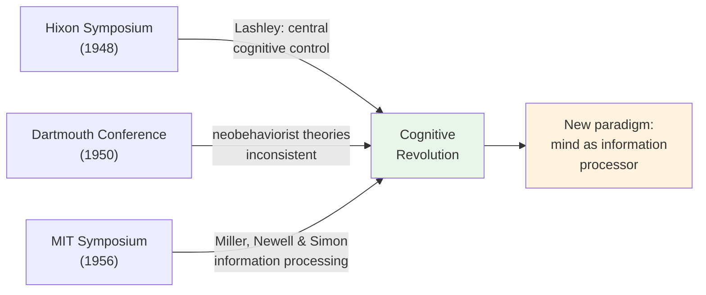

# Chapter 11 · Module 5
# The Eve of Revolution — From Behaviorism to Cognition
## Psychology · Unit 1 · History of Psychology

---

Pasadena, California, October 1948. The California Institute of Technology is hosting a symposium on "Cerebral Mechanisms in Behavior." The room is crowded with some of the most brilliant minds of the twentieth century. Karl Lashley, the neuro psychologist who once worked alongside Watson, sits in the front row. John von Neumann, the mathematician who helped design the atomic bomb and is now thinking about computers, is in the back. Wolfgang Köhler, the Gestalt psychologist who challenged behaviorism from Berlin, is nearby. Warren McCulloch, a neurophysiologist who believes the brain is a kind of logical machine, is presenting.

Lashley speaks first. He has spent decades studying how the brain learns, and he has arrived at a conclusion that would have been heresy in any behaviorist laboratory: complex behavior cannot be explained by chains of stimulus-response connections. Something else is going on. The brain is not a passive receiver of stimuli. It is an active, organized system that generates behavior from within. "Input is never into a quiescent or static system," Lashley tells the audience, "but always into a system which is always already excited and organized."

Von Neumann follows. He draws a startling parallel between the brain and the newly invented electronic computer. Both process information. Both store and retrieve data. Both operate on logical rules. The analogy is imperfect — von Neumann knows this — but it is powerful. If the brain is a kind of computer, then psychology needs a new vocabulary: information, processing, storage, retrieval. Not stimulus, response, reinforcement.

The **Hixon Symposium** of 1948 did not launch the cognitive revolution. But it cracked the door open. And over the next eight years, a series of events would push that door wide open — until psychology could no longer ignore what was on the other side.

## The Three Conferences That Changed Psychology

The cognitive revolution did not happen in a single moment. It unfolded across three landmark events, each building on the last, each eroding the behaviorist consensus a little further.

**The Hixon Symposium (1948).** Lashley's argument about serial ordering was the intellectual centerpiece. He pointed to language, music, and skilled movement — all of which involve complex sequences that cannot be explained by simple stimulus-response chains. When a pianist plays a sonata, the order of finger movements is determined by the musical score, not by the environmental stimuli pressing on each finger. When you speak a sentence, the order of words is determined by grammatical rules, not by the sequence of sounds you have heard. Something in the brain — some **central cognitive control process** — is organizing behavior from the top down.

Von Neumann's contribution was equally revolutionary. He suggested that the brain's neural networks might operate like the logical circuits of a computer — processing information according to rules, not merely transmitting impulses along reflex arcs. This was the seed of computational cognitive psychology, a field that would not fully blossom for another two decades.

**The Dartmouth Conference on Learning (1950).** Two years after Hixon, a conference at Dartmouth brought together learning theorists to assess the state of their field. The verdict was devastating. Neobehaviorist theories of learning — Hull's drive-reduction system, Tolman's cognitive maps, Skinner's operant conditioning — were found to be inconsistent with each other and beset by empirical anomalies. The conference proceedings, published as *Modern Learning Theory* (Estes et al., 1954), documented a field in crisis. The grand dream of a unified science of learning had collapsed under the weight of contradictory evidence.

**The MIT Symposium on Information Theory (1956).** This was the moment that Jerome Bruner and George Miller — two of the undisputed leaders of the cognitive revolution — later identified as the revolution's official launch. At this symposium, Miller presented his landmark paper "The Magical Number Seven, Plus or Minus Two," which demonstrated that human short-term memory has a fixed capacity of about seven items — a finding that made no sense in behaviorist terms but fit perfectly with an information-processing model of the mind. Allen Newell and Herbert Simon presented their Logic Theory Machine, a computer program that could prove mathematical theorems — demonstrating that machines could think, or at least process information in ways that resembled thinking.

*Figure: Three conferences across eight years moved psychology from behaviorism to cognition.*

> [!TIP] **Stop and Think**
> The cognitive revolution was launched at a symposium on information theory — an engineering topic. What does it tell you about the nature of scientific revolutions that psychology's biggest paradigm shift was inspired by a technology (the computer) rather than by a discovery about the mind itself?

## The WWII Engine: How War Transformed Psychology

Behind these intellectual developments lay a massive institutional transformation. The Second World War did for psychology in the 1940s what the First World War had done in 1917 — it demonstrated psychology's practical value and expanded its institutional reach. But the scale was far greater.

During the war, psychologists contributed to personnel selection, intelligence work, the evaluation of prisoners of war, studies of troop morale, the psychological effects of bombing, civilian reactions to D-Day, propaganda analysis, and — most importantly — **human factors research**. This last area focused on the interaction between human operators and machines: how do you design a torpedo so that a sailor can operate it under stress? How do you arrange a radar screen so that an operator can detect incoming aircraft? How do you design a cockpit so that a pilot can read the instruments in combat?

Human factors research pushed psychologists to think about the mind in new ways. The problem was no longer "how does a rat learn to press a lever?" It was "how does a human operator process information from multiple sources, make decisions under time pressure, and coordinate complex sequences of action?" These questions demanded a vocabulary of attention, perception, decision-making, and information processing — the vocabulary of cognitive psychology.

The war also transformed the institutional structure of the APA. In 1944, the APA was reorganized with 18 charter divisions, representing the interests of applied psychologists — clinical, consulting, industrial, school — alongside the existing scientific societies. The new constitution stated that the goal of the association was "to advance psychology as science, as a profession, and as a means of promoting human welfare." Applied psychologists had won their seat at the table.

After the war, the Veterans Administration and the U.S. Public Health Service funded training programs in clinical psychology at major universities, creating a new generation of psychologists who were as much practitioners as researchers. Industrial psychology boomed: the use of psychological tests in business rose from about 14 percent before the war to about 75 percent by 1950. Psychology was no longer a niche academic discipline. It was a profession.

> [!TIP] **Stop and Think**
> Human factors research during WWII forced psychologists to study how people process information from multiple sources simultaneously. Think about your own experience using a smartphone while walking in a busy city. What cognitive processes are at work — and how are they different from what a behaviorist account would predict?

## What the Behaviorists Got Right — and What They Missed

It would be easy to tell this story as a simple triumph: behaviorism was wrong, cognition was right, and the good guys won. But that would be dishonest. The truth is more complicated, and more interesting.

The behaviorists were right about several things. They were right that psychology needed to be an empirical science — grounded in observation and experiment, not armchair speculation. They were right that the mind cannot be studied through introspection alone. They were right that behavior is influenced by environmental contingencies — by what happens before and after we act. They were right that rigorous experimental methods are essential. These contributions endure.

But they were wrong about something fundamental. They were wrong that the mind is irrelevant to explaining behavior. They were wrong that all learning can be reduced to a single set of conditioning principles. They were wrong that cognition, consciousness, and biological constraints can be ignored. And they were wrong that a science of psychology can be built without a science of the mind.

The cognitive revolution did not destroy behaviorism. Behavior modification, applied behavior analysis, and operant conditioning remain powerful tools in education, clinical psychology, and animal training. What the cognitive revolution destroyed was behaviorism's monopoly — its claim to be the only legitimate way to study the mind. After 1956, psychologists could study mental processes without being accused of mysticism. They could postulate internal representations without being dismissed as unscientific. They could take cognition seriously.

| What Behaviorism Contributed | What Cognition Added |
|---|---|
| Empirical, experimental methods | Study of internal mental processes |
| Environmental contingencies matter | Internal representations also matter |
| Observable behavior as data | Information processing as framework |
| Rigor and operational definition | Theoretical richness and flexibility |
| Practical applications (therapy, education) | Understanding of language, memory, thinking |

*Table: The behaviorist legacy and the cognitive addition.*

> [!TIP] **Stop and Think**
> Skinner accused cognitive psychologists of "emasculating the experimental analysis of behavior" and returning to superstition. Was he entirely wrong? Are there risks to studying internal mental states that behaviorists were right to worry about?

> [!IMPORTANT]
> Behaviorism gave psychology its empirical backbone — rigorous methods, environmental analysis, and practical applications that endure to this day. What it could not give was an account of the mind itself. The cognitive revolution did not erase the behaviorist contribution; it completed it. Together, behaviorism and cognition reveal a science that needed both: a framework grounded in observable behavior and a willingness to take internal mental processes seriously. The lesson is not that one side was right and the other wrong, but that a mature science of psychology requires both.

## Speaking of Revolutions...

You live in the world the cognitive revolution built. When you use a search engine, you are benefiting from information-processing models of human memory and attention. When you play a video game, the designers have applied cognitive psychology principles to manage your attention, working memory, and decision-making. When a doctor in Lagos uses a diagnostic checklist, the checklist was designed using cognitive research on how experts categorize information. When a teacher in São Paulo uses spaced repetition to help students learn vocabulary, the technique is based on cognitive research on memory consolidation.

The computer metaphor that von Neumann introduced at the 1948 Hixon Symposium has become so pervasive that it is hard to think about the mind in any other way. We speak of the brain "processing" information, "storing" memories, "retrieving" knowledge. We worry about our mental "bandwidth" and our "cognitive load." These metaphors are not neutral — they shape how we think about thinking. And they trace directly back to that crowded room in Pasadena where a mathematician, a neurophysiologist, and a neuropsychologist began to imagine the mind as something new.

In South Korea, cognitive psychology research on attention and multitasking has influenced national policies on smartphone use while driving. In India, cognitive load theory has reshaped how textbooks are designed for the national education system. In Nigeria, cognitive research on decision-making under uncertainty has been applied to public health campaigns. The cognitive revolution was not just an American event. Its consequences are global.

> [!TIP] **Stop and Think**
> The behaviorists tried to build a psychology without the mind. The cognitive psychologists tried to build a psychology centered on the mind. Neither camp got everything right. What would a psychology that takes both behavior and cognition seriously — that studies how the mind shapes behavior and how behavior shapes the mind — actually look like?

> [!TIP] **Stop and Think**
> The computer metaphor for the mind has been enormously productive — but is it also limiting? The brain does not process information the way a computer does. It is wet, noisy, parallel, emotional, embodied. What might a different metaphor — the brain as an ecosystem, or a jazz ensemble, or a conversation — reveal that the computer metaphor hides?

---

The story of neobehaviorism, radical behaviorism, and the problems of behaviorism is, at its heart, a story about the limits of a paradigm. For fifty years, behaviorism gave psychology its methods, its institutional structure, and its public identity. It was not a mistake. It was a necessary stage in the development of a science. But it was also incomplete. The mind is not a black box. It is the thing psychology was always trying to understand.

*[Module 5 of 5 complete. Chapter 11 complete. Take time with the "Stop and Think" prompts before moving to the next chapter.]*

## References

- Bruner, J. S. (1980). *In Search of Mind: Essays in Autobiography*. New York: Harper & Row.
- Estes, W. K., Koch, S., MacCorquodale, K., Meehl, P. E., Mueller, C. G., Schoenfeld, W. N., & Verplanck, W. S. (1954). *Modern Learning Theory*. New York: Appleton-Century-Crofts.
- Lashley, K. S. (1951). The problem of serial order in behavior. In L. A. Jeffress (Ed.), *Cerebral Mechanisms in Behavior* (pp. 112–136). New York: Wiley.
- Miller, G. A. (1956). The magical number seven, plus or minus two: Some limits on our capacity for processing information. *Psychological Review*, *63*(2), 81–97.
- von Neumann, J. (1951). The general and logical theory of automata. In L. A. Jeffress (Ed.), *Cerebral Mechanisms in Behavior* (pp. 1–31). New York: Wiley.
