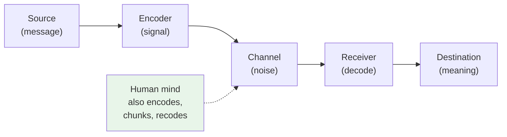
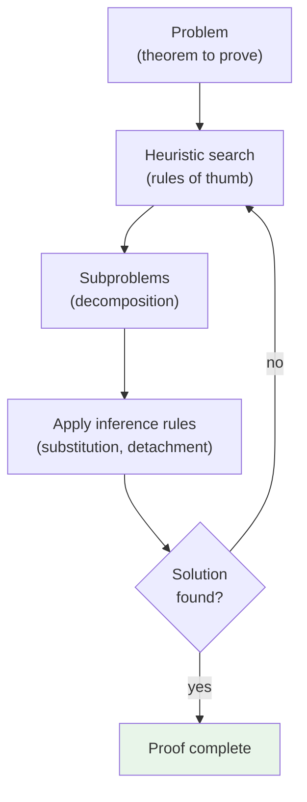

# Chapter 12 · Module 1
# The Machine That Thinks — Information Theory and the Birth of Cognitive Science
## Psychology · Unit 1 · History of Psychology

---

The year is 1943. A torpedo is launched from a submarine in the North Atlantic. Its target is a convoy of merchant ships, but the ships are moving, turning, evading. A traditional torpedo travels in a straight line and misses. But this torpedo is different. It carries a device that listens to the sound of the ship's engines, calculates the angle of approach, and adjusts its own trajectory — turning left, then right, then left again — until it finds its target. The torpedo is not alive. It has no brain, no consciousness, no intentions. But it behaves *purposefully*. It corrects its course based on feedback from the environment. It pursues a goal.

A mathematician named Norbert Wiener watches this and sees something profound. The torpedo's behavior is not random. It is not a simple reflex. It is regulated by information — signals from the goal that modify the activity of the object in the course of the behavior. Wiener has a name for this: **feedback**. And he has a name for the science that studies it: **cybernetics**, from the Greek word for "steersman." In his 1948 book *Cybernetics*, Wiener argues that the same principles of control and communication apply to animals, humans, and machines. "Information is information," he writes, "not matter or energy."

This single sentence will reshape psychology. For fifty years, behaviorists had insisted that psychology must study observable behavior — stimuli and responses. Now, a mathematician is saying that there is a third kind of thing in the universe: information. And the study of how organisms acquire, process, store, and use information will become the foundation of a new science of the mind.

## From Wires to Minds: Shannon's Communication Theory

The story begins not in a psychology laboratory but in a telephone company. Claude Shannon, an engineer at Bell Laboratories, was wrestling with a practical problem: how do you transmit the maximum amount of information through a limited-capacity channel — a telephone wire, a radio wave — with the minimum loss due to noise?

Shannon's solution, published in 1948, was elegant. He defined **information** in terms of reduction in uncertainty. If you already know that tomorrow is Monday, receiving the message "tomorrow is Monday" carries no information. But if you are uncertain whether tomorrow is Monday or Tuesday, the message resolves that uncertainty — and the amount of information it carries can be measured mathematically. Shannon defined the **bit** (short for "binary unit") as the elemental unit of information: the amount needed to decide between two equally probable alternatives. A coin flip carries one bit. A message that tells you which of eight equally probable outcomes occurred carries three bits.

Shannon and Warren Weaver developed a general model of communication: a **source** generates a message, which is encoded into a signal, transmitted through a **channel** (which introduces **noise**), decoded by a receiver, and delivered to a **destination**. This model was designed for telephone circuits. But George Miller, a young psychologist at Harvard, saw that it could be applied to the human mind.

Miller introduced Shannon's statistical measures to psychology in the early 1950s. He used information theory to analyze how people process verbal stimuli, how much information they can hold in short-term memory, and how they encode and decode messages. In his landmark 1956 paper "The Magical Number Seven, Plus or Minus Two," Miller demonstrated that human short-term memory has a capacity of about seven items — a finding that made perfect sense in information-processing terms but was mysterious from a behaviorist perspective.

But Miller also discovered something that went beyond information theory. People do not just passively receive information. They **recode** it. The seven items in your memory are not fixed units; they are **chunks** that you can expand by grouping. The letters R, H, M, T, E, O are six items. But rearranged as M-O-T-H-E-R, they become one chunk. The memory span is fixed at about seven chunks, but the size of each chunk is limited only by your ability to organize the input. This was not a passive process of stimulus-response association. It was an active process of cognitive transformation.

*Figure: Shannon's communication model — and how the human mind goes beyond it by actively recoding information.*

> [!TIP] **Stop and Think**
> Shannon defined information as reduction in uncertainty. Is this the same as "meaning"? A random string of letters carries high information in Shannon's sense (it is unpredictable), but it carries no meaning. What is the difference between information and understanding?

## Machines That Think: Newell, Simon, and the Logic Theorist

The most dramatic demonstration that machines could process information like minds came in August 1956. At the RAND Corporation in Santa Monica, California, a program called the **Logic Theorist** ran on the JOHNNIAC computer (named after John von Neumann). The program was designed by Allen Newell, J. C. Shaw, and Herbert Simon. It was given the axioms of Russell and Whitehead's *Principia Mathematica* and a set of four inference rules — substitution, replacement, detachment, and chaining — and asked to prove theorems in symbolic logic.

The Logic Theorist proved 38 of the first 52 theorems from Chapter 2 of *Principia Mathematica*. One of its proofs was more elegant than the original proof in *Principia*. When Simon showed the results to his colleague Herbert Simon, he reportedly said, "It's thinking." Newell, Shaw, and Simon presented their achievement at the MIT Symposium on Information Theory in September 1956 — the same conference where Miller presented "The Magical Number Seven." According to Jerome Bruner and George Miller, this was the moment the cognitive revolution was born.

The Logic Theorist was not just a calculator. It employed **heuristics** — rules of thumb for searching through possible solutions — that mimicked the strategies human problem-solvers use. Newell, Shaw, and Simon argued that their program did not just solve problems; it solved them the way humans do. They supported this claim by comparing the program's behavior with "think-aloud" protocols from human subjects solving the same logical problems. The parallels were striking: both humans and the program organized problems hierarchically, employed directional search, and sometimes got stuck in blind alleys.

From the Logic Theorist, Newell and Simon went on to develop the **General Problem Solver** (GPS), a program designed to handle a wider range of cognitive tasks — chess, geometry, logic — using the same information-processing framework. They insisted that their theory had "nothing to do — directly — with computers." The programs could have been written "if computers had never existed." The computer was a tool for testing theories about the mind, not the mind itself.

This was a crucial distinction. The computer model of the mind was not a claim that the brain *is* a computer. It was a claim that the brain and the computer share something important: they both process information according to rules. The same program (software) can run on different physical systems (hardware) — a PC, a Mac, a human brain. This was Aristotle's functionalist insight, expressed in the language of computer science: psychological capacities are defined by what they do, not by what they are made of.

*Figure: The Logic Theorist's problem-solving process — decomposing problems into subproblems and applying inference rules, much like a human mathematician.*

> [!TIP] **Stop and Think**
> Simon said the Logic Theorist was "thinking." Searle later argued that computers manipulate symbols without understanding them — that a person following a Chinese-to-Chinese rulebook could pass a language test without understanding Chinese. Where do you stand: can a machine genuinely think, or does it only simulate thinking? Does the distinction matter for psychology?

## The Functionalists Were Right All Along

The development of information theory and computer science did something remarkable: it vindicated a philosophical position that had been marginalized for decades. Aristotle had argued that the soul (or mind) is defined by its functions — by what it does, not by what it is made of. The functionalist psychologists of the late nineteenth century — William James, John Dewey, James Rowland Angell — had made the same argument. The mind is not a substance; it is a capacity. And the same capacity can be realized in different physical systems.

Behaviorists had rejected this insight. They insisted that psychology must study observable behavior, not internal functions. But the computer demonstrated — in a way that no philosophical argument ever could — that functional explanations are scientifically legitimate. A computer program is not a physical thing. It is a set of rules that can be instantiated in vacuum tubes, silicon chips, or biological neurons. The program does not care what it is made of. Neither does the mind.

Wiener made this point explicitly. He argued that the same principles of teleological explanation — explanation in terms of goals and feedback — apply to living and nonliving systems, regardless of their material composition. "Information is information, not matter or energy." This was the Aristotelian functionalist insight, now backed by the engineering of actual machines that behaved purposefully.

Donald Broadbent, the British psychologist who developed the first information-processing theory of human attention, drew the same conclusion. He argued that cognitive psychological theories should be autonomous with respect to neurophysiology. You can describe what the mind does — how it filters information, how it selects channels, how it stores and retrieves data — without committing to a specific theory of how the brain implements these functions. Just as you can describe what a computer program does without knowing whether it runs on silicon or vacuum tubes.

This methodological dualism — the separation of cognitive software from neural hardware — gave psychologists permission to study the mind without first solving the brain. It was, as Broadbent put it, "what happened inside a man which was not a mentalistic introspective language, which was not hypothetical neurophysiology, and which wasn't simply a description of the visible behavior."

> [!TIP] **Stop and Think**
> Broadbent argued that cognitive theories should be neutral about neurophysiology — you can study what the mind does without knowing how the brain does it. Is this a strength (it lets psychology proceed without waiting for neuroscience) or a weakness (it risks studying something that might not correspond to brain reality)?

## Speaking of Information...

You live in an information-processing world. Every time you open a web browser, your device is performing operations that Shannon would recognize: encoding, transmitting, decoding, correcting for noise. Every time you use a search engine, you are engaging in heuristic search — the same kind of problem-solving that Newell and Simon modeled in the Logic Theorist. Every time you chunk a phone number into groups (like 555-867-5309 instead of 5558675309), you are doing exactly what Miller described in 1956.

In Nigeria, mobile banking platforms like M-Pesa process millions of transactions daily through information channels with limited bandwidth — the same engineering challenges Shannon addressed for Bell Labs. In South Korea, the world's fastest internet infrastructure is built on principles of channel capacity and noise reduction that Shannon formalized. In Brazil, cognitive scientists study how favela residents navigate complex urban environments using mental maps and heuristic strategies — the same cognitive processes that Newell and Simon modeled in their problem-solving programs.

> [!TIP] **Stop and Think**
> The Logic Theorist proved theorems, and Newell and Simon said it was simulating human thinking. But the program never *understood* the theorems — it just manipulated symbols. Is understanding necessary for cognition? Can a process be cognitive without being understood by the system performing it?

The information-processing metaphor has become so natural that it is hard to think about the mind any other way. But remember: it *is* a metaphor. The brain is not literally a digital computer. It does not process information in binary. It is wet, noisy, parallel, and emotional. The computer model gave psychology a language and a framework. But the mind is older, stranger, and more complex than any machine we have built.

> [!TIP] **Stop and Think**
> Shannon's information theory was designed for telephone wires. Miller applied it to human memory. Newell and Simon applied it to problem-solving. At what point does a metaphor become a theory? Is the mind "like" an information processor, or *is* it an information processor? What difference does the distinction make?

---

The information-processing framework gave cognitive psychologists something behaviorism never provided: a language for talking about what happens inside the mind. But a framework is not a science. The science came from the people — Bruner, Miller, Neisser, and others — who filled the framework with experimental findings, theoretical concepts, and institutional support. That is the story of the next module.

*[Module 1 of 5 complete.]*

## References

- Miller, G. A. (1956). The magical number seven, plus or minus two: Some limits on our capacity for processing information. *Psychological Review*, *63*(2), 81–97.
- Newell, A., Shaw, J. C., & Simon, H. A. (1958). Elements of a theory of human problem solving. *Psychological Review*, *65*(3), 151–166.
- Shannon, C. E. (1948). A mathematical theory of communication. *Bell System Technical Journal*, *27*(3), 379–423.
- Wiener, N. (1948). *Cybernetics: Or Control and Communication in the Animal and the Machine*. New York: Wiley.
