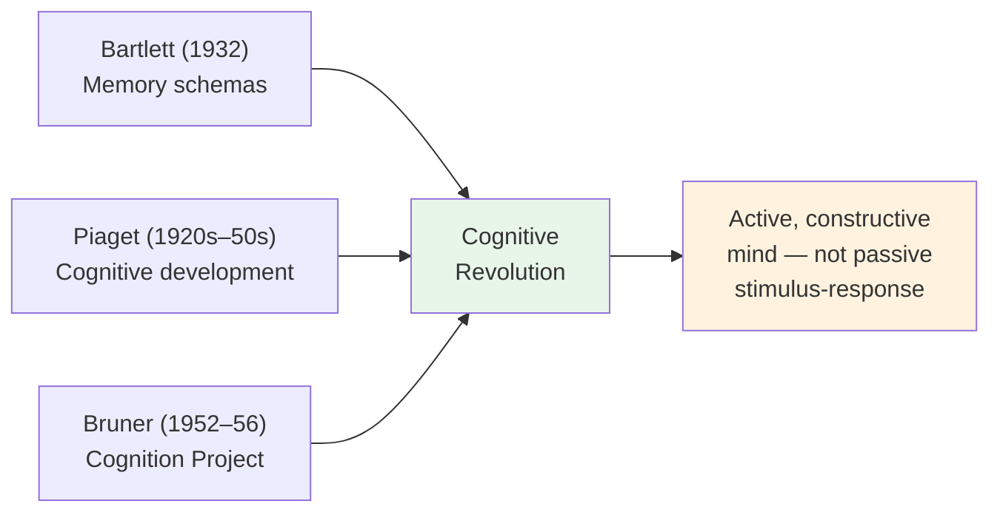

# Chapter 12 · Module 2
# The People Who Brought Back the Mind — Bruner, Miller, and Neisser
## Psychology · Unit 1 · History of Psychology

---

Harvard, 1952. Jerome Bruner is tired of propaganda. During the war, he had studied how to change people's minds — how morale could be boosted, how enemy populations could be demoralized, how public opinion could be shaped. Now the war is over, and Bruner wants to understand something more fundamental: how people *form* beliefs in the first place. Not how you manipulate them, but how they construct their understanding of the world.

He sets up the Cognition Project at Harvard and begins running experiments on how people perceive ambiguous stimuli. His findings are startling. Hungry people see food in blurry images. Poor children overestimate the size of coins. People are faster to recognize words they expect and slower to recognize words that are taboo. Perception is not a passive process of receiving sensory data. It is an active process of constructing meaning — shaped by expectations, motivations, and emotions.

Bruner calls this the **"new look" in perception**, and it represents a direct challenge to the behaviorist orthodoxy. Behaviorists had insisted that perception is a matter of stimulus-response association — the environment pushes, the organism responds. Bruner is saying that the organism pushes back. The mind does not just receive the world; it interprets it.

This is the beginning of the cognitive revolution — not a single dramatic moment, but a slow gathering of evidence that the mind is active, constructive, and irreducible to stimulus-response chains. And Bruner is not alone. Across the Atlantic and across the country, other psychologists are arriving at the same conclusion from different directions.

## Bruner's Active Mind: From Perception to Concept Formation

Bruner was influenced by two European psychologists who had been studying cognition for decades, largely ignored by the American behaviorist establishment. The first was Sir Frederic Bartlett, a Cambridge psychologist who had demonstrated in the 1930s that memory is not a faithful recording of experience. When people recall a story, they do not reproduce it verbatim; they reconstruct it using **schemas** — organized frameworks of knowledge that shape how new information is encoded and retrieved. Bartlett's work was published in 1932, but it had little impact in America until Bruner rediscovered it during a visit to Cambridge in 1955.

The second was Jean Piaget, the Swiss psychologist who had been studying cognitive development in children since the 1920s. Piaget argued that children do not passively absorb knowledge from the environment; they actively construct their understanding of the world through a process of assimilation (fitting new information into existing schemas) and accommodation (modifying schemas to fit new information). Bruner visited Piaget in Geneva in 1956 and was deeply influenced by his developmental framework, though he later developed a more socially oriented account of cognitive development that emphasized culture and interaction.

At Harvard, Bruner and his colleagues Jacqueline Goodnow and George Austin published *Studies in Thinking* (1956), the first major product of the Cognition Project. The book was an experimental study of **concept formation** — how people learn to classify objects into categories. Bruner identified several cognitive strategies that subjects employ: "successive scanning" (testing hypotheses one at a time), "conservative focusing" (changing one attribute at a time), and "focus gambling" (changing multiple attributes to gain maximum information). These were not habits or reflexes. They were active, deliberate, flexible cognitive strategies — exactly what behaviorists said did not exist.

*Studies in Thinking* deserves to be called, as some historians have argued, the first substantive psychological monograph of the cognitive revolution.

*Figure: European influences on Bruner's cognitive psychology — Bartlett's schemas and Piaget's developmental theory converged with Bruner's experimental work to establish the "new look" in perception.* It demonstrated that human thinking involves active hypothesis testing, strategic information gathering, and flexible problem-solving — all of which require cognitive constructs that cannot be reduced to stimulus-response associations.

> [!TIP] **Stop and Think**
> Bruner showed that hungry people see food in ambiguous images. What does this tell you about the relationship between motivation and perception? Can you think of a time when your desires or needs shaped what you saw or heard?

## Miller's Conversion: From Behaviorism to Cognition

George Miller's journey from behaviorism to cognitivism is one of the most dramatic intellectual conversions in the history of psychology. Miller began his career firmly in the behaviorist tradition. His early work used information theory to analyze operant conditioning — studying how rats and pigeons process information in Skinner boxes. He was, by his own account, a committed behaviorist.

But Miller was also honest, curious, and willing to change his mind. His 1956 paper "The Magical Number Seven, Plus or Minus Two" was a turning point. The paper demonstrated that human short-term memory has a fixed capacity of about seven items — a finding that was consistent with information-processing theory but difficult to explain in behaviorist terms. More importantly, Miller showed that people actively recode information into meaningful chunks, expanding the effective capacity of memory. This was a cognitive process, not a conditioned response.

The final blow came in the summer of 1957, when Miller met Noam Chomsky at a seminar at Stanford University. Chomsky's critique of Skinner's *Verbal Behavior* — which Miller had read in manuscript — convinced him that behaviorism could not account for the complexity of human language. Miller later claimed that he abandoned behaviorism "as a direct result of meeting Chomsky."

By 1965, Miller had fully embraced the cognitive paradigm. He described the shift in vivid terms: "We started talking about hypothesis testing instead of discrimination learning, about the evaluation of hypotheses instead of the reinforcement of responses, about rules instead of habits, about productivity instead of generalization, about symbols instead of conditioned stimuli, about linguistic structure instead of chains of responses."

In 1960, Miller and Bruner persuaded Harvard to establish the **Center for Cognitive Studies** — the first institutional home for cognitive psychology. The center hosted visiting faculty working on language, memory, perception, concept formation, and cognitive development. Although it lasted only ten years (done in by intellectual fragmentation and departmental politics), it provided crucial institutional legitimacy for the cognitive paradigm at a critical moment. Miller later moved to Princeton, where he established a program in **cognitive science** — the interdisciplinary field that brings together cognitive psychology, artificial intelligence, linguistics, philosophy, and neuroscience.

| Milestone | Year | Significance |
|---|---|---|
| Miller's "Magical Number Seven" | 1956 | Demonstrated fixed memory capacity, introduced chunking |
| MIT Symposium on Information Theory | 1956 | Logic Theorist presented; cognitive revolution launched |
| Miller meets Chomsky | 1957 | Miller abandons behaviorism |
| Center for Cognitive Studies (Harvard) | 1960 | First institutional home for cognitive psychology |
| Miller's "Some Psychological Studies of Grammar" | 1962 | Promoted Chomsky's ideas to psychologists |
| Miller moves to Princeton (cognitive science program) | 1970s | Established cognitive science as interdisciplinary field |

*Table: George Miller's journey from behaviorism to the founding of cognitive science.*

> [!TIP] **Stop and Think**
> Miller said he abandoned behaviorism after meeting Chomsky. Scientific paradigms are supposed to change because of evidence, not personal encounters. What role do social relationships and personal influence play in scientific revolutions? Is that a problem, or just how science works?

## Neisser's Baptism: Naming the Field

If Bruner and Miller were the architects of cognitive psychology, Ulric Neisser was the one who gave it its name. In 1967, Neisser published *Cognitive Psychology*, a book that integrated the scattered research programs of the 1950s and 1960s — perception, attention, memory, concept formation, psycholinguistics, computer simulation — into a single, coherent framework.

Neisser defined **cognitive psychology** as the study of "all the processes by which sensory input is transformed, reduced, elaborated, stored, recovered, and used." This was a deliberately broad definition, encompassing everything from the initial registration of sensory data to the highest forms of abstract reasoning. "Such terms as sensation, perception, imagery, retention, recall, problem-solving, and thinking," Neisser wrote, "refer to hypothetical stages or aspects of cognition."

Neisser was also explicit about the philosophical commitments of the new field. He championed a **realist** conception of cognitive constructs: "Cognitive processes surely exist, so it can hardly be unscientific to study them." This was a direct rebuke to the behaviorists, who had spent fifty years arguing that references to internal mental states were unscientific. Neisser was saying, in effect: the mind is real, cognitive processes are real, and studying them is legitimate science.

But Neisser was not naive. He recognized that the computer metaphor had limits. "The task of the psychologist trying to understand human cognition is analogous to that of a man trying to discover how a computer has been programmed," he wrote — but he also critically dismissed computer simulation as "simplistic." Human beings are not passive information processors. They select, attend, recode, and reformulate. They are active constructors of their own cognitive experience.

> [!TIP] **Stop and Think**
> Neisser defined cognition as "all the processes by which sensory input is transformed, reduced, elaborated, stored, recovered, and used." Is this too broad? Does it include everything psychological? What would fall outside this definition?

## Plans, Programs, and the Architecture of Thought

The cognitive revolution needed a framework — a way of thinking about how the mind organizes complex behavior. In 1960, George Miller, Eugene Galanter, and Karl Pribram published *Plans and the Structure of Behavior*, which proposed exactly that.

Miller, Galanter, and Pribram argued that the behaviorist unit of analysis — the stimulus-response connection — was inadequate for explaining complex, goal-directed behavior. They proposed an alternative: the **plan**, defined as "any hierarchical process in the organism that can control the order in which a sequence of operations is to be formed." A plan is not a habit. It is a flexible, hierarchical structure that guides behavior toward a goal — adjusting, correcting, and reorganizing as circumstances change.

They recommended the **TOTE unit** (Test-Operate-Test-Exit) as the basic building block of behavior. The idea was simple: you test the current state against a goal, operate to reduce the discrepancy, test again, and exit when the goal is reached. A pianist testing each note against the intended melody, a driver adjusting steering to stay in a lane, a student checking an essay against an outline — all are TOTE cycles.

The TOTE unit was explicitly modeled on computer programs. Miller, Galanter, and Pribram acknowledged that the term "program" could be substituted for "plan" throughout their book. But the framework was not tied to any specific computer architecture. It was a way of thinking about how minds organize behavior — hierarchically, flexibly, and purposefully.

This was the framework that connected the diverse strands of the cognitive revolution: Bruner's strategies, Miller's chunks, Newell and Simon's programs, Broadbent's filters, Chomsky's rules. All were expressions of the same fundamental insight: the mind is an active processor of information, governed by rules and representations, organized hierarchically, and irreducible to stimulus-response chains.

> [!TIP] **Stop and Think**
> The TOTE unit describes a cycle: test, operate, test, exit. Think about a task you do every day — cooking a meal, writing an email, navigating a city. Can you identify the TOTE cycles within it? How does this framework differ from a behaviorist account of the same task?

## Speaking of Active Minds...

The idea that perception is active and constructive is now so well established that it seems obvious. But it was revolutionary in the 1950s. Consider: when you read this sentence, you are not passively receiving visual data. You are actively predicting the next word, filling in missing letters, correcting errors, and constructing meaning from context. If you read "The c__ t sat on the m__," you instantly complete it as "The cat sat on the mat" — not because the stimulus told you to, but because your mind imposed a schema on incomplete data.

In India, cognitive research on concept formation has influenced how mathematics is taught in primary schools — emphasizing active hypothesis-testing over rote memorization. In the United Kingdom, cognitive psychology research on attention has shaped safety guidelines for drivers using mobile phones. In South Korea, studies of cognitive strategies in expert gamers have been applied to training programs for surgeons. The insights of Bruner, Miller, and Neisser are not just historical curiosities. They are the foundation of how we understand human thinking today.

Bartlett's concept of the schema — an organized framework of knowledge that shapes how new information is encoded and retrieved — has become one of the most influential ideas in cognitive psychology. When you walk into a restaurant, you do not need to figure out what to do from scratch. You activate a "restaurant schema": sit down, look at the menu, order, eat, pay. The schema guides your behavior, shapes your expectations, and helps you interpret ambiguous situations (is that person walking toward you a waiter or another customer?). Schemas are not habits. They are flexible, knowledge-based structures that organize experience — exactly the kind of cognitive construct that behaviorists denied.

> [!TIP] **Stop and Think**
> Bruner was influenced by European psychologists — Bartlett and Piaget — who had been studying cognition for decades, largely ignored by American behaviorism. What does this tell you about the role of cultural and national traditions in science? Can important ideas be suppressed simply because they come from the wrong place?

---

The cognitive revolution had its people — Bruner, Miller, Neisser, Chomsky, Newell, Simon, Broadbent — and it had its framework: information processing, rules and representations, active cognition. But was it really a revolution? Did behaviorism die? Or did something more subtle happen — a shift not in what psychologists studied, but in how they thought about what they were studying? That is the question of the next module.

*[Module 2 of 5 complete.]*

## References

- Bruner, J. S., Goodnow, J. J., & Austin, G. A. (1956). *A Study of Thinking*. New York: Wiley.
- Miller, G. A., Galanter, E., & Pribram, K. H. (1960). *Plans and the Structure of Behavior*. New York: Holt.
- Neisser, U. (1967). *Cognitive Psychology*. New York: Appleton-Century-Crofts.
- Bartlett, F. C. (1932). *Remembering: A Study in Experimental and Social Psychology*. Cambridge: Cambridge University Press.
