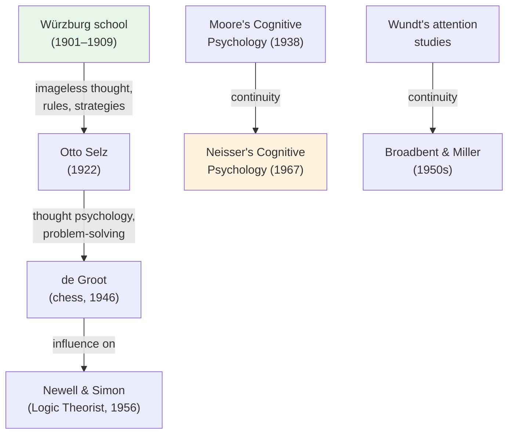

# Chapter 12 · Module 4
# The Mind Unbound — Cognition as Its Own Subject
## Psychology · Unit 1 · History of Psychology

---

Würzburg, Germany, 1901. A group of psychologists led by Oswald Külpe are running experiments on thinking. Their subjects sit in a darkened room and are asked to perform mental tasks — solving problems, forming concepts, making judgments. The psychologists ask them: "What were you thinking?" The subjects report their thoughts, but something strange happens. Many of the mental processes involved in solving the problem — the rules they applied, the strategies they used, the representations they constructed — are not accompanied by any conscious experience. The subjects are doing cognitive work, but they are not aware of doing it.

The Würzburg psychologists call these "imageless thoughts" — cognitive processes that operate without conscious imagery. This is a direct challenge to the prevailing assumption, shared by Titchener's structuralists and the empiricist tradition, that all cognition is both imagistic and conscious. The Würzburg school does not survive long — it is disrupted by World War I and the deaths and displacements of its members. But its core insight — that cognition can be unconscious, rule-governed, and representational — will resurface fifty years later, when the cognitive revolution makes it respectable again.

The cognitive revolution was not a return to the introspectionist psychology of Titchener and Wundt. It was a return to something older and more radical: the idea that the mind has its own structure, its own processes, and its own laws — and that these can be studied scientifically without relying on what people say about their own mental states.

## Not Structuralism: What Cognitive Psychology Is Not

One of the most persistent criticisms of the cognitive revolution was that it represented a retreat to the discredited introspectionism of Titchener's structural psychology. Skinner made this accusation repeatedly. He argued that cognitive psychologists were "emasculating the experimental analysis of behavior" by returning to unscientific speculations about internal processes.

The accusation was wrong, for several reasons. Titchener's structural psychology rested on two assumptions from the empiricist tradition: that cognition is **imagistic** (all thought consists of mental images) and that cognition is **conscious** (all thought is accessible to introspection). Cognitive psychology rejected both assumptions.

First, cognitive psychologists did not equate cognition with imagery. Research demonstrated that some cognitive processes are propositional (rule-based, language-like) rather than imagistic. You can think about abstract concepts — justice, infinity, democracy — without forming any mental image. Kosslyn's research on mental imagery showed that images play a role in some cognitive processes, but not all. Cognition is not reducible to imagery.

Second, and more importantly, cognitive psychologists did not presume that cognitive processes are conscious. One of the most celebrated findings of cognitive psychology was that people have **limited introspective access** to their own cognitive processes. Nisbett and Wilson's classic 1977 paper demonstrated that subjects often cannot accurately report the causes of their own behavior — they confabulate explanations that sound plausible but are demonstrably wrong. "The accuracy of subject reports is so poor," Nisbett and Wilson concluded, "as to suggest that any introspective access that may exist is not sufficient to produce generally correct or reliable reports."

This was the opposite of Titchener's program. Titchener wanted to study consciousness through introspection. Cognitive psychologists studied cognition *despite* the unreliability of introspection. They used rigorous experimental methods — reaction time studies, priming experiments, error analysis, computational modeling — to infer the structure of cognitive processes that subjects cannot directly observe or report.

> [!TIP] **Stop and Think**
> Nisbett and Wilson showed that people often cannot accurately report the causes of their own behavior. Think about a decision you made recently — choosing a career, buying something, forming an opinion. How confident are you that you know the real reasons for your choice? Could there be cognitive processes operating that you are not aware of?

## Not Anthropomorphism: Morgan's Canon Reclaimed

Another accusation, made by neobehaviorists like Abram Amsel, was that cognitive psychologists had reintroduced the "methodological sins of subjectivism and anthropomorphism" that Morgan's canon was supposed to exorcise. By attributing cognitive states to animals — representations, expectations, strategies — cognitive psychologists were supposedly projecting human mental life onto creatures that might not possess it.

This criticism rested on a misinterpretation of Morgan's canon. Lloyd Morgan had argued that we should not attribute a higher psychological capacity to an animal if a lower one will explain the behavior. But Morgan never argued that it is *illegitimate* to attribute cognitive capacities to animals. He doubted that animals possess abstract reasoning, but he never doubted the scientific legitimacy of investigating whether they do. Morgan's canon was a methodological caution, not a prohibition.

Moreover, Morgan's canon only made sense as a constraint on explanation if you assume that all behavior can be explained by lower-level processes like conditioning. If conditioning cannot explain all behavior — as Lashley, Chomsky, the Brelands, and Garcia had demonstrated — then there is no reason to restrict explanations to conditioning. Attributing cognitive states to animals is not anthropomorphism. It is a legitimate scientific hypothesis, testable by experiment.

Cognitive psychologists maintained **strong continuity** between human and animal psychology — they affirmed that many cognitive capacities are shared across species. But they denied **strong continuity** between cognitive processes and reflexive associative processes. Rats can have cognitive maps without having human-level abstract reasoning. Primates can solve problems without having human language. The denial of strong continuity between cognition and conditioning does not require the denial of continuity between human and animal minds.

> [!TIP] **Stop and Think**
> A rat runs a maze and takes a shortcut when a familiar path is blocked. Is this evidence of a cognitive map, or can it be explained by simpler conditioning processes? How would you design an experiment to tell the difference?

## The Cognitive Tradition: A Thread from Würzburg to Harvard

The cognitive revolution was not as sudden as it seemed. There was a continuous — if attenuated — cognitive tradition in psychology stretching back to the Würzburg school of the early 1900s.

The Würzburg psychologists developed theories of cognitive processing that anticipated contemporary cognitive psychology: they postulated rule-governed operations on representational states without assuming that those states were imagistic or conscious. Newell, Shaw, and Simon acknowledged that their computer simulation of human problem-solving was based on the "thought-psychology" of Otto Selz, one of the last major Würzburg theorists, and his student Adriaan de Groot, who developed prototype programs for analyzing chess players' problem-solving.

Thomas Vernon Moore published *Cognitive Psychology* in 1938 — a book that used the term "cognitive psychology" three decades before Neisser. Woodworth's *Experimental Psychology* (1938) included a long chapter on "Thinking." A small group of American psychologists continued Wundt's experimental studies of attention throughout the early twentieth century, until Broadbent and Miller returned attention to center stage in the 1950s.

During the first half of the twentieth century, psychologists continued to pursue cognitive research areas — problem-solving, reasoning, concept formation, inductive inference, logical organization — mostly using human subjects rather than rats and pigeons. The cognitive tradition was suppressed during the heyday of behaviorism, but it never fully disappeared. The cognitive revolution brought it back into the mainstream.

This historical continuity matters. It means that the cognitive revolution was not a bolt from the blue. It was the resurgence of a tradition that had been marginalized but never eliminated — a tradition that was always there, waiting for the right intellectual climate to flourish.

*Figure: The cognitive tradition — a continuous thread from the Würzburg school to the cognitive revolution, surviving decades of behaviorist dominance.*

> [!TIP] **Stop and Think**
> The cognitive tradition survived behaviorism through a handful of researchers working in relative obscurity. What other scientific ideas might be marginalized today — not because they are wrong, but because they do not fit the current paradigm? How would you know?

## Neisser's Second Thoughts: Ecological Validity

In 1976, Neisser published *Cognition and Reality*, a book that surprised many of his colleagues. In it, he criticized the artificiality of much experimental research in cognitive psychology. Laboratory experiments on memory, attention, and perception used highly controlled stimuli — nonsense syllables, random letter strings, tachistoscopic presentations — that bore little resemblance to the rich, complex environments in which people actually think.

Neisser called for a more "ecological" approach — studying cognition in real-world contexts, with ecologically valid stimuli and tasks. He argued that cognitive psychology had become too focused on isolated processes (memory, attention, perception) and had lost sight of how these processes work together in the complex, messy reality of everyday life.

Critics of the cognitive revolution seized on Neisser's second thoughts as evidence that cognitive psychology had failed. But Neisser never rejected the basic framework. He never questioned the legitimacy of studying cognitive processes. He never returned to behaviorism. He later affirmed that a wide range of cognitive psychology research is of "real significance" and that cognitive psychology and related disciplines "have made important and ecologically valid discoveries." His critique was about methodology and emphasis, not about fundamentals.

Neisser's ecological turn was not a retreat from cognitive psychology. It was a call to make cognitive psychology better — more grounded in the real world, more attentive to the complexity of actual human experience, more honest about the limitations of laboratory research. It was, in other words, the kind of self-correcting criticism that healthy sciences engage in.

> [!TIP] **Stop and Think**
> Neisser criticized the artificiality of cognitive psychology experiments but never rejected the cognitive framework. Is it possible to study cognition in controlled laboratory settings and still learn something true about how the mind works in the real world? What are the trade-offs between experimental control and ecological validity?

## Speaking of Cognitive Traditions...

The idea that cognition can be unconscious is now one of the most well-established findings in psychology. When you ride a bicycle, you are making constant adjustments — balancing, steering, pedaling — without conscious awareness of the cognitive processes involved. When you understand a sentence, you are parsing its grammar, resolving ambiguities, and constructing meaning — all in milliseconds, without any conscious effort. When you recognize a friend's face in a crowd, you are performing an incredibly complex pattern-matching operation — but it feels effortless, automatic, invisible.

In Nigeria, market traders in Lagos perform complex mental arithmetic — calculating prices, making change, negotiating discounts — with speed and accuracy that would challenge a calculator, yet they cannot always explain how they do it. In Japan, expert calligraphers produce characters with precise, fluid movements that require complex motor planning, but the planning is largely unconscious. In Brazil, samba musicians improvise complex rhythmic patterns in real time, coordinating with other musicians through cognitive processes they cannot introspect.

The Würzburg psychologists were right: much of cognition is imageless and unconscious. The cognitive revolution vindicated their insight — but it took fifty years and the invention of the computer to do it.

> [!TIP] **Stop and Think**
> If much of cognition is unconscious, what are the implications for self-knowledge? How well can you know your own mind if many of the processes that shape your thoughts, decisions, and behavior are invisible to you?

---

The cognitive revolution did not just give psychology new theories. It gave psychology permission to study the mind — not as a black box, not as a collection of reflexes, not as an illusion, but as a real system with its own structure, processes, and laws. This permission was hard-won, earned through decades of work by psychologists who refused to accept that the mind was beyond the reach of science.

*[Module 4 of 5 complete.]*

## References

- Neisser, U. (1976). *Cognition and Reality: Principles and Implications of Cognitive Psychology*. San Francisco: W. H. Freeman.
- Nisbett, R. E., & Wilson, T. D. (1977). Telling more than we can know: Verbal reports on mental processes. *Psychological Review*, *84*(3), 231–259.
- Bartlett, F. C. (1932). *Remembering: A Study in Experimental and Social Psychology*. Cambridge: Cambridge University Press.
