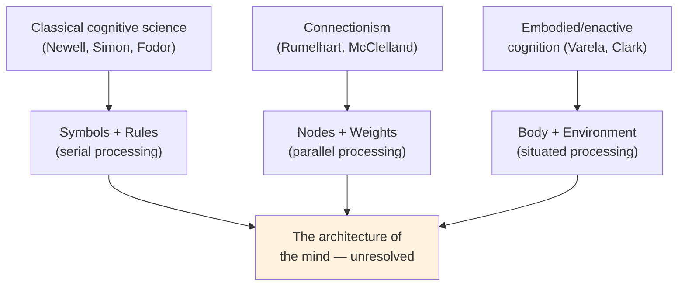

# Chapter 12 · Module 5
# Connections and Open Questions — From Cognitive Science to the Future
## Psychology · Unit 1 · History of Psychology

---

San Diego, 1986. Two volumes appear on the desks of cognitive scientists around the world. They are called *Parallel Distributed Processing*, edited by David Rumelhart and James McClelland, and they propose a radically different way of thinking about the mind. Instead of the computer metaphor — serial processing, symbols, rules — they offer the brain metaphor. Instead of programs that execute instructions one at a time, they propose **neural networks**: systems of simple, interconnected units that process information in parallel, the way neurons do.

The idea is elegant. A neural network consists of layers of nodes — input units, hidden units, output units — connected by weighted links. The network learns not by following rules but by adjusting the weights on its connections: when the network produces a correct output, the weights that contributed to it are strengthened; when it produces an incorrect output, they are weakened. Over thousands of training trials, the network develops patterns of connection that allow it to recognize faces, understand sentences, or make decisions — without ever being explicitly programmed with rules.

This is **connectionism**, and it represents a fundamental challenge to the classical cognitive science of Newell, Simon, and Chomsky. Classical cognitive science treats the mind as a symbol processor — a system that manipulates representations according to rules, like a computer executing a program. Connectionism treats the mind as a pattern recognizer — a system that extracts regularities from experience through the adjustment of connections, like a brain developing neural pathways.

The debate between classical and connectionist approaches is not just technical. It is about the fundamental nature of cognition. Is the mind a rule-following symbol processor, or a pattern-extracting neural network? Is thought more like a computer program, or more like a brain? The answer matters — not just for psychology, but for how we understand ourselves.

## The Architecture of Cognition

The cognitive revolution produced not just individual findings but entire theoretical frameworks — architectures of cognition that attempted to explain how the mind is organized.

John Anderson's **ACT** (Adaptive Control of Thought) theory, first proposed in 1976 and refined over decades, is one of the most comprehensive. Anderson proposed that the mind has three types of memory: declarative memory (facts and knowledge), procedural memory (skills and rules), and working memory (the active processing space where thinking happens). He developed computational models that could simulate human performance on a wide range of tasks — from solving algebra problems to learning programming languages. Anderson's ACT-R architecture remains one of the most influential frameworks in cognitive science.

Jerry Fodor's **modularity hypothesis** (1983) took a different approach. Fodor argued that the mind is organized into specialized modules — perceptual systems, language systems, face-recognition systems — each of which operates independently, with its own proprietary database and processing rules. These modules are "informationally encapsulated": they do their work without consulting the rest of the mind. Your visual system processes light and color without waiting for your beliefs or desires to weigh in. Your language parser interprets syntax without checking whether you agree with the sentence's meaning.

Fodor's modularity hypothesis was inspired by the way computers are organized — with specialized hardware for different functions (graphics cards, sound cards, network interfaces). But it also drew on neuroscience, which had shown that different brain regions are specialized for different functions: the fusiform face area for face recognition, Broca's area for language production, the hippocampus for memory formation.

David Marr's *Vision* (1982) offered a different kind of architecture — a computational theory of how the brain constructs a three-dimensional representation of the world from two-dimensional retinal images. Marr argued that vision involves three levels of analysis: the computational level (what problem is being solved?), the algorithmic level (what steps are taken?), and the implementational level (how is it physically realized?). His framework demonstrated that a complete theory of a cognitive process requires all three levels — you cannot understand vision by studying neurons alone, or by studying behavior alone.

*Figure: Three competing visions of the architecture of cognition — classical, connectionist, and embodied — each with different assumptions about how the mind works.*

> [!TIP] **Stop and Think**
> Fodor argued that perceptual modules are "informationally encapsulated" — your visual system processes what it sees without consulting your beliefs. But consider optical illusions: even when you *know* the lines are the same length, they still *look* different. Does this support or undermine Fodor's modularity hypothesis?

## Fragmentation and Integration

The cognitive revolution succeeded in establishing cognition as a legitimate subject of scientific study. But it did not produce a unified science of the mind. By the 1970s, cognitive psychology was fragmented into subfields — perception, attention, memory, language, reasoning, problem-solving — each with its own experimental methods, theoretical frameworks, and professional journals. Researchers in one subfield often knew little about what was happening in others.

James Jenkins complained about this fragmentation. Allen Newell called for more integrative theories. The lack of theoretical unity was sometimes cited as evidence that the cognitive revolution had failed — that it had produced a collection of disconnected findings rather than a coherent science.

But some cognitive psychologists did develop integrative theories. Anderson's ACT-R architecture attempted to unify research on memory, learning, problem-solving, and language within a single computational framework. The development of **cognitive science** as an interdisciplinary field — bringing together psychology, computer science, linguistics, philosophy, and neuroscience — also helped bridge the gaps between subfields.

It is possible that the fragmentation of cognitive psychology reflects the fragmentation of cognition itself. Fodor's modularity hypothesis suggests that the mind is organized into relatively independent modules, each doing its own thing. If the mind is genuinely modular, then a modular science of the mind — with different theories for different modules — might be the appropriate response. The lack of a grand unified theory might not be a failure. It might be a reflection of how the mind actually works.

> [!TIP] **Stop and Think**
> Cognitive psychology is fragmented into subfields — perception, memory, language, reasoning — each with its own theories and methods. Is this a problem? Should psychology aim for a single unified theory of the mind, or is the mind itself too complex and modular for any single theory to capture?

## The Autonomy of Cognitive Explanation

One of the most enduring contributions of the cognitive revolution was the principle that cognitive explanations are **autonomous** with respect to neurophysiology. Wiener stated this principle most clearly: "Information is information, not matter or energy." Broadbent elaborated it: you can describe what the mind does — how it filters information, selects channels, stores and retrieves data — without committing to a specific theory of how the brain implements these functions.

This principle has been challenged by the rise of cognitive neuroscience, which attempts to link cognitive theories to brain mechanisms. Some researchers argue that a cognitive theory is not complete until it specifies its neural implementation. Others argue that cognitive theories can stand on their own, just as computer programs can be understood without knowing the details of the hardware.

The debate is not just academic. It has practical implications. If cognitive explanations are autonomous, then a theory of memory or attention does not need to wait for neuroscience to validate it. If they are not, then cognitive psychology must become a branch of neuroscience. The history of psychology suggests that both levels of explanation are needed — but that they serve different purposes. Cognitive theories tell you *what* the mind does. Neural theories tell you *how* the brain does it. Neither level of explanation is reducible to the other.

This is, once again, Aristotle's functionalist insight, expressed in modern terms. The mind is defined by its functions — by what it does — not by what it is made of. The same function can be implemented in different physical systems. The same cognitive process can be realized in different brains, different computers, different species. Understanding the function does not require understanding the implementation — though understanding both is better than understanding either alone.

> [!TIP] **Stop and Think**
> Wiener wrote, "Information is information, not matter or energy." Does this mean the mind is something beyond the physical? Or does it just mean that cognitive explanations operate at a different level than physical explanations? What is the relationship between the mental and the physical?

## Speaking of Connections...

The debate between classical and connectionist approaches to cognition mirrors a broader question about the nature of human intelligence. Is human thought more like a computer program — deliberate, rule-governed, sequential? Or is it more like a neural network — intuitive, pattern-based, parallel?

Consider how you recognize a friend's face. You do not consciously apply a set of rules ("if the nose is this shape and the eyes are this distance apart, then it is Maria"). You recognize the face instantly, holistically, without conscious effort — more like a neural network than a computer program. But consider how you solve a math problem. You follow rules, execute procedures, check your work step by step — more like a computer program than a neural network.

In South Korea, researchers have used neural network models to predict student performance on national exams, finding that the models outperform traditional statistical methods. In India, connectionist models have been applied to natural language processing for Hindi and Tamil, languages with complex morphology that challenges rule-based approaches. In Nigeria, cognitive scientists study how expert market traders make rapid pricing decisions — decisions that look more like pattern recognition than rule-following. In Brazil, researchers use connectionist models to understand how children learn Portuguese verb conjugation — a task that requires both rule-governed and pattern-based processing.

The mind, it seems, is not purely one thing or the other. It is both a rule-follower and a pattern-recognizer. It is both a computer and a brain.

> [!TIP] **Stop and Think**
> The cognitive revolution was inspired by the computer. Connectionism was inspired by the brain. What might the next revolution in cognitive science be inspired by? Could it come from biology, from artificial intelligence, from something we have not yet imagined?

The cognitive revolution gave us the language to ask these questions. The answers are still coming.

> [!TIP] **Stop and Think**
> Connectionism challenges the classical view that cognition is rule-governed symbol manipulation. But neural networks learn from experience — they require thousands of training trials to develop useful patterns. Is this how human learning works? Can connectionism explain one-shot learning, creative problem-solving, or the acquisition of abstract rules?

---

The cognitive revolution opened the mind to scientific investigation. It gave psychologists permission to study representations, rules, schemas, strategies, memory systems, attention filters, and decision processes. It established that cognition is real, that it has its own structure and laws, and that it can be studied with the tools of science. But it did not close the book. The questions it raised — about the nature of representation, the architecture of the mind, the relationship between cognition and consciousness, the role of the body and the environment — remain open. They are the questions that define cognitive science today.

*[Module 5 of 5 complete. Chapter 12 complete. Take time with the "Stop and Think" prompts before moving to the next chapter.]*

## References

- Anderson, J. R. (1983). *The Architecture of Cognition*. Cambridge, MA: Harvard University Press.
- Fodor, J. A. (1983). *The Modularity of Mind*. Cambridge, MA: MIT Press.
- Rumelhart, D. E., & McClelland, J. L. (1986). *Parallel Distributed Processing: Explorations in the Microstructure of Cognition* (2 vols.). Cambridge, MA: MIT Press.
- Marr, D. (1982). *Vision: A Computational Investigation into the Human Representation and Processing of Visual Information*. San Francisco: W. H. Freeman.
