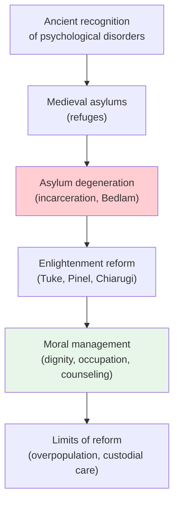

# Chapter 13 · Module 1
# From Chains to Dignity — The Reform of Asylums
## Psychology · Unit 1 · History of Psychology

---

London, 1814. A young woman named James Norris has been chained to a wall in Bethlehem Hospital — "Bedlam" — for over a decade. An American sea captain, he was committed after a dispute with his wife. His crime: being difficult. His punishment: an iron harness bolted to the wall, a strap around his waist, his arms pinned to his sides. He can neither stand nor lie down. He has been this way for years. When a parliamentary committee visits the hospital and sees him, they are horrified. The image of Norris, restrained like an animal, becomes a symbol of everything wrong with the institutional treatment of the insane.

But Norris's story is not exceptional. It is ordinary. Across Europe and America, people suffering from psychological disorders are locked away in institutions that were originally designed as retreats — places of healing — but have degenerated into warehouses. The insane are chained, beaten, bled, purged, and displayed to paying visitors. They share their cells with criminals, beggars, and the destitute. They are not patients. They are prisoners.

How did this happen? And how did a retired tea merchant, a French revolutionary doctor, and an American schoolteacher begin to change it? The story of asylum reform is not just a chapter in the history of psychology. It is a story about what happens when society decides that some people are less than human — and what happens when a few brave individuals decide they are wrong.

## The Origins of Incarceration

The history of psychological disorders is older than the history of psychology. Ancient peoples recognized depression, mania, and hysteria. They attributed most psychological disorders to neural causes — not, as is commonly supposed, to demonic possession. The Hippocratic tradition treated mental illness as a natural phenomenon, caused by imbalances in the body's humors. Treatments included fresh air, relaxation, dieting, music, and — when all else failed — bloodletting and purgation.

From early Roman times, laws governed the treatment of the psychologically disturbed. These laws recognized that such persons were not legally responsible for their actions, because of their diminished powers of reasoning. Institutions devoted to their care were set up in medieval cities — Baghdad, Valencia, London. The common law of many European states included protections for them.

But protection gradually became incarceration. The insane became the legal responsibility of local parishes, which were also responsible for the poor and the unemployed. They were housed in **asylums** — institutions originally created to isolate lepers, later used to house a bewildering mix of "degenerates," "destitutes," and the genuinely ill. This was as much a social measure as a medical one, designed to combat begging, vagrancy, and occasional violence. In Paris, the Hôpital Général confined beggars, tramps, and prostitutes alongside the insane, by order of a royal edict in 1656.

St. Mary's of Bethlehem in London, founded in 1247, exemplified this descent. It degenerated into "Old Bedlam" — a human zoo where inmates were chained, whipped, and subjected to public display before paying visitors. The original intent of charging visitors had been to raise money for treatment. The reality was entertainment at the expense of human suffering.

> [!TIP] **Stop and Think**
> Asylums were originally created as places of refuge. Over time, they became places of incarceration. What causes institutions designed to help people to become places that harm them? Can you think of modern examples of this pattern?

## The Reformers: Tuke, Pinel, and Moral Management

The reform of asylums began not with doctors but with a retired tea merchant. William Tuke, a Quaker from York, was moved to action when a fellow Quaker died in a local asylum under appalling conditions. In 1796, he founded the York Retreat — a place where psychologically disturbed Quakers could be treated with respect and dignity, in a rural setting designed to resemble a farmstead. Tuke's treatment regime included exercise, wholesome diet, pastoral counseling, and occupational therapy. He eliminated barred cells and physical restraints (except in violent cases) and prohibited bloodletting and beating.

Tuke's approach was based on **moral management** — the idea that psychological disorders could be treated through the cultivation of reason, self-control, and moral character. It was not a medical treatment in the modern sense. It was closer to what we might call rehabilitation: a structured, supportive environment designed to help people regain their capacity for self-governance.

Across the Channel, a French physician was pursuing similar reforms under very different circumstances. Philippe Pinel was appointed head of the Bicêtre Hospital in Paris during the French Revolution. The hospital housed around 4,000 male inmates — the insane, the criminal, and the destitute — in conditions of extraordinary brutality. In 1793, Pinel initiated a series of reforms: the removal of chains, the elimination of bloodletting and beating, and the introduction of humane treatment regimes.

Pinel's reforms were continued by his disciple Jean-Étienne-Dominique Esquirol, who tried to promote humane treatment throughout Europe. But progress was slow. Most physicians resisted reform. The sheer number of inmates in public asylums — overwhelmed by the poor, the criminal, and the destitute as well as the genuinely ill — made humane treatment difficult to sustain.

*Figure: The arc of asylum history — from refuge to degradation to reform and its limits.*

> [!TIP] **Stop and Think**
> Pinel removed the chains from inmates at the Bicêtre. Legend says he did this in a dramatic public gesture, though historians debate whether it really happened that way. Why do reform stories tend to get simplified into dramatic moments? Does it matter whether the legend is true if the reforms were real?

## Dorothea Dix and the American Reform Movement

In America, the reform of asylums was driven by a schoolteacher named Dorothea Dix. In 1841, Dix began teaching a Sunday school class at a jail in East Cambridge, Massachusetts. There she discovered women suffering from psychological disorders locked in cells alongside common criminals — unheated, dark, and filthy. She was appalled. She began investigating conditions in jails and almshouses across Massachusetts, and then across the country.

For nearly forty years, Dix traveled from state to state, documenting the treatment of the insane and pressing legislatures to create new, humane institutions. She harnessed the press and the public in her campaign. She lectured Queen Victoria and Pope Pius IX on the need for reform. She served as chief of hospital nurses during the American Civil War, earning a reputation as an American Florence Nightingale. By the time she was done, she had helped establish over 30 hospitals for the mentally ill across the United States.

Dix's reforms built on the work of earlier American pioneers. Benjamin Rush, often called the father of American psychiatry, had deplored the cruelty of institutional treatment in his 1812 book *Medical Inquiries and Observations Upon the Diseases of the Mind*. Eli Todd founded the Connecticut Retreat for the Insane in 1824, modeling it on Tuke's York Retreat. Samuel Woodward promoted moral management at Worcester State Hospital. Pliny Earle championed the use of detailed statistical records to evaluate treatment efficacy.

But Dix also inherited the limits of the reform movement. The institutions she helped create were soon overwhelmed by numbers. As immigration and urbanization swelled the population of the poor and the destitute, asylums filled beyond capacity. Moral management gave way to custodial care. The reforms that had promised dignity and healing became, once again, warehouses for the unwanted.

| Reformer | Location | Key Contribution |
|---|---|---|
| William Tuke | York, England (1796) | Founded the York Retreat; moral management |
| Philippe Pinel | Paris (1793) | Removed chains at Bicêtre; humane classification |
| Vincenzo Chiarugi | Florence (1789) | Limited restraints; "respect the insane as a person" |
| Benjamin Rush | Philadelphia (1812) | Deplored cruelty; father of American psychiatry |
| Eli Todd | Connecticut (1824) | Founded Hartford Retreat; pastoral counseling |
| Dorothea Dix | Across America (1841–1881) | Advocated for 30+ hospitals; lobbied legislatures |

*Table: The pioneers of asylum reform — from England to Italy to America.*

> [!TIP] **Stop and Think**
> Dorothea Dix was not a doctor. She was a schoolteacher. What does it tell us about the history of mental health reform that some of the most important changes were driven by outsiders — people without medical training or institutional power?

## The Limits of Reform

The reform of asylums was a genuine moral achievement. It established, for the first time, that people suffering from psychological disorders deserve to be treated with dignity. It introduced principles — humane treatment, occupational therapy, pastoral counseling — that remain foundational in mental health care today.

But the reform movement had deep structural limitations. The asylums that Dix and others helped create were designed for a specific population: the psychologically disturbed. In practice, they were flooded with the poor, the criminal, the destitute, and the simply unwanted. Superintendents who had trained in moral management found themselves running custodial institutions, managing thousands of inmates with inadequate resources. The ideals of reform gave way to the realities of overcrowding, underfunding, and political indifference.

Pliny Earle, one of the reformers himself, eventually acknowledged that the treatment success rates claimed by his colleagues were wildly inflated. He published data showing that many patients who were discharged as "cured" had actually relapsed. The moral management that had seemed so promising in small, well-funded retreats could not scale to the massive public asylums that states were building.

This pattern — reform followed by institutional decay — would repeat itself throughout the history of mental health care. The ideals were not wrong. The implementation was overwhelmed by social forces that the reformers could not control.

> [!TIP] **Stop and Think**
> The asylum reform movement established that people with psychological disorders deserve dignity and humane treatment. But it also created a system of mass institutionalization. Can a reform create new problems even as it solves old ones? How do you balance the need for care with the risk of incarceration?

## Speaking of Reform...

The pattern of reform, overreach, and decay is not unique to asylums. In education, progressive reform movements have repeatedly promised to transform schools, only to be overwhelmed by bureaucratic inertia and underfunding. In criminal justice, the rehabilitative ideal of the early twentieth century gave way to the warehousing of prisoners in overcrowded facilities. In healthcare, the community mental health movement of the 1960s promised to replace institutional care with community-based services, but many of those services were never adequately funded.

In India, the Mental Healthcare Act of 2017 established the right to mental health care and mandated the reduction of institutional confinement. In Nigeria, traditional healers still play a major role in mental health care, and the integration of traditional and modern approaches remains a challenge. In Brazil, the psychiatric reform movement of the 1980s and 1990s led to the closure of many asylums and the creation of community-based mental health centers — but the transition has been uneven and incomplete.

The history of asylum reform teaches us that good intentions are not enough. Institutions designed to help people can become instruments of control unless they are constantly monitored, adequately funded, and held accountable to the people they serve.

> [!TIP] **Stop and Think**
> The asylum reformers believed that psychological disorders were caused by social conditions — city life, family conflict, moral weakness — and could be treated through moral management. How does this compare with modern understandings of mental illness? Have we replaced one set of assumptions with another, or have we actually made progress?

---

The asylum reformers established the principle that people with psychological disorders deserve dignity and humane treatment. But they did not develop a scientific understanding of what those disorders are or how to treat them. That would require a different kind of revolution — one that began not in an asylum but in a Viennese consulting room, with a neurologist who believed that the key to mental illness lay in the unconscious mind.

*[Module 1 of 5 complete.]*

## References

- Pinel, P. (1801). *Traité médico-philosophique sur l'aliénation mentale*. Paris: Brosson.
- Scull, A. (1989). *Social Order/Mental Disorder: Anglo-American Psychiatry in Historical Perspective*. Berkeley: University of California Press.
- Shorter, E. (1997). *A History of Psychiatry: From the Era of the Asylum to the Age of Prozac*. New York: Wiley.
