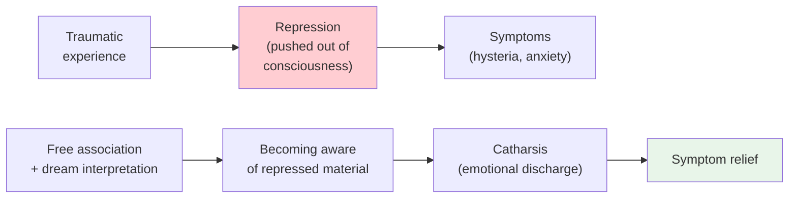

# Chapter 13 · Module 2
# Freud's Revolution — The Talking Cure and the Unconscious
## Psychology · Unit 1 · History of Psychology

---

Vienna, 1885. A young neurologist named Sigmund Freud arrives in Paris to study with the famous Jean-Martin Charcot. Freud has trained under the austere physicalism of Ernst Brücke, who believed that all psychological phenomena can be reduced to physiology. He has worked on brain damage, experimented with cocaine, and published papers on the analgesic properties of the drug that will later become associated with addiction and decadence. He is ambitious, brilliant, and hungry for a discovery that will make his name.

What he sees in Charcot's clinic changes everything. Charcot demonstrates female patients with hysterical symptoms — paralysis, blindness, mutism — that have no neurological cause. Their bodies are physically intact, yet they cannot move, see, or speak. More remarkably, Charcot can induce and relieve these symptoms through hypnosis. If a symptom can be created and dissolved by suggestion, then its cause cannot be physical. It must be psychological.

Freud returns to Vienna with a new question: if hysterical symptoms are not caused by brain damage, what *are* they caused by? The answer he will develop over the next decade — that they are caused by repressed memories of traumatic experiences, buried in an unconscious part of the mind — will become the most influential and controversial theory in the history of psychology.

## The Birth of the Talking Cure

Back in Vienna, Freud settles into private practice, specializing in nervous diseases. His friend Joseph Breuer, a respected physician, refers many of his early patients. Among them is a young woman Breuer has been treating for two years — a patient known in the literature as "Anna O."

Anna O has developed a collection of hysterical symptoms while nursing her dying father: visual impairment, paralysis of her arms and legs, speech disorientation, and a refusal to drink water from a glass. During one of the periodic trances into which she lapses, Anna acts out an episode from months earlier — her disgust at seeing a dirty dog drinking from a glass. When she recovers from the trance, she can drink again. Breuer discovers that he can relieve her other symptoms by helping her recall the traumatic experiences that triggered them and express the emotions associated with those experiences.

Anna O calls this process the "talking cure" — or, more vividly, "chimney sweeping." Breuer and Freud publish their findings in *Studies on Hysteria* (1895), the founding text of psychoanalysis. They argue that hysterical symptoms are expressions of **repressed** memories of earlier traumas — memories that have been pushed out of conscious awareness because they are too painful to confront. The symptoms can be relieved through **catharsis** — the emotional discharge of these charged memories.

They also identify two phenomena that will become central to psychoanalytic practice. **Transference** occurs when the patient redirects emotions originally directed at parents or other significant figures onto the therapist. **Countertransference** occurs when the therapist develops an emotional attachment to the patient. These phenomena are not side effects of therapy. They are, Freud will argue, the very stuff of the therapeutic relationship.

> [!TIP] **Stop and Think**
> Anna O's symptoms were relieved when she recalled traumatic memories and expressed the associated emotions. Is this evidence that repressed memories cause symptoms? Or could there be other explanations for why talking about painful experiences sometimes helps?

## The Psychoanalytic Method

After the publication of *Studies on Hysteria*, Breuer drops out — partly because of the emotional complications generated by transference and countertransference, partly because he is uncomfortable with Freud's increasing emphasis on the sexual origins of hysteria. Freud continues alone, developing the method and theory that will bear his name.

The **psychoanalytic method** works like this. The patient lies on a couch and is asked to say whatever comes to mind — a technique called **free association**. The analyst listens for patterns, contradictions, and slips (the famous "Freudian slips") that reveal the operation of the unconscious. The analyst interprets these patterns, helping the patient become aware of repressed thoughts and feelings that are driving their symptoms.

Freud identifies **resistance** — the patient's unconscious efforts to avoid confronting painful material. Resistance is not a failure of therapy. It is a sign that the therapy is approaching something important. The analyst must work through resistance, helping the patient gradually become aware of what they have been avoiding.

Freud also develops a theory of **dream interpretation**. In *The Interpretation of Dreams* (1900), he argues that dreams are "the royal road to the unconscious." The content of a dream — what you remember when you wake up — is the **manifest content**. The hidden meaning — the repressed wishes and desires that the dream expresses — is the **latent content**. The process by which latent content is transformed into manifest content is called **dream work**. The analyst's job is to reverse this process, decoding the dream's hidden meaning.

*Figure: The psychoanalytic model — repression causes symptoms; bringing repressed material to consciousness relieves them.*

> [!TIP] **Stop and Think**
> Freud believed that Freudian slips — slips of the tongue — reveal unconscious thoughts. Think about a time you said something you did not intend to say. Was it a random error, or did it reveal something about what you were really thinking? How would you design an experiment to test this?

## The Structure of the Mind

Freud's theory evolved over decades, but its most influential formulation is the structural model proposed in *The Ego and the Id* (1923). The mind, Freud argues, is divided into three agencies:

- The **id** is the reservoir of unconscious drives — primarily sexual and aggressive urges. It operates on the "pleasure principle," seeking immediate gratification without regard for reality or morality.
- The **ego** is the rational, reality-testing part of the mind. It operates on the "reality principle," mediating between the demands of the id, the constraints of the external world, and the moral demands of the superego.
- The **superego** is the internalized voice of society — the moral conscience. It develops through the child's identification with parents and cultural norms.

Most of mental life, Freud argues, is unconscious. The id is entirely unconscious. The ego and superego are partly conscious, but much of their operation occurs below the level of awareness. Psychological symptoms arise when the ego cannot successfully manage the conflicting demands of the id, the superego, and reality. Defense mechanisms — repression, denial, projection, sublimation — are the ego's strategies for managing these conflicts, but they can become pathological when they are too rigid or too extreme.

Freud also develops a theory of psychosexual development, arguing that children pass through oral, anal, phallic, and genital stages, and that fixation at any stage can produce characteristic patterns of behavior and psychopathology in adulthood. His claim that sexual conflicts are the primary cause of psychological disorders — the "sexual etiology" of neurosis — is one of the most controversial aspects of his theory.

| Component | Function | Principle |
|---|---|---|
| **Id** | Unconscious drives (sex, aggression) | Pleasure principle (immediate gratification) |
| **Ego** | Reality-testing, rational mediation | Reality principle (delayed gratification) |
| **Superego** | Moral conscience, internalized norms | Morality principle (right vs. wrong) |

*Table: Freud's structural model of the mind — id, ego, and superego.*

> [!TIP] **Stop and Think**
> Freud claimed that most of mental life is unconscious. Modern cognitive psychology has confirmed that much of cognition occurs below conscious awareness — but without Freud's emphasis on sexual drives. Is the idea of the unconscious still valuable if you strip away the sexual theory?

## The Legacy: Genius, Charlatan, or Both?

Freud is the most famous psychologist who ever lived. He is also the most criticized. His influence on therapy, culture, and intellectual life is immeasurable. The idea that the unconscious mind shapes behavior, that childhood experiences matter, that talking about your problems can help — these ideas are so deeply embedded in modern culture that they seem obvious. But they were not obvious before Freud.

The scientific criticisms are serious. Freud's theories are largely untestable — they can explain any outcome after the fact, but they rarely make specific, falsifiable predictions. His evidence was based on case studies of his own patients, many of whom were upper-class Viennese women. His claim that repressed memories of sexual abuse are the primary cause of hysteria has been challenged by historians who argue that some of his patients' "memories" may have been suggested by Freud himself during therapy. His theory of psychosexual development has been criticized as culturally specific and gender-biased.

Freud was also wrong about some things. His early enthusiasm for cocaine as a therapeutic agent was reckless and harmful. His claim that all psychological disorders have a sexual etiology was an overgeneralization. His theory of penis envy was, by any modern standard, sexist.

But Freud was also profoundly right about some things. The existence of unconscious mental processes is now well established by cognitive psychology. The importance of early childhood experiences for later development is confirmed by developmental psychology. The therapeutic value of the relationship between therapist and patient — what Freud called transference — is supported by decades of research on psychotherapy outcomes.

The honest assessment is that Freud was both a genius and a product of his time. He saw things that no one before him had seen clearly — the power of the unconscious, the importance of early experience, the complexity of the therapeutic relationship. He also made claims that were wrong, untestable, or culturally biased. The challenge for modern psychology is to keep what was valuable in Freud's insights while discarding what was not.

> [!TIP] **Stop and Think**
> Freud's theories have been criticized as untestable — they can explain anything after the fact, but they rarely make predictions that can be tested. Is a theory that cannot be falsified still useful? Can a theory be wrong about details but right about the big picture?

## Speaking of the Unconscious...

The idea that much of mental life is unconscious is now one of the best-established findings in cognitive psychology. When you ride a bicycle, you are performing complex motor computations without conscious awareness. When you understand a sentence, you are parsing its grammar in milliseconds, without any conscious effort. When you make a snap judgment about whether someone is trustworthy, you are drawing on unconscious processes that operate faster than conscious thought.

In the United Kingdom, psychodynamic therapy — the descendant of Freud's psychoanalysis — is available on the National Health Service, alongside cognitive-behavioral therapy. In India, psychoanalytic ideas have been adapted to local cultural contexts, with therapists integrating concepts from Hindu philosophy and Buddhist mindfulness practices. In Argentina, psychoanalysis has been enormously popular since the mid-twentieth century — Buenos Aires has more psychoanalysts per capita than any other city in the world. In Japan, the concept of the unconscious has been integrated with traditional ideas about the hidden dimensions of the self.

Freud's ideas have traveled the world, adapted and transformed by different cultures. They have been criticized, revised, and sometimes rejected. But the fundamental insight — that we are not fully aware of our own minds, and that this lack of awareness can cause suffering — endures.

> [!TIP] **Stop and Think**
> Freud believed that making the unconscious conscious was the key to healing. Modern cognitive-behavioral therapy focuses on changing patterns of thought and behavior, not exploring the unconscious. Which approach makes more sense to you? Are they addressing the same problem in different ways?

---

Freud gave psychology a theory of the mind, a method of therapy, and a cultural influence that no other psychologist has matched. But he did not give psychology a science. The scientific study of psychological disorders — their classification, their causes, their treatment — would come from a different tradition: the tradition of Kraepelin, the DSM, and the behavior therapists.

*[Module 2 of 5 complete.]*

## References

- Freud, S., & Breuer, J. (1895). *Studies on Hysteria*. London: Hogarth Press.
- Freud, S. (1900). *The Interpretation of Dreams*. London: Hogarth Press.
- Crews, F. (1995). *The Memory Wars: Freud's Legacy in Dispute*. New York: New York Review of Books.
- Gay, P. (1988). *Freud: A Life for Our Time*. New York: Norton.
