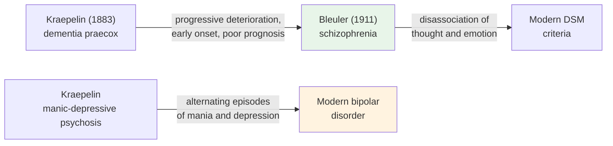

# Chapter 13 · Module 3
# Naming the Disorders — Kraepelin, Classification, and the Birth of Diagnosis
## Psychology · Unit 1 · History of Psychology

---

Heidelberg, 1883. A young psychiatrist named Emil Kraepelin is frustrated. He has been trained in the laboratory of Wilhelm Wundt — the founder of experimental psychology — and he believes that the study of mental illness should be just as rigorous as the study of perception or reaction time. But the classification of psychological disorders is a mess. Different doctors use different terms for the same condition. The same term — "mania," for example — is applied to wildly different disorders. There is no systematic way to predict which patients will recover and which will not.

Kraepelin sets out to change this. He begins meticulously recording the symptoms, course, and outcome of every patient he sees. He does not focus on what the patient *says* about their experience — that is too subjective, too unreliable. He focuses on what he can observe: the symptoms, their progression, and their outcome. Over decades of work, he develops a classification system that will become the foundation of modern psychiatric diagnosis.

His system identifies two major categories that will endure for over a century. **Dementia praecox** — a disorder characterized by early onset, cognitive deterioration, and poor prognosis — is the ancestor of what we now call schizophrenia. **Manic-depressive psychosis** — a disorder characterized by alternating episodes of mania and depression — is the ancestor of what we now call bipolar disorder. Kraepelin's insight is that disorders that look similar in their symptoms may have very different courses and outcomes — and that the course and outcome, not the symptoms alone, are the key to diagnosis.

## Kraepelin's Classification

Kraepelin's approach was shaped by his training with Wundt. He believed that psychological disorders, like all psychological phenomena, should be studied using the methods of physiological psychology. He founded laboratories of experimental psychopathology at Heidelberg and Munich, where he measured reaction times, attention, and memory in patients with various disorders.

But Kraepelin's most enduring contribution was not his experiments. It was his classification system. In his *Compendium of Psychiatry* (1883), revised in multivolume editions of his *Textbook of Psychiatry* (1915), he proposed that psychological disorders should be classified not by their symptoms alone, but by their **course and outcome**. Two patients might present with similar symptoms — hallucinations, delusions, disorganized thinking — but if one recovers and the other deteriorates, they have different disorders.

This approach led Kraepelin to distinguish between **dementia praecox** (a progressive, deteriorating condition with early onset) and **manic-depressive psychosis** (an episodic condition with better prognosis). He followed Wundt in treating dementia praecox as a disorder of attention and held that it was a constitutional disease incapable of treatment — though he later admitted that about 10 percent of cases make an almost full recovery.

Kraepelin's classification was not perfect. His categories were based on the patients he saw in his own clinics — predominantly lower-class Germans. His assumption that most disorders are constitutional and untreatable was too pessimistic. But his basic insight — that diagnosis should be based on the systematic observation of symptoms, course, and outcome — became the foundation of modern psychiatric classification.

> [!TIP] **Stop and Think**
> Kraepelin classified disorders by their course and outcome, not just their symptoms. Why does this matter? Can two disorders that look the same in their symptoms be fundamentally different? Can you think of examples from other fields of medicine where the same symptom can have different causes?

## From Dementia Praecox to Schizophrenia

In 1911, the Swiss psychiatrist Eugen Bleuler proposed a radical revision of Kraepelin's concept of dementia praecox. Bleuler argued that the disorder is not characterized by progressive cognitive deterioration (as Kraepelin had claimed), but by a **disassociation of thought and emotion** — a splitting of the mind's integrative functions. He renamed the disorder **schizophrenia**, from the Greek for "split mind."

Bleuler's revision was significant for several reasons. First, it shifted the focus from prognosis (how the disorder ends) to mechanism (what goes wrong in the mind). Second, it was more optimistic: Bleuler believed that schizophrenia could be treated, and he worked with patients for years, helping them develop coping strategies. Third, it broadened the concept: schizophrenia was no longer limited to young people with poor prognoses, but could occur at any age and with varying degrees of severity.

Bleuler's concept of schizophrenia became the standard diagnosis, and it remains so today — though the definition has evolved considerably through successive editions of the DSM. The tension between Kraepelin's pessimism (disorders are constitutional and untreatable) and Bleuler's optimism (disorders are functional and treatable) would persist throughout the history of psychiatry.

*Figure: From Kraepelin's classification to modern diagnosis — the evolution of schizophrenia and bipolar disorder.*

> [!TIP] **Stop and Think**
> Bleuler renamed dementia praecox "schizophrenia" — meaning "split mind." This has led to a widespread misunderstanding that schizophrenia involves a "split personality" (like multiple personality disorder). What are the consequences of a misleading medical term? How do names shape our understanding of disorders?

## The DSM: From Theory to Symptoms

The classification of psychological disorders has evolved dramatically since Kraepelin. In 1952, the American Psychiatric Association published the first *Diagnostic and Statistical Manual of Mental Disorders* (DSM). The original DSM defined disorders in terms of their theoretical causal **etiology** — the presumed underlying cause. This was consistent with Kraepelin's approach.

But subsequent editions moved away from etiology and toward **symptom-based classification**. DSM-II (1968) retained some theoretical language, but DSM-III (1980) made a clean break. Disorders were defined purely in terms of observable symptoms, without reference to their causes. This shift was driven by a practical problem: clinicians could not agree on the causes of disorders, but they could agree on the symptoms.

The symptom-based approach had clear advantages. It improved **reliability** — different clinicians, trained in different theoretical traditions, could now agree on the same diagnosis. It made the DSM a practical tool for clinical practice, insurance reimbursement, and research.

But it also had costs. Critics argued that the DSM sacrificed **validity** for reliability — that grouping symptoms into categories does not necessarily tell you what is actually wrong with the patient. Two patients with the same diagnosis might have very different underlying conditions. The DSM's categories might carve nature at the wrong joints.

The evolution of the DSM — from DSM-I (1952) through DSM-5 (2013) — reflects the ongoing tension between the desire for scientific rigor and the practical needs of clinicians. The DSM is the most widely used classification system in the world, but it remains deeply controversial.

| Edition | Year | Approach | Key Change |
|---|---|---|---|
| DSM-I | 1952 | Theoretical etiology | First American classification |
| DSM-II | 1968 | Modified etiology | Influenced by psychoanalysis |
| DSM-III | 1980 | Symptom-based | Radical shift to observable symptoms |
| DSM-III-R | 1987 | Revised symptoms | Minor corrections |
| DSM-IV | 1994 | Evidence-based | More empirical support |
| DSM-5 | 2013 | Dimensional + categorical | Hybrid approach |

*Table: The evolution of the DSM — from etiology-based to symptom-based classification.*

> [!TIP] **Stop and Think**
> The DSM defines mental disorders by their symptoms, not their causes. Is this a strength (it improves reliability) or a weakness (it ignores what is actually happening)? In other areas of medicine, diagnosis typically identifies the cause (bacterial infection, genetic mutation). Should psychiatry aim for the same standard?

## Meyer's Psychobiology and the Mental Hygiene Movement

Not everyone agreed with Kraepelin's constitutional approach. Adolf Meyer, a Swiss-born psychiatrist who became professor of psychiatry at Johns Hopkins, rejected the idea that most psychological disorders are products of neural pathology. Instead, he argued that they are **functional disorders** — the product of maladaptive responses to the difficulties and stresses of everyday life.

Meyer called his approach **psychobiology** — an integrated biological and psychological framework that treated psychological disorders as "psychobiological reactions." He claimed that disorders like schizophrenia are not constitutional diseases but ineffective responses that lead to "progressive habit deteriorations." They could be treated through training programs directed toward more adaptive and effective responses.

Meyer was also a supporter of the **mental hygiene movement**, inspired by Clifford Beers, a former suicidal depressive who described his experience in mental institutions in *The Mind That Found Itself* (1908). The movement aimed to increase public awareness of mental health issues and to promote prevention through education and early intervention. Meyer pioneered the use of developmental case histories and encouraged Watson to work with infants — a connection that linked the mental hygiene movement to the behaviorist tradition.

Meyer's approach was optimistic. He believed that psychological disorders could be understood, prevented, and treated through education and relearning. This was a stark contrast to Kraepelin's pessimism and Freud's emphasis on unconscious conflict. Meyer's legacy lives in the modern emphasis on functional approaches to mental health — the idea that disorders are not fixed brain diseases but patterns of behavior that can be changed.

> [!TIP] **Stop and Think**
> Meyer argued that psychological disorders are functional — maladaptive responses that can be changed through relearning. Kraepelin argued they are constitutional — brain diseases that cannot be treated. Who was right? Is the answer different for different disorders?

## Speaking of Classification...

Classification is not just a technical exercise. It shapes how we understand suffering, how we allocate resources, and how we assign blame. When a disorder is classified as a "brain disease," the patient is not responsible for their condition. When it is classified as a "maladaptive response," the patient may be seen as partly responsible. When it is classified as a product of "social conditions," the society may be seen as partly responsible.

In China, the classification of psychological disorders has been influenced by traditional Chinese medicine, which emphasizes the balance of qi and the integration of mind and body. In India, the concept of "culture-bound syndromes" — disorders that exist only in specific cultural contexts — challenges the universality of Western diagnostic categories. In Nigeria, the WHO's International Classification of Diseases (ICD) is used alongside traditional diagnostic systems that emphasize spiritual and social causes. In Japan, the concept of *hikikomori* — prolonged social withdrawal — has been debated as a culture-bound syndrome that does not fit neatly into Western categories.

The classification of psychological disorders is a scientific project, but it is also a cultural and political one. The categories we use shape the reality they describe.

> [!TIP] **Stop and Think**
> The DSM is an American classification system, developed primarily by American psychiatrists. Should it be used as a global standard? What might be lost when Western diagnostic categories are applied to non-Western cultures?

---

Kraepelin gave psychology a systematic approach to classification. Bleuler refined it. The DSM codified it. Meyer challenged it. Together, they established the framework within which psychological disorders are understood and treated today. But classification is only the beginning. The question of how to treat these disorders — through therapy, medication, or social change — is the subject of the next module.

*[Module 3 of 5 complete.]*

## References

- Kraepelin, E. (1883). *Compendium der Psychiatrie*. Leipzig: Abel.
- Bleuler, E. (1911/1950). *Dementia Praecox or the Group of Schizophrenias*. New York: International Universities Press.
- Mayes, R., & Horwitz, A. V. (2005). DSM-III and the revolution in the classification of mental illness. *Journal of the History of the Behavioral Sciences*, *41*(3), 249–267.
