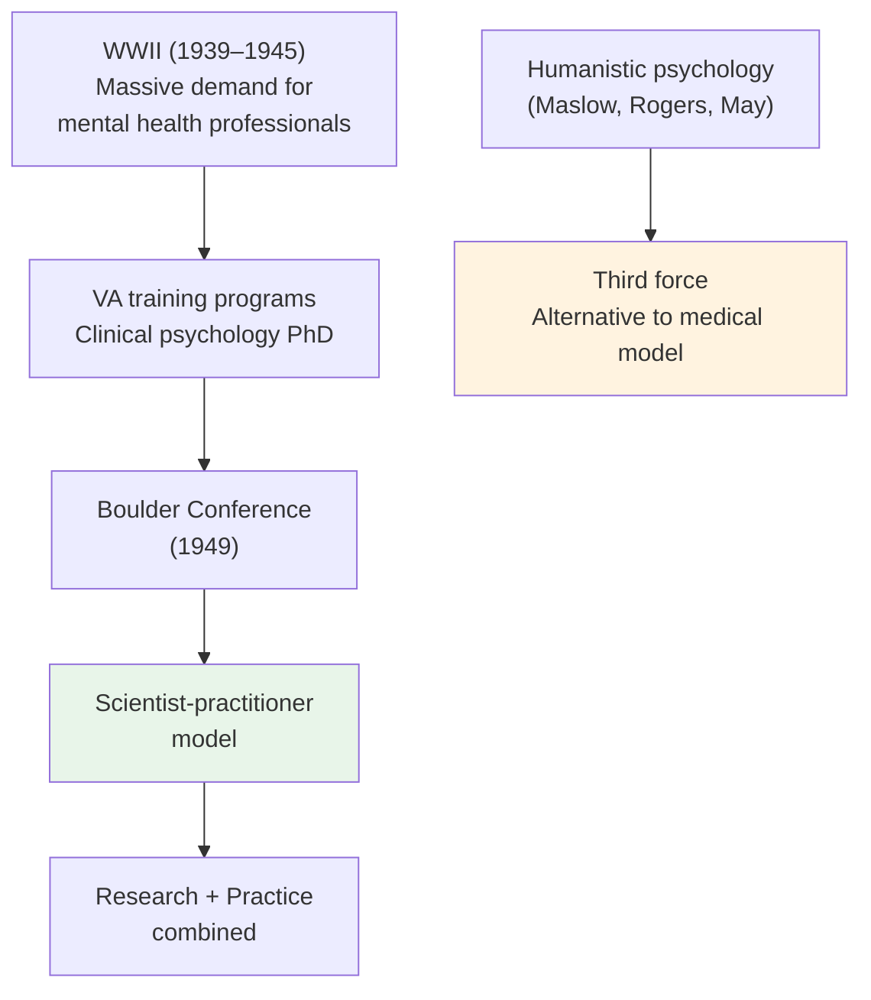

# Chapter 13 · Module 4
# The Professionalization of Clinical Psychology — From World War II to Humanistic Psychology
## Psychology · Unit 1 · History of Psychology

---

1945. The war is over. Millions of soldiers are returning home — many of them carrying invisible wounds. Combat trauma, what was then called "shell shock" or "war neurosis," has affected hundreds of thousands. The Veterans Administration (VA) is overwhelmed. There are not enough psychiatrists to treat the flood of returning veterans who need help. The VA turns to a profession that, before the war, had little to do with clinical practice: psychology.

This is the moment when clinical psychology is born as a profession. Before the war, psychologists were primarily academic researchers. They studied perception, learning, and memory in laboratories. They had no training in therapy, no license to practice, no professional identity as healers. The war changed all that. The government funded training programs in clinical psychology at major universities. Psychologists began to learn how to diagnose, assess, and treat psychological disorders. They developed the **scientist-practitioner model** — the idea that clinical psychologists should be both researchers and practitioners, integrating science with practice.

But not everyone was satisfied with this model. Some psychologists felt that the scientist-practitioner framework was too narrow, too focused on diagnosis and treatment, too rooted in the medical model of mental illness. They wanted a psychology that addressed the whole person — not just their symptoms, but their aspirations, their values, their search for meaning. This dissatisfaction would give rise to a movement that called itself the "third force" in psychology: humanistic psychology.

## The Boulder Conference and the Scientist-Practitioner Model

In 1949, the American Psychological Association held a conference in Boulder, Colorado, to determine the future of clinical psychology. The question was straightforward: should clinical psychologists be scientists, practitioners, or both? The answer — the **scientist-practitioner model** — was a compromise. Clinical psychologists would be trained as researchers first, practitioners second. They would use scientific methods to study psychological disorders and evaluate treatments. They would be, in effect, scientist-practitioners.

The Boulder Conference was a watershed moment. It established clinical psychology as a legitimate profession, distinct from psychiatry (which was medically trained) and from academic psychology (which was purely research-oriented). It created a training model — the PhD in clinical psychology — that combined scientific research with clinical practice. It gave psychologists a professional identity that they had never had before.

The scientist-practitioner model had clear strengths.

*Figure: The professionalization of clinical psychology — from WWII demand to the Boulder Conference to the humanistic alternative.* It ensured that clinical practice would be grounded in research evidence. It gave psychologists a distinct professional identity that set them apart from psychiatrists and social workers. It created a framework for evaluating the effectiveness of treatments.

But it also had limitations. The model assumed that the best way to help people is through scientific diagnosis and evidence-based treatment. It did not leave much room for the kind of deep, personal, exploratory work that Freud's psychoanalysis had emphasized. It did not address the existential questions — about meaning, purpose, authenticity — that many people bring to therapy. And it did not challenge the medical model of mental illness — the idea that psychological disorders are diseases that can be diagnosed and treated like physical illnesses.

> [!TIP] **Stop and Think**
> The scientist-practitioner model requires clinical psychologists to be both researchers and practitioners. Is this realistic? Can one person be good at both? What are the trade-offs of combining scientific rigor with clinical practice?

## Maslow and the Hierarchy of Needs

Abraham Maslow was not satisfied with the scientist-practitioner model. He was not satisfied with behaviorism or psychoanalysis either. He wanted a psychology that addressed what he saw as the highest human aspirations — creativity, self-fulfillment, the search for meaning. He called his approach **humanistic psychology**, and he called it the "third force" — an alternative to both behaviorism (the first force) and psychoanalysis (the second force).

Maslow's most famous contribution is the **hierarchy of needs**, proposed in *Motivation and Personality* (1954). The hierarchy is usually depicted as a pyramid. At the base are physiological needs — food, water, shelter. Above these are safety needs — security, stability. Then come belonging and love needs — friendship, intimacy. Then esteem needs — respect, recognition. At the top is **self-actualization** — the realization of one's full potential.

Maslow argued that lower needs must be satisfied before higher needs can be pursued. A person who is starving is not concerned with self-actualization. But once basic needs are met, people are motivated by a desire to grow, to create, to become the best version of themselves. Maslow studied people he considered self-actualizers — Abraham Lincoln, Albert Einstein, Eleanor Roosevelt — and identified common characteristics: creativity, spontaneity, acceptance of facts, problem-centering, and what he called **peak experiences** — moments of intense joy, wonder, and transcendence.

Maslow's hierarchy was not without criticism. The rigid ordering of needs has been challenged by cross-cultural research showing that people in different cultures prioritize different needs. The concept of self-actualization has been criticized as culturally specific — reflecting Western, individualistic values. And the selection of self-actualizers was biased toward famous, privileged individuals.

But Maslow's core insight — that human motivation is not just about reducing drives or managing symptoms, but about growth and fulfillment — resonated with many psychologists and with the broader public. It gave psychology a positive vision of human potential.

> [!TIP] **Stop and Think**
> Maslow's hierarchy places self-actualization at the top. But in many cultures, collective needs — family, community, social harmony — are valued more than individual self-fulfillment. Is self-actualization a universal human need, or a Western cultural value?

## Rogers and Client-Centered Therapy

Carl Rogers was, like Maslow, dissatisfied with both behaviorism and psychoanalysis. But his approach was more clinical than philosophical. Rogers was a therapist, and he wanted to know: what actually helps people change?

His answer, developed in *Client-Centered Therapy* (1951), was revolutionary in its simplicity. Rogers argued that the key to therapeutic change is not the therapist's expertise, technique, or interpretation. It is the quality of the relationship between therapist and client. When a therapist provides three conditions — **unconditional positive regard** (acceptance without judgment), **empathic understanding** (the ability to see the world through the client's eyes), and **genuineness** (authenticity and honesty) — the client naturally moves toward growth and self-acceptance.

Rogers called his approach **client-centered therapy** because it placed the client, not the therapist, at the center of the therapeutic process. The therapist does not diagnose, interpret, or direct. The therapist listens, reflects, and provides a safe space for the client to explore their own experience. Rogers believed that every person has an innate tendency toward growth — what he called the **actualizing tendency** — and that the therapist's job is to create conditions that allow this tendency to flourish.

Rogers's approach was deeply democratic. It rejected the authority of the expert — the psychiatrist who diagnoses, the analyst who interprets — and placed trust in the client's own capacity for self-understanding. It was also empirically grounded: Rogers was one of the first therapists to record and study therapy sessions, and he inspired a vast research tradition on the process and outcome of psychotherapy.

| Rogers's Core Conditions | Definition | Effect |
|---|---|---|
| **Unconditional positive regard** | Acceptance without judgment | Client feels safe to explore |
| **Empathic understanding** | Seeing through the client's eyes | Client feels understood |
| **Genuineness** | Authenticity and honesty | Relationship is real and trustworthy |

*Table: Rogers's three core conditions for therapeutic change.*

> [!TIP] **Stop and Think**
> Rogers believed that the therapist's technique matters less than the quality of the therapeutic relationship. Think about a time when someone really listened to you — without judging, without advising, just understanding. How did that experience affect you? Is understanding alone enough to help someone change?

## Existential Psychology: Meaning, Authenticity, and Anxiety

The third strand of humanistic psychology was existential psychology, influenced by European philosophers like Kierkegaard, Heidegger, and Sartre. Rollo May and James Bugental brought existential ideas into American psychology, arguing that the central human challenge is not drive reduction (Freud), not self-actualization (Maslow), but the confrontation with fundamental existential givens — death, freedom, isolation, and meaninglessness.

Existential psychologists argued that much of human suffering arises from the avoidance of these givens. People distract themselves from the awareness of death through busyness and denial. They avoid the burden of freedom by conforming to social expectations. They escape isolation through superficial connections. They flee meaninglessness through the pursuit of status and possessions.

Therapy, in the existential view, is not about diagnosing disorders or interpreting unconscious conflicts. It is about helping people confront these existential realities and live **authentically** — in full awareness of their freedom, their mortality, and their responsibility for their own choices. The goal is not happiness but **authenticity** — living in accordance with one's own values, even when doing so is difficult or painful.

Existential psychology was never as mainstream as psychoanalysis or behaviorism. It did not produce a standardized therapy technique or a manualized treatment protocol. But it addressed questions that other approaches ignored — questions about meaning, purpose, and the human condition. It reminded psychology that people are not just bundles of symptoms or collections of behaviors. They are beings who struggle with the deepest questions of existence.

> [!TIP] **Stop and Think**
> Existential psychologists argue that much suffering comes from avoiding awareness of death, freedom, isolation, and meaninglessness. Do you agree? Think about how you cope with uncertainty or the awareness of your own mortality. Do you confront these realities or avoid them?

## Speaking of Therapy...

The landscape of therapy today is remarkably diverse. Cognitive-behavioral therapy (CBT) — which focuses on changing patterns of thought and behavior — is the most widely practiced and researched approach. Psychodynamic therapy — descended from Freud's psychoanalysis — remains influential, particularly in Europe. Humanistic and existential approaches continue to be practiced, especially in settings that value personal growth and self-exploration.

In the United Kingdom, the National Health Service offers CBT as a first-line treatment for anxiety and depression, alongside other evidence-based approaches. In India, the integration of Western psychotherapy with traditional practices like yoga and meditation has created culturally adapted therapeutic approaches. In Nigeria, community-based mental health programs combine Western therapeutic techniques with traditional healing practices. In South Korea, the concept of *nunchi* — a culturally specific form of social awareness and empathy — has been integrated into therapeutic practice.

The diversity of therapeutic approaches reflects a fundamental truth about human suffering: there is no single way to help people. Different people, in different cultures, with different kinds of suffering, need different kinds of help. The scientist-practitioner model provides rigor. The humanistic tradition provides warmth. The existential tradition provides depth. The best therapy integrates all of these.

> [!TIP] **Stop and Think**
> There are hundreds of different therapy approaches. Research suggests that most effective therapies share common factors — a good therapeutic relationship, a coherent rationale, and the client's expectation of improvement. What does this tell you about the nature of therapeutic change? Is it the specific technique that helps, or the relationship?

---

The professionalization of clinical psychology after World War II created a new kind of psychologist — trained in both science and practice. The humanistic and existential movements challenged the medical model and reminded psychology of its deeper purpose: not just to diagnose and treat, but to understand and support the whole person. These traditions continue to shape clinical practice today.

*[Module 4 of 5 complete.]*

## References

- Rogers, C. R. (1951). *Client-Centered Therapy: Its Current Practice, Implications, and Theory*. Boston: Houghton Mifflin.
- Maslow, A. H. (1954). *Motivation and Personality*. New York: Harper.
- May, R. (1958). *Existence: A New Dimension in Psychiatry and Psychology*. New York: Basic Books.
