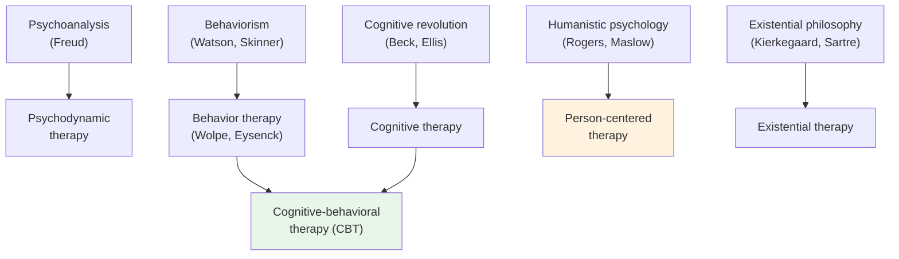

# Chapter 13 · Module 5
# Therapy in Practice — From the Asylum to the Clinic
## Psychology · Unit 1 · History of Psychology

---

New York, 1963. President John F. Kennedy signs the Community Mental Health Act, promising to replace the massive state asylums with a network of community mental health centers. The vision is bold: people with mental illness will be treated in their own communities, close to their families, with dignity and respect. The era of institutionalization is over. The era of community care has begun.

But the vision is never fully realized. The community mental health centers are inadequately funded. Many never open. Those that do are overwhelmed by demand. Patients who are discharged from asylums often end up homeless, incarcerated, or cycling through emergency rooms. The closure of state hospitals — **deinstitutionalization**, as it is called — frees thousands of people from institutional confinement, but it also abandons many of them to a different kind of suffering: poverty, isolation, and neglect.

This is the complicated legacy of the modern mental health system. It has achieved things that the asylum reformers could only dream of — effective medications, evidence-based therapies, legal protections for people with mental illness. But it has also created new problems — homelessness, incarceration, the medicalization of normal experience, the persistent stigma of mental illness. The story of therapy in practice is not a story of steady progress. It is a story of gains and losses, breakthroughs and failures, ideals and compromises.

## The Medication Revolution

The treatment of psychological disorders was transformed in the 1950s by the discovery of effective psychiatric medications. Chlorpromazine, first synthesized in 1950 and used as an antipsychotic from 1952, dramatically reduced the symptoms of schizophrenia — hallucinations, delusions, agitation — and made it possible for many patients to leave institutional care. Lithium, used to treat bipolar disorder from the 1960s, stabilized mood swings. Tricyclic antidepressants and monoamine oxidase inhibitors offered relief from severe depression.

The medication revolution had enormous consequences. It provided evidence that psychological disorders have biological components — that they can be modified by drugs that act on brain chemistry. It made deinstitutionalization feasible: patients who had been confined for years could now be managed with medication in community settings. It also shifted the balance of power in mental health treatment from psychotherapy to pharmacology.

But the medication revolution also raised troubling questions. If psychological disorders can be treated with drugs, are they simply brain diseases? Is therapy unnecessary when medication works? And what are the long-term consequences of relying on medication to manage conditions that may also have psychological and social causes?

The answers are complicated. Medications are effective for many people, but they do not work for everyone. They often have significant side effects. And they treat symptoms, not causes — when the medication is stopped, symptoms often return. The best evidence suggests that for many disorders, a combination of medication and therapy is more effective than either alone.

> [!TIP] **Stop and Think**
> Antipsychotic medications made deinstitutionalization possible by controlling the most severe symptoms of schizophrenia. But many discharged patients ended up homeless or incarcerated. Does effective medication create a moral obligation to provide it? And does providing medication absolve society of the responsibility to provide other forms of support?

## The Therapy Revolution

The postwar period saw an explosion of therapeutic approaches. By the 1970s, there were over a hundred different forms of psychotherapy — from psychoanalysis to behavior therapy, from gestalt therapy to transactional analysis, from rational-emotive therapy to primal scream therapy.

The most significant development was the rise of **cognitive-behavioral therapy** (CBT), which combined the behaviorist focus on observable behavior with the cognitive focus on thoughts and beliefs. Aaron Beck, a psychiatrist who had been trained in psychoanalysis, developed cognitive therapy for depression in the 1960s. He argued that depression is caused not by unconscious conflicts but by distorted patterns of thinking — negative automatic thoughts, cognitive distortions, and maladaptive beliefs. Therapy consists of identifying and challenging these distortions, replacing them with more realistic and adaptive patterns of thought.

CBT became the most widely practiced and researched form of therapy. It was manualized — structured into specific techniques that could be taught, standardized, and evaluated. It was time-limited — typically 12 to 20 sessions. And it was empirically supported — hundreds of randomized controlled trials demonstrated its effectiveness for depression, anxiety, PTSD, and many other conditions.

But CBT was not the only effective therapy. Psychodynamic therapy, descended from Freud's psychoanalysis, continued to show effectiveness in long-term treatment of complex conditions. Humanistic and existential approaches were effective for people seeking personal growth and self-understanding. Group therapy offered benefits that individual therapy could not — social support, interpersonal learning, and the realization that one is not alone in one's suffering.

The proliferation of therapy approaches raised a question that remains unresolved: if many different therapies work, what makes them work? The **common factors** theory suggests that effective therapies share core ingredients — a good therapeutic relationship, a coherent rationale, and the client's expectation of improvement — rather than specific techniques. If this is true, then the specific school of therapy matters less than the quality of the relationship between therapist and client.

*Figure: The major therapeutic traditions and their intellectual roots — from psychoanalysis to CBT to humanistic and existential approaches.*

> [!TIP] **Stop and Think**
> Research suggests that different therapies are roughly equally effective for most conditions. If the specific technique matters less than the therapeutic relationship, what does this tell you about the nature of healing? Is therapy more of an art or a science?

## The DSM Debate and the Medicalization of Experience

The DSM has become the standard classification system for mental disorders worldwide. It is used by clinicians, researchers, insurance companies, and courts. It shapes how people understand their own suffering and how society allocates resources for mental health care.

But the DSM is deeply controversial. Critics have raised several concerns:

**Reliability vs. validity.** The DSM's symptom-based categories are reliable — different clinicians agree on the same diagnosis. But reliability does not guarantee validity. Two patients with the same diagnosis may have very different underlying conditions. The categories may not carve nature at the right joints.

**Medicalization of normal experience.** The DSM has expanded dramatically over the decades. Conditions that were once considered normal variations of human experience — shyness, grief, childhood restlessness — have been classified as disorders (social anxiety disorder, complicated bereavement disorder, ADHD). Critics argue that this expansion pathologizes normal experience and creates a culture of diagnosis.

**Cultural bias.** The DSM was developed primarily by American psychiatrists, based on American patients. Its categories may not apply to people in other cultures. Culture-bound syndromes — conditions that exist only in specific cultural contexts — challenge the universality of Western diagnostic categories.

**The politics of diagnosis.** Homosexuality was classified as a mental disorder in the DSM until 1973, when it was removed following political pressure and changing social attitudes. This history raises uncomfortable questions about the relationship between scientific classification and social values.

Thomas Szasz, in *The Myth of Mental Illness* (1961), went further, arguing that mental illness is not a medical condition at all but a label applied to behavior that society finds deviant or threatening. While few psychologists accept Szasz's radical position, his critique highlighted the power dynamics embedded in psychiatric diagnosis.

> [!TIP] **Stop and Think**
> Homosexuality was removed from the DSM in 1973 — not because of new scientific evidence, but because of changing social attitudes. What does this tell you about the relationship between science and culture in the classification of mental disorders? Are there conditions in the current DSM that might be removed in the future for similar reasons?

## Cross-Cultural Perspectives: Mental Health Around the World

The Western model of mental illness — biological causes, diagnostic categories, professional treatment — is not universal. Different cultures understand psychological suffering in very different ways.

In many African cultures, mental illness is understood in terms of spiritual and social causes — ancestral displeasure, witchcraft, community conflict. Traditional healers play a central role in mental health care, using rituals, herbal medicines, and community support. In India, the concept of mental health is deeply influenced by Hindu and Buddhist philosophy, which emphasizes the integration of mind, body, and spirit. Traditional healing practices like yoga and meditation have been integrated into modern therapeutic approaches.

Arthur Kleinman, in *Rethinking Psychiatry* (1988), argued that Western diagnostic categories are culturally specific and may not apply to people in other cultures. He introduced the concept of **culture-bound syndromes** — conditions that exist only in specific cultural contexts, such as *susto* (soul loss) in Latin America, *koro* (genital retraction anxiety) in Southeast Asia, and *hikikomori* (prolonged social withdrawal) in Japan.

The World Health Organization (WHO) has attempted to develop culturally sensitive diagnostic systems, but the challenge remains. The globalization of Western psychiatric categories — through the DSM, the ICD, and international mental health programs — risks imposing Western assumptions on non-Western cultures. At the same time, the recognition of cultural variation risks relativism — the idea that all cultural understandings of mental illness are equally valid, even when some may cause harm.

The future of mental health care lies in finding a balance between universal standards and cultural sensitivity — between the evidence-based rigor of Western science and the wisdom of diverse cultural traditions.

> [!TIP] **Stop and Think**
> In many cultures, traditional healers play a central role in mental health care. Should Western-trained psychologists collaborate with traditional healers? What are the potential benefits and risks of integrating different healing traditions?

## Speaking of Mental Health Today...

You live in a world where mental health is more visible, more discussed, and more treated than at any point in human history. In the United Kingdom, the Improving Access to Psychological Therapies (IAPT) program has made evidence-based therapy available to millions. In India, the Mental Healthcare Act of 2017 established the right to mental health care. In Nigeria, the Federal Ministry of Health has developed a national mental health policy. In South Korea, the government has invested heavily in suicide prevention programs. In Brazil, the community mental health movement has created a network of centers that provide therapy, medication, and social support.

But the challenges remain enormous. Globally, the majority of people with mental illness receive no treatment at all. Stigma persists. Funding is inadequate. The workforce of trained mental health professionals is far too small to meet the need. And the fundamental questions — what causes mental illness, how best to treat it, how to prevent it — remain unanswered.

The history of abnormal and clinical psychology teaches us that there are no easy answers. The asylum reformers believed that humane treatment would cure mental illness. It did not. Freud believed that making the unconscious conscious would resolve psychological conflict. It helps, but it is not enough. Kraepelin believed that scientific classification would lead to effective treatment. The DSM has improved reliability, but validity remains elusive. The humanistic psychologists believed that empathy and acceptance would heal. They help, but they do not cure.

What we have learned, over two centuries of effort, is that mental illness is complex — shaped by biology, psychology, social context, and culture. There is no single cause, no single treatment, no single solution. The best we can do is to keep learning, keep listening, and keep trying to help.

> [!TIP] **Stop and Think**
> The history of mental health care is a history of good intentions, partial successes, and unintended consequences. What lessons from this history should guide the future of mental health care? What should change, and what should be preserved?

---

*[Module 5 of 5 complete. Chapter 13 complete. Take time with the "Stop and Think" prompts before moving to the next chapter.]*

## References

- Kleinman, A. (1988). *Rethinking Psychiatry: From Cultural Category to Personal Experience*. New York: Free Press.
- Szasz, T. S. (1961). *The Myth of Mental Illness: Foundations of a Theory of Personal Conduct*. New York: Hoeber-Harper.
- Shorter, E. (1997). *A History of Psychiatry: From the Era of the Asylum to the Age of Prozac*. New York: Wiley.
- Scull, A. (2015). *Madness in Civilization: A Cultural History of Insanity*. London: Thames & Hudson.
