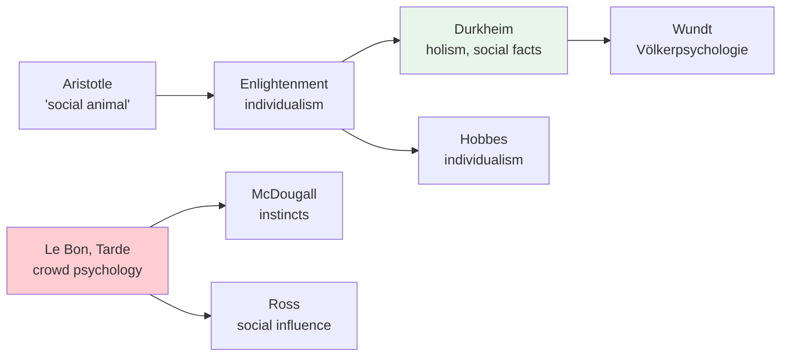

# Chapter 14 · Module 1
# The Social Animal — European Roots of Social Psychology
## Psychology · Unit 1 · History of Psychology

---

Paris, 1895. A doctor named Gustave Le Bon publishes a book that will become one of the most influential — and most disturbing — works in the history of social science. It is called *The Crowd: A Study of the Popular Mind*, and it argues that when individuals gather in crowds, they undergo a psychological transformation. They become irrational, emotional, suggestible — a "mob mentality" that is more primitive and more dangerous than the behavior of any individual. The crowd, Le Bon writes, is "endowed with a sort of collective mind which makes it feel, think, and act in a manner quite different from that in which each individual of it would feel, think, and act were he in a state of isolation."

Le Bon's book is published at a time of deep anxiety about democracy. The French Revolution is barely a century old. Mass politics, labor movements, and popular uprisings are reshaping Europe. The educated classes are terrified of what might happen if the "mob" gains power. Le Bon's theory provides a scientific justification for that fear: crowds are dangerous because they make people stupid.

But Le Bon's theory is not just a product of class anxiety. It raises a genuine question that social psychology will grapple with for the next century: how does the social context change the individual? Are you the same person alone as you are in a group? Does the group enhance your abilities, or does it diminish them? And if the group can make you do things you would never do alone, what does that tell you about the nature of the self?

## The Individual and the Community

The question of how individuals relate to social groups is as old as philosophy. Aristotle called the human being a "social animal" — a creature whose nature is fulfilled only in community. Medieval scholars conceived of individuals primarily as members of social groups. To describe a person was to describe their place in the community — their role, their relationships, their obligations.

The Enlightenment challenged this view. Thinkers like Thomas Hobbes argued that social groups are nothing more than collections of individuals, each pursuing their own self-interest. Adam Smith extended this argument to economics: the common good is best served by the individual pursuit of profit. The individual, not the community, became the basic unit of social thought.

This tension between **holism** (the view that social groups have emergent properties that cannot be reduced to individuals) and **individualism** (the view that social phenomena are nothing more than the aggregate behavior of individuals) has shaped social psychology from its inception. Durkheim, the founder of sociology, championed holism: social facts — norms, institutions, collective representations — are real, irreducible, and exert causal power over individuals. Hobbes and his heirs championed individualism: there is nothing in society that is not, at bottom, the behavior of individual persons.

Early social psychologists were divided on this question. Wilhelm Wundt, the founder of experimental psychology, recognized a distinctive **social psychology** — what he called **Völkerpsychologie** (folk psychology) — concerned with the "mental products" of social communities: language, myth, and custom. Wundt spent most of his later years developing this form of psychology in his ten-volume *Völkerpsychologie* (1900–1920). He argued that these social products cannot be understood through individual experimentation alone; they require the historical-comparative study of social communities.

> [!TIP] **Stop and Think**
> Are you a different person in different social contexts — with your family, with your friends, at work, online? James said you have as many "social selves" as there are groups whose opinion you care about. Is this a sign of inauthenticity, or is it just how social life works?

## Crowd Psychology: Le Bon and Tarde

Le Bon was not the only theorist studying crowds. Gabriel Tarde, a French sociologist, developed a complementary theory based on **imitation**. Tarde argued that social behavior is fundamentally imitative: people copy the behavior of others, especially those they admire or fear. "Society is imitation," Tarde wrote, "and imitation is a form of somnambulism." Social change, in Tarde's view, is driven by the spread of imitated behaviors — fashions, fads, innovations — through populations.

Both Le Bon and Tarde associated crowd behavior with abnormal behavior, likening the behavior of individuals in crowds to individuals in a hypnotic state. This early association of social and abnormal psychology was institutionalized when Morton Prince included papers on social psychology in the *Journal of Abnormal Psychology*, which he renamed the *Journal of Abnormal and Social Psychology* in 1917.

Durkheim and Weber rejected this framework. Durkheim insisted that social behavior is not the same as imitated behavior. Social facts — norms, laws, moral obligations — are "obligatory"; they constrain behavior whether or not anyone imitates them. Weber similarly distinguished social action (action oriented to the represented actions of members of social groups) from merely imitated behavior. Imitating someone's fishing technique is not social action. Following a rule because you believe others expect you to is.

This distinction — between social behavior that is genuinely oriented to others and behavior that is merely copied — remains important. It is the difference between following a law because you believe in the social order and following a crowd because you are swept up in the moment.

> [!TIP] **Stop and Think**
> Le Bon argued that crowds make people irrational. But crowds can also be sources of solidarity, creativity, and collective action — think of protest movements, festivals, or community responses to disasters. When does a crowd make people worse, and when does it make them better?

## McDougall and Ross: Instinct vs. Influence

In America, social psychology took a different turn. William McDougall, a British psychologist who moved to Harvard and later Duke, argued that social behavior is rooted in **instincts** — innate tendencies that predispose humans toward certain social behaviors. In *An Introduction to Social Psychology* (1908), McDougall identified a set of instincts — flight, repulsion, curiosity, self-assertion, self-abasement, parental instinct — each linked to a specific emotion. Social behavior, in his view, is the expression of these instinctive tendencies, shaped by experience and learning.

Edward Alsworth Ross, an American sociologist, took the opposite approach. In *Social Psychology* (1908), Ross argued that social behavior is primarily the product of **social influence** — the pressure that groups and societies exert on individuals. Ross studied suggestibility, imitation, and crowd behavior, and argued that individual psychology is shaped by the social context in which it develops.

The McDougall-Ross debate — nature vs. nurture in social behavior — anticipated a tension that would persist throughout the history of social psychology. Are humans naturally social, or do they become social through learning and culture? The answer, as with most nature-nurture questions, is both: humans have innate social tendencies that are shaped by social experience.

*Figure: The intellectual roots of social psychology — from Aristotle through Enlightenment individualism to the competing frameworks of crowd psychology, instincts, and social influence.*

> [!TIP] **Stop and Think**
> McDougall argued that social behavior is rooted in instincts. Ross argued it is shaped by social influence. Think about your own social behavior — how much of it feels innate (like the instinct to belong) and how much feels learned (like the norms of your culture)?

## Speaking of Social Animals...

The idea that humans are fundamentally social creatures is now supported by neuroscience. Mirror neurons — neurons that fire both when you perform an action and when you observe someone else performing it — may underlie empathy, imitation, and social learning. The brain's "social network" — regions specialized for processing social information — is one of the most developed in the human brain.

In Japan, the concept of *amae* — a culturally specific form of social dependence and mutual care — illustrates how social relationships are shaped by cultural norms. In Nigeria, the Ubuntu philosophy ("I am because we are") emphasizes the fundamental interconnectedness of human identity. In India, the joint family system shapes social development in ways that differ significantly from Western nuclear families. In Brazil, the concept of *jeitinho* — a socially learned strategy for navigating bureaucratic and social systems — illustrates how social behavior is shaped by institutional contexts.

The European theorists who founded social psychology — Durkheim, Weber, Le Bon, Tarde — were asking questions that remain urgent: How does society shape the individual? How does the individual shape society? And what happens when the relationship between the two breaks down?

> [!TIP] **Stop and Think**
> Le Bon and Tarde associated crowd behavior with irrationality and hypnosis. But modern research shows that crowds can also be rational and prosocial — think of coordinated disaster relief or peaceful protest movements. What determines whether a crowd becomes destructive or constructive?

> [!TIP] **Stop and Think**
> Durkheim argued that social facts are real and irreducible — they cannot be explained by individual psychology alone. Is this true? Can you explain a social norm (like shaking hands when you meet someone) purely in terms of individual behavior, or does it require reference to the social group?

---

Social psychology began as a European enterprise — rooted in sociology, philosophy, and the study of crowds. But it was in America that it became an experimental science, with laboratories, experiments, and precise measurements. That transformation is the story of the next module.

*[Module 1 of 5 complete.]*

## References

- Le Bon, G. (1895/1896). *The Crowd: A Study of the Popular Mind*. London: Ernest Benn.
- Durkheim, É. (1895/1982). *The Rules of Sociological Method*. New York: Free Press.
- McDougall, W. (1908). *An Introduction to Social Psychology*. London: Methuen.
