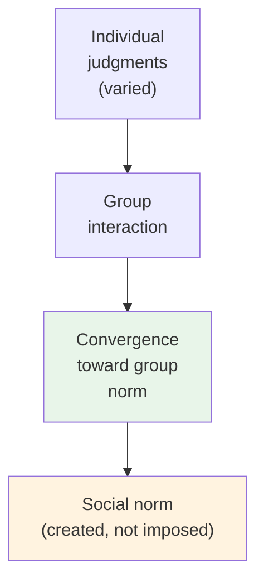

# Chapter 14 · Module 2
# The Laboratory of the Social — Experimental Social Psychology
## Psychology · Unit 1 · History of Psychology

---

Indiana, 1898. A psychologist named Norman Triplett is studying cycling. He notices something curious: cyclists ride faster when they are racing against others than when they are racing alone. Triplett wonders whether this is a general phenomenon — does the presence of others improve performance? He designs an experiment: children are asked to wind fishing line as fast as they can, either alone or in the presence of other children doing the same task. The result confirms his hypothesis: children wind faster when others are present.

Triplett's experiment, published in 1898, is often cited as the first experiment in social psychology. It is a modest beginning — just children winding fishing line. But it establishes a principle that will become central to the field: the social context changes behavior. The presence of other people is not just a background condition. It is a variable that can be studied experimentally.

Over the next half-century, social psychology will transform from a theoretical enterprise into an experimental science. It will develop precise methods for measuring attitudes, studying conformity, and analyzing group dynamics. And it will produce some of the most famous — and most controversial — experiments in the history of science.

## James's Social Selves

Before social psychology became an experimental science, William James laid the conceptual groundwork. In his *Principles of Psychology* (1890), James described the various **social selves** that can be attributed to individuals — complexes of beliefs, attitudes, emotions, and habits associated with membership in different social groups.

"We may practically say that he has as many social selves as there are distinct groups of persons about whose opinion he cares," James wrote. "He generally shows a different side of himself to each of these different groups." A youth who is demure before his parents may swear and swagger among his friends. A person who is tender with their children may be stern with their subordinates. The result is "what practically is a division of the man into several selves" — sometimes harmonious, sometimes discordant.

James's insight was ahead of its time. It anticipated modern research on social identity, self-presentation, and the situational variability of behavior. It also raised a question that social psychology has never fully resolved: if you have multiple social selves, which one is the "real" you? Is there a core self beneath the social roles, or is the self constituted by its social relationships?

> [!TIP] **Stop and Think**
> James said you have as many social selves as there are groups whose opinion you care about. Think about how you behave with your family, your friends, your colleagues, and strangers. Are these different selves, or different facets of the same self? What does this tell you about the nature of identity?

## Allport and the Experimental Turn

Floyd Allport, brother of the more famous Gordon Allport, is often credited with establishing experimental social psychology as a distinct discipline. In his *Social Psychology* (1924), Allport argued that social psychology should be an experimental science, studying the behavior of individuals in social situations using the same rigorous methods that Wundt and his students had applied to perception and reaction time.

Allport introduced the concept of **social facilitation** — the effect of the presence of others on individual performance, building on Triplett's earlier work. He demonstrated that the presence of others enhances the performance of simple tasks but impairs the performance of complex tasks — a finding that anticipated decades of research on audience effects.

Allport's approach was methodologically individualist. He studied how individuals behave in social situations, not how social groups function as collective entities. This was consistent with the dominant individualist tradition in American psychology, but it left some social psychologists uneasy. Was social psychology just individual psychology in a social context? Or was there something about social groups that could not be reduced to individual behavior?

> [!TIP] **Stop and Think**
> Allport argued that social psychology should study individuals in social situations. But some phenomena — like crowd behavior, social norms, or cultural identity — seem to belong to the group, not the individual. Can you study a group by studying individuals? What might you miss?

## Sherif and the Creation of Social Norms

Muzafer Sherif, a Turkish-born psychologist working in the United States, demonstrated something that Le Bon and Tarde had theorized: that social norms are not just descriptions of what people do; they are created through social interaction.

In his famous **autokinetic effect** experiment (1936), Sherif placed subjects in a dark room and asked them to estimate how far a stationary point of light moved. (The light does not actually move — the apparent movement is an optical illusion caused by eye movements.) When subjects made their estimates alone, they each developed their own personal norm. But when they made their estimates in the presence of others, their judgments converged toward a common group norm.

Sherif's experiment was elegant and profound. It demonstrated that even in a situation with no objectively correct answer, people create shared norms through social interaction. These norms are not imposed by authority or derived from evidence. They are emergent social products — created by the group, for the group.

This was exactly what Durkheim had argued: social facts are real, irreducible, and constraining. Sherif showed how they are created. And his experiment anticipated a generation of research on conformity, group polarization, and the power of social norms.

*Figure: Sherif's autokinetic effect — individual judgments converge toward a group norm through social interaction.*

> [!TIP] **Stop and Think**
> Sherif showed that people create shared norms even in ambiguous situations. Think about the unwritten rules of your social group — how to dress, what to say, how to behave. Where did these rules come from? Were they imposed from above, or did they emerge through social interaction?

## Speaking of Social Facilitation...

Triplett's observation that cyclists ride faster when competing with others has been confirmed and extended by decades of research. The presence of others enhances the performance of well-learned tasks (like running or typing) but impairs the performance of novel tasks (like solving unfamiliar problems). This is called **social facilitation** — and it has practical implications everywhere.

In India, the concept of social facilitation is relevant to the design of open-plan offices and co-working spaces. In South Korea, the competitive culture of education — where students study in groups and compare their performance — leverages social facilitation to drive achievement. In Nigeria, communal farming practices — where villagers work together on each other's fields — may enhance productivity through social facilitation. In Brazil, the carnival tradition — where musicians, dancers, and performers are surrounded by thousands of spectators — creates conditions for extraordinary performances.

The social context is not just a backdrop. It is an active force that shapes behavior, for better and for worse. This is the core insight of social psychology, and it was established through the experimental methods pioneered by Triplett, Allport, and Sherif.

> [!TIP] **Stop and Think**
> Allport's approach was methodologically individualist — he studied individuals in social situations. But some social psychologists argue that groups have emergent properties that cannot be reduced to individual behavior. Can you think of a group phenomenon — a riot, a market bubble, a cultural trend — that seems to have a life of its own?

> [!TIP] **Stop and Think**
> Social facilitation enhances performance on easy tasks but impairs it on hard tasks. Why do you think this is? What is it about the presence of others that makes easy things easier and hard things harder?

---

Sherif showed that social norms are created through group interaction. But what happens when the group's norm is clearly wrong? Do people conform even when they know the group is mistaken? And what happens when an authority figure orders you to do something harmful? Do you obey? These questions led to two of the most famous experiments in the history of psychology — Asch's conformity studies and Milgram's obedience experiments.

*[Module 2 of 5 complete.]*

## References

- Triplett, N. (1898). The dynamogenic factors in pacemaking and competition. *American Journal of Psychology*, *9*(4), 507–533.
- Sherif, M. (1936). *The Psychology of Social Norms*. New York: Harper.
- Allport, F. H. (1924). *Social Psychology*. Boston: Houghton Mifflin.
