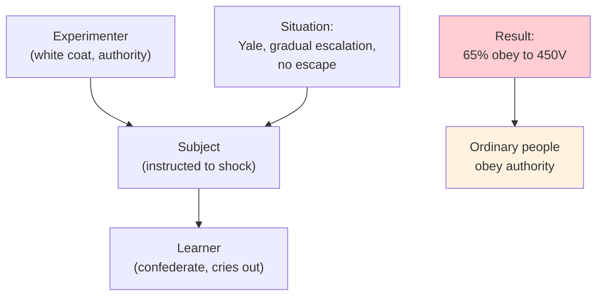

# Chapter 14 · Module 3
# Conformity, Obedience, and Attitudes — The Classic Experiments
## Psychology · Unit 1 · History of Psychology

---

New York, 1951. A group of seven college students sits around a table. They are shown a card with three lines of different lengths and asked which one matches a standard line. The correct answer is obvious — any child could get it right. But what the subject does not know is that the other six "students" are confederates of the experimenter, and they have been instructed to give the wrong answer.

Solomon Asch watches what happens next. In one-third of trials, the subject conforms — gives the obviously wrong answer to match the group. In some cases, the subject later reports that they genuinely saw the lines differently — the group's judgment actually changed their perception. In other cases, the subject knows the answer is wrong but goes along with the group anyway.

Asch's conformity experiments, conducted at Swarthmore College in the early 1950s, are among the most famous in psychology. They demonstrate that the pressure to conform is powerful enough to override the evidence of one's own senses. Even in a situation with an unambiguously correct answer, people will deny the obvious to avoid disagreeing with the group.

But Asch's experiments also show something more nuanced. Not everyone conforms. In about two-thirds of trials, subjects resist the group pressure and give the correct answer. And the presence of even one dissenting confederate — one other person who gives the correct answer — dramatically reduces conformity. Conformity is not inevitable. It depends on the situation, the individual, and the availability of social support.

> [!TIP] **Stop and Think**
> In Asch's experiments, about one-third of subjects conformed to the group's obviously wrong answer. Think about a time when you went along with a group opinion even though you privately disagreed. What made it difficult to dissent? What would have made it easier?

## Milgram: The Power of Authority

If Asch's experiments demonstrated the power of conformity, Stanley Milgram's experiments demonstrated the power of obedience — and they did so in a way that shocked the world.

In 1961, Milgram began a series of experiments at Yale University. Subjects were told they were participating in a study on learning and memory. They were instructed to administer electric shocks to another person (actually a confederate) every time that person answered a question incorrectly. The shocks started at 15 volts and increased in 15-volt increments up to 450 volts — labeled "XXX" on the shock generator. The confederate, who received no actual shocks, cried out in pain, begged for the experiment to stop, and eventually fell silent.

Milgram asked psychiatrists to predict the results. They estimated that less than 1 percent of subjects would administer the maximum shock. The actual result: 65 percent of subjects obeyed the experimenter's instructions all the way to 450 volts.

Milgram's experiments are among the most controversial in the history of psychology. They raised serious ethical concerns — subjects were deceived, distressed, and potentially traumatized. But they also revealed something deeply unsettling about human nature: ordinary people, placed in a situation where an authority figure instructs them to cause harm, will often comply. Not because they are sadistic, not because they enjoy causing pain, but because the situation creates pressure to obey.

Milgram's experiments were conducted in the shadow of the Holocaust. Milgram, a Jewish American psychologist, wanted to understand how ordinary Germans could have participated in the atrocities of the Nazi regime. His answer was not that Germans are uniquely evil. His answer was that the situation — the authority of the state, the diffusion of responsibility, the gradual escalation of harm — creates conditions in which ordinary people will do extraordinary things.

*Figure: Milgram's obedience experiment — the situational factors that led 65% of ordinary people to administer maximum shocks.*

> [!TIP] **Stop and Think**
> Milgram's experiments raised serious ethical concerns — subjects were deceived and distressed. Was the knowledge gained worth the harm caused? Where should psychology draw the line between scientific inquiry and the protection of research subjects?

## Measuring Attitudes: Thurstone and Likert

Social psychologists also developed methods for measuring **attitudes** — learned evaluations of people, objects, and events that influence behavior. The measurement of attitudes became one of social psychology's most important contributions to practical life, influencing polling, marketing, and political strategy.

Louis Thurstone developed one of the first systematic attitude scales in the 1920s. His method — **equal-appearing intervals** — involved having judges rate the favorability of a set of statements about a topic (like war or religion). The statements were then arranged along a scale from most unfavorable to most favorable, with equal intervals between them. Subjects indicated which statements they agreed with, and their attitude score was the average scale value of their endorsed statements.

Rensis Likert developed a simpler method in the 1930s — **summated ratings**. Subjects rate their agreement with each statement on a five-point scale (strongly agree, agree, neutral, disagree, strongly disagree). The attitude score is the sum of the ratings. Likert scales became the most widely used method for measuring attitudes in psychology, marketing, and political science.

These measurement tools had enormous practical applications. They made it possible to measure public opinion, predict voting behavior, and evaluate the effectiveness of persuasion campaigns. They also raised questions about the relationship between attitudes and behavior — do people actually act on their attitudes, or is the relationship more complex?

> [!TIP] **Stop and Think**
> Attitude scales measure what people say they believe. But does what people say predict what they do? Think about a time when your behavior contradicted your stated beliefs. What does this tell you about the relationship between attitudes and behavior?

## Lewin and Group Dynamics

Kurt Lewin, a German-born Gestalt psychologist who fled to America in 1933, brought a new perspective to social psychology. Lewin argued that behavior is a function of the person and the environment — what he called **field theory**. You cannot understand behavior by studying the individual alone; you must study the entire "life space" — the person, the environment, and the relationship between them.

Lewin applied this framework to the study of **group dynamics** — the forces that operate within and between groups. He demonstrated that different leadership styles (authoritarian, democratic, laissez-faire) produce different group behaviors. Groups with democratic leaders were more productive, more satisfied, and more cohesive than groups with authoritarian or laissez-faire leaders.

Lewin also pioneered the use of **group decision** as a tool for behavior change. In a famous study during World War II, he showed that housewives were more likely to change their food habits (using unfamiliar organ meats during rationing) when the change was discussed in a group and a group decision was made, rather than when they were simply told to change by an authority figure. This demonstrated the power of social influence in producing lasting behavioral change.

Lewin's work on group dynamics anticipated modern research on organizational behavior, team effectiveness, and leadership. His field theory — the idea that behavior is a function of the person and the environment — became a foundational principle of social psychology.

> [!TIP] **Stop and Think**
> Lewin showed that democratic leadership produces better group outcomes than authoritarian leadership. Think about groups you have been part of — a sports team, a class project, a workplace. How did the leadership style affect the group's performance and your own experience?

## Cognitive Dissonance: When Beliefs and Behavior Collide

In 1957, Leon Festinger proposed a theory that would become one of the most influential in social psychology: **cognitive dissonance**. The idea is simple but powerful. When people hold two inconsistent cognitions — beliefs, attitudes, or behaviors that contradict each other — they experience an uncomfortable psychological tension (dissonance) that motivates them to reduce the inconsistency.

The classic experiment: Festinger and Carlsmith (1959) asked subjects to perform a boring task (turning pegs on a board). Some subjects were paid $1 to tell the next subject that the task was interesting; others were paid $20. The surprising result: subjects paid $1 rated the task as more interesting than subjects paid $20. Why? Subjects paid $20 had a clear justification for their lie — "I was well paid." Subjects paid $1 had no such justification. To reduce the dissonance between their behavior (telling someone the task was interesting) and their belief (the task was boring), they changed their belief: "Maybe the task was actually interesting."

Cognitive dissonance theory explains a wide range of phenomena: why people rationalize bad decisions, why initiations are more effective when they are painful, why smokers who know smoking is harmful continue to smoke (and sometimes deny the evidence). It demonstrates that attitudes are not fixed — they can be changed by behavior, especially when the behavior is not externally justified.

| Factor | Effect on Dissonance |
|---|---|
| **Free choice** | More dissonance when behavior is freely chosen |
| **Commitment** | More dissonance when behavior is irreversible |
| **Justification** | Less dissonance when external justification exists |
| **Importance** | More dissonance when the cognitions are personally important |

*Table: Factors that influence the magnitude of cognitive dissonance.*

> [!TIP] **Stop and Think**
> Festinger showed that people change their beliefs to match their behavior, especially when they lack external justification. Think about a decision you made that turned out badly. Did you change your beliefs to justify the decision, or did you accept that you made a mistake?

## Speaking of Conformity and Obedience...

Asch's and Milgram's experiments were conducted in the United States in the mid-twentieth century. But conformity and obedience are universal human phenomena — though they manifest differently across cultures.

In Japan, the concept of *wa* (harmony) creates strong social pressure to conform to group norms. In China, the Confucian tradition emphasizes respect for authority and social hierarchy. In Nigeria, communal values create strong conformity pressures within extended family and community networks. In India, the caste system historically created rigid social hierarchies that demanded obedience. In the United Kingdom, the "stiff upper lip" tradition creates conformity to emotional restraint.

Cross-cultural replications of Asch's experiments have shown that conformity rates vary across cultures — higher in collectivist cultures (like Japan and India) and lower in individualist cultures (like the United States and United Kingdom). But the basic phenomenon — the pressure to conform to group norms — is universal.

Milgram's experiments have been replicated in many countries — including Germany, Italy, Spain, Australia, and the Netherlands — with broadly similar results. Obedience to authority is not a uniquely American phenomenon. It is a feature of human social life that transcends cultural boundaries.

> [!TIP] **Stop and Think**
> Asch's and Milgram's experiments are often cited as evidence of the dark side of human nature — conformity and obedience. But conformity can also be a force for good: following traffic laws, respecting social norms, cooperating with others. When is conformity healthy, and when is it dangerous?

---

The classic experiments of social psychology — Sherif, Asch, Milgram, Festinger — revealed the power of social influence on individual behavior. They also raised profound questions about human nature, free will, and the relationship between the individual and the group. But while social psychologists were studying how people behave in groups, developmental psychologists were studying how people become who they are — from infancy through old age.

*[Module 3 of 5 complete.]*

## References

- Asch, S. E. (1951). Effects of group pressure upon the modification and distortion of judgments. In H. Guetzkow (Ed.), *Groups, Leadership, and Men* (pp. 177–190). Pittsburgh: Carnegie Press.
- Milgram, S. (1963). Behavioral study of obedience. *Journal of Abnormal and Social Psychology*, *67*(4), 371–378.
- Festinger, L. (1957). *A Theory of Cognitive Dissonance*. Stanford: Stanford University Press.
