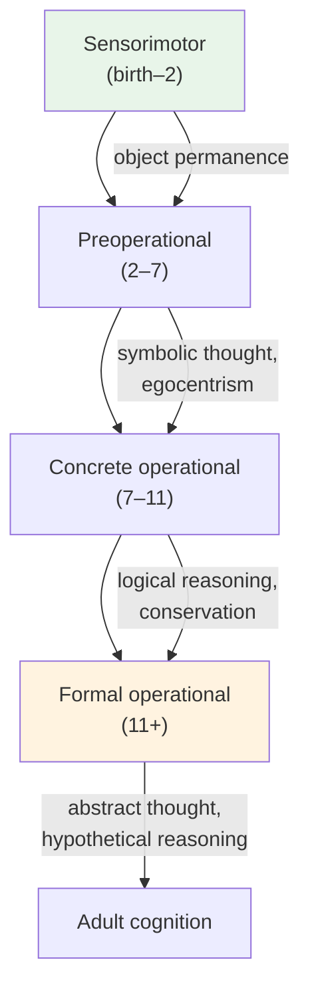

# Chapter 14 · Module 4
# Growing Minds — The Origins of Developmental Psychology
## Psychology · Unit 1 · History of Psychology

---

Geneva, 1920s. A young Swiss biologist-turned-psychologist named Jean Piaget is watching children. Not just any children — his own. He watches them solve problems, make mistakes, and ask questions. And he notices something that will change the way we understand the developing mind: children do not just know less than adults. They think *differently*. Their reasoning follows a different logic. Their understanding of the world is qualitatively different from adult understanding — not just less developed, but fundamentally organized in a different way.

A child who has not yet mastered the concept of conservation — the idea that the amount of a substance does not change when its shape changes — will tell you that pouring water from a short, wide glass into a tall, narrow glass produces more water. This is not a mistake in the adult sense. The child is not failing to attend or making a careless error. The child's mind is organized in a way that makes this answer perfectly logical. The quantity of water, for the child, is tied to its appearance — and the tall glass looks like it contains more.

Piaget's insight is revolutionary. Before him, developmental psychology was largely a descriptive enterprise — cataloguing what children can do at different ages. After him, it becomes a theoretical enterprise — explaining *how* the mind develops and *why* it develops the way it does. Piaget does not just describe development. He explains it.

## The Question of Origins

The question of how the mind develops is as old as philosophy. The ancient Greeks debated whether knowledge is innate (present at birth) or acquired through experience. This debate was reformulated in the seventeenth century as the conflict between **preformationism** (the view that the mind is preformed at birth and merely unfolds over time) and **epigenesis** (the view that the mind develops through a process of qualitative change, with new structures emerging through interaction with the environment).

The modern study of child development began in the late nineteenth century with G. Stanley Hall, who established the first American laboratory devoted to child study. Hall's approach was shaped by Darwin's theory of evolution. He proposed a theory of **recapitulation** — the idea that the development of the individual recapitulates the development of the species. Just as the human embryo passes through stages that resemble the embryos of lower animals, the human child passes through stages that recapitulate the history of the human race.

Hall's recapitulation theory was wrong — children do not literally recapitulate evolutionary history. But his emphasis on development as a process of change over time, and his use of systematic methods to study that change, established developmental psychology as a scientific discipline. He also introduced the concept of **adolescence** as a distinct developmental period, arguing that it is characterized by "storm and stress" — emotional turbulence, identity confusion, and conflict with authority.

> [!TIP] **Stop and Think**
> Hall argued that adolescence is a period of "storm and stress." Is this true in all cultures, or is it a product of Western, industrialized societies? What do you know about adolescence in other cultural contexts? Is the experience of growing up universal or culturally specific?

## Watson and Gesell: Two Approaches to Development

John Watson, the founder of behaviorism, applied his principles to child development. In *Psychological Care of Infant and Child* (1928), Watson argued that children are born as blank slates — their development is entirely determined by environmental conditioning. "Give me a dozen healthy infants, well-formed, and my own specified world to bring them up in," Watson famously claimed, "and I'll guarantee to take any one at random and train him to become any type of specialist I might select."

Watson's behaviorist approach to child development was influential but limited. It could explain how children learn specific behaviors — through reinforcement, punishment, and conditioning — but it could not explain how children develop the capacity for abstract reasoning, language, or moral judgment. These capacities seem to require something more than stimulus-response association.

Arnold Gesell took the opposite approach. Gesell, a pediatrician at Yale, argued that development is primarily a process of **maturation** — the unfolding of genetically determined patterns. He used systematic observation and filming to document the developmental norms — the typical ages at which children achieve milestones like sitting, walking, and talking. Gesell's norms were widely used by parents and pediatricians to track children's development.

Gesell's maturation theory was more accurate than Watson's blank-slate theory in recognizing the role of biology. But it was too passive — it treated the child as a plant that simply grows according to its genetic blueprint, rather than an active agent who constructs understanding through interaction with the environment.

> [!TIP] **Stop and Think**
> Watson said development is all environment. Gesell said it is all maturation. Modern developmental psychology recognizes both nature and nurture. But the balance between them varies for different developmental achievements. For walking, maturation is primary. For reading, environment is primary. What about for moral reasoning? For empathy? For creativity?

## Piaget's Cognitive Development: Stages of Understanding

Piaget's theory of cognitive development, developed over decades of meticulous observation and experimentation, is the most influential developmental theory of the twentieth century. Piaget argued that children pass through four stages of cognitive development, each characterized by a qualitatively different way of understanding the world:

1. **Sensorimotor stage (birth–2 years):** Infants learn about the world through their senses and actions. They develop **object permanence** — the understanding that objects continue to exist even when they cannot be seen.

2. **Preoperational stage (2–7 years):** Children begin to use language and symbols, but their thinking is characterized by **egocentrism** (inability to see things from another's perspective) and a failure to understand **conservation** (the idea that quantity does not change when shape changes).

3. **Concrete operational stage (7–11 years):** Children can think logically about concrete events. They understand conservation, classification, and seriation (ordering objects along a dimension). But they cannot think abstractly.

4. **Formal operational stage (11+ years):** Adolescents can think abstractly, hypothetically, and systematically. They can reason about hypothetical situations, test hypotheses, and think about thinking itself.

Piaget explained development through two complementary processes. **Assimilation** is the process of fitting new information into existing cognitive structures (schemas). **Accommodation** is the process of modifying existing schemas to fit new information. Development occurs through the dynamic interaction of these processes — as children encounter new experiences that challenge their existing understanding, they must modify their schemas to accommodate them.

*Figure: Piaget's four stages of cognitive development — from sensorimotor exploration to abstract reasoning.*

> [!TIP] **Stop and Think**
> Piaget argued that children in the preoperational stage are "egocentric" — they cannot see things from another person's perspective. But research has shown that even very young children show empathy and understanding of others' emotions. Does this challenge Piaget's theory, or can empathy and cognitive perspective-taking develop independently?

## Speaking of Growing Up...

Piaget's stages have been both enormously influential and heavily criticized. Cross-cultural research has shown that the stages are not as universal as Piaget believed — children in different cultures reach the stages at different ages, and some (particularly the formal operational stage) may not be reached at all without formal education. In rural communities where formal schooling is limited, adults may not develop the abstract reasoning that Piaget associated with the formal operational stage.

In India, research on cognitive development has shown that children in traditional communities develop practical reasoning skills (like market arithmetic) earlier than Piaget's theory would predict, while developing formal abstract reasoning later. In Nigeria, children learn to navigate complex social systems — understanding kinship obligations, social hierarchies, and community expectations — at ages that Western developmental norms would consider too young. In Brazil, street children develop sophisticated practical reasoning skills — negotiating, bargaining, avoiding danger — that do not fit neatly into Piaget's stage theory.

These findings suggest that cognitive development is shaped by both biology and culture. The basic cognitive structures that Piaget identified — schemas, assimilation, accommodation — may be universal. But the specific ways in which they develop, and the cognitive achievements that are valued and cultivated, vary across cultures.

> [!TIP] **Stop and Think**
> Watson claimed he could train any infant to become any specialist. Piaget argued that development follows universal stages shaped by biological maturation. Who was closer to the truth? If you had to raise a child using only one of these frameworks, which would you choose — and why?

> [!TIP] **Stop and Think**
> Piaget's theory was developed by observing children in Geneva — mostly from educated, middle-class families. How might the results have been different if Piaget had studied children in rural Africa, urban India, or indigenous Amazonia? What does this tell you about the relationship between culture and cognitive development?

---

Piaget showed that children actively construct their understanding of the world. But he did not give enough credit to the social context in which that construction takes place. That was the contribution of Lev Vygotsky, who argued that cognitive development is fundamentally a social process — that children learn not just from their own experience, but from their interactions with more knowledgeable others. Vygotsky's ideas, along with Bowlby's attachment theory and Erikson's psychosocial framework, are the subject of the final module.

*[Module 4 of 5 complete.]*

## References

- Piaget, J. (1952). *The Origins of Intelligence in Children*. New York: International Universities Press.
- Hall, G. S. (1904). *Adolescence: Its Psychology and Its Relations to Physiology, Anthropology, Sociology, Sex, Crime, Religion, and Education*. New York: Appleton.
- Gesell, A. (1928). *Infancy and Human Growth*. New York: Macmillan.
