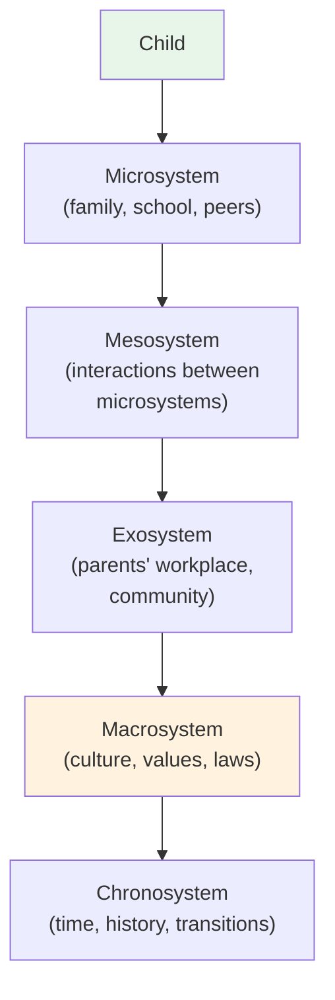

# Chapter 14 · Module 5
# Attachment, Culture, and the Developing Self
## Psychology · Unit 1 · History of Psychology

---

London, 1958. A psychiatrist named John Bowlby is studying delinquent boys. He notices something that the prevailing behaviorist theories of development cannot explain: many of these boys have been separated from their mothers in early childhood. They were raised in institutions, shuffled between foster homes, or abandoned. Their delinquency, Bowlby argues, is not the result of poor conditioning or inadequate reinforcement. It is the result of disrupted **attachment** — the deep emotional bond that forms between an infant and a primary caregiver in the first years of life.

Bowlby's theory of attachment, developed over the next two decades, is one of the most important contributions to developmental psychology. It argues that the quality of the early attachment relationship — secure or insecure — has profound consequences for emotional development, social competence, and mental health throughout the lifespan. Children who develop a **secure base** — a reliable, responsive caregiver who provides safety and comfort — are better able to explore the world, regulate their emotions, and form healthy relationships later in life. Children who lack a secure base are more likely to develop anxiety, depression, and behavioral problems.

Bowlby's theory was controversial when he first proposed it. Psychoanalysts criticized him for abandoning the focus on unconscious conflict. Behaviorists criticized him for reintroducing "mentalistic" concepts. Feminists criticized him for placing the burden of child-rearing on mothers. But decades of research have confirmed the central importance of attachment for human development.

## Vygotsky: The Social Construction of Mind

While Piaget was developing his theory in Geneva, a Russian psychologist named Lev Vygotsky was developing a very different account of cognitive development in Moscow. Vygotsky argued that cognitive development is not primarily a process of individual construction, as Piaget believed. It is a process of **social construction** — children develop higher mental functions through their interactions with more knowledgeable others: parents, teachers, peers, and the broader culture.

Vygotsky's most influential concept is the **zone of proximal development** (ZPD) — the gap between what a child can do alone and what they can do with the help of a more competent partner. A child who cannot solve a problem independently may be able to solve it with guidance, scaffolding, and support. The ZPD is where learning happens — at the edge of the child's current competence, with the assistance of someone who can bridge the gap.

**Scaffolding** — the process by which a more knowledgeable person provides temporary support that is gradually withdrawn as the child becomes more competent — has become one of the most widely used concepts in education. It captures the idea that learning is not a passive absorption of information, but an active, collaborative process of meaning-making between the child and the social world.

Vygotsky also emphasized the role of **private speech** — the self-directed talk that children use to guide their own behavior. Unlike Piaget, who saw private speech as a sign of egocentrism that would eventually disappear, Vygotsky argued that it is a crucial cognitive tool — a way of internalizing social dialogue and using it to regulate one's own thinking.

Vygotsky's work was suppressed in the Soviet Union during the Stalin era and did not become widely known in the West until the 1960s. But it has since become enormously influential, particularly in education. His emphasis on the social context of learning, the role of scaffolding, and the importance of cultural tools (language, symbols, technologies) has reshaped how we think about teaching and learning.

> [!TIP] **Stop and Think**
> Vygotsky argued that learning happens in the zone of proximal development — with the help of a more knowledgeable other. Think about a skill you learned — playing an instrument, speaking a language, cooking a meal. How did a teacher, parent, or friend help you learn? Was the help gradually withdrawn as you became more competent?

## Erikson: Development Across the Lifespan

Erik Erikson, a psychoanalyst trained in the Freudian tradition, extended developmental psychology beyond childhood. In *Childhood and Society* (1950) and later works, Erikson proposed that human development unfolds across eight stages, from birth to old age, each characterized by a central psychosocial conflict:

1. **Trust vs. mistrust** (infancy) — Can I trust the world?
2. **Autonomy vs. shame and doubt** (toddlerhood) — Can I do things myself?
3. **Initiative vs. guilt** (preschool) — Can I plan and act?
4. **Industry vs. inferiority** (school age) — Am I competent?
5. **Identity vs. role confusion** (adolescence) — Who am I?
6. **Intimacy vs. isolation** (young adulthood) — Can I love and be loved?
7. **Generativity vs. stagnation** (middle adulthood) — Am I contributing?
8. **Integrity vs. despair** (old age) — Was my life meaningful?

Erikson's theory was broader than Freud's in several ways. It emphasized social and cultural influences on development, not just biological drives. It extended development across the entire lifespan, not just childhood. And it focused on healthy development — on the positive outcomes that are possible at each stage — not just on pathology.

Erikson's concept of **identity crisis** — the adolescent struggle to establish a coherent sense of self — has become part of everyday language. His concept of **generativity** — the middle-adult concern with contributing to the next generation — has inspired research on parenting, mentoring, and civic engagement.

> [!TIP] **Stop and Think**
> Erikson's eight stages span the entire lifespan, from birth to old age. Where are you in this framework? What is the central conflict you are facing right now? How does your current stage connect to the stages that came before it?

## Bronfenbrenner: The Ecology of Development

Urie Bronfenbrenner, a Russian-born American psychologist, argued that development cannot be understood by studying the child alone. The child is embedded in multiple environmental systems — family, school, community, culture — that all influence development. His **ecological systems theory** identifies several levels of environmental influence:

- **Microsystem:** The immediate environment — family, school, peers, workplace.
- **Mesosystem:** The interactions between microsystems — for example, the relationship between family and school.
- **Exosystem:** The broader social environment — parents' workplace, community resources, media.
- **Macrosystem:** The cultural context — values, laws, customs, economic systems.
- **Chronosystem:** The dimension of time — historical events, life transitions, socio-historical context.

Bronfenbrenner's theory challenged the tendency to study development in artificial laboratory settings. He argued that development is a process that occurs in real-world contexts, and that those contexts must be studied as part of the developmental process.

Cross-cultural research has confirmed the importance of Bronfenbrenner's ecological perspective. In India, the joint family system creates a microsystem that is very different from the nuclear family typical of Western cultures. In Nigeria, the extended family and community play a much larger role in child-rearing than in individualistic Western societies. In Japan, the school system and peer culture create developmental contexts that are very different from those in the United States or Europe. In Brazil, economic inequality creates vastly different developmental ecologies for children in different social classes.

*Figure: Bronfenbrenner's ecological systems theory — the child is embedded in multiple layers of environmental influence.*

> [!TIP] **Stop and Think**
> Bronfenbrenner argued that you cannot understand a child's development without understanding the systems they are embedded in. Think about your own development. How did your family, school, community, and culture shape who you are today? Which systems had the most influence?

## Speaking of Development...

The question of whether development is universal or culturally specific is one of the most important in developmental psychology. Piaget's stages have been found in many cultures, but the ages at which they are reached vary, and some stages (particularly formal operations) may not be universal. Erikson's stages are based on Western, industrialized societies and may not apply to cultures with very different life trajectories. Bowlby's attachment theory has been supported by research in many countries, but the specific patterns of attachment vary across cultures.

In collectivist cultures — like those of Japan, China, and India — the emphasis is on interdependence, social harmony, and filial piety. Development is oriented toward becoming a responsible member of the community, not toward individual self-actualization. In individualist cultures — like those of the United States, United Kingdom, and Australia — the emphasis is on independence, self-expression, and personal achievement. Development is oriented toward becoming an autonomous individual.

Neither orientation is inherently better. They are different solutions to the universal challenge of becoming a competent, contributing member of society. The challenge for developmental psychology is to understand both the universal processes and the cultural variations — to recognize what is shared across cultures and what is distinctive to each one.

> [!TIP] **Stop and Think**
> Erikson's concept of "identity crisis" has become part of everyday language. But the idea that adolescence is a time of identity formation may be culturally specific. In many cultures, identity is not something you "find" — it is something that is given to you by your family, community, and social role. Is the search for individual identity a luxury of affluent societies?

> [!TIP] **Stop and Think**
> Developmental psychology has been dominated by Western theories — Piaget, Erikson, Bowlby. What might be missing from these accounts? What perspectives might a developmental psychologist from India, Nigeria, or Japan bring that Western theorists have overlooked?

---

Social and developmental psychology share a common insight: human beings are not isolated individuals. They are social creatures, shaped by their relationships, their communities, and their cultures. Social psychology shows how the social context influences behavior. Developmental psychology shows how that influence unfolds over a lifetime. Together, they remind us that to understand the human mind, you must understand the human world.

*[Module 5 of 5 complete. Chapter 14 complete. Take time with the "Stop and Think" prompts before moving to the next chapter.]*

## References

- Bowlby, J. (1969). *Attachment and Loss, Vol. 1: Attachment*. New York: Basic Books.
- Vygotsky, L. S. (1934/1986). *Thought and Language*. Cambridge, MA: MIT Press.
- Erikson, E. H. (1950). *Childhood and Society*. New York: Norton.
- Bronfenbrenner, U. (1979). *The Ecology of Human Development*. Cambridge, MA: Harvard University Press.
