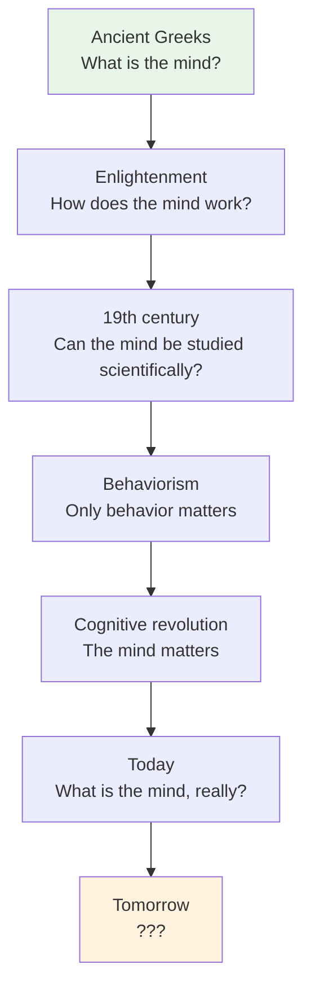

# Chapter 15 · Module 1
# The Past and Future of Scientific Psychology
## Psychology · Unit 1 · History of Psychology

---

You have just traveled through twenty-five centuries of the history of psychology — from the ancient Greeks who first asked what the mind is, to the cognitive scientists who are still working on the answer. You have met philosophers who believed the mind is a blank slate, physiologists who mapped the brain, evolutionists who traced the mind's origins to animal behavior, behaviorists who insisted that only observable behavior matters, and cognitive psychologists who brought the mind back into the laboratory. You have seen asylum reformers fight for dignity, Freud uncover the unconscious, Piaget watch children think, and Milgram test the limits of obedience.

This is not just a collection of facts and names. It is a story — a story about how human beings have tried to understand themselves. And like all stories, it has a shape. It is not a straight line from ignorance to knowledge. It is a winding path, full of wrong turns, dead ends, rediscoveries, and surprises.

## The Contingency of History

One of the most important lessons of this history is that the development of psychology was not inevitable. It depended on the particularities of social, cultural, political, and institutional context — and on the vagaries of individual careers.

Consider: Italian psychology embraced cognitive psychology in the 1920s and never looked back. When George Miller critiqued behaviorism at a talk in London in the 1960s, his host pointed out that there were only three behaviorists in Britain and apologized for the fact that none were in attendance. French psychology was closely linked to medicine and clinical psychology from the beginning, through the work of Charcot, Janet, and Dumas. Latin American psychology was based on a mix of Wundtian physiology and Freudian psychoanalysis. Russian psychology before the revolution comprised an eclectic mix of cognitive psychology, musicology, psychophysics, physiology, linguistics, and social and developmental psychology.

The story of psychology that you have read in this book is primarily the story of *American* psychology. It is the story of how a particular set of ideas — structuralism, functionalism, behaviorism, cognitivism — developed in a particular country, under particular social and institutional conditions. In other countries, the story was different. Behaviorism never dominated British psychology as it did American psychology. Cognitive psychology arrived in Italy decades before it arrived in the United States. Psychoanalysis took root in Argentina in a way it never did in most other countries.

This is not a criticism. It is a reminder that the history of science is not just the history of ideas. It is the history of people, institutions, cultures, and circumstances. The same ideas can flourish in one context and wither in another. The development of psychology depended on who taught at which university, who funded which research, who published which journal, and who happened to be in the room when a new idea was proposed.

> [!TIP] **Stop and Think**
> The development of psychology was contingent on social, cultural, and institutional circumstances. If behaviorism had not dominated American psychology, what might have developed instead? What ideas were suppressed or marginalized that might have flourished under different conditions?

## What We Have Learned

Looking back across this history, several themes stand out:

**The mind is real.** From Aristotle to the cognitive revolution, psychologists have debated whether the mind is a legitimate subject of scientific study. The answer, after twenty-five centuries, is yes. Cognitive processes — perception, memory, attention, reasoning, language — are real phenomena that can be studied with the tools of science.

**The mind is embodied.** The mind is not a disembodied soul or an abstract computer program. It is a biological system, shaped by evolution, implemented in the brain, and embedded in a body. The history of psychology is the history of coming to terms with this fact — from the ancient Greeks' recognition that the brain, not the heart, is the organ of thought, to modern neuroscience's mapping of cognitive processes onto neural circuits.

**The mind is social.** Humans are not isolated individuals. They are social creatures, shaped by their relationships, their communities, and their cultures. From Wundt's Völkerpsychologie to Vygotsky's social constructivism to Bronfenbrenner's ecological systems theory, psychologists have recognized that the mind cannot be understood in isolation from the social world.

**The mind is historical.** The way people think, feel, and behave changes over time — not just across individual development, but across cultural and historical periods. The medieval mind is not the modern mind. The mind of a hunter-gatherer is not the mind of a software engineer. Psychology must be sensitive to historical and cultural context.

**Science is human.** The history of psychology is not just a history of ideas. It is a history of people — brilliant, flawed, ambitious, compassionate, biased, and courageous. Watson's behaviorism was shaped by his personality. Freud's theories were shaped by his Viennese context. The army testing program was shaped by wartime urgency. The cognitive revolution was shaped by the invention of the computer. Science is a human enterprise, with all the strengths and weaknesses that implies.

*Figure: The arc of psychology's history — from ancient questions to modern answers to future possibilities.*

> [!TIP] **Stop and Think**
> Psychology has been shaped by wars, technologies, social movements, and individual personalities. What forces are shaping psychology today? What might the history of psychology look like fifty years from now?

## The Future of Psychology

The future of scientific psychology, like its past, depends on the contingencies of historical circumstance and personality. But some trends are clear.

**The integration of levels.** Psychology is increasingly integrating multiple levels of explanation — cognitive, neural, social, developmental, and cultural. The old boundaries between subdisciplines are breaking down. Cognitive neuroscience integrates cognition and brain science. Cultural psychology integrates cognition and culture. Developmental psychopathology integrates development and clinical practice.

**The globalization of psychology.** Psychology has been dominated by Western, industrialized societies. But this is changing. Researchers in India, China, Nigeria, Brazil, Japan, and South Korea are producing world-class research that challenges Western assumptions and enriches the field. The future of psychology is global.

**The challenge of technology.** Artificial intelligence, social media, virtual reality, and brain-computer interfaces are creating new psychological phenomena that psychologists must understand. How does technology change the way we think, feel, and relate to each other? What is the psychology of the digital age?

**The ethical imperative.** The history of psychology includes episodes of harm — the misuse of intelligence testing to justify eugenics, the ethical violations of the Milgram experiments, the overreach of psychoanalysis, the neglect of marginalized populations. The future of psychology must be guided by a commitment to ethical practice, social justice, and the well-being of all people.

> [!TIP] **Stop and Think**
> You have now completed the history of psychology. What surprised you most? What challenged your assumptions? What will you take with you as you continue your study of psychology?

---

The history of psychology is not over. It is being written right now — in laboratories, clinics, classrooms, and communities around the world. The questions that the ancient Greeks asked — What is the mind? How does it work? How should we live? — are still being asked. The answers are still coming. And you, as a student of psychology, are now part of that story.

*[Module 1 of 1 complete. Chapter 15 complete. Take time with the "Stop and Think" prompts before concluding.]*

## References

- Baars, B. J. (1986). *The Cognitive Revolution in Psychology*. New York: Guilford Press.
- Sexton, V. S., & Misiak, H. (1976). *Psychology Around the World*. Belmont, CA: Wadsworth.
- Greenwood, J. D. (2009). *A Conceptual History of Psychology*. New York: McGraw-Hill.
