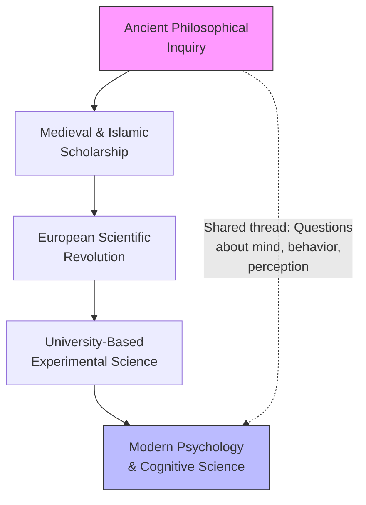

# Chapter 1 — Defining the Subject

## Module 1: The Culture of Knowledge

---

Professor Maren had been teaching introductory psychology for twenty-three years, and she still started every semester the same way. She arrived early, before the students trickled in, and stood at the lectern watching the empty seats fill. This was a large hall — tiered, amphitheater-style, with wooden desks scarred by decades of bored handwriting. The air smelled of chalk dust and old paper.

On the projection screen behind her, a single timeline glowed. It read: **1879 — Wundt founds laboratory at Leipzig. Psychology begins.**

When the hall was nearly full — eighty students, notebooks open, pens ready — she began.

"In your first chapter," she said, tapping the remote, "you'll find a familiar claim. Psychology began in 1879. Leipzig. Wilhelm Wundt. A laboratory." She let the words settle. "I want you to hold that claim in your mind. Suspend it, like a scientist suspends judgment."

She clicked to the next slide: a marble bust of Aristotle. "This man — fourth century BC — wrote extensively on perception, memory, emotion, imagination, and the nature of sleep. His work on animal behavior was systematic. Technical. Detailed enough that we still reference his categories in modern comparative psychology." She paused. "So when your textbook says psychology is 'young,' something doesn't quite add up."

A student near the back raised her hand. "Maybe the textbook means the experimental method? Like, the lab work?"

Maren nodded. "That's a reasonable distinction. But consider this: chemistry didn't get its first university laboratory until the 1830s. Physics not much earlier. If we define a field by its labs, then almost every science is young. And if we don't — if we define it by its questions — then psychology stretches back to the earliest thinkers who wondered why humans feel, perceive, and behave as they do."

She set the remote down and folded her arms. "So which is it? Is psychology a recent invention, or an ancient inquiry wearing modern clothes?"

No one answered. Maren smiled, picked up a piece of chalk, and wrote on the blackboard in large letters: **What makes a subject young?**

"Let's figure that out together," she said. "And to do it, we need to understand something larger than psychology itself."

---

## The Myth of the Young Science

You've probably encountered the claim already: psychology is a young science. It appears in nearly every introductory textbook, usually accompanied by a timeline that begins with Wilhelm Wundt's Leipzig laboratory in 1879. The implication is clear — psychology is still finding its footing, still establishing itself, still shedding its philosophical childhood.

But what if that claim is more folklore than fact?

The problem starts with how we define "psychology." If you mean the word itself — the formal label for an academic discipline — then yes, it's relatively recent. But if you mean the systematic study of how humans perceive, think, feel, remember, and behave, the timeline stretches back millennia. Aristotle's fourth-century BC writings on perception, emotion, and animal behavior are detailed and technical enough that modern researchers still engage with his categories. Chinese and Indian philosophical traditions developed sophisticated theories of mind and consciousness long before European universities existed.

The "young science" narrative depends on a subtle trick: it equates the **name** of a field with its **subject matter**. That's like saying medicine is young because the word "physician" didn't always exist — ignoring the fact that healers have been studying the body for thousands of years.

### Why the Label Sticks

So why does the "young" label persist? A few reasons worth examining.

First, there's the **experimental method** argument. Wundt's laboratory was the first dedicated specifically to psychological experimentation. Before that, the work happened in philosophy departments, medical schools, and private studies. But this argument proves too much — chemistry's first university lab came only decades before psychology's. Apply the same standard consistently and you'd have to call chemistry young too.

Second, there's institutional convenience. Textbooks need a starting point. "It began in 1879" is clean, memorable, and easy to test on an exam. "It began when the first human wondered why they dreamed" is less tidy.

Third, and most interestingly, there's a psychological reason for the label. Calling a field "young" implies it's still growing, still flexible, still open to radical revision. That's a flattering self-image for a discipline that sometimes struggles with internal disagreements.

> [!TIP]
> **Stop and Think:** Consider a field you know well — music, medicine, mathematics, agriculture. When did it "begin"? Did it start when someone gave it a formal name, or when humans first engaged in its core activity? How does your answer change the timeline?

### Aristotle's Claim to the Title

Let's look more closely at Aristotle's contributions, because they're genuinely surprising if you've only encountered him as a "philosopher" in the abstract.

Aristotle wrote systematic treatises on perception — how the senses work, what distinguishes seeing from hearing, how we integrate sensory information. He wrote on memory and imagination — how images are retained, how memory differs from mere sensation. He wrote on emotion — what triggers anger, fear, and pity, and how emotions relate to bodily states. And he wrote on animal behavior — detailed observations of migration, reproduction, and social organization across dozens of species.

His work on animal behavior, in particular, reads less like armchair philosophy and more like early comparative psychology. He catalogued species. He described behaviors in detail. He proposed causal explanations.

So is Aristotle a psychologist? That depends on whether you define the field by its institutional structure or by its questions. The answer you choose reveals something important about how we think about knowledge itself.

> [!TIP]
> **Stop and Think:** If someone in ancient Athens systematically studied how people form memories, would you call that psychology? What if they did it without a laboratory, without a university department, without the word "psychology"? What minimum conditions does a practice need to count as a science?

---

## The Culture of Knowledge

Now we arrive at a bigger idea — one that reframes everything we've discussed so far.

When you talk about a **culture of knowledge**, you're not talking about a single nation, ethnicity, or religion. You're talking about something that cuts across all those boundaries: a tradition of inquiry, argument, speculation, and discovery that belongs to humanity as a whole.

Think about what connects an Indian mathematician in the seventh century, an Arab astronomer in the ninth century, a European natural philosopher in the seventeenth century, and a Japanese neuroscientist today. They share no single language, no single faith, no single government. But they share something: a commitment to asking questions, testing ideas, and building on what came before.

That's the culture of knowledge. It's not Western or Eastern, ancient or modern. It's human.

### How Traditions Shape Inquiry

Here's the crucial point: intellectual pursuits don't emerge from nowhere. They arise within existing traditions, and they carry the marks of those traditions.

Consider how medical research developed differently across civilizations. Chinese medicine developed elaborate theories of energy flow — *qi* — and mapped it through the body in ways that didn't correspond to European anatomical models. European medicine focused on dissecting cadavers and mapping physical structures. Both traditions produced genuine insights. Both were shaped by the cultural contexts in which they emerged.

The same is true for psychology. The questions you ask, the methods you use, the theories you find plausible — all of these bear the marks of the intellectual tradition you inherit. This isn't a flaw. It's how knowledge works.

*Figure 1.1: The culture of knowledge spans millennia — a continuous tradition of inquiry about the mind that precedes and outlasts any single institutional form.*

### What This Means for Psychology

If psychology is a creation of this broader culture of knowledge, then studying its history isn't optional — it's essential. You can't understand what psychology **is** without understanding how it came to be. And you can't understand how it came to be without understanding the traditions that shaped it.

This brings you to a paradox. Psychology, as a formal discipline, is relatively young. But the questions it asks — Why do we feel? How do we perceive? What makes us act? — are among the oldest questions humans have ever posed. The subject matter is ancient. The institutional wrapper is new.

> [!TIP]
> **Stop and Think:** Think about the difference between a subject's **content** (the questions it asks) and its **institution** (the departments, journals, and degree programs that house it). Can a subject exist without a formal institution? Does the institution shape the content, or does the content demand the institution?

---

## History as Explanation, Not Just Dates

Now we come to the most important idea in this module — and it arrives from an unexpected source: a philosopher of history named R. G. Collingwood.

### The Difference Between Facts and Understanding

In his 1946 book *The Idea of History*, Collingwood made a distinction that changes how you think about the past. He argued that history is not just a collection of facts. It's a form of **science** — a discipline that seeks causes, explanations, and understanding.

Here's the difference in practice. **Chronology** tells you that Wundt founded a laboratory at Leipzig in 1879. **History** tells you *why* Wundt founded that lab — what conditions made it possible, what questions he was trying to answer, what traditions he was building on or rebelling against.

Chronology collects. History explains.

This distinction matters enormously for psychology. If you only know the dates — Wundt in 1879, Freud at the century's turn, the behaviorist revolution in the 1920s — you have a timeline. But you don't have understanding. You don't know *why* those developments happened, what problems they were trying to solve, or what assumptions they carried.

### Collingwood's Key Insight

Collingwood put it directly: "Science in general... does not consist in collecting what we already know and arranging it in this or that kind of pattern. It consists in fastening upon something we do not know, and trying to discover it."

Applied to psychology's history, this means the interesting questions aren't "When did X happen?" but "Why did X happen when it did?" and "What made X possible?" and "What did the people involved think they were doing?"

These are the questions that transform a list of names and dates into genuine understanding.

### Internal and External Stories

Historians of science sometimes distinguish between **internal history** and **external history**. Internal history tracks the ideas — the theories, methods, debates, and discoveries within a field. External history tracks the context — the institutions, funding structures, social movements, and cultural shifts that shape what happens inside the field.

For psychology, both stories matter. The internal story includes Wundt's structuralism, James's functionalism, the behaviorist revolution, the cognitive turn. The external story includes the growth of universities, the two World Wars, the rise of pharmaceutical companies, the changing role of government funding.

Neither story is complete without the other. Understanding psychology requires understanding both the ideas and the world in which those ideas emerged.

> [!TIP]
> **Stop and Think:** Pick any historical event you know well — the invention of the printing press, the development of vaccines, the first Moon landing. Now ask: Do you know *when* it happened? Do you know *why* it happened? Do you know *what conditions made it possible*? Which kind of knowledge is more useful for understanding the present?

### Knowing vs. Understanding

Let's return to the source text's example. You can know that Wundt founded a laboratory at Leipzig in 1879. That's a fact. You can also know that Freud wrote extensively on dream interpretation at the end of the same century. Another fact.

But facts alone don't explain anything. They don't tell you why Wundt chose to study consciousness through controlled introspection. They don't tell you why Freud broke with that approach and developed psychoanalysis. They don't tell you what problem each thinker was trying to solve, or what assumptions they carried from their training and culture.

Collingwood's insight is that this explanatory work — the work of understanding *why* — is what transforms history from a list into a science. And for psychology, this transformation is essential. Without it, you're memorizing. With it, you're understanding.

> [!TIP]
> **Stop and Think:** Think about the difference between knowing a fact and understanding it. You know that the Earth orbits the Sun. But do you understand *why* — the physics of gravity and inertia? How does that understanding change your relationship to the fact? Now apply the same logic to psychology: knowing that Wundt founded a lab is one thing. Understanding why is something else entirely.

---

## Speaking of Knowledge Cultures...

Let's make this concrete. Here are some everyday examples of how cultures of knowledge work across the world.

**In medicine:** A traditional healer in Nigeria and a surgeon in Seoul both operate within knowledge cultures. The healer inherits a tradition of herbal remedies and spiritual practices developed over centuries. The surgeon inherits a tradition of anatomical dissection and clinical trials developed over centuries. Neither tradition emerged from nowhere. Both carry the marks of their origins. And both produce real results — though they disagree about *why* those results occur.

**In agriculture:** Rice cultivation techniques in Southeast Asia developed through centuries of accumulated observation — which varieties resist flooding, when to transplant seedlings, how to manage water levels. This is a knowledge culture: a tradition of inquiry, experimentation, and transmission that doesn't require formal institutions or written papers.

**In music:** Jazz didn't emerge from a vacuum. It arose from the intersection of West African rhythmic traditions, European harmonic structures, and the specific social conditions of early twentieth-century New Orleans. The musicians who created it were drawing on — and transforming — existing knowledge cultures.

**In technology:** The development of smartphone interfaces drew on decades of research in cognitive psychology, human-computer interaction, and industrial design. Each of those fields had its own knowledge culture, its own traditions of inquiry. The smartphone is a product of their convergence.

The point is simple: knowledge doesn't appear out of thin air. It grows from traditions. It carries the marks of its origins. And understanding those origins is essential to understanding the knowledge itself.

---

> [!IMPORTANT]
> The most important thing to carry forward from this module is the difference between knowing that something happened and understanding why it happened. Facts are the raw material of history, but explanation is its purpose. When you encounter a claim about psychology — that it's young, that it's fragmented, that it's scientific — ask yourself: What explains this? What traditions shaped it? What assumptions does it carry? These questions will serve you throughout your study of psychology and beyond.

---

There is more to this story, of course. If psychology's origins stretch back to Aristotle, then what happened in the centuries between? How did the ancient questions about mind and behavior travel through the medieval world, through Islamic scholarship, through the European Renaissance? And how did the specific institutional form of modern psychology — the departments, the journals, the laboratories — emerge from that longer tradition?

Those are the questions we take up next. And to answer them, we need to look at how knowledge itself traveled across civilizations — carried by scholars, traders, conquerors, and refugees — and how each culture that received it transformed it into something new.

---

## References

Collingwood, R. G. (1946). *The Idea of History*. Oxford: Clarendon Press.

---

*Module 1 of 3 complete.*
