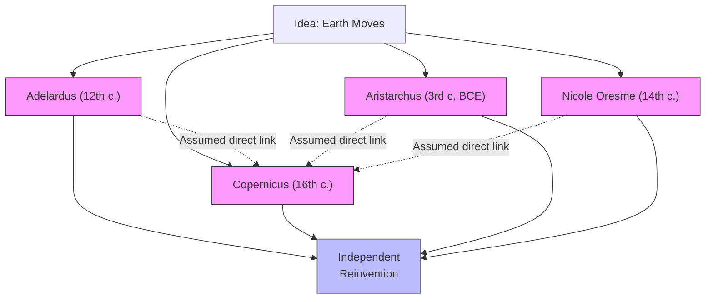
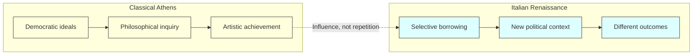

# Chapter 1: Defining the Subject

## Module 2: The Historian's Biases

Imagine a historian — let's call him Marco — sitting in a Roman archive in 1740, surrounded by crumbling manuscripts. He's trying to piece together what ordinary people in the first century actually believed about the human soul. He has access to Seneca's elegant philosophical letters, to passages from Lucretius, to scattered references in Cicero. He leans back in his chair, frustrated. These are the educated elite — people who debated in Latin, who had Greek tutors, who wrote for audiences of fellow philosophers. Marco suspects that the farmer in the Roman countryside, the merchant in the harbor, the soldier on the frontier — none of them thought about the soul the way Seneca did. But their voices are gone. All he has is the scholars.

He picks up another manuscript, this one from a contemporary who claims to have traced a direct line of influence: a Greek idea traveled through Rome, then into medieval theology, then into the thinking of Marco's own time. The chain looks tidy. Too tidy. Marco has seen how ideas actually spread — messy, overlapping, independently reinvented in different places by people who never read each other's work. He thinks of a conversation he had last week with a merchant from Naples who described folk beliefs about the afterlife that sounded nothing like anything Seneca ever wrote. The merchant had never read a word of Greek philosophy. Yet his ideas about the soul were coherent, meaningful, and entirely his own.

The archive around Marco is quiet except for the scratching of a clerk's pen in the next room. Dust motes drift through a shaft of afternoon light. He has spent three years in this room, reading the same manuscripts, comparing the same passages. And with each passing month, the problem has become clearer, not more complicated but more troubling: the people who wrote these texts were not ordinary people. They were scholars, aristocrats, rhetoricians. They wrote for each other. The vast majority of the population — the enslaved, the rural poor, the women who ran households, the soldiers who spent decades on distant frontiers — left almost no written record. What they believed, how they thought, what they worried about at night — all of that is lost, or nearly lost, buried beneath layers of elite interpretation.

He puts down the manuscript and stares out the window. How do you write the history of ideas when your sources are biased, your witnesses unreliable, and your own judgment colored by the era you live in? That question would consume him for the rest of his career. And it would eventually lead him to a set of insights so sharp that historians five centuries later are still reckoning with them.

---

## The Five Lenses That Distort

You might think that the biggest challenge in intellectual history is finding enough evidence. More documents, more letters, more transcripts — problem solved, right? Not quite. The text we opened with makes a crucial point: even if memory were perfect and commentators were in full agreement, interpretation would still be necessary. Complex, unfolding events and ideas don't come with built-in explanations. You have to make sense of them. And every time you make sense of something, you bring your own baggage.

Here's the uncomfortable truth: the historian doesn't just face the obstacles that confront any other kind of inquiry — imperfect records, limited perspectives, incomplete data. Intellectual history adds its own special layer of difficulty. Words, unlike swords or currency exchange rates, change meaning across time. They often intend more than they convey. The thin lines of evidence diverge while actual witnesses, out of ignorance or fear or sloth or confusion, fail to reflect accurately the ideas of their period. And then modern analysts enter with their own biases and confusions, further darkening the record.

A man named Giovanni Battista Vico saw all of this with unusual clarity. Writing in Naples in the early eighteenth century, he identified a series of systematic errors — biases so common that historians fall into them almost by reflex. Let's walk through five of the most important.

### The Worship of the Old

Think of it this way: imagine you're evaluating two restaurants. One has been open for two hundred years. The other opened last month. Which one do you instinctively trust more? Most people pick the old one — not because they've tasted the food, but because longevity itself feels like proof of quality. We do something remarkably similar with the past.

Vico warned against what we might call **presentist history** — the tendency to revere antiquity beyond all proportion. This isn't just a gentle admiration for old things. It's a systematic bias that colors our evaluations and sometimes produces outright quantitative errors: miscalculating the wealth, population, or longevity of ancient civilizations because we assume that older must mean wiser or grander.

You see this everywhere. A friend tells you that ancient Indian surgeons performed plastic surgery thousands of years ago, and the implication is clear: they were somehow ahead of their time, superior to what came after. The reverence feels respectful, even flattering. But it distorts. It measures the past against the present and finds the past either gloriously advanced or tragically primitive — both of which miss the point. The past wasn't trying to be us.

This is where **contextualist history** offers a corrective. Rather than asking "how advanced were they?" you ask "what were they trying to do, given what they had?" It's the difference between judging a fishing boat by how well it races and understanding it as a tool built for a specific sea.

> [!TIP]
> Stop and Think: When you hear someone say "the ancients were more advanced than we think," what assumptions are embedded in that claim? Who defines "advanced"?

### Beyond the Sage's Study

Here's an analogy: if you wanted to understand what everyday life is like in Seoul today, would you read academic papers from Korean universities? You'd get brilliant, rigorous work — and almost no information about what people eat for breakfast, how they argue about parking, or what they worry about at 2 a.m. Scholars are specialists. They live in a different world from their neighbors.

Vico recognized this with devastating clarity. Most common of all historical blunders, he noted, is the tendency to identify the character of an age by studying the thoughts of its scholars. But scholars are not representative of their time. They differ from their contemporaries in interests, in schooling, even in basic values.

Consider Aristotle's theory of the soul. It's a masterpiece of philosophical reasoning. But if you wanted to understand what "the Athenian" believed about the soul, Aristotle would be a terrible guide. The average Athenian seldom considered such matters and, had he been privileged to discuss them with Aristotle, might well have found the philosopher's treatment bizarre. To find the common understanding, you'd need to search the myths and rites of antiquity, the poems and correspondence and plays of the age. And once you found those popular views, they would nearly invariably differ from the sage's.

The same holds in every culture. If you studied only the published papers of Brazilian psychologists to understand how Brazilians think about mental health, you'd miss the folk healing traditions, the role of religious communities, the everyday language people use when they say they're feeling "heavy" or "light." The scholars write for each other. The people live differently.

> [!TIP]
> Stop and Think: Think about your own field of study or profession. How different are the ideas discussed among experts from the beliefs held by ordinary people around you?

### Firsthand Doesn't Mean First-Right

Picture this: a journalist who witnessed a building collapse in Lagos gives a detailed eyewitness account. She was there. She saw it happen. Surely her testimony carries more weight than a later reconstruction by an engineer who wasn't present?

Not necessarily. The journalist saw the event from one angle. She arrived after the first floor had already pancaked. She spoke Yoruba and English but not the Hausa spoken by several witnesses she couldn't interview. She relied on her phone's camera, which captured a thirty-second clip of a ten-second event from a position fifty meters away. She is a skilled, honest professional. And her account is incomplete.

Vico applied this same logic to ancient historians. The fact that Tacitus wrote about events in his own time does not mean he was conceptually closer to them. He wore the distorting lenses of his epoch. His travels were limited. He spoke and read in only two languages. His resources were saddled to a primitive technology. Lacking the methods of modern scholarship — methods only recently developed by linguists, archaeologists, physicists, and others — Tacitus could examine earlier eras only through the eyes and fables of those who came before him.

This doesn't mean eyewitness accounts are worthless. It means proximity in time does not guarantee proximity in understanding. A witness is not an analyst. Being there and understanding what happened there are two different skills.

> [!TIP]
> Stop and Think: Think of a significant event you personally witnessed — a political protest, a natural disaster, a family conflict. How complete is your own account of what actually happened?

### The Straight Line That Wasn't There

This one is subtle, and it might be the most dangerous bias of all.

Imagine you're tracing the history of a recipe. You find a version of it in a cookbook from 1820 in London. You find another version in a cookbook from 1910 in Mumbai. The recipes are similar. The obvious conclusion: the British brought the recipe to India during the colonial period. It spread from London to Mumbai. Case closed.

Except the recipe uses spices that were common in Indian cooking for centuries before the British arrived. The Indian version might have developed independently, drawing on local traditions that had nothing to do with London. The similarity doesn't prove transmission. It might prove nothing more than two cultures arriving at a good idea separately.

Vico identified this error and gave it a name: **scholastica successionis civitatum** — the "scholastic succession of states." It's the assumption that when an intellectual development occurs sequentially in two different countries, it occurs in the second through the direct influence of the first. Since Adelardus spoke in the twelfth century of the earth's motion, and since Copernicus was generous in his reading habits, historians concluded Copernicus must have got the idea from Adelardus — or from Cicero, or Aristarchus, or Nicole Oresme.

According to this view, an idea is a pebble dropped by philosophers on the calm lake of slumbering minds. It disturbs first one culture, then the next, in neat sequence. The historian's job is to work backward from the ripples to the source — the first origin of all our wisdom.

Vico knew this was wrong. So did Aristotle before him. Ours is a questioning and theorizing species that does not rest at length. There is hardly a notion prized by any age that was not entertained by many others at many different times and quite independently. The linear chain of influence is almost always a fiction we impose because stories with clear origins feel satisfying.

*Figure 2.1: The "Scholastic Succession" fallacy assumes ideas spread in a straight line from one source (dashed arrows). In reality, the same idea often emerges independently across cultures and eras (solid arrows).*

This matters enormously for psychology. When you read that behavior therapy in the 1960s was "influenced by" Pavlov's work, ask yourself: were the early behavior therapists really reading Pavlov, or were they responding to the same clinical problems that Pavlov had encountered, using similar experimental logic, arriving at similar conclusions independently? Sometimes the answer is direct influence. Often it isn't. The straight line is a story we tell because it's tidy.

> [!TIP]
> Stop and Think: Think of a "fact" you've always assumed was discovered by one person. How confident are you that it wasn't discovered independently by someone else, somewhere else, at a different time?

### Echoes Aren't Repeats

You've probably heard someone say "history repeats itself." It's one of the most seductive ideas in all of intellectual life. Empires rise and fall. Fashions cycle back. Philosophical movements come and go. The pattern feels real. But Vico — and many historians after him — would urge you to resist it.

Consider the Italian Renaissance, conventionally dated from 1350 to 1600. When we call it a "renaissance" — a "rebirth" — we're implicitly adopting at least four propositions. First, that there was, at some earlier time, a classical outlook later to be recovered or reborn. Second, that this older age vanished or entered a period of prolonged hibernation. Third, that at a definable time, the hibernation ended and a renascence of perspective and achievement took place. Fourth, that this rebirth itself ran a given course only to be replaced by something discriminably different.

Each of those propositions is defensible as a rough approximation. None of them is literally true. The classical outlook didn't simply vanish — it persisted in fragments, in translated texts, in the practices of communities that never fully forgot it. The "hibernation" was not a sleep but a transformation. And the Renaissance itself was not a re-creation of the Athenian **Zeitgeist** — the spirit of the age. The fifteenth-century Florentines who admired Greek sculpture were not living in ancient Athens. They were living in a city riven by trade wars, plague, and political intrigue. They borrowed selectively from the classical tradition, and what they borrowed was shaped by their own needs and values.

Here's the underlying point: history is neither constant nor cyclical. What sometimes makes it seem cyclical is the mere recurrence of certain political and philosophical dispositions. But the conditions responsible for these dispositions are always different the second, third, or fourth time around. You cannot understand the Renaissance as a simple re-creation of classical Athens. You cannot understand an eighteenth-century Virginia plantation as "medieval." The labels feel convenient, but they smuggle in false equivalences.

*Figure 2.2: The Renaissance borrowed from Classical Athens, but the borrowing was selective, shaped by entirely different political and social conditions. Influence is not repetition.*

The practical lesson is this: if you're clear about the artificiality of abrupt historical transitions, you can gain the advantage that labels give to memory without suffering the burden they impose on judgment. Use the term "Renaissance" — it's useful shorthand. But never forget that it compresses and distorts. We must be prepared to discover change without expecting duplication, orderliness but not historical necessity.

This is especially important in psychology. When someone tells you that "cognitive psychology is just a return to the introspectionism of the early twentieth century," resist the temptation to accept the parallel. The conditions are different. The methods are different. The questions are different. The resemblance is real but superficial, like two people wearing the same shirt for completely different reasons.

> [!TIP]
> Stop and Think: Think of a pattern you've noticed in your own life — a recurring situation, a repeated dynamic. Are you sure it's the "same" pattern each time, or are you imposing a narrative on events that are actually quite different?

---

## Speaking of the Historian's Biases

These five biases show up in everyday life more often than you'd expect. Here are some scenarios where you might catch yourself — or others — falling into them.

The family reunion version. Your grandmother tells you that her grandmother never argued with her husband, implying that modern couples are weaker. You're revering antiquity — assuming that older relationships were better without asking what "argue" meant in that context, or whether silence reflected harmony or something else entirely.

The workplace meeting version. A manager at a company in São Paulo reads about a successful strategy used by a tech firm in Tokyo and assumes the same approach will work for her team. She's committing the scholastic successionis error — assuming that because an idea worked in one context, it traveled in a straight line and will work in another. The conditions that made it succeed in Tokyo — the team size, the market, the regulatory environment, the culture of decision-making — may be entirely absent in São Paulo.

The cultural conversation version. A student in Lagos hears about the Greek concept of eudaimonia and says, "Oh, that's just like our idea of ubuntu." The two concepts share some surface features — both involve human flourishing in a community context. But ubuntu is rooted in specific Bantu philosophical traditions, and eudaimonia in specific Greek ones. Treating them as the same idea erases the differences that make each meaningful.

The medical history version. A doctor in Mumbai reads that Ayurvedic practitioners described something resembling diabetes thousands of years ago and concludes that "they knew about diabetes before the West did." This is the worship of antiquity in action. The Ayurvedic descriptions are valuable on their own terms. Measuring them against Western diagnostic categories and declaring them "ahead of their time" imposes a framework they never asked for.

---

## What This Means for How You Study

> [!IMPORTANT]
> The historian's biases are not flaws to be eliminated — they are conditions to be recognized. Every account of the past is told from somewhere, by someone, for some purpose. The goal is not to achieve a view from nowhere but to understand the view you actually have. Intellectual history is not a treasure hunt for the first person who had a particular idea. It is an investigation into how ideas were used, misused, transformed, and reimagined by people who were not us — and who were, at the same time, exactly like us.

We study the history of ideas to learn how others have dealt with problems facing us, what others have considered important, and the factors that seemed to have caused events of consequence. One inescapable product of our study is a chronology — an ordering of events in time — but chronology is a tool, not a goal. A mere sequence of ideas would fail to be a history of ideas, and it would fail to be true.

What, then, can we say with confidence? We can say that an event of a certain kind occurred at a particular time, or at least that no earlier record has been found. We can trace how ideas were received, debated, and transformed in specific communities. But we cannot date the first appearance of a thought with the precision we'd like. The Greeks invented philosophy as a disciplined form of inquiry regulated by rules and organized around a set of questions. In that narrow sense, they were the first philosophers. But it would be absurd to argue that Thales was the first human being to recognize that "it is hard to be good."

We have no reason to assume that, because people in the past thought about different matters, they thought in different ways — or that because they perceived their condition differently, they either had no perception at all or lacked one that could be defended. "They," after all, are "we." Otherwise our inquiry would be reduced to a kind of comparative anatomy — cataloguing specimens rather than understanding minds.

---

The five biases Vico identified are not just problems for professional historians. They shape how you read the news, how you evaluate claims about the past, how you understand your own field of study. And they point toward a deeper question that will occupy us for the rest of this book: if every account of the past is shaped by the present, how do we ever get closer to the truth? The answer, as we'll see in the next module, begins with understanding what intellectual history actually is — not a chronology of great ideas, but an investigation into the conditions that made those ideas thinkable in the first place.

---

## References

Vico, G. B. (1725/1984). *The New Science* (T. G. Bergin & M. H. Fisch, Trans.). Cornell University Press.

---

*Module 2 of 3 complete.*
