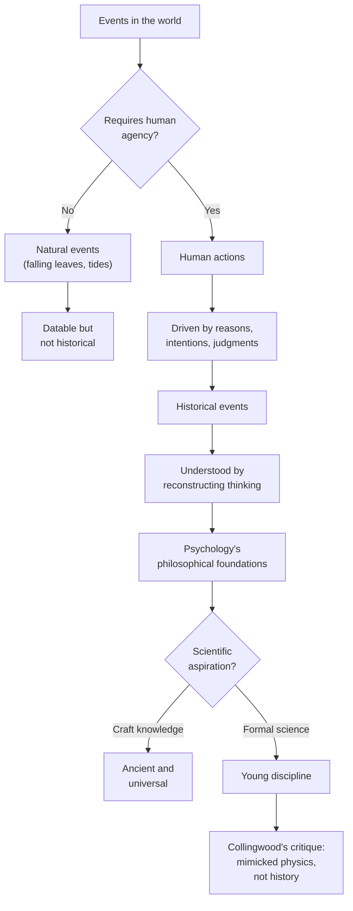

# Psychology's Ancient Foundations

Somewhere in Egypt, around 450 BCE, a Greek traveler named **Herodotus** sat in the shade of a temple courtyard, watching. He had come to see the wonders everyone talked about — the pyramids, the Nile, the monuments. But what held his attention that afternoon was not stone. It was a conversation.

A temple priest was speaking with a man who had arrived days earlier in visible distress. The man could not sleep. He could not eat. He avoided his family. The priest did not chant over him or prescribe a poultice. He sat with the man. He asked questions. He listened — not casually, but with the focused attention of someone building something, question by question, like a mason fitting stones.

Herodotus recognized something in this exchange that he had not seen recorded in any Greek text. The Egyptians, he wrote, had developed distinct specializations in medicine. Some physicians treated the body. Others treated what he described as "the suffering of the mind." They did not use the same methods. The mind specialists, as Herodotus understood them, relied on conversation, suggestion, and the careful examination of a person's habits and history.

He wrote it down. He moved on. But the observation lingered in his notes like an unanswered question: Were these Egyptian practitioners doing something that deserved to be called understanding the mind? Or were they merely skilled? And what, exactly, is the difference?

---

## What Counts as History

You have probably heard someone say that history is just "one thing after another." It is a useful joke because it captures something true about how we first encounter the past — as a timeline, a sequence, a row of dates marching forward. But if you stop and think about it, the joke reveals a problem. Plenty of things happen one after another that we would never call history. Leaves fall. Tides rise. Stars appear and disappear every night. These events can be dated. Their causes can be identified. Yet no one writes books about them and calls those books history.

So what separates the historical from the merely chronological? The answer is **human agency** — the capacity of human beings to think, choose, judge, and act on the basis of those judgments. A forest fire caused by lightning is a natural event. The same fire set deliberately by a person who had reasons, plans, and intentions — that is a historical event. Not because fire behaves differently depending on its source, but because the second fire tells us something about the human world that the first fire does not.

This distinction has consequences for how we understand the past. If history requires human agency, then the proper study of history is not the cataloging of events but the reconstruction of the thinking behind them. We explain a historical event by asking: What did the people involved believe? What did they want? What reasons did they have for acting as they did? The historian's job is to recover those reasons — not from the outside, as a physicist studies a falling object, but from the inside, by entering into the perspectives of the people who were there.

> [!TIP]
> **Stop and Think:** Consider a bridge that collapses during a storm. Engineers call it a structural failure. Historians call it a disaster only if people were on it. What does this tell you about what we mean by "historical"?

This is not an abstract philosophical puzzle. It shapes how you will encounter every idea in this book. When we study the thinkers who contributed to psychology's development, we are not just tracking who said what and when. We are trying to understand *why* they said it — what problems they faced, what assumptions they held, what they were trying to accomplish. That is what makes this an intellectual history rather than a mere chronology.

### The Great Man Trap

Once you accept that history requires human agency, a tempting shortcut presents itself. If human actions drive history, then surely the most important actions come from the most important people — kings, generals, prophets, geniuses. This is the **great man theory** of history: the idea that the past is best explained by the deeds of extraordinary individuals.

The theory has a certain logic to it. When we think of the French Revolution, we think of Robespierre. When we think of ancient philosophy, we think of Socrates. When we think of physics, we think of Newton. These figures loom so large in our narratives that it seems natural to treat them as the main characters of history.

But there is a problem. Consider the metaphor the original text uses: a family. Some relatives leave diaries, portraits, and handsome bequests. Others leave only a record of goodwill. Still others remain a mystery — they said little, traveled less, and wrote nothing. When we reconstruct a family history based only on what the prominent members left behind, we get a distorted picture. The quiet aunt who held the family together through a crisis disappears from the record. The cousin whose ideas influenced three generations but who never published a word is forgotten entirely.

Intellectual history works the same way. The ideas that shaped psychology did not come exclusively from famous names. They came from teachers, students, translators, critics, and countless unnamed people who argued, refined, and passed along concepts across centuries. When we focus only on the "great" thinkers, we miss the texture of how ideas actually travel.

> [!TIP]
> **Stop and Think:** Think of a recipe in your family. Can you trace it to one inventor, or did it evolve across many hands? How is the history of an idea like — or unlike — the history of a recipe?

### How Ideas Actually Travel

Here is what the family metaphor really teaches us: ideas do not pass from one age to the next like objects handed across a table. They are not inert things waiting to be picked up. They are living processes, reinterpreted in every generation that encounters them.

**Plato** did not simply hand down a set of dialogues for future scholars to file away. Each generation that read Plato read him through the lens of its own concerns. Medieval Arab scholars encountered Plato's ideas about the soul and integrated them with their own philosophical traditions. Renaissance Europeans rediscovered those same ideas and read them through new political and religious frameworks. Enlightenment thinkers read Plato yet again and found ammunition for entirely different debates. Each reading was faithful to the text and yet profoundly different from the others.

This means that when you encounter an idea from the ancient world in this book, you are not seeing it "as it was." You are seeing it as it has been interpreted, challenged, and reconstructed across centuries of human engagement. That is not a flaw in the historical method. It is the nature of ideas themselves.

Sometimes the most striking intellectual connections appear between thinkers who had no direct link at all. Distant cousins share more features than brothers. Certain children bear no resemblance to either parent. The history of ideas is full of such surprises — convergences that no linear narrative can explain.

And sometimes entire traditions survive only because someone in a distant land cared enough to preserve them. Without Arab scholars translating, commenting on, and extending Aristotle's work during the medieval period, the chapter on his psychological theories might fill less than a page. Geography, chance, and the dedication of unnamed translators have shaped the intellectual inheritance you are about to explore as much as any "great man" ever did.

---

## Ancient Subject, Young Science

You now have a framework for thinking about what makes an event historical and how ideas travel across time. Let us apply it to psychology itself. Here is a puzzle that should strike you as strange: psychology's subject matter is as old as human reflection, yet we routinely call it a young discipline. How can both be true?

The answer lies in a distinction that will recur throughout this book — the distinction between a **subject** and a **science**. Psychology as a subject is ancient. Human beings, in every period and every culture, have not been indifferent to the workings of their own minds. Parents in ancient Mesopotamia worried about their children's temperaments. Traders in Phoenicia tried to read the intentions of their counterparts. Healers in every tradition developed theories about why people suffer and how to help them. Aristotle wrote detailed analyses of perception, memory, emotion, and dreaming. These are psychological investigations, conducted thousands of years before anyone used the word "psychology."

Yet we call psychology young. Why? Because we mean something specific when we call a field a science. We mean that it has developed formal methods for testing its claims, that its knowledge is cumulative, and that its practitioners share a set of standards for what counts as evidence. Physics was young at the time of Archimedes. Geometry was "founded" by Euclid and "fathered" by Thales. In each case, the subject matter existed long before the formal discipline.

### The Shipbuilder and the Geometer

Consider a concrete example. Ancient shipbuilders launched vessels that sailed successfully across seas and rivers. They understood, through long experience, how to shape a hull so that it would not capsize. They knew which woods would hold and which would rot. Their knowledge was real, practical, and often sophisticated.

But they were not physicists. They did not know the laws of buoyancy. They could not explain *why* their hulls floated, only *that* they did. Similarly, ancient stone-cutters constructed pillars of identical circumference before anyone had formulated the mathematical relationship C = πD. They measured, compared, and reproduced — a remarkable craft. But they did not understand the principle that governed what they were doing.

**Craft knowledge** is local, practical, and often unconscious. The craftsperson learns from a master, who learned from a master before them. The knowledge lives in the hands and in long practice. It produces reliable results, but the craftsperson cannot always articulate why those results occur.

**Science**, by contrast, seeks universal principles. It asks why, not just how. It tests claims against evidence and builds cumulative knowledge, where each discovery extends what came before. The transition from craft to science is not just a change in what you know — it is a change in how you know it.

> [!TIP]
> **Stop and Think:** Think about cooking. A grandmother who makes perfect bread without a recipe has deep craft knowledge. A food scientist who understands gluten chemistry has scientific knowledge. What can each do that the other cannot? What might each miss?

Psychology's ancient foundations are full of craft knowledge. Every culture has produced people with remarkable insight into human behavior — diplomats who could read a room, parents who could calm a distressed child, leaders who understood what motivated their followers. This knowledge is real. It is often sophisticated. But it is not science. It is the equivalent of the shipbuilder's skill: reliable, practical, and not yet explained by underlying principles.

The question that will occupy us for the rest of this book is whether psychology should have pursued scientific status at all — and if so, what kind of science it should have become.

---

## Collingwood's Critique: Mimicking the Wrong Model

Here is where the story takes an unexpected turn. The British philosopher R.G. Collingwood argued that psychology's attempt to become a natural science was not just incomplete — it was a fundamental mistake. His critique, developed in the early twentieth century, remains one of the most provocative challenges to how psychology defines itself.

Collingwood's argument was straightforward. The natural sciences — physics, chemistry, biology — study events that are caused by forces acting on objects. A billiard ball moves because another ball strikes it. A planet orbits because gravity pulls it. The scientist's task is to identify the cause and predict the effect. This model works beautifully for the physical world.

But human beings are not billiard balls. When a person acts, they do not merely respond to forces. They act for **reasons**. They have intentions, beliefs, desires, and purposes. A person who raises their arm to vote in an election is not behaving in the same way as a person whose arm is raised by a doctor examining their shoulder. The physical motion may look identical, but the meaning is entirely different.

Collingwood argued that psychology, in its eagerness to join the family of science, adopted the model of physics — seeking causal laws that would explain human behavior the way Newton's laws explain planetary motion. This was, in his view, a category error. It confused two fundamentally different kinds of explanation. The physicist explains events by identifying causes. The historian — and, Collingwood argued, anyone studying human action — explains events by identifying reasons.

> [!TIP]
> **Stop and Think:** If someone asks you "Why did you choose that career?" do you answer with a cause ("My brain chemistry made me") or a reason ("I was fascinated by the subject and wanted to help people")? What does your answer reveal about how humans understand their own actions?

### The Difference That Makes a Difference

Let us make this concrete. Imagine you are trying to understand why a student dropped out of university. A causal explanation might point to financial pressures, family obligations, or neurological factors affecting concentration. These are real factors, and ignoring them would be foolish. But they do not, by themselves, explain the decision.

The student also had reasons. Perhaps they concluded that the degree was not worth the cost. Perhaps they received an opportunity that seemed more promising. Perhaps they weighed their options and made a judgment — a human judgment, shaped by their values, their experiences, and their understanding of their own situation. To understand the dropout fully, you need to enter into the student's perspective. You need to understand what the world looked like from where they stood.

This is what Collingwood meant when he wrote that history — and by extension, any study of human action — is "the disciplining of empathy by scholarship." It is not enough to observe behavior from the outside. You must reconstruct the thinking that produced it. And that reconstruction requires a fundamentally different method from the one a physicist uses to study falling objects.

### Psychology's Foundational Question

Collingwood's critique raises a question that has haunted psychology since its earliest days: What kind of knowledge should psychology produce? Should it seek the universal, predictive laws of physics? Or should it seek the interpretive, contextual understanding of history and philosophy?

This is not an academic debate. It shapes everything — how research is designed, what counts as evidence, how therapists understand their patients, how educators approach learning, how workplaces are organized. If psychology is a natural science, then its goal is to discover laws that predict behavior. If it is closer to history and philosophy, then its goal is to understand meaning, intention, and perspective.

The original text puts it bluntly: psychology's foundations are philosophical, not scientific. That does not mean science has nothing to offer. It means that the roots of the discipline lie in questions about knowledge, conduct, and values — questions that philosophers asked long before laboratories existed.

> [!TIP]
> **Stop and Think:** Suppose a psychologist claims to have discovered a "law of human behavior" as reliable as the law of gravity. What would you want to know before believing that claim? How would your expectations differ from those you would have for a law in physics?

---

## Speaking of Ancient Foundations

So what does all of this mean for you, as someone beginning to study psychology's history?

First, it means that the ideas you are about to encounter are not museum pieces. They are not dead artifacts from a vanished civilization. They are living problems that every generation has grappled with and that you, too, are grappling with right now — whether you realize it or not. When you wonder why a friend acted irrationally, when you try to persuade a colleague, when you reflect on your own motivations, you are doing what Aristotle did. You are investigating the mind.

Second, it means that the neat timeline you might expect — ancient Greece leads to Rome leads to the medieval period leads to the Enlightenment leads to modern psychology — is more like a family tree than a straight line. Some branches are well documented. Others are lost. Some connections are obvious. Others are surprising. The Arab scholars who preserved and extended Greek thought are as much a part of this story as any European thinker, and their contributions deserve recognition.

Third, it means that the question Collingwood raised — should psychology model itself on physics or on history? — has never been settled. You will see it resurface in different forms throughout this book. Every time a psychologist claims to have found a universal law of behavior, someone else will point out that human beings are not billiard balls. Every time a psychologist insists on interpretive understanding, someone else will ask where the evidence is. This tension is not a weakness of the field. It is the field's defining characteristic.

Think about the last time you tried to understand why someone did something that surprised you. Did you look for a cause — "They were stressed" — or a reason — "They believed it was the right thing to do"? Did you settle for one explanation, or did you need both? Your answer reveals more about your own implicit theory of human behavior than you might expect.

The foundations of psychology, then, are not just philosophical in the sense that they come from philosophers. They are philosophical in the sense that they raise questions that no amount of data, by itself, can answer. What is the relationship between mind and body? Can human behavior be predicted? What counts as understanding another person? These are not questions you solve once and move on from. They are questions you carry with you, and the history of psychology is, in large part, the history of how different thinkers have carried them.

---

*Figure 1.1: What makes an event "historical" — the role of human agency*

---

> [!IMPORTANT]
> **Closing Insight:** Psychology's subject matter is as old as human reflection itself — every culture has investigated the mind. But psychology is young as a formal science, and its attempt to model itself on physics, Collingwood argued, was a fundamental mistake. The foundations of the discipline are philosophical: they lie in questions about knowledge, conduct, and values that no experiment, by itself, can resolve. To understand where psychology came from, you must begin not in a laboratory but in a conversation — the kind of conversation that Egyptian priest was having twenty-five centuries ago.

---

The ideas in this module — about what counts as history, about how knowledge travels, about the difference between craft and science, about whether psychology chose the right model — are not just historical curiosities. They are the intellectual foundation on which everything else in this book is built. When we turn to the thinkers of ancient Greece in the next chapter, you will see these questions come alive in the work of specific people, facing specific problems, in a specific time and place. But the questions themselves are timeless. They were old when Herodotus watched that Egyptian priest. They are no less urgent today.

---

## References

Collingwood, R.G. (1946). *The Idea of History*. Oxford: Clarendon Press.

Collingwood, R.G. (1939). *An Autobiography*. Oxford: Clarendon Press.

Herodotus. (*c.* 430 BCE). *The Histories*, Book II (Euterpe). Trans. A. de Sélincourt (1954). London: Penguin Classics.

Robinson, D.N. (1995). *An Intellectual History of Psychology* (3rd ed.). Madison: University of Wisconsin Press.

Watson, R.I. (1963). *The Great Psychologists: From Aristotle to Freud*. Philadelphia: Lippincott.

---

*Module 3 of 3 complete. Take time with the 'Stop and Think' prompts before moving to the next chapter.*
