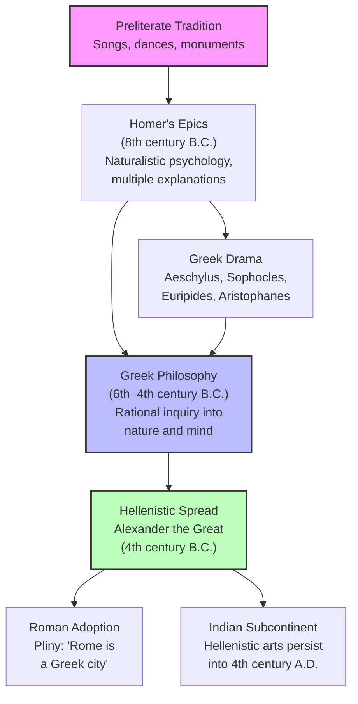

# Chapter 2: Psychology in the Hellenic Age

## Module 1: Why Greece Matters

Imagine standing in a sun-bleached marketplace in Athens, somewhere around 420 B.C. A bronze-worker's hammer rings out from a nearby stall. The smell of olive oil and sweat hangs in the air. Near the fountain, a stocky man with a broad forehead — you'd know him anywhere from the busts — is arguing with a younger companion about whether courage lives in the chest or in the mind. His name is Socrates, and he will never write a single word. The companion, a restless aristocrat named Plato, is twenty-something and already keeping notes.

You've heard the names before. Everyone has. But standing here, you notice something strange: the sheer *density* of genius packed into this one city, this one century. Thales predicted an eclipse. Hippocrates catalogued diseases. Aeschylus wrote tragedies that made grown soldiers weep. Pericles rebuilt the Acropolis. And all of it — the philosophy, the medicine, the drama, the sculpture — happened inside a territory roughly the size of Montana, in a window of about three hundred years.

Here's the question that keeps nagging you, though. Why *here*? Why did the Greeks, of all people — a fractured collection of quarrelsome city-states, suspicious of foreigners, convinced of their own superiority — produce the intellectual foundations of Western thought? And what does that have to do with how we understand the human mind?

---

## The Unlikely Birthplace of a Worldview

You might think of ancient Greece the way most people do: as a small, brilliant culture that gave us democracy and a few good myths before Rome took over. That picture is not wrong, exactly, but it misses the point by a mile. What the Greeks built was not a regional curiosity. It was a civilization whose influence stretched from the Mediterranean to the Indian subcontinent and forward in time for over two millennia. Hellenistic decorative arts were still the style of choice among wealthy elites in near-east Asia well into the fourth century A.D. — centuries after Rome had already risen and fallen. In a word, as the historian Daniel Robinson puts it, there is nothing regional about Hellenic civilization except its birth.

The word **Hellenism** refers not to a geographic boundary but to a shared set of values: a commitment to beauty, learning, education, and life within an ordered family and an ordered state. The Greeks themselves understood this. The orator Isocrates (436–338 B.C.) argued that anyone who embraced Hellenic culture — **paideia**, the ideal of cultivated learning — was "Greek" in the only sense that mattered. The concept was so powerful that the Roman writer Pliny would eventually declare Rome itself to be a Greek city.

> [!TIP]
> **Stop and Think:** We often treat "Western civilization" as though it sprang from one ethnic group or one geography. Isocrates would disagree. What does it mean that the Greeks defined themselves by *culture* rather than by birthplace? How does that change how we think about who gets credit for intellectual history?

---

### From Poems to Philosophy

Before the philosophers came the poets. And before the poems came something even older: the oral traditions of a preliterate society trying to make sense of life. Preliterate cultures develop non-literate aids to memory — paintings and monuments, songs and dances, poems and signs. In Greece, these tools didn't just preserve memory. They *became* philosophy.

The foundation was laid by Homer in the eighth century B.C. In the *Iliad* and the *Odyssey*, Homer presents what is already a fully developed conception of human nature. Heroic actions are explained by specific emotions arising within and taking control of regions of the body — the heart, the chest, the abdomen. Other behaviors are ascribed to the gods, who send demons to disturb sleep, shape dreams, or impersonate mortals. What is so striking about these epic poems is the *need* to understand oneself, to externalize thoughts and images and passions in order to examine them in something close to a clinical fashion.

And here's what makes Homer remarkable: there is no pretension to certainty. No last word. Consider only his treatment of the causes of the Trojan War. Was it Helen's indiscretion? Was it Paris choosing Aphrodite over her competitors for the prize of "most beautiful"? Or was the root cause the offense given to Discordia by not inviting her to the feast? Homer offers all three. He doesn't choose. The multiplicity of explanations is the point.

> [!TIP]
> **Stop and Think:** Homer's refusal to name a single cause for the Trojan War is not indecision — it's a method. When you face a complex problem today (a relationship breakdown, a career failure, a social conflict), do you default to one explanation, or do you hold multiple causes in mind at once? What does that discipline require of you?

---

### A Naturalistic View of the Human Condition

The epics point toward something that would become central to Greek thought: an ordered state, reasonable methods for settling disputes, and the necessity of character and fortitude. And though Homer gives the gods their due, his explanations of human conduct are typically **naturalistic** — rooted in the body and the material world rather than in divine decree.

One acts because of impulses arising in the body. One dies when vital organs are damaged. After death, there exists some shadowy but mostly mindless residual — briefly revived by the fresh blood of animals, but soon reverting to a wraith-like existence utterly removed from the human condition. True immortality belongs only to the gods, and only because of a special substance, *ichor*, that runs in their veins.

The gods of Homer have their favorites among mortals and occasionally breed with them, but the Olympians are generally preoccupied with their own affairs. They are often indifferent, sometimes contemptuous, of human lives and limitations. They must be propitiated, never angered. But they are not looked to for answers to the abiding questions or for solutions to the problems of life and mind. In the matter of fundamental truths, Homer's Greeks are left to their own devices.

This is a crucial point. The Greeks honored the Olympians and believed in the prophetic power of oracles, but they did not have the equivalent of a "prophet" as this type was known in the eastern world. They did not claim to possess a body of divine and unchallengeable truths. The codes by which they lived carried the authority of history and the additional authority of nature — nothing more.

*Figure 2.1: From oral tradition to global influence — the path of Greek thought.*

---

### The Freedom and the Gap

The absence of revealed truth had consequences — both positive and negative. On the positive side, it permitted a freedom of interpretation and a creative approach to the spiritual dimensions of life. This surely played a subtle but pervasive role in the evolution of philosophy, nurturing an inquiring and even skeptical mind. If no one can tell you what the gods definitively want, you are free to ask questions. And the Greeks asked questions relentlessly.

On the negative side, the absence of a codified body of religious principles not only compounded the chronic problem of political unity among the Greek city-states but also encouraged an assortment of superstitious beliefs within various communities. Even as the classical achievement was becoming part of the historical record, the masses of Greek people remained committed to witchcraft, prognostication, omens, and curses. That the better minds of the period had contempt for all this is evident in Plato's rebukes in the *Republic* (Book II, 364) and in *Laws* (Book X, 909b; XI, 933a). But in this, as in so many other ways, the philosophers were outside the common culture.

> [!TIP]
> **Stop and Think:** A society can produce extraordinary thinkers while the majority of its population clings to superstition. Is that a contradiction — or a predictable pattern? Think about your own time. Where do you see the gap between intellectual elites and popular beliefs?

Supplementing Homer's contribution was the work of Hesiod, writing slightly later in the same century. His *Works and Days* records the life of the modest farmer working with nature, within the cycles of the seasons, developing an ethics based upon the orderly and productive works of a properly tended and respected earth. Where Homer gave the Greeks a psychology, Hesiod gave them a grounded ethic — reason and labor as the basis of a good life.

---

### How Poetry Became Philosophy

You might wonder how poems turn into philosophy. It is not as strange as it sounds. A poem like the *Iliad* does something that a sacred text does not: it *dramatizes* confusion. It presents the hero Achilles torn between rage and duty, Odysseus navigating between cunning and honesty, Agamemnon sacrificing his daughter because a goddess demanded it. These are not moral lessons delivered from on high. They are portraits of human beings wrestling with real dilemmas, and the audience is invited to judge for itself.

That habit of judgment — of weighing competing explanations, of demanding reasons, of distrusting anyone who claims certainty — is the seed of philosophy. The Greeks did not discover the love of wisdom (*philosophia*) in a vacuum. They inherited it from their poets, their dramatists, and their farmers. Philosophy was not a break from Greek culture. It was its fullest expression.

> [!TIP]
> **Stop and Think:** Think of a poem, novel, or film that made you reconsider a fundamental question about human nature — not by telling you the answer, but by showing you a problem. How is that experience different from reading a textbook explanation? Which one stays with you longer?

---

### The Scale of the Achievement

Let's return to that marketplace in Athens, and to the sheer improbability of it all. Within an area approximating the size of Montana, and over a period of less than three hundred years, the Greek-speaking people produced:

- **Philosophers:** Thales, Anaxagoras, Empedocles, Parmenides, Zeno, Pythagoras, Protagoras, Socrates, Plato, and Aristotle
- **Dramatists:** Aeschylus, Sophocles, Euripides, and Aristophanes
- **Historians:** Herodotus, Thucydides, and Xenophon
- **Others:** Hippocrates the physician, Pericles the political leader, Pheidias the sculptor

This span of time — roughly from the appearance of the Pythagorean school around 530 B.C. to the flowering of Aristotle's scholarship two centuries later — comprises the Hellenic epoch of classical Greece. It was not anticipated by any prior age.

> [!TIP]
> **Stop and Think:** If you had to explain to someone why a small, politically fragmented collection of city-states produced more lasting intellectual innovation than any empire of its time, what would you say? What conditions — geographic, political, cultural — might have made this possible?

The answer, as we will see in the modules ahead, lies not in any single genius but in a culture that valued questioning over obedience, multiple explanations over dogma, and the examined life over the unexamined one. The Greeks did not invent the human mind. But they invented the tools by which the human mind could study itself.

> [!IMPORTANT]
> The Greeks' greatest gift to psychology was not a specific theory. It was a *method of inquiry* — born from poetry, freed by the absence of revealed truth, and sustained by a culture that treated the question as more valuable than the answer. Everything that follows in this chapter — the pre-Socratics, Plato's tripartite soul, Aristotle's biology of behavior — grows from that single, improbable seed.

---

## Speaking of Greek Civilization...

You've probably encountered the word "Hellenic" before without thinking much about it. But consider what it really means: a self-conscious civilization that defined itself not by blood or soil but by a shared commitment to *paideia* — cultivated learning, beauty, and order. When Isocrates said that anyone who embraced these values was "Greek," he was making a radical claim. Culture, not genetics, is what makes a people.

Think about how that idea echoes today. When someone says a city is "cosmopolitan" or "cultured," they are using a framework the Greeks invented. When universities describe their mission as producing "well-rounded citizens," they are channeling *paideia*. And when you notice that a philosophy lecture in Tokyo or Nairobi sounds remarkably like an argument Socrates might have made, you are witnessing the living reach of a civilization that occupied a space smaller than Montana.

The reach extended further than you might expect. After Alexander the Great conquered vast territories, Hellenistic culture spread to the Indian subcontinent. Hellenistic decorative arts were still the style of choice among wealthy near-east Asian elites well into the fourth century A.D. — centuries after Greece itself had faded as a political power. Ideas, it turns out, travel farther and last longer than armies.

---

That question Socrates was debating in the marketplace — whether courage lives in the chest or in the mind — would take on a very different character when a new generation of thinkers stopped asking *where* emotions live and started asking *what kind of thing* the mind itself is. Before Plato could build his theory of the soul, before Aristotle could classify the faculties of mind, a strange and brilliant group of thinkers known as the pre-Socratics had to take the first, most radical step: looking at the natural world and asking whether the same principles that govern rivers and stars might also govern thought. That is where we go next.

---

## References

Robinson, D. N. (1995). *An Intellectual History of Psychology* (3rd ed.). University of Wisconsin Press.

Homer. (ca. 8th century B.C.). *Iliad* and *Odyssey*.

Hesiod. (ca. 700 B.C.). *Works and Days*.

Isocrates. (ca. 380 B.C.). *Panegyricus*.

Plato. (ca. 375 B.C.). *Republic*, Book II.

Plato. (ca. 350 B.C.). *Laws*, Books X–XI.

*Module 1 of 8 complete.*
